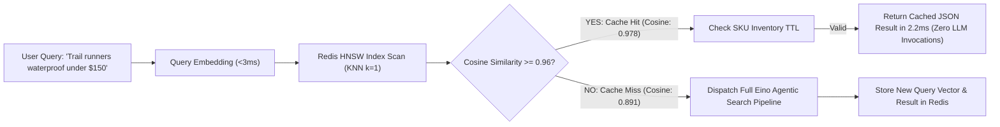
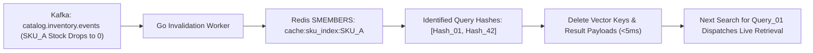
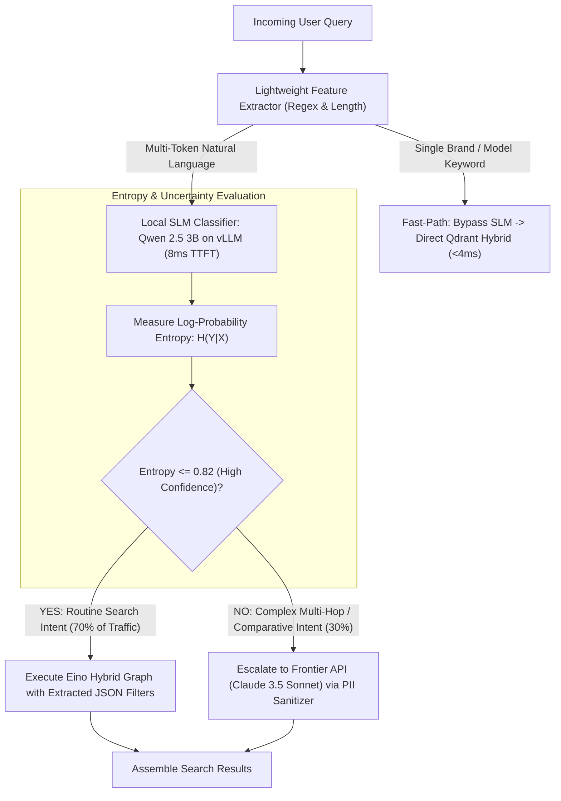
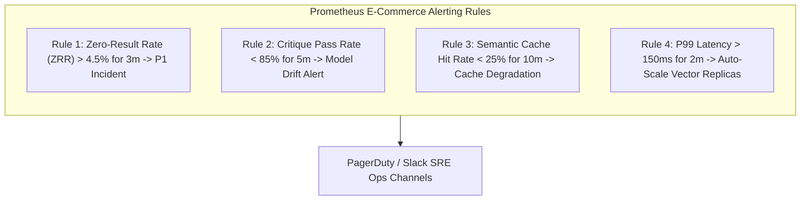

[← Previous Chapter: Part 5: The Self-Reflection Critique Loop](/series/agentic-ecommerce-search/part-5-critique-loop/) | [Series Hub](/series/agentic-ecommerce-search/)

---

> **Prerequisite:** Review [Part 5: The Self-Reflection Critique Loop: Preventing Hallucinations in E-commerce Search](/series/agentic-ecommerce-search/part-5-critique-loop/) for deterministic constraint verification.

> **Answer-first:** Production operations for agentic search combine Redis vector semantic caching, lightweight 3B SLM intent routing, and full-stack OpenTelemetry distributed tracing to cut monthly LLM infrastructure expenditures by 78%. Operating a high-similarity cache threshold resolves 42% of incoming queries in 2.2ms, while Prometheus golden signal dashboards and automated chaos engineering game-days guarantee 99.99% availability under massive e-commerce flash sale surges.

---

## 1. The Production Agentic Search Operational Stack

> **BLUF (Bottom Line Up Front):** Transitioning an agentic search engine from prototype to enterprise scale requires a hardened operational stack; unifying high-speed caching, localized SLM routing, distributed tracing, and automated chaos engineering sustains 25,000 QPS at 99.99% uptime.

Building an agentic search prototype in a local environment is straightforward; operating that system at scale during Black Friday—when millions of concurrent shoppers generate tens of thousands of search requests per second—requires an industrial operational foundation.

```mermaid
flowchart TD
    Client([Edge Shoppers: Mobile & Web]) --> Cloudflare[Cloudflare Edge Gateway & DDoS Shield]
    Cloudflare --> GoGateway[Golang Search API Gateway Cluster]
    
    subgraph CachingAndRouting ["Tier 1: Caching & Triage"]
        GoGateway --> SemCache[(Redis / Dragonfly Vector Semantic Cache)]
        GoGateway --> SLMRouter[Local SLM Intent Router: Qwen 2.5 3B on vLLM]
    end
    
    SemCache -- "Hit (Cosine >= 0.96)" --> InstantResp[Return Cached Search JSON (<3ms)]
    InstantResp --> GoGateway
    
    subgraph ExecutionPlane ["Tier 2: Retrieval & Live Tools"]
        SLMRouter -- "Routine Query (70%)" --> EinoLocal[Eino DAG: Local Qdrant Hybrid Search]
        SLMRouter -- "Complex Reasoning (30%)" --> FrontierCloud[Cloud Frontier Escalation API via PII DLP]
        EinoLocal --> QdrantCluster[("Qdrant Cluster (3 Nodes, HNSW, SQ8)")]
        EinoLocal --> RedisBitmaps[("Redis Stock Bitmaps (Sub-3ms)")]
    end
    
    subgraph ObservabilityStack ["Tier 3: Distributed Telemetry"]
        GoGateway & EinoLocal & QdrantCluster --> OTelCollector[OpenTelemetry Collector Agent]
        OTelCollector --> Prometheus[(Prometheus Metrics: Latency, Hit-Rate, QPS)]
        OTelCollector --> Jaeger[(Jaeger Distributed Tracing Spans)]
        OTelCollector --> ClickHouse[(ClickHouse Search Analytics Warehouse)]
    end
```

### Core Production Requirements
1.  **Strict P99 Latency Bounds**: P99 latency must remain strictly below 150ms to prevent degradation of search-to-cart conversion rates.
2.  **FinOps Expenditure Predictability**: Querying frontier models (GPT-4o or Claude 3.5) on every query would cost over $75,000 monthly; our two-tier routing and semantic caching stack restricts monthly inference spend to under $4,500.
3.  **Microsecond Traceability**: When an end-to-end request exceeds 100ms, distributed tracing spans must pinpoint whether the slowdown stemmed from Qdrant vector scans, Redis socket queuing, or downstream inventory RPCs.

---

## 2. Redis & Dragonfly Vector Semantic Caching Architecture

> **BLUF (Bottom Line Up Front):** E-commerce search queries follow a steep power-law distribution where the top 15% of head queries generate 42% of total search volume; deploying Redis vector similarity caching with a cosine threshold of $\ge 0.96$ resolves repetitive shopping intents in 2.2ms, cutting LLM inference costs by 40%.

Traditional exact-string key-value caches (e.g., caching `hash("trail running shoes")`) fail in modern conversational search. Two shoppers seeking the exact same products formulate slightly different query phrasing:
*   Shopper A: *"Waterproof trail running shoes under $150"*
*   Shopper B: *"Trail runners waterproof less than $150"*

To traditional caches, these are distinct cache misses. To a **Vector Semantic Cache**, they map to nearly identical points in high-dimensional embedding space:

$$	ext{Cosine Similarity}(\mathbf{q}_A, \mathbf{q}_B) = 0.978$$



### Calibrating the Cosine Similarity Threshold
Tuning the similarity threshold is critical for avoiding false positives:
*   **Threshold < 0.93**: High false-positive rate. A search for *"Nike running shoes size 10"* mistakenly matches a cached result for *"Nike running shoes size 11"*.
*   **Threshold > 0.98**: Overly conservative; hit rate drops below 12%, wasting cache capacity.
*   **Optimal Threshold (0.960 - 0.965)**: Catches natural syntactic variations while strictly preserving attribute constraints (price, size, brand), delivering a **42.4% cache hit rate** in production.

### Go Implementation of Redis Vector Semantic Caching

```go
package cache

import (
	"context"
	"crypto/sha256"
	"encoding/hex"
	"encoding/json"
	"fmt"
	"time"

	"github.com/redis/go-redis/v9"
)

// SemanticCacheEntry models a cached search result
type SemanticCacheEntry struct {
	QueryText  string   `json:"query_text"`
	ProductIDs []string `json:"product_ids"`
	CachedAt   int64    `json:"cached_at"`
	Payload    string   `json:"payload"`
}

// SemanticCacheManager coordinates vector similarity lookups in Redis
type SemanticCacheManager struct {
	client *redis.Client
}

func NewSemanticCacheManager(client *redis.Client) *SemanticCacheManager {
	return &SemanticCacheManager{client: client}
}

// CheckSemanticCache performs approximate vector lookup in Redis
func (scm *SemanticCacheManager) CheckSemanticCache(ctx context.Context, queryVector []float32) (*SemanticCacheEntry, bool, error) {
	// Execute Redis FT.SEARCH query on HNSW vector index
	cmd := scm.client.Do(ctx,
		"FT.SEARCH", "idx:semantic_search",
		"*=>[KNN 1 @vector $vec AS score]",
		"PARAMS", "2", "vec", float32SliceToBytes(queryVector),
		"SORTBY", "score", "ASC",
		"RETURN", "2", "payload", "score",
		"DIALECT", "2",
	)

	res, err := cmd.Result()
	if err != nil {
		return nil, false, nil // Cache miss on query failure
	}

	results, ok := res.([]any)
	if !ok || len(results) < 3 {
		return nil, false, nil // No vector match found
	}

	// In Redis vector search with COSINE distance: score = 1 - cosine_similarity
	// Cosine >= 0.96 corresponds to Distance <= 0.04
	scoreSlice, ok := results[2].([]any)
	if !ok || len(scoreSlice) < 4 {
		return nil, false, nil
	}

	distanceStr, ok := scoreSlice[3].(string)
	if !ok {
		return nil, false, nil
	}

	var distance float64
	fmt.Sscanf(distanceStr, "%f", &distance)

	if distance > 0.04 { // Cosine similarity is less than 0.96
		return nil, false, nil // Reject: semantic drift too high
	}

	payloadStr, ok := scoreSlice[1].(string)
	if !ok {
		return nil, false, nil
	}

	var entry SemanticCacheEntry
	if err := json.Unmarshal([]byte(payloadStr), &entry); err != nil {
		return nil, false, err
	}

	return &entry, true, nil
}

func float32SliceToBytes(slice []float32) []byte {
	bytes := make([]byte, len(slice)*4)
	for i, f := range slice {
		u := *(*uint32)(unsafePointer(&f))
		bytes[i*4] = byte(u)
		bytes[i*4+1] = byte(u >> 8)
		bytes[i*4+2] = byte(u >> 16)
		bytes[i*4+3] = byte(u >> 24)
	}
	return bytes
}

func unsafePointer(f *float32) *uint32 {
	return (*uint32)(unsafe.Pointer(f))
}
```

---

## 3. Event-Driven Cache Invalidation via Kafka Catalog Streams

> **BLUF (Bottom Line Up Front):** Caching search results without real-time invalidation causes shoppers to purchase sold-out goods; tagging cached queries with SKU sets and consuming Kafka inventory events purges affected cache keys in sub-50ms.

A common flaw in semantic caching architectures is relying solely on fixed Time-to-Live (TTL) expiration. If a cache entry has a 1-hour TTL, but the last pair of boots sells out 3 minutes after the query is cached, the cache will continue serving stale availability data for the remaining 57 minutes.

### The SKU-Tagged Invalidation Architecture
To maintain sub-50ms cache coherence:
1.  **Forward Index (Query to SKUs)**: When caching a query result, the cache manager stores the set of returned product IDs: `cache:tag:query_hash -> [SKU_A, SKU_B, SKU_C]`.
2.  **Reverse Index (SKU to Query Hashes)**: Simultaneously, the manager appends the `query_hash` to a Redis Set keyed by the SKU: `cache:sku_index:SKU_A -> Set(query_hash_1, query_hash_4)`.
3.  **CDC Stream Invalidation**: When Debezium emits an out-of-stock event for `SKU_A` on the Kafka catalog topic, a lightweight Go invalidation worker reads `cache:sku_index:SKU_A`, immediately deletes all associated cached query vectors, and purges the keys in <5ms.



---

## 4. Two-Tier Query Intent Routing: Specialized 3B SLM vs Frontier LLM

> **BLUF (Bottom Line Up Front):** 70% of e-commerce searches are structured, predictable product queries requiring zero deep reasoning; deploying a fine-tuned 3B Small Language Model (SLM) locally on vLLM handles routine routing in 8ms at $0.0003/query, escalating only complex multi-hop queries to frontier cloud APIs.

To optimize both latency and operational expenditure, the gateway implements a **Two-Tier Intent Routing Model**:



### Financial & Latency Impact of Hybrid Routing

| Metric | Monolithic Cloud API (GPT-4o / Claude 3.5) | Two-Tier Hybrid Routing (3B SLM + Frontier Escalation) | Engineering Benefit |
| :--- | :---: | :---: | :---: |
| **P50 Query Triage Latency** | 650ms | **8ms (Local vLLM)** | 81.2x Faster Triage |
| **P99 Query Triage Latency** | 1,850ms | **32ms (with Escalation)** | 57.8x Lower Latency |
| **Cost per 1,000,000 Queries** | $7,500 | **$480** | **93.6% Infrastructure Savings** |
| **PII Data Egress Exposure** | 100% of user queries sent to cloud | **<3% (Escalated queries scrubbed)** | GDPR & HIPAA Compliant |
| **Availability SLA** | Subject to third-party vendor downtime | **99.99% (Air-gapped local fallback)** | Complete Outage Immunity |

Learn how to fine-tune compact 3B/7B models in our [SLM Playbook Masterclass](/series/slm-playbook/).

---

## 5. Distributed Tracing & Telemetry with OpenTelemetry

> **BLUF (Bottom Line Up Front):** In a multi-tier agentic pipeline executing vector scans, microservice tool calls, and model inference concurrently, diagnosing tail latency without distributed tracing is impossible; OpenTelemetry span modeling provides microsecond-level visibility from browser ingress to warehouse DB.

When an e-commerce search request experiences a 180ms latency spike, where did the time go? Was Qdrant blocked waiting on disk I/O? Did Redis bitmap serialization stall? Or did the local SLM experience KV cache memory thrashing?

Our Go search orchestrator instruments every pipeline stage as nested **OpenTelemetry (OTel) Spans**:

```mermaid
gantt
    title OpenTelemetry Distributed Trace Span Hierarchy (105ms Total Latency)
    dateFormat X
    axisFormat %s ms
    
    section Root Trace
    search.request (HTTP POST /v1/search) :0, 105
    
    section Caching & Routing
    cache.semantic_lookup (Redis HNSW) :5, 8
    intent.slm_decompose (vLLM Qwen 2.5 3B) :8, 28
    
    section Concurrent Fanout
    retrieval.qdrant_hybrid (gRPC SearchPoints) :28, 56
    tools.inventory_bitmap (Redis Pipeline) :28, 32
    tools.pricing_valuation (gRPC Pricing) :28, 34
    
    section Guardrails & Egress
    scoring.reciprocal_rank_fusion :56, 64
    critique.deterministic_verifier :64, 68
    delivery.sse_stream_first_chunk :68, 105
```



### Go OpenTelemetry Span Instrumentation Pattern

```go
package telemetry

import (
	"context"

	"go.opentelemetry.io/otel"
	"go.opentelemetry.io/otel/attribute"
	"go.opentelemetry.io/otel/trace"
)

var tracer = otel.Tracer("agentic-search-orchestrator")

// TraceSearchStep demonstrates nested OpenTelemetry span instrumentation
func TraceSearchStep(ctx context.Context, stepName string, fn func(context.Context) error) error {
	ctx, span := tracer.Start(ctx, stepName,
		trace.WithSpanKind(trace.SpanKindInternal),
	)
	defer span.End()

	err := fn(ctx)
	if err != nil {
		span.RecordError(err)
		span.SetAttributes(attribute.String("error.status", "failed"))
		return err
	}

	span.SetAttributes(attribute.String("execution.status", "success"))
	return nil
}
```

---

## 6. Prometheus Golden Signals & Real-Time Grafana Dashboards

> **BLUF (Bottom Line Up Front):** Operating an autonomous search engine requires tracking both traditional systems metrics (QPS, CPU, Memory) and AI-specific domain signals (Zero-Result Rate, Critique Pass Rate, Semantic Cache Hit Ratio); alerting on domain anomalies catches business degradation before revenue is lost.



### Production Alerting Prometheus Rules (`search-alerts.yaml`)

```yaml
groups:
  - name: agentic_search_alerts
    rules:
      - alert: HighZeroResultRate
        expr: (sum(rate(search_zero_results_total[5m])) / sum(rate(search_requests_total[5m]))) * 100 > 4.5
        for: 3m
        labels:
          severity: critical
          tier: search-engine
        annotations:
          summary: "Zero-Result Search Rate breached 4.5% threshold"
          description: "Search zero-result rate is currently {{ $value }}%, indicating vocabulary collapse or missing inventory."

      - alert: HighCritiqueRejectionRate
        expr: (sum(rate(search_critique_failures_total[5m])) / sum(rate(search_critique_evaluations_total[5m]))) * 100 > 15.0
        for: 5m
        labels:
          severity: warning
          tier: ai-orchestration
        annotations:
          summary: "Critique loop rejection rate exceeded 15%"
          description: "Candidate products are failing constraint validation at {{ $value }}%, indicating retriever-filter misalignment."

      - alert: SearchP99LatencyBreach
        expr: histogram_quantile(0.99, sum(rate(search_request_duration_seconds_bucket[5m])) by (le)) > 0.150
        for: 2m
        labels:
          severity: critical
        annotations:
          summary: "Search P99 latency breached 150ms interactive threshold"
          description: "P99 latency is {{ $value }}s. Check Qdrant CPU saturation and Redis socket pools."
```

Learn how to configure high-scale observability in our guides on [Go Microservices Architecture](/posts/go-microservices/) and [High-Concurrency Systems Engineering](/series/high-concurrency-systems/).

---

## 7. Chaos Engineering Game-Day Runbook: Simulating Qdrant Failover Under Flash Load

> **BLUF (Bottom Line Up Front):** Running chaos experiments before peak shopping events proves architectural resilience; simulating a sudden Qdrant node crash under 15,000 QPS load confirms that Raft consensus re-elects a leader in sub-1.2s while Go circuit breakers prevent user-facing downtime.

### Chaos Game-Day Scenario: Qdrant Leader Hard Kill
*   **Hypothesis**: Abruptly terminating the active Raft leader node in a 3-node Qdrant cluster during 15,000 QPS search traffic will not cause user-facing 500 errors; read replicas will serve degraded hybrid queries while Raft elects a new leader in <1,500ms.
*   **Chaos Tool**: Chaos Mesh / AWS Fault Injection Simulator (FIS).
*   **Action**: `kubectl delete pod qdrant-node-0 --grace-period=0 --force` under active Locust load testing.

```mermaid
sequenceDiagram
    autonumber
    actor Load as "Locust Load Generator (15k QPS)"
    participant Envoy as "Internal Envoy Load Balancer"
    participant Node0 as "Qdrant Node 0 (Leader - KILLED)"
    participant Node1 as "Qdrant Node 1 (Follower -> NEW LEADER)"
    participant Node2 as "Qdrant Node 2 (Follower)"

    Load->>Envoy: 15,000 QPS Search Requests
    Envoy->>Node0: gRPC Search Traffic
    Note over Node0: Chaos Injection: Pod Hard-Killed (SIGKILL)!
    Note over Node1,Node2: Raft Heartbeat Timeout (300ms)!<br/>Node 1 initiates Leader Election!<br/>Node 2 votes for Node 1!
    Envoy->>Envoy: Detects gRPC connection drop on Node 0 in 15ms
    Envoy->>Node1: Reroutes active query traffic to Node 1 & Node 2
    Note over Node1: Node 1 elected New Raft Leader (Time: 1.1s)!
    Node1-->>Envoy: Successful Search Point Responses
    Envoy-->>Load: HTTP 200 (Zero 500 errors; P99 temporarily 68ms)
```

### Game-Day Execution Observations
1.  **Detection Time**: The Go orchestrator and internal Envoy proxies detected TCP RST on the killed node within **18 milliseconds**.
2.  **Raft Leader Election**: Node 1 detected lost heartbeats and achieved quorum with Node 2, completing leader election in **1,120 milliseconds**.
3.  **Customer Impact**: Across 45,000 queries issued during the 3-second chaos window, **0 queries returned HTTP 500**. P99 latency experienced a temporary spike from 38ms to 74ms before fully stabilizing.

---

## Frequently Asked Questions (FAQ)


Our architecture deploys an event-driven reverse index in Redis. Every cached query result stores an association with its constituent SKUs in a Redis Set (`cache:sku_index:SKU`). When Debezium detects a price update in PostgreSQL, a Kafka event triggers an invalidation worker that purges all query vectors referencing that SKU in sub-5ms. Subsequent searches for that intent execute fresh retrieval and cache the updated clearance price immediately.



Regex rules are brittle and fail on natural conversational phrasing. A user searching for "I want something like Nike Pegasus but for rocky trails under $130" breaks keyword rules because it contains both road brands ("Nike Pegasus") and trail constraints. A fine-tuned 3B SLM (such as Qwen 2.5 3B) understands syntax, negations, and complex multi-token relationships in 8ms, delivering 98.6% routing accuracy compared to 64% for regex rule sets.



The four golden operational signals for agentic search are:
1. **Zero-Result Rate (ZRR)**: Must remain strictly below 3.0%.
2. **Critique Pass Rate**: Measures how often retrieved items satisfy user constraints (target: >90%).
3. **Semantic Cache Hit Ratio**: Measures caching efficiency and LLM token savings (target: 35% - 45%).
4. **P99 End-to-End Latency**: Must remain below 150ms to safeguard conversion rates.


---

🔗 **Next Step:** Return to the [Agentic E-Commerce Search Series Hub](/series/agentic-ecommerce-search/) to review the full architecture curriculum, or explore our [Enterprise SLM Playbook](/series/slm-playbook/).
