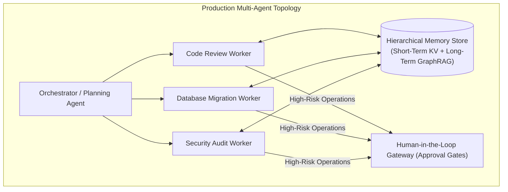

> **Answer-first:** Moving AI agents from toy demos to enterprise production requires treating them as **Stateful Distributed Systems**. This series documents the 6 core pillars of production agentic architecture: Swarm Topology (Router/Worker vs Shared Blackboards), Hierarchical Memory Management, Resilient Tool-Calling Protocols, AgentOps Observability, Automated Evals, and Human-in-the-Loop (HITL) Gateways.

---
## 🎯 The Architectural Challenge of Autonomous Agents

Building production-ready AI agents is fundamentally a distributed systems engineering challenge, not a prompt engineering trick:
* **Hallucination Cascades:** A single erroneous tool output in Step 2 propagates and corrupts decisions in Step 10.
* **State Loss & Memory Bloat:** Multi-turn dialogue context quickly overflows LLM context windows, degrading retrieval precision.
* **Runaway Agent Costs & Infinite Loops:** Poorly bounded agent swarms can burn thousands of API tokens in recursive loops.

---

## 🗺️ Masterclass Chapters

- **[Executive Summary: The 6 Pillars of Production Agentic Systems](/series/agentic-system-architecture/executive-summary/)**  
  *High-level blueprint, failure mode taxonomy, and architectural boundaries.*
- **[Part 1: Swarm Topologies — Hierarchical Routers vs. Shared Blackboards](/series/agentic-system-architecture/part-1-topology/)**  
  *Comparing orchestrator-worker, peer-to-peer swarms, and actor mailbox models.*
- **[Part 2: Hierarchical Memory — Episodic, Semantic & Temporal Graphs](/series/agentic-system-architecture/part-2-memory/)**  
  *Solving the context window problem with working memory buffers, vector retrieval, and knowledge graphs.*
- **[Part 3: Resilient Tool Calling — Model Context Protocol (MCP) & Sandboxing](/series/agentic-system-architecture/part-3-tool-calling/)**  
  *Schema validation, rate-limiting, idempotent retries, and kernel-level sandboxing.*
- **[Part 4: AgentOps — Tracing, Token FinOps & Deadlock Detection](/series/agentic-system-architecture/part-4-agentops/)**  
  *OpenTelemetry semantic conventions for AI agents, distributed tracing, and loop break circuits.*
- **[Part 5: Agent Evals — Automated Benchmarking & Trajectory Validation](/series/agentic-system-architecture/part-5-agent-evals/)**  
  *LLM-as-a-judge trajectory grading, tool invocation accuracy, and regression testing.*
- **[Part 6: Human-in-the-Loop (HITL) Gateways & Security Boundaries](/series/agentic-system-architecture/part-6-human-in-the-loop/)**  
  *Async approval workflows, state pausing, privilege escalation controls, and audit trails.*
