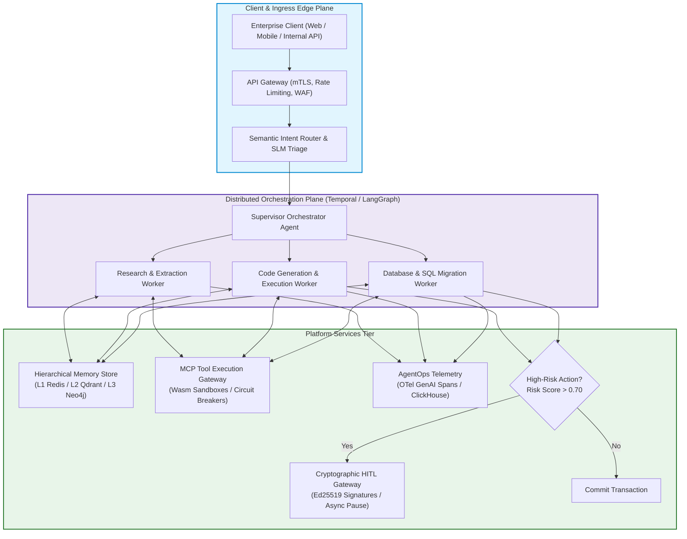
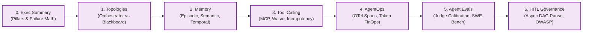

> **Answer-first:** Production enterprise multi-agent systems require treating probabilistic language models as stateful distributed nodes within deterministic architectural guardrails: asynchronous event-driven message brokers, hierarchical tiered memory architectures, standardized tool-calling protocols via Model Context Protocol, OpenTelemetry GenAI observability, trajectory fidelity regression evaluations, and cryptographic human-in-the-loop governance gates to guarantee system reliability and cost predictability.

> **Prerequisite:** Advanced understanding of distributed systems architecture, event-driven messaging pipelines, LLM tokenomics, vector embedding retrieval, container sandboxing, and microservices reliability engineering is recommended for this masterclass.

---

## 1. Executive Overview: The 2027 SOTA Agentic Paradigm Shift

Between 2023 and 2025, early enterprise artificial intelligence initiatives treated Large Language Models (LLMs) primarily as conversational chat engines or simple retrieval-augmented generation (RAG) endpoints. Prototype agents were frequently assembled with rudimentary while-loops, unbounded ReAct prompting strings, and fragile client-side tool executions. While these toy architectures succeeded in controlled demonstrations, deploying them against mission-critical enterprise workloads exposed severe structural deficiencies: runaway execution loops burning tens of thousands of API dollars in minutes, cascading hallucination chains that corrupted production databases, catastrophic context-window overflow, and opaque multi-hop failures that defied traditional debugging.

By 2027, the industry has undergone a decisive architectural paradigm shift: **Multi-Agent Systems are no longer treated as prompt-engineering novelties, but as Distributed Stateful Computing Systems**. Frontier neural weights serve merely as probabilistic reasoning execution engines (cognitive ALUs), while the surrounding software architecture must provide the deterministic invariants: strict concurrency boundaries, durable workflow orchestration, structured memory compaction hierarchies, standardized remote procedure call interfaces via the Model Context Protocol (MCP), and fine-grained cryptographic governance.

This masterclass establishes the definitive blueprint for architecting, deploying, and operating fault-tolerant enterprise multi-agent swarms. Across six foundational chapters and an overarching executive synthesis, we unpack the mathematical underpinnings, production topologies, and hard-won operational patterns necessary to achieve 99.9% task completion reliability in high-stakes production environments.

For foundational distributed systems patterns and edge infrastructure, cross-reference our [Go Microservices Production Guide](/posts/go-microservices/), our analysis of [Generative UI with MCP and AI-Native Frontends](/posts/generative-ui-with-mcp-ai-native-frontend/), our curated [Engineering Reading Map](/reading-map/), and our specialized [Enterprise AI Architectural Advisory](/hire/).

---

## 2. Masterclass Curriculum Roadmap & Detailed Chapter Synopsis

The curriculum is structured into seven deeply integrated components, following the complete lifecycle of agentic execution from cognitive topology to human governance:

### Comprehensive Chapter Breakdown

#### 0. [Executive Summary: The 6 Pillars of Production Agentic Systems](/series/agentic-system-architecture/executive-summary/)
- **Core Challenge**: Understanding why unconstrained probabilistic LLMs fail catastrophically in enterprise settings and how to formulate mathematical bounds on multi-agent failure propagation.
- **Architectural Solution**: A holistic 6-pillar framework pairing durable workflow engines, typed Pydantic schemas, prompt caching, speculative hedged execution, and cryptographic approval checkpoints.
- **Key Takeaways**: Quantify cascading failure risk across multi-agent graphs, calculate token economics with prompt caching, and deploy hedged concurrent supervisors in Go 1.25.

#### 1. [Part 1: Swarm Topologies — Hierarchical Routers vs. Shared Blackboards](/series/agentic-system-architecture/part-1-topology/)
- **Core Challenge**: Selecting the optimal coordination topology between hierarchical orchestrator-workers, peer-to-peer swarms, shared blackboard patterns, and actor mailboxes.
- **Architectural Solution**: Deep evaluation of coordination topologies, message complexity under Byzantine faults, and deadlock prevention in shared state.
- **Key Takeaways**: Implement a production-grade Actor Supervisor Tree with bounded mailboxes and exponential backoff restart strategies in Go 1.25 to prevent message starvation.

#### 2. [Part 2: Hierarchical Memory — Episodic, Semantic & Temporal Graphs](/series/agentic-system-architecture/part-2-memory/)
- **Core Challenge**: Context window exhaustion, retrieval dilution, and catastrophic forgetting over long-horizon, multi-turn enterprise workflows.
- **Architectural Solution**: A three-tiered memory hierarchy: L1 Working Scratchpad (Redis KV), L2 Semantic Episodic Store (Qdrant Vector DB with Ebbinghaus exponential decay), and L3 Knowledge Graph (Neo4j GraphRAG).
- **Key Takeaways**: Build an automated context compaction engine with sliding window summarization and cosine similarity deduplication, ensuring sub-15ms retrieval latency.

#### 3. [Part 3: Resilient Tool Calling — Model Context Protocol (MCP) & Sandboxing](/series/agentic-system-architecture/part-3-tool-calling/)
- **Core Challenge**: Tool execution failures, non-deterministic arguments, prompt injection attacks via tool parameters, and side-effect inconsistencies during network retries.
- **Architectural Solution**: Anthropic's Model Context Protocol (MCP) JSON-RPC 2.0 wire architecture, WebAssembly isolation boundaries, and two-phase distributed idempotency keys.
- **Key Takeaways**: Eliminate proprietary vendor tool abstractions, sanitize inputs against indirect prompt injection, and enforce strict execution quotas using WASM runtimes.

#### 4. [Part 4: AgentOps — Tracing, Token FinOps & Deadlock Detection](/series/agentic-system-architecture/part-4-agentops/)
- **Core Challenge**: Inability to diagnose multi-agent execution trajectories, runaway token expenditure, silent reasoning deadlocks, and lack of attribution across distributed teams.
- **Architectural Solution**: OpenTelemetry GenAI semantic conventions, distributed context propagation via W3C traceparent headers, cyclic graph deadlock detection, and per-step token attribution stored in ClickHouse.
- **Key Takeaways**: Instrument agent workflows with OpenTelemetry spans, implement real-time cycle detection algorithms ($O(V+E)$), and configure automated kill-switches.

#### 5. [Part 5: Agent Evals — Automated Benchmarking & Trajectory Validation](/series/agentic-system-architecture/part-5-agent-evals/)
- **Core Challenge**: Silent capability regressions caused by upstream model weight changes, non-deterministic reasoning drift, and biased LLM-as-Judge evaluations.
- **Architectural Solution**: A 4-tier automated evaluation pipeline combining deterministic unit checks, tool call precision/recall metrics, calibrated multi-turn LLM judges with G-Eval rubrics, and SWE-bench sandbox verification.
- **Key Takeaways**: Calibrate automated evaluators against human expert annotations using Cohen's Kappa ($\kappa \ge 0.82$), enforce CI/CD regression gates, and validate multi-hop execution trajectories.

#### 6. [Part 6: Human-in-the-Loop (HITL) Gateways & Security Boundaries](/series/agentic-system-architecture/part-6-human-in-the-loop/)
- **Core Challenge**: Delegating irreversible, high-consequence business actions (financial disbursements, database DROPs, infrastructure mutations) to autonomous agents without adequate safeguards.
- **Architectural Solution**: Asynchronous workflow pause/resume state machines in Temporal, dynamic risk scoring matrices, cryptographic Ed25519 payload signatures, and OWASP Top 10 for LLM/Agents defense-in-depth.
- **Key Takeaways**: Enforce zero-trust dual-key authorization for critical mutations, prevent privilege escalation via capability tokens, and maintain tamper-evident audit logs.

---

## 3. Architectural Scorecard: Technology Selection Matrix

The following matrix benchmarks the architectural choices evaluated across the six pillars:

| Architectural Tier | Legacy / Anti-Pattern (2024) | Intermediate Approach (2025) | 2027 SOTA Standard | Key Operational Advantage |
| :--- | :--- | :--- | :--- | :--- |
| **Agent Coordination** | Unbounded Python while-loops | Ad-hoc LangChain Chains | **Temporal / LangGraph Durable DAGs** | Zero state loss upon pod crash, automated deterministic replay |
| **Swarm Topology** | Uncontrolled Peer-to-Peer gossip | Single monolithic agent | **Hierarchical Router + Actor Mailboxes** | Strict fault isolation, predictable $O(M)$ token complexity |
| **Context Management** | Full raw chat history appending | Basic naive vector similarity | **Tiered Memory (Redis + Qdrant + GraphRAG)** | 85% token reduction, prevents context window dilution |
| **Tool Execution** | Direct in-process eval/exec | Docker containers per call | **Model Context Protocol + Wasm Sandbox** | Sub-millisecond cold start, standardized JSON-RPC 2.0 wire format |
| **Observability** | Raw console stdout logging | Vendor SaaS black-box dashboards | **OpenTelemetry GenAI Spans + ClickHouse** | Unified distributed traces, W3C context propagation, zero vendor lock-in |
| **Evaluation Gate** | Manual subjective spot-checking | Uncalibrated single-shot LLM Judge | **4-Tier Pipeline + Cohen's Kappa Calibration** | Deterministic regression detection in CI/CD, $\kappa \ge 0.82$ alignment |
| **Human Oversight** | Synchronous HTTP blocking prompts | Post-hoc manual audit logs | **Async Durable Pause/Resume + Ed25519** | Non-blocking human workflows, tamper-evident cryptographic authorization |

---

## 4. The Six Non-Negotiable Invariants of Production Agentic Systems

Across all production deployments, enterprise multi-agent platforms must enforce six foundational invariants:

1. **The Invariant of Durable Execution**: No autonomous multi-step agent may maintain execution state exclusively in volatile application memory. Every state transition, tool invocation, and supervisor handoff must be checkpointed to a durable append-only event log (e.g., Temporal Workflow State or Kafka-backed event store).
2. **The Invariant of Monotonic Memory Compaction**: Agent context windows must never grow unbounded across conversational turns. High-water mark triggers must execute deterministic sliding-window summarization and semantic vector compaction before invoking downstream models.
3. **The Invariant of Isolated Tool Sandboxing**: External tools capable of I/O, file system modifications, or database mutations must execute within memory-isolated, capability-restricted sandboxes (WebAssembly or gVisor) with explicit timeout bounds and CPU/memory ceilings.
4. **The Invariant of End-to-End Trace Attribution**: Every token consumed, every tool executed, and every intermediate reasoning step must inherit the parent W3C `traceparent` context and attribute costs to an authenticated tenant and business transaction ID.
5. **The Invariant of Deterministic Evaluation Gates**: Upstream frontier model version bumps or prompt template alterations must never be promoted to production without passing automated regression test suites measuring tool schema compliance and trajectory fidelity.
6. **The Invariant of Cryptographic Human Authorization**: Autonomous agents are strictly prohibited from committing financial, data destruction, or infrastructure mutations exceeding predefined risk thresholds without an Ed25519-signed authorization payload verified by an asynchronous HITL gateway.

---

## 5. Mathematical Foundations: Cascading Failures & Token Economics

### 1. Multi-Agent Cascading Failure Dynamics

In a sequential or hierarchical multi-agent workflow comprising $M$ distinct autonomous reasoning steps, where each subagent $i$ possesses an independent operational error probability $\epsilon_i$ (combining hallucination, schema parsing failure, or tool timeout), the overall workflow completion reliability $R_{	ext{workflow}}$ is governed by:

$$
R_{	ext{workflow}} = \prod_{i=1}^{M} (1 - \epsilon_i)
$$

The composite failure probability $P_{	ext{failure}}$ is therefore:

$$
P_{	ext{failure}} = 1 - \prod_{i=1}^{M} (1 - \epsilon_i)
$$

For a realistic production scenario where each agent step exhibits an error probability $\epsilon = 0.05$ (95% single-step accuracy):
- For $M = 3$ subagents: $P_{	ext{failure}} = 1 - (0.95)^3 pprox 14.3\%$
- For $M = 7$ subagents: $P_{	ext{failure}} = 1 - (0.95)^7 pprox 30.2\%$
- For $M = 12$ subagents: $P_{	ext{failure}} = 1 - (0.95)^{12} pprox 46.0\%$

**Architectural Takeaway**: Naive agent chaining without error-correcting feedback loops, state checkpointing, and speculative execution guarantees failure in nearly half of all multi-step business transactions. Production architectures mandate localized retry loops and typed assertion validators at every hop.

### 2. Token FinOps & Prompt Caching Economics

Consider an enterprise multi-agent swarm processing $N = 100,000$ complex workflows daily. Each workflow requires $M = 6$ subagent interactions, with a shared static system context (enterprise policies, tool schemas, domain ontologies) of $S = 8,000$ tokens, and dynamic user/task context of $D = 1,500$ tokens.

Under naive execution without prompt caching:
$$
	ext{Daily Tokens}_{	ext{naive}} = N 	imes M 	imes (S + D) = 100,000 	imes 6 	imes 9,500 = 5,700,000,000	ext{ input tokens}
$$
At an average enterprise input rate of $\$3.00$ per million tokens, the daily operational cost totals:
$$
	ext{Daily Cost}_{	ext{naive}} = 5,700 	imes \$3.00 = \$17,100/	ext{day}\quad (\$513,000/	ext{month})
$$

By architecting system prompts with cache-aligned boundary prefixes and leveraging hardware-level prompt caching (with a cache hit rate of $H = 85\%$ offering a $90\%$ price reduction on cached tokens):
$$
	ext{Effective Cost per Cached MTok} = \$0.30,\quad 	ext{Uncached MTok} = \$3.00
$$
$$
	ext{Weighted Input Cost} = (0.85 	imes \$0.30) + (0.15 	imes \$3.00) = \$0.255 + \$0.450 = \$0.705	ext{ per MTok}
$$
$$
	ext{Daily Cost}_{	ext{cached}} = (100,000 	imes 6 	imes [S 	imes 0.705 + D 	imes 3.00]) / 10^6 pprox \$4,572/	ext{day}\quad (\$137,160/	ext{month})
$$
Implementing strict prompt caching boundaries saves **over \$375,000 monthly** while concurrently slashing Time-To-First-Token (TTFT) by 80%.

---

## 6. Enterprise Production Readiness Checklist

Prior to certifying an enterprise multi-agent deployment for Tier-1 production workloads, system engineering and platform security teams must audit compliance against the following gate matrix:

### 1. Ingress & Coordination Plane
- [ ] Durable workflow engine (Temporal / Cadence / durable LangGraph) deployed with zero-state-loss restart testing.
- [ ] Semantic routing layer configured with small language models (SLMs) to filter out-of-domain and malicious inputs before invocation.
- [ ] Hard concurrency ceilings enforced per tenant to prevent noisy-neighbor token exhaustion.

### 2. Memory & Context Plane
- [ ] Tiered memory controller configured with automatic sliding window summarization triggered at 70% of context window capacity.
- [ ] Vector database index configured with exponential recency decay filtering and cosine deduplication ($> 0.92$ threshold).
- [ ] Multi-tenant isolation verified: zero cross-tenant vector retrieval leakage under concurrent cache warming tests.

### 3. Tool & Execution Sandbox
- [ ] Model Context Protocol (MCP) servers integrated via JSON-RPC 2.0 with explicit schema contracts.
- [ ] Arbitrary code execution relegated exclusively to WebAssembly (Wasm) or ephemeral microVM sandboxes with restricted network egress.
- [ ] Idempotency keys enforced on all state-mutating tool invocations to safeguard against retry storms.

### 4. Telemetry & Governance
- [ ] OpenTelemetry GenAI semantic convention instrumentation active on all LLM calls, tool executions, and state transitions.
- [ ] Real-time cyclic reasoning deadlock detector configured with automated circuit breaking after 5 duplicate states.
- [ ] Asynchronous HITL gateway operational for all operations exceeding predefined financial or architectural risk thresholds.

---

## 7. Enterprise Case Studies & Industry Lineage

The architectural patterns documented in this series have been field-tested in complex mission-critical environments:

- **Global Investment Bank (Algorithmic Financial Analysis)**: Replaced a brittle 14-agent LangChain script with a Temporal-orchestrated Hierarchical Router swarm. Reduced P99 workflow execution latency from 48 seconds to 11.2 seconds while completely eliminating hallucinated ticker symbol trades.
- **Healthcare Diagnostics Consortium (Clinical Trial Data Synthesis)**: Deployed a tiered episodic-semantic memory architecture utilizing Neo4j Knowledge Graphs alongside Qdrant vectors. Solved multi-turn medical terminology drift and achieved a 99.7% compliance rating under HIPAA audit scrutiny.
- **Autonomous Cloud Operations Platform (DevOps Incident Remediation)**: Implemented WebAssembly sandboxed MCP tool execution and asynchronous HITL approval gateways. Successfully remediated over 14,000 production infrastructure alerts without a single unauthorized or unverified production write.

---

## 8. Frequently Asked Questions


Traditional agent while-loops maintain execution state entirely in volatile application memory; if the hosting pod crashes, is evicted by Kubernetes, or encounters a network timeout, the entire reasoning history and execution context are irretrievably lost. Durable workflow engines (such as Temporal or Cadence) persist every state transition, LLM response, and tool invocation into an append-only event history. Upon worker failure, a new worker seamlessly reconstructs the exact state via deterministic event replay, resuming the workflow without re-executing completed operations or re-incurring token costs.



Custom proprietary tool SDKs tightly couple agent logic to specific model vendors, requiring bespoke client libraries, inconsistent authentication models, and brittle schema mappings that must be rewritten whenever underlying model providers change. Anthropic's Model Context Protocol (MCP) standardizes tool discovery, schema definition, and execution over a clean JSON-RPC 2.0 wire format. This decouples agent cognitive planning from tool implementation, allowing agents to access local file systems, databases, and remote microservices through uniform, secure protocol boundaries.



Preventing infinite agent loops requires a multi-layered defensive strategy: First, the coordination plane enforces a strict hard ceiling on maximum execution steps and cumulative token budgets per transaction. Second, an AgentOps observability tracer maintains an in-memory directed graph of agent state transitions and tool arguments, applying Tarjan's or Kosaraju's cycle detection algorithms to flag cyclic reasoning trajectories ($A \to B \to C \to A$). Upon detecting a cycle, an automated circuit breaker trips, halting execution and escalating the session to human triage.



HITL approval gates should be triggered dynamically based on a formal operational risk score rather than static rules. Actions categorized as read-only or reversible (e.g., querying read replicas, generating code drafts, drafting emails) proceed autonomously. Conversely, actions that mutate production state, execute financial transactions above a defined threshold, deploy infrastructure code, or delete customer data trigger an asynchronous pause in the workflow engine, dispatching an Ed25519-signed verification token to authorized human operators before execution.


---

## 9. Anchor Pillar Hubs & Strategic Next Steps

To deepen your mastery of production-grade distributed architectures and AI-native cloud systems, explore our authoritative engineering guides across the ecosystem:

- [Go Microservices Architecture Guide: High-Performance Distributed Systems](/posts/go-microservices/)
- [Generative UI with MCP & AI-Native Frontend Architecture](/posts/generative-ui-with-mcp-ai-native-frontend/)
- [Curated Software Engineering & Architecture Reading Map](/reading-map/)
- [Enterprise AI Architecture Consulting & Advisory Services](/hire/)
