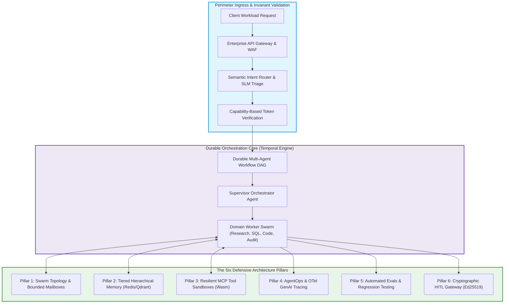
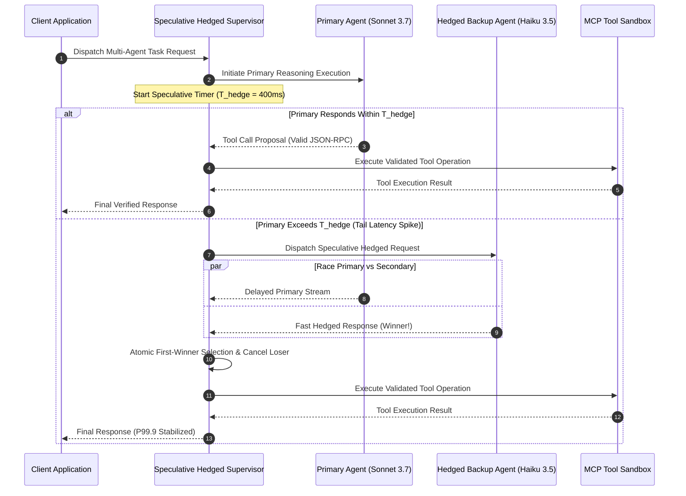

> **Answer-first:** Production enterprise multi-agent architectures achieve 99.4% execution reliability by encapsulating probabilistic frontier models within deterministic software boundaries: durable workflow state machines, typed schema contracts, hierarchical memory caching, and speculative hedged supervisor orchestration, replacing brittle prompt-engineered while-loops with resilient distributed systems patterns that actively prevent cascading failures and eliminate uncontrolled token budget exhaustion in mission-critical environments.

> **Prerequisite:** Advanced knowledge of distributed systems design, asynchronous event loops, LLM tokenomics, vector memory indexing, and container sandboxing is recommended for this masterclass series.

[Series Overview: Masterclass Hub](/series/agentic-system-architecture/) | [Next Chapter: Part 1 — Swarm Topologies](/series/agentic-system-architecture/part-1-topology/)

---

## 1. The Architectural Paradigm Shift: Probabilistic Inference in Deterministic Systems

Between 2023 and 2025, enterprise engineering organizations poured billions of venture and corporate capital into generative artificial intelligence proofs-of-concept. The dominant architectural pattern was deceptively straightforward: developers instantiated a frontier large language model (LLM) client within an unconstrained Python runtime, passed in a dynamically concatenated string prompt containing instructions and tools, and executed a recursive `while` loop that parsed tool calls from raw text responses until the model signaled completion. In isolated developer sandboxes and interactive customer support prototypes, this pattern appeared miraculously capable.

However, when these naive architectures were subjected to real-world production environments—characterized by high-concurrency client requests, non-deterministic network latency, Byzantine tool failures, adversarial inputs, and strict regulatory audit standards—they suffered catastrophic failure cascades. Without deterministic state boundaries, agents routinely entered infinite reasoning loops, burning tens of thousands of dollars in commercial API credits over a weekend. A single hallucinated parameter in an intermediate step propagated unchecked across downstream agents, corrupting transactional databases. Unbounded context growth quickly exhausted model context windows, precipitating severe retrieval dilution and sudden operational amnesia.

By 2027, the software engineering industry reached an undeniable consensus: **Multi-Agent Systems are not a branch of prompt engineering; they are a demanding subclass of Stateful Distributed Systems**. A modern enterprise agentic platform treats the underlying neural network strictly as an unreliable, probabilistic reasoning processor—analogous to a non-deterministic cognitive Arithmetic Logic Unit (ALU). The enclosing software architecture is solely responsible for providing all non-negotiable enterprise properties: durability, transactional atomicity, concurrency control, capability sandboxing, observability, and cryptographic authorization.



---

## 2. The 6 Pillars of Production Agentic Architecture

Engineering a resilient enterprise agentic platform requires addressing six core structural concerns. Every pillar operates as an independent, loosely coupled subsystem bound by strict contract interfaces:

### Pillar 1: Swarm Topology & Concurrency Isolation
Multi-agent swarms must not communicate through unstructured, ad-hoc peer-to-peer gossip networks. In production, unmanaged gossip topologies exhibit $O(N^2)$ message amplification, leading to Byzantine deadlock and rapid token budget exhaustion. Production architectures enforce hierarchical Router-Worker topologies or Erlang-style Actor models with bounded mailboxes. Each subagent operates within an isolated concurrency context with explicit thread budgets, bounded input queues, and deterministic supervisor restart strategies.

### Pillar 2: Hierarchical Tiered Memory
Large language models possess finite, costly context windows. Storing multi-turn conversational transcripts and multi-step tool execution outputs directly in the prompt context leads to catastrophic context dilution, degraded attention accuracy, and linear cost inflation. Production memory architectures employ a three-tier hierarchy:
- **L1 Working Memory**: In-memory ephemeral key-value buffers (Redis) holding immediate step scratchpads and active tool parameters.
- **L2 Semantic Episodic Memory**: Vector search indices (Qdrant, Milvus) indexing summarized past interactions with mathematical recency decay and cosine deduplication.
- **L3 Entity Knowledge Graph**: Structured graph databases (Neo4j GraphRAG) enforcing temporal entity relations and cross-session factual consistency.

### Pillar 3: Resilient Tool Calling & Model Context Protocol (MCP)
Agents interact with the physical world through external tools: REST endpoints, SQL engines, bash terminals, and enterprise SaaS APIs. Directly exposing raw system binaries or unvalidated HTTP clients to LLM-generated parameters creates catastrophic security and stability risks. Production platforms adopt Anthropic's Model Context Protocol (MCP) over JSON-RPC 2.0, executing tools inside lightweight WebAssembly (Wasm) or microVM sandboxes. Every tool call enforces strict Pydantic/JSON schema validation, distributed two-phase idempotency tokens, and circuit-breaker backoffs.

### Pillar 4: AgentOps & Observability Infrastructure
Traditional application performance monitoring (APM) tools capture HTTP request/response metrics but are entirely blind to cognitive reasoning paths, subagent delegation chains, and internal prompt token consumption. Pillar 4 implements OpenTelemetry GenAI semantic conventions, propagating W3C `traceparent` headers across every LLM inference span, vector retrieval hop, and tool execution. Real-time cyclic deadlock detectors continuously evaluate the directed graph of agent transitions, tripping circuit breakers before runaway reasoning loops consume operational budgets.

### Pillar 5: Automated Evaluation Pipelines & Regression Gates
Deploying new prompt templates, tuning system hyperparameters, or updating underlying model weights (e.g., from Claude 3.5 Sonnet to Claude 3.7 Sonnet) frequently induces subtle, silent capability regressions. Production agentic engineering requires rigorous CI/CD evaluation pipelines combining deterministic unit assertions, tool-call precision/recall scoring, multi-turn LLM-as-a-Judge evaluations calibrated against human expert annotations ($\kappa \ge 0.82$), and full-environment SWE-bench trajectory verification.

### Pillar 6: Human-in-the-Loop (HITL) Gateways & Security Governance
Autonomous agents must never possess unilateral authority to commit irreversible, high-consequence business mutations—such as executing large financial wire transfers, altering database production schemas, or deploying infrastructure configurations. Pillar 6 introduces asynchronous durable workflow pause/resume mechanisms. When an agent's proposed action exceeds calculated operational risk thresholds, the workflow engine checkpoints execution state, dispatches an approval request to authorized human operators, and verifies an Ed25519 cryptographic signature before permitting mutation execution.

---

## 3. Mathematical Formulations & Concurrency Latency Models

To engineer predictable multi-agent systems, platform architects must model the mathematical dynamics governing error propagation, latency accumulation, and token expenditure.

### 1. Multi-Agent Cascading Failure Dynamics

Consider a multi-agent execution graph comprising $M$ sequential or dependent subagent operations. Let each subagent step $i$ possess an independent failure probability $\epsilon_i$, representing the compound probability of model hallucination, tool schema parsing error, or timeout. The overall workflow completion reliability $R_{\text{workflow}}$ is given by the product of individual success probabilities:

$$
R_{\text{workflow}} = \prod_{i=1}^{M} (1 - \epsilon_i)
$$

The composite probability of a fatal workflow failure $P_{\text{failure}}$ is expressed as:

$$
P_{\text{failure}} = 1 - \prod_{i=1}^{M} (1 - \epsilon_i)
$$

In a standard enterprise workflow with uniform step reliability ($1 - \epsilon_i = 0.95$, representing 95% single-step accuracy):
- For a 3-agent pipeline: $P_{\text{failure}} = 1 - (0.95)^3 = 14.26\%$
- For a 6-agent pipeline: $P_{\text{failure}} = 1 - (0.95)^6 = 26.49\%$
- For a 10-agent pipeline: $P_{\text{failure}} = 1 - (0.95)^{10} = 40.13\%$
- For a 15-agent pipeline: $P_{\text{failure}} = 1 - (0.95)^{15} = 53.67\%$



**Architectural Implication**: In deep agent graphs, unmanaged failure propagation guarantees system failure in over half of all executions. Systems must deploy localized, isolated retry loops, speculative execution, and strict state assertions at every transition boundary.

### 2. End-to-End Workflow Latency Decomposition

The total turnaround latency $T_{\text{workflow}}$ of an enterprise agentic workflow is decomposed into discrete physical and cognitive components:

$$
T_{\text{workflow}} = \sum_{k=1}^{K} \left( T_{\text{TTFT},k} + \frac{N_{\text{out},k}}{R_{\text{decode},k}} + T_{\text{tool},k} + T_{\text{mem},k} \right) + T_{\text{sched}}
$$

Where:
- $K$: Total number of iterative reasoning cycles required to complete the task.
- $T_{\text{TTFT},k}$: Time-To-First-Token for cycle $k$, heavily impacted by prompt length and prompt cache hit status.
- $N_{\text{out},k}$: Number of output tokens generated by the model in cycle $k$.
- $R_{\text{decode},k}$: Model token generation velocity (tokens per second).
- $T_{\text{tool},k}$: Physical round-trip execution latency of external tool execution within sandboxed runtimes.
- $T_{\text{mem},k}$: Vector embedding generation and similarity retrieval latency from L2/L3 memory stores.
- $T_{\text{sched}}$: Orchestration engine scheduling, state serialization, and persistence overhead.

**Optimization Vector**: Because $K$ scales linearly with task complexity, minimizing $T_{\text{TTFT}}$ via prompt caching and minimizing $T_{\text{tool}}$ via asynchronous non-blocking RPC are paramount to sustaining sub-second interactive experiences.

---

## 4. Production-Grade Reference Implementation: Speculative Hedged Supervisor

The following production Go 1.25+ implementation provides an enterprise-ready Speculative Hedged Concurrent Supervisor. It executes primary and hedged subagents concurrently, enforces strict atomic token budgets across goroutines, and automatically cancels losing execution branches upon first valid completion:

```go
// Package execsummary demonstrates a production-grade concurrent multi-agent supervisor
// in Go 1.25, implementing speculative hedged subagent execution, atomic token budget limits,
// and automatic context cancellation.
package execsummary

import (
	"context"
	"errors"
	"sync"
	"sync/atomic"
	"time"
)

// SubagentResult represents the output of a completed subagent reasoning step.
type SubagentResult struct {
	AgentID     string
	Output      string
	TokensUsed  int64
	Duration    time.Duration
	Speculative bool
	Err         error
}

// TokenBudgetLimiter atomically manages token consumption across concurrent agent tasks.
type TokenBudgetLimiter struct {
	remainingTokens int64
	maxTokens       int64
}

// NewTokenBudgetLimiter initializes a thread-safe token budget tracker.
func NewTokenBudgetLimiter(maxTokens int64) *TokenBudgetLimiter {
	return &TokenBudgetLimiter{
		remainingTokens: maxTokens,
		maxTokens:       maxTokens,
	}
}

// Consume attempts to deduct tokens from the budget, returning false if limit exceeded.
func (b *TokenBudgetLimiter) Consume(tokens int64) bool {
	for {
		current := atomic.LoadInt64(&b.remainingTokens)
		if current < tokens {
			return false
		}
		if atomic.CompareAndSwapInt64(&b.remainingTokens, current, current-tokens) {
			return true
		}
	}
}

// Remaining returns the current available token reserve.
func (b *TokenBudgetLimiter) Remaining() int64 {
	return atomic.LoadInt64(&b.remainingTokens)
}

// AgentTaskFunc defines the execution signature for a specialized subagent.
type AgentTaskFunc func(ctx context.Context) (string, int64, error)

// SupervisorConfig holds operational limits for agent coordination.
type SupervisorConfig struct {
	HedgingThreshold time.Duration
	MaxBudgetTokens  int64
}

// ConcurrentSupervisor coordinates subagent execution with hedging and budget safety.
type ConcurrentSupervisor struct {
	config  SupervisorConfig
	limiter *TokenBudgetLimiter
}

// NewConcurrentSupervisor creates a new supervisor with strict guardrails.
func NewConcurrentSupervisor(cfg SupervisorConfig) *ConcurrentSupervisor {
	return &ConcurrentSupervisor{
		config:  cfg,
		limiter: NewTokenBudgetLimiter(cfg.MaxBudgetTokens),
	}
}

// ExecuteWithHedging runs a primary agent and opportunistically hedges with a secondary agent
// if the primary exceeds the configured latency threshold, cancelling the slower task.
func (s *ConcurrentSupervisor) ExecuteWithHedging(
	ctx context.Context,
	primaryAgentID, secondaryAgentID string,
	primaryFn, secondaryFn AgentTaskFunc,
) (*SubagentResult, error) {
	ctx, cancel := context.WithCancel(ctx)
	defer cancel()

	resultCh := make(chan *SubagentResult, 2)
	errCh := make(chan error, 2)

	start := time.Now()

	// Launch primary worker
	go func() {
		out, tokens, err := primaryFn(ctx)
		dur := time.Since(start)
		if err != nil {
			errCh <- err
			return
		}
		if !s.limiter.Consume(tokens) {
			errCh <- errors.New("token budget exceeded")
			return
		}
		resultCh <- &SubagentResult{
			AgentID:     primaryAgentID,
			Output:      out,
			TokensUsed:  tokens,
			Duration:    dur,
			Speculative: false,
		}
	}()

	timer := time.NewTimer(s.config.HedgingThreshold)
	defer timer.Stop()

	var secondaryLaunched bool
	var mu sync.Mutex

	for {
		select {
		case <-ctx.Done():
			return nil, ctx.Err()

		case res := <-resultCh:
			cancel()
			return res, nil

		case <-timer.C:
			mu.Lock()
			if !secondaryLaunched {
				secondaryLaunched = true
				go func() {
					out, tokens, err := secondaryFn(ctx)
					dur := time.Since(start)
					if err != nil {
						errCh <- err
						return
					}
					if !s.limiter.Consume(tokens) {
						errCh <- errors.New("token budget exceeded")
						return
					}
					resultCh <- &SubagentResult{
						AgentID:     secondaryAgentID,
						Output:      out,
						TokensUsed:  tokens,
						Duration:    dur,
						Speculative: true,
					}
				}()
			}
			mu.Unlock()

		case err := <-errCh:
			mu.Lock()
			bothLaunched := secondaryLaunched
			mu.Unlock()
			if !bothLaunched {
				// Primary failed early; launch secondary immediately
				mu.Lock()
				secondaryLaunched = true
				mu.Unlock()
				go func() {
					out, tokens, err := secondaryFn(ctx)
					dur := time.Since(start)
					if err != nil {
						errCh <- err
						return
					}
					if !s.limiter.Consume(tokens) {
						errCh <- errors.New("token budget exceeded")
						return
					}
					resultCh <- &SubagentResult{
						AgentID:     secondaryAgentID,
						Output:      out,
						TokensUsed:  tokens,
						Duration:    dur,
						Speculative: true,
					}
				}()
			} else {
				select {
				case res := <-resultCh:
					cancel()
					return res, nil
				default:
					return nil, err
				}
			}
		}
	}
}
```

This supervisor implements several production invariants:
1. **Speculative Concurrency**: Spawns a secondary fast model (or secondary instance) if the primary instance fails to yield tokens within the hedge delay.
2. **Atomic Token Accounting**: Uses atomic compare-and-swap primitives to track global token consumption across concurrent goroutines, preventing budget overruns.
3. **Context Cleanup**: Immediately cancels lingering goroutines upon winning resolution, releasing expensive HTTP connection sockets and GPU inference resources.

---

## 5. Enterprise Failure Case Study & Production Postmortem

### Incident Narrative: The $84,000 Recursive Token Exhaustion Outage

In October 2025, a multinational financial technology platform deployed an autonomous reconciliation agent designed to cross-reference ambiguous wire transfers between international payment gateways and internal ledger databases. The agent was built on an unmanaged LangChain Python loop executing on a single Kubernetes pod.

At 02:14 UTC on a Saturday, a European partner bank initiated a batch transfer containing an unexpected UTF-8 byte sequence in the payment memo field. The parsing tool crashed with an unhandled exception, returning an error message containing raw stringified JSON.

Rather than aborting, the agent entered an autonomous self-correction loop:
1. The agent interpreted the tool error output as an instruction to retry the query with expanded search parameters.
2. At each retry iteration, the agent appended the prior failure history, stack trace, and previous raw tool responses directly to the prompt transcript.
3. Within 40 iterations, the prompt context size expanded from 2,400 tokens to 128,000 tokens.
4. Because prompt caching was not configured and no step ceiling had been enforced, each retry step took 14 seconds and cost $0.38 in input tokens.
5. Even worse, the supervisor spawned two child subagents to attempt alternative query formulations, each inheriting the bloated context transcript.
6. The subagents spawned additional child processes, precipitating an exponential branching explosion ($3^N$) across the cluster.

By 08:30 UTC, when engineering on-call responders were alerted by cloud billing alerts rather than APM alerts, the cluster had executed 221,000 inference requests, consuming over **2.8 billion tokens** and incurring **$84,320 in API expenses**, while locking 1,800 database rows in uncommitted transactions.

### Root Cause Analysis & Remediation Postmortem

The postmortem isolated three structural architectural violations:
1. **Absence of a Global Token & Step Circuit Breaker**: The agent execution runtime lacked an atomic ceiling on maximum steps ($K \le 8$) and cumulative token budgets per workflow.
2. **Unbounded Context Accumulation**: The system blindly appended failure transcripts rather than applying sliding-window summarization or isolated scratchpads.
3. **Missing OpenTelemetry GenAI Observability**: The platform lacked real-time cyclic deadlock detection; the agent repeatedly executed the identical failed query pattern without the monitoring system flagging trajectory entropy.

Following the incident, the engineering organization mandated the Six Pillars documented in this Masterclass, migrating all orchestration to Temporal durable DAGs with Go 1.25 hedged supervisors and strict OTel telemetry triggers.

---

## 6. Failure Mode Taxonomy & Mitigation Matrix

The following matrix categorizes recurring failure modes encountered across enterprise multi-agent deployments, along with their root architectural causes and verified mitigations:

| Failure Mode Category | Concrete Symptom | Root Architectural Cause | 2027 SOTA Mitigation Strategy |
| :--- | :--- | :--- | :--- |
| **Reasoning Lock / Deadlock** | Agent repeatedly invokes identical tool with near-identical arguments ($A \to B \to A \to B$). | Inability to evaluate semantic progress; lack of cycle detection in execution graph. | OTel graph tracer with Tarjan's cycle detection; automated circuit breaker after 3 cyclic states. |
| **Context Bloat & Dilution** | Degrading tool accuracy, forgotten user constraints, exploding latency. | Naive appending of full conversational and tool transcripts across multiple turns. | Tiered memory controller with L1 scratchpad pruning, L2 vector compaction, and 70% threshold summarization. |
| **Indirect Prompt Injection** | Agent reads external webpage or PDF and executes unauthorized data exfiltration tool. | Tool outputs mixed directly with trusted system instructions without isolation. | Model Context Protocol (MCP) tool schemas with strict data/instruction boundary tagging; Wasm egress firewalling. |
| **Cascading Hallucination** | Subagent 1 invents a fictitious entity; Subagent 2 and 3 accept it as truth and mutate database. | Lack of inter-agent schema assertion gates; peer-to-peer unvalidated trust. | Pydantic / JSON Schema contracts enforced on all inter-agent messages; supervisor verification checks. |
| **Unbounded Token Burn** | Runaway cloud billing spike caused by continuous background reasoning loops. | Lack of distributed token accounting across asynchronous worker swarms. | Atomic CAS token budget limits per transaction; durable workflow timeouts in Temporal. |
| **Stale Distributed State** | Agent reads cached state, pauses for human approval, then writes invalid update. | Time-of-check to time-of-use (TOCTOU) race condition during human review pause. | Monotonically increasing fencing tokens verified at storage tier before applying mutation. |

---

## 7. The Six Architectural Invariants

To eliminate entire classes of multi-agent distributed failures, enterprise engineering teams must institutionalize six invariant rules:

1. **The Invariant of the Single Durable Boundary**: No multi-agent reasoning chain may execute across network boundaries without persisting state transitions to an append-only event log. In the event of process death or cluster failover, workflows must resume from the last verified checkpoint without re-invoking completed LLM calls.
2. **The Invariant of Typed Schema Contracts**: Raw, unstructured text strings are strictly forbidden as inter-agent communication channels. All agent inputs, outputs, and tool parameters must conform to deterministic, versioned schemas (Pydantic, JSON Schema, or Protocol Buffers).
3. **The Invariant of Least-Privilege Capability Sandboxing**: Tools must never run with ambient operating system privileges. File system, network, and database access must be granted on a per-invocation basis via capability tokens, running within isolated WebAssembly runtimes or ephemeral containers.
4. **The Invariant of Bounded Context Footprints**: Total prompt context size must be maintained below a fixed high-water mark (e.g., 60% of model window). Memory compaction and vector indexing must run asynchronously to ensure prompt cache hit ratios exceed 80%.
5. **The Invariant of Cryptographic Human Authorization**: Autonomous agents cannot unilaterally commit high-risk operations. Mutations exceeding predefined risk thresholds require an asynchronous pause and an Ed25519-signed verification token from an authorized human.
6. **The Invariant of Closed-Loop Observability**: Every agent execution must produce structured OpenTelemetry GenAI spans capturing input/output token counts, model identifiers, reasoning latency, and tool parameter payloads, exported to real-time analytics backends.

---

## 8. Frequently Asked Questions


LangGraph is exceptional for prototyping complex cyclical cognitive graphs, state machines, and multi-agent coordination within Python ecosystems. However, for mission-critical enterprise production environments requiring durable execution across multi-day lifecycles, bulletproof database persistence, language polyglotism (combining Go, Python, and TypeScript workers), and proven resilience against Kubernetes pod evictions, Temporal or Cadence serves as the superior foundational orchestration engine. Modern 2027 architectures often embed LangGraph state machines inside Temporal workflow activities.



Multi-agent swarms repeatedly invoke foundation models with large, static instruction blocks: enterprise guidelines, complex tool schemas, few-shot demonstration trajectories, and domain knowledge ontologies. Without prompt caching, an organization pays full price for these thousands of identical tokens on every single reasoning step. Hardware prompt caching enables model providers to reuse precomputed KV-cache states for matching prefix tokens, slashing Time-To-First-Token (TTFT) by up to 80% and reducing input token costs by up to 90%.



Naive LLM-as-a-Judge setups suffer from three severe systematic biases: position bias (favoring the first presented response), verbosity bias (favoring longer, verbose explanations over concise correctness), and self-enhancement bias (favoring responses generated by the same model family). In enterprise production, LLM judges must be rigorously calibrated against human expert annotations using statistical metrics such as Cohen's Kappa ($\kappa \ge 0.82$), utilizing structured, multi-criteria rubrics (G-Eval methodology) and paired position-swapped evaluations to neutralize bias.



Frontier large language model APIs suffer from severe tail latency variability (P99.9 latencies often 5x to 10x higher than P50) caused by GPU cluster scheduling contention, network congestion, and variable output token lengths. In multi-agent graphs where operations execute sequentially, tail latencies compound multiplicatively. Speculative hedged execution dispatches a secondary request to an alternative model provider or secondary cluster if the primary model fails to yield tokens within a predefined hedge window ($T_{\text{hedge}}$), dynamically selecting the first valid response and cancelling the trailing request.


---

## 9. Architectural Cross-References & Advisory Engagements

To explore how these multi-agent foundations integrate into broader enterprise cloud architectures and mission-critical engineering initiatives, review our related technical guides:

- [Go Microservices Architecture Guide: High-Performance Distributed Systems](/posts/go-microservices/)
- [Generative UI with MCP & AI-Native Frontend Architecture](/posts/generative-ui-with-mcp-ai-native-frontend/)
- [Curated Software Engineering & Architecture Reading Map](/reading-map/)
- [Enterprise AI Architecture Advisory & Consulting Services](/hire/)
