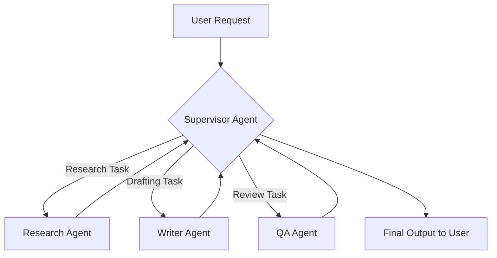

---

title: "Part 1 — Agent Topology & Orchestration"
date: "2026-05-15T08:00:00+07:00"
lastmod: "2026-05-15T08:00:00+07:00"
draft: false
description: "Explore Multi-Agent design patterns (Supervisor, P2P) and how to build a simple Python Orchestrator for task coordination."
ShowToc: true
TocOpen: true
weight: 2
categories: ["Series", "Agent Architecture"]
tags: ["AI", "Multi-Agent", "Orchestration", "System Design"]
cover:
  image: "images/posts/agentic-ai-swarm-cover.png"
  alt: "Agentic System Architecture series: multi-agent production systems with Go and LiteLLM"
  relative: false
author: "Lê Tuấn Anh"
canonicalURL: "https://tanhdev.com/series/agentic-system-architecture/part-1-topology/"
mermaid: true
---

> **Prerequisite:** To understand the context and why we need Multi-Agent systems instead of traditional Microservices, please refer to [Comprehensive AI-Native System Architecture](/series/ai-driven-playbook/part-8-ai-native-system-architecture/).

When first approaching GenAI, most developers start by stuffing a massive prompt into a single LLM, hoping it completes the entire task. However, as the system scales, this "Single Monolithic Agent" approach reveals fatal flaws regarding performance, cost, and risk control.

That is when we need a **Multi-Agent System**.

## 1.1. Why Multi-Agent instead of a Large Single Agent?

Similar to the transition from Monoliths to Microservices, Multi-Agent breaks down a complex task into independent sub-tasks. Each Agent gets its own context (System Prompt) and specific toolset (Tools).

- **Least Privilege:** Agent A (drafting content) shouldn't have access to the production Database. Splitting tasks enables highly secure Sandboxing.
- **Cost & Token Efficiency:** Instead of loading the company's entire context into an LLM, Agent B (Code Review) only receives the specific source code to review, saving millions of wasted tokens.
- **Maintainability:** You can upgrade the LLM model specifically for Agent A without breaking Agent B's logic.

## 1.2. Topology Models

How do Agents communicate with each other? Modern software architecture revolves around three main models:

### Supervisor / Worker (Hierarchical)
This is the most common and controllable model in Enterprise environments. A `Supervisor Agent` acts as a Manager, receiving the request from the User, decomposing it into tasks, and delegating them to `Worker Agents`. When a Worker finishes, it returns the result to the Supervisor for synthesis.

<!-- markdownlint-disable MD034 -->


### Peer-to-Peer
In this model, there is no "Boss". Agents have the authority to decide who takes the next step based on the current context. Each Agent evaluates whether it has the capability to handle the Request.

- **Use cases:** Suitable for creative Brainstorming, open debates, or simulation scenarios where multiple AIs act as different experts for cross-validation.
- **Pros:** Extremely flexible, capable of discovering creative solutions that humans might not anticipate.
- **Cons:** Highly Non-deterministic, unsuitable for sequential business processes (like payment approval), and particularly prone to costly **Infinite Loops**.

## 1.3. Routing logic: How does the Orchestrator know which Agent handles the task?

The essence of a `Supervisor` or `Orchestrator` is a **Semantic Router**. It doesn't rely on URLs or HTTP Methods like an API Gateway, but on *Natural Language Intent*.

When a User inputs: *"Find information about Kubernetes 1.36 and write a summary"*, the Orchestrator triggers:
1. `Classifier`: Classifies the Intent (Search + Summarize).
2. `Graph State`: Updates the system state.
3. `Dispatcher`: Calls the function to trigger the corresponding Workers in order.

> 🔥 **[Production Failure]: Agent Deadlock in a Customer Support System**
> **Symptom:** The automated customer response system hung, and API costs spiked dramatically.
> **Root Cause:** Two Agents were configured in a Peer-to-Peer model. The `Billing Agent` didn't understand the info and asked the `Tech Support Agent`. `Tech Support` also lacked context, so it replied with another question. Both got stuck in an endless chat loop, cross-requesting each other, burning 50,000 tokens/minute before being detected.
> 📊 **Impact:** Burned $500 of API budget in less than an hour; constant system timeouts.
> 📈 **Resolution:** 
> - Before: Ran with uncontrolled communication turns.
> - After: Configured `max_turns = 3` (maximum allowed chat turns). If exceeded, trigger an Exception and escalate to a Human-in-the-loop.
> *(Source: Synthesized from public post-mortems on the LangChain community and HackerNews).*

## 1.4. Case study: Building a Simple Orchestrator in Python

Below is a Python snippet simulating how to set up a Supervisor Orchestrator using a State Graph approach. (Using Python because the AI/LLM ecosystem is extremely friendly with this language).

```python
"""
Module: Simple Agentic Orchestrator
Description: Simulates basic State Graph Routing architecture to orchestrate Multi-Agent systems.
Focus: Uses GraphState to maintain and transfer context, and the supervisor_router function
acts as the Semantic Router for task decomposition.
"""

from typing import TypedDict, List

# 1. Define State (Graph State) maintained throughout the process
class GraphState(TypedDict):
    input_task: str
    current_worker: str
    intermediate_steps: List[str]
    final_result: str

# 2. Worker Agents
def research_worker(state: GraphState) -> GraphState:
    print(">> Research Agent: Searching for information...")
    # Simulate calling a Tool (Web Search)
    state["intermediate_steps"].append("Found documentation for Kubernetes 1.36")
    return state

def writer_worker(state: GraphState) -> GraphState:
    print(">> Writer Agent: Synthesizing content...")
    # Simulate LLM drafting logic
    state["final_result"] = "Summary: Kubernetes 1.36 focuses on..."
    return state

# 3. Supervisor (Orchestrator) Logic
def supervisor_router(state: GraphState) -> str:
    print(">> Supervisor: Analyzing Task...")
    task = state["input_task"].lower()
    
    if "information" in task and not state["intermediate_steps"]:
        return "research"
    elif "summary" in task and not state["final_result"]:
        return "write"
    else:
        return "done"

# 4. Execution Flow
def run_orchestrator(task: str):
    state = GraphState(input_task=task, current_worker="supervisor", intermediate_steps=[], final_result="")
    
    max_turns = 3 # Prevent Production Failure (Infinite Loop)
    turns = 0
    
    while turns < max_turns:
        next_step = supervisor_router(state)
        
        if next_step == "research":
            state = research_worker(state)
        elif next_step == "write":
            state = writer_worker(state)
        elif next_step == "done":
            print(f"✅ Completed: {state['final_result']}")
            break
            
        turns += 1
        
    if turns >= max_turns:
        print("❌ Warning: Loop limit exceeded (max_turns). Escalating to Human review.")

# Test execution
run_orchestrator("Find information about Kubernetes 1.36 and write a summary")
```

In the example above, `supervisor_router` represents a State Machine or a small LLM Classifier. Most importantly, we pre-programmed a **safety variable `max_turns`** to prevent the Deadlock disaster.

---
🔗 **Next Step:** The Orchestrator knows how to classify and delegate tasks — but how does an Agent remember important information from this session to the next without overflowing the Context Window? Find out in [Part 2 — State, Memory & Context Management](/series/agentic-system-architecture/part-2-memory/).
