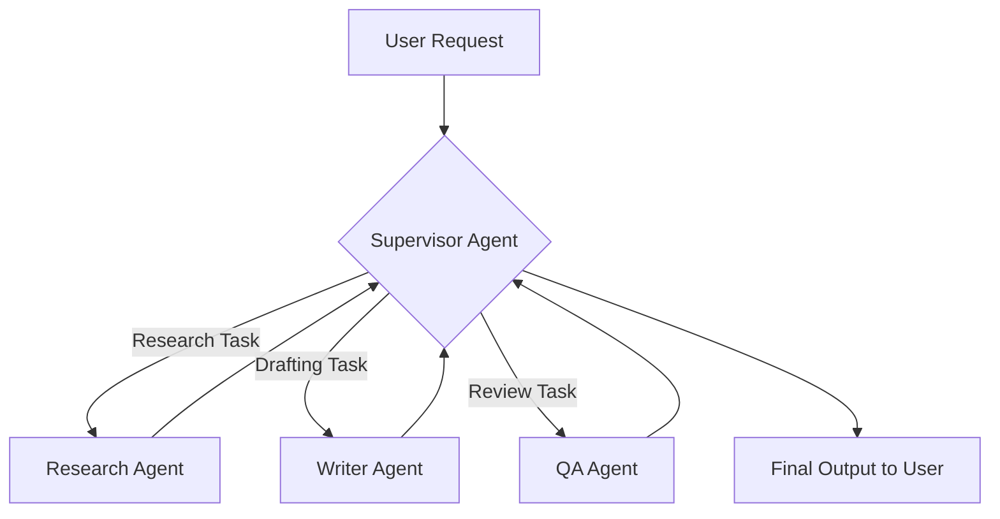

[← Chương trước: Executive Summary: Chuyển Dịch Sang Kiến Trúc Agentic](/series/agentic-system-architecture/executive-summary/) | [Mục lục Series](/series/agentic-system-architecture/) | [Chương tiếp theo: Phần 2: State, Memory & Context Management →](/series/agentic-system-architecture/part-2-memory/)

> **Answer-first:** Agent Topology phân loại kiến trúc điều phối thành Router, Orchestrator-Workers, và Autonomous Swarm. Việc lựa chọn mô hình phụ thuộc vào tính xác định của luồng nghiệp vụ: luồng tuần tự dùng Orchestrator tập trung, trong khi tác vụ phân tán phức tạp tận dụng Swarm với giao thức đồng thuận rõ ràng.

---

> **Prerequisite:** Để hiểu rõ bản chất kiến trúc và lý do tại sao chúng ta cần các hệ thống Multi-Agent thay vì Microservices truyền thống, vui lòng tham khảo [Kiến Trúc Hệ Thống AI-Native Toàn Diện](/series/ai-driven-playbook/part-8-ai-native-system-architecture/).

Khi mới tiếp cận với GenAI, đa phần lập trình viên đều bắt đầu bằng việc nhồi nhét một khối lượng prompt khổng lồ cho một LLM duy nhất, hy vọng nó sẽ hoàn thành toàn bộ tác vụ. Tuy nhiên, khi hệ thống scale, cách tiếp cận "Single Monolithic Agent" này bộc lộ những điểm yếu chí mạng về hiệu năng, chi phí và khả năng kiểm soát rủi ro.

Đó là lúc chúng ta cần đến **Multi-Agent System** (Hệ thống Đa Tác Vụ).

## 1.1. Tại sao lại cần Multi-Agent thay vì Single Agent lớn?

Giống như việc chuyển dịch từ Monolith sang Microservices, Multi-Agent chia nhỏ một tác vụ phức tạp thành các sub-tasks độc lập. Mỗi Agent sẽ có một ngữ cảnh (System Prompt) và bộ công cụ (Tools) riêng biệt.

- **Least Privilege:** Agent A (viết nháp nội dung) không nên có quyền truy cập Database production. Việc chia nhỏ giúp giới hạn quyền (Sandboxing) cực kỳ an toàn.
- **Cost & Token Efficiency:** Thay vì load toàn bộ context của công ty vào một LLM, Agent B (Review code) chỉ nhận đúng mã nguồn cần review, tiết kiệm hàng triệu tokens thừa.
- **Maintainability:** Có thể nâng cấp LLM model cho riêng Agent A mà không làm vỡ logic của Agent B.

## 1.2. Các mô hình Topology

Làm sao để các Agent giao tiếp với nhau? Kiến trúc phần mềm hiện nay xoay quanh ba mô hình chính:

### Supervisor / Worker (Hierarchical)
Đây là mô hình phổ biến và dễ kiểm soát nhất ở Enterprise. Một `Supervisor Agent` đóng vai trò như Manager, nhận yêu cầu từ User, phân rã (Decompose) thành các tasks và giao cho các `Worker Agents`. Khi Worker xong, nó trả kết quả về cho Supervisor để tổng hợp.

<!-- markdownlint-disable MD034 -->

```mermaid
flowchart TD
    User["User Request"] --> Supervisor{"Supervisor Agent"}
    Supervisor -->|Research Task| Worker1["Research Agent"]
    Supervisor -->|Drafting Task| Worker2["Writer Agent"]
    Supervisor -->|Review Task| Worker3["QA Agent"]
    
    Worker1 --> Supervisor
    Worker2 --> Supervisor
    Worker3 --> Supervisor
    
    Supervisor --> Output["Final Output to User"]
```

### Peer-to-Peer (Mạng ngang hàng)
Trong mô hình này, không có ai làm "Sếp". Các Agent có quyền tự quyết định ai sẽ làm bước tiếp theo dựa trên trạng thái hệ thống hiện tại. Mỗi Agent tự đánh giá xem mình có năng lực xử lý Request hay không.

- **Use cases:** Phù hợp cho các bài toán Brainstorming sáng tạo, tranh luận (Debate mở), hoặc các kịch bản mô phỏng nơi nhiều AI đóng vai các chuyên gia khác nhau để phản biện chéo (Cross-validation).
- **Pros (Ưu điểm):** Cực kỳ linh hoạt, có thể tìm ra những hướng giải quyết sáng tạo mà con người không lường trước được.
- **Cons (Nhược điểm):** Rất khó kiểm soát (Non-deterministic), không phù hợp cho các quy trình doanh nghiệp có tính tuần tự (như phê duyệt thanh toán), và đặc biệt dễ sinh ra **vòng lặp vô tận (Infinite Loops)** gây tốn kém.

## 1.3. Routing logic: Làm sao Orchestrator biết Agent nào xử lý task?

Bản chất của một `Supervisor` hay `Orchestrator` là một hệ thống **Semantic Router**. Nó không dựa trên URL hay HTTP Method như API Gateway, mà dựa trên *Ý định của ngôn ngữ tự nhiên (Intent)*.

Khi User nhập: *"Tìm thông tin về Kubernetes 1.36 và viết một bản tóm tắt"*, Orchestrator sẽ kích hoạt:
1. `Classifier`: Phân loại Intent (Search + Summarize).
2. `Graph State`: Cập nhật trạng thái hệ thống. (Năm 2026, các team kỹ thuật thường sử dụng các framework như **LangGraph** thay vì tự code state machine thủ công để tránh rủi ro quản lý luồng).
3. `Dispatcher`: Gọi hàm kích hoạt các Worker tương ứng theo thứ tự.

> 🔥 **[Production Failure]: Agent Deadlock trong hệ thống Customer Support**
> **Symptom:** Hệ thống tự động phản hồi khách hàng bị treo, chi phí API tăng đột biến.
> **Root Cause:** Hai Agent được thiết lập mô hình Peer-to-Peer. `Agent Billing` không hiểu thông tin, hỏi lại `Agent Tech Support`. `Tech Support` cũng thiếu context nên trả lời bằng một câu hỏi khác. Cả hai kẹt trong một vòng lặp chat vô tận, gửi request chéo nhau, đốt 50,000 tokens/phút trước khi bị phát hiện.
> 📊 **Impact:** Đốt cháy 500$ ngân sách API trong chưa đầy 1 tiếng, hệ thống timeout liên tục.
> 📈 **Before/After (Khắc phục):** 
> - Trước: Chạy không kiểm soát số lượt giao tiếp.
> - Sau: Thiết lập cấu hình `max_turns = 3` (giới hạn số lượt chat tối đa). Nếu vượt quá, kích hoạt Exception ném về cho Human-in-the-loop (nhân viên thật).
> *(Source: Tổng hợp từ các báo cáo post-mortem trên cộng đồng LangChain và HackerNews).*

## 1.4. Case study: Xây dựng Orchestrator đơn giản với Python

Dưới đây là một đoạn mã Python mô phỏng cách thiết lập một Supervisor Orchestrator sử dụng thư viện mô phỏng State Graph. (Sử dụng Python vì hệ sinh thái AI/LLM cực kỳ thân thiện với ngôn ngữ này).

```python
"""
Module: Simple Agentic Orchestrator
Description: Mô phỏng kiến trúc State Graph Routing cơ bản để điều phối Multi-Agent.
Trọng tâm: Sử dụng GraphState để duy trì và truyền tải ngữ cảnh, cùng hàm supervisor_router 
đóng vai trò Semantic Router phân rã công việc (Decompose task).
"""

from typing import TypedDict, List

# 1. Định nghĩa State (Graph State) lưu giữ xuyên suốt quá trình
class GraphState(TypedDict):
    input_task: str
    current_worker: str
    intermediate_steps: List[str]
    final_result: str

# 2. Worker Agents
def research_worker(state: GraphState) -> GraphState:
    print(">> Research Agent: Đang tìm kiếm thông tin...")
    # Giả lập logic gọi Tool (Web Search)
    state["intermediate_steps"].append("Đã tìm thấy tài liệu Kubernetes 1.36")
    return state

def writer_worker(state: GraphState) -> GraphState:
    print(">> Writer Agent: Đang tổng hợp nội dung...")
    # Giả lập logic LLM soạn thảo
    state["final_result"] = "Bản tóm tắt: Kubernetes 1.36 tập trung vào..."
    return state

# 3. Supervisor (Orchestrator) Logic
def supervisor_router(state: GraphState) -> str:
    print(">> Supervisor: Đang phân tích Task...")
    task = state["input_task"].lower()
    
    if "tìm thông tin" in task and not state["intermediate_steps"]:
        return "research"
    elif "tóm tắt" in task and not state["final_result"]:
        return "write"
    else:
        return "done"

# 4. Thực thi luồng
def run_orchestrator(task: str):
    state = GraphState(input_task=task, current_worker="supervisor", intermediate_steps=[], final_result="")
    
    max_turns = 3 # Tránh Production Failure (Infinite Loop)
    turns = 0
    
    while turns < max_turns:
        next_step = supervisor_router(state)
        
        if next_step == "research":
            state = research_worker(state)
        elif next_step == "write":
            state = writer_worker(state)
        elif next_step == "done":
            print(f"✅ Hoàn thành: {state['final_result']}")
            break
            
        turns += 1
        
    if turns >= max_turns:
        print("❌ Cảnh báo: Vượt quá giới hạn vòng lặp (max_turns). Chuyển cho Human review.")

# Test thử
run_orchestrator("Tìm thông tin về Kubernetes 1.36 và viết một bản tóm tắt")
```

Trong ví dụ trên, `supervisor_router` đại diện cho một State Machine hoặc một LLM Classifier nhỏ. Quan trọng nhất là chúng ta đã lập trình sẵn **biến số an toàn `max_turns`** để ngăn chặn thảm họa Deadlock.

---
🔗 **Bước tiếp theo:** Orchestrator đã biết cách phân loại và giao việc — nhưng làm sao Agent nhớ được các thông tin quan trọng từ phiên làm việc này qua phiên làm việc khác mà không bị tràn Context Window? Mời bạn đón đọc [Part 2 — State, Memory & Context Management](/series/agentic-system-architecture/part-2-memory/).

---

### 🔗 Đọc thêm các chuyên đề liên quan:
- [Kiến trúc Microservices Golang & DDD](/posts/architecting-21-service-ecommerce-golang-ddd/)
- [Triển khai Agentic AI Swarm trong Production với OpenClaw & LiteLLM](/posts/deploying-autonomous-ai-swarm-openclaw-litellm/)
- [Kiến trúc Microservices Golang gRPC: Protobuf, TLS & Middleware](/posts/golang-grpc-microservices-production-guide/)

---

[← Chương trước: Executive Summary: Chuyển Dịch Sang Kiến Trúc Agentic](/series/agentic-system-architecture/executive-summary/) | [Mục lục Series](/series/agentic-system-architecture/) | [Chương tiếp theo: Phần 2: State, Memory & Context Management →](/series/agentic-system-architecture/part-2-memory/)


---

## ❓ Câu Hỏi Thường Gặp (FAQ)

### Q1: Agent Topology & Orchestration giải quyết vấn đề cốt lõi nào trong kiến trúc hệ thống?
Khám phá các mô hình thiết kế Multi-Agent (Supervisor, P2P) và cách xây dựng một Orchestrator đơn giản bằng Python để điều phối công việc.

### Q2: Những lưu ý quan trọng nhất khi triển khai thực tế là gì?
Cần chú trọng phân tầng ranh giới trách nhiệm (bounded context), thiết lập cơ chế fallback dự phòng, và giám sát chặt chẽ qua metrics OpenTelemetry để phát hiện sớm các điểm nghẽn.

### Q3: Làm sao để kiểm thử và đánh giá hiệu quả sau khi áp dụng?
Áp dụng kiểm thử tải (load test), benchmark độ trễ P95/P99 trước và sau triển khai, kết hợp tracing phân tán để xác minh tính ổn định dưới tải cao.
