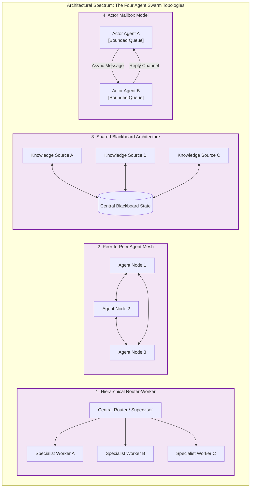
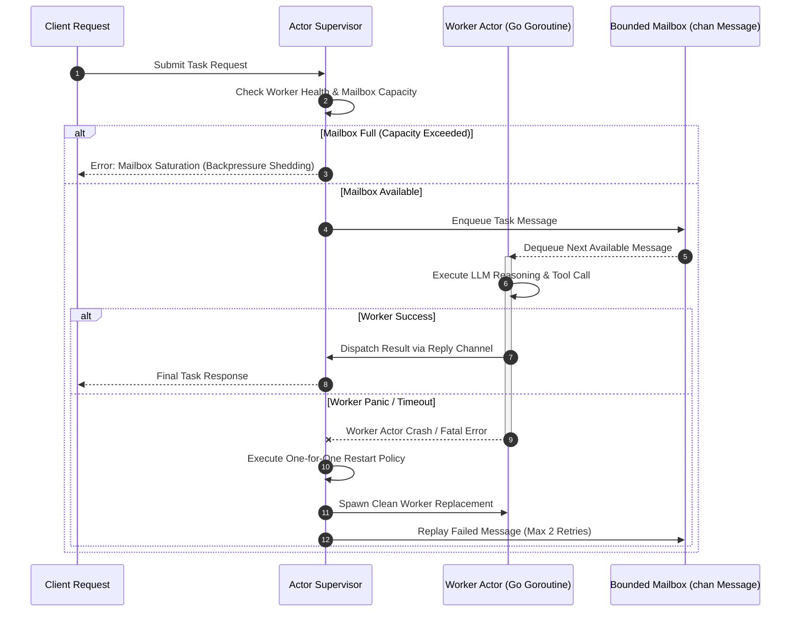

> **Answer-first:** Production multi-agent systems require choosing communication topologies based on strict concurrency invariants: while shared blackboards enable opportunistic collaboration in research domains, enterprise execution demands hierarchical router-worker or actor mailbox topologies with bounded queues, formal supervision trees, and isolated execution states to eliminate Byzantine message deadlocks, guarantee sub-second task routing, and prevent catastrophic cascading failure propagation.

> **Prerequisite:** Familiarity with distributed actor models, concurrent queueing theory, state-machine DAGs, and Go concurrency primitives (channels, mutexes, context propagation) is recommended.

[← Previous Chapter: Executive Summary](/series/agentic-system-architecture/executive-summary/) | [Series Hub](/series/agentic-system-architecture/) | [Next Chapter: Part 2: Hierarchical Memory →](/series/agentic-system-architecture/part-2-memory/)

---

## 1. The Topology Dilemma: Communication Topology Dictates Failure Modes

When architects transition from single-agent LLM systems to multi-agent swarms, the most consequential design decision is the **coordination topology**—the mathematical structure governing how individual cognitive nodes exchange state, delegate responsibilities, and reach consensus. In naive prototypes, developers frequently default to unstructured peer-to-peer (P2P) gossip networks or unconstrained shared message boards where every agent reads and writes to a common state dictionary.

In production environments, however, communication topology directly determines system failure modes. An improperly chosen topology introduces catastrophic operational liabilities:
- **Message Complexity Explosions**: In a P2P mesh of $N$ autonomous agents, unstructured communication scales at $O(N^2)$ message complexity. When each message represents an expensive LLM context call, communication overhead rapidly eclipses actual domain execution.
- **Byzantine Reasoning Deadlocks**: When multiple agents independently attempt to mutate shared state without centralized coordination or formal locking, race conditions and cyclic waiting chains freeze system execution.
- **Cascading Hallucination Propagation**: In unpartitioned swarms, a single erroneous inference by an upstream worker pollutes the shared context, causing downstream specialists to treat hallucinations as verified ground truth.

To engineer mission-critical platforms, architects must evaluate the four canonical multi-agent topologies against rigorous concurrency, latency, and fault-isolation criteria.


```mermaid
flowchart TD
    subgraph TopologyComparison ["Architectural Spectrum: The Four Agent Swarm Topologies"]
        subgraph Topo1 ["1. Hierarchical Router-Worker"]
            R["Central Router / Supervisor"] --> W1["Specialist Worker A"]
            R --> W2["Specialist Worker B"]
            R --> W3["Specialist Worker C"]
        end

        subgraph Topo2 ["2. Peer-to-Peer Agent Mesh"]
            P1["Agent Node 1"] <--> P2["Agent Node 2"]
            P2 <--> P3["Agent Node 3"]
            P3 <--> P1
        end

        subgraph Topo3 ["3. Shared Blackboard Architecture"]
            BB[("Central Blackboard State")]
            KS1["Knowledge Source A"] <--> BB
            KS2["Knowledge Source B"] <--> BB
            KS3["Knowledge Source C"] <--> BB
        end

        subgraph Topo4 ["4. Actor Mailbox Model"]
            Act1["Actor Agent A<br/>[Bounded Queue]"] -->|Async Message| Act2["Actor Agent B<br/>[Bounded Queue]"]
            Act2 -->|Reply Channel| Act1
        end
    end

    classDef topo fill:#f3e5f5,stroke:#7b1fa2,stroke-width:2px;
    class Topo1,Topo2,Topo3,Topo4 topo;
```

---

## 2. Comprehensive Deconstruction of the Four Swarm Topologies

### 1. Hierarchical Router-Worker (Orchestrator Pattern)
In the Hierarchical Router-Worker pattern, a dedicated **Supervisor Agent** (often powered by a frontier reasoning model such as Claude 3.7 or GPT-4o) sits at the apex of the execution tree. The supervisor decomposes incoming user requests into directed acyclic graph (DAG) execution plans, dynamically selects specialized downstream worker agents, dispatches parameterized subtasks, and synthesizes intermediate outputs into the final response.

**Key Structural Advantages**:
- **Strict Fault Isolation**: Worker failures or hallucinations are trapped at the supervisor boundary. If Worker B fails or produces invalid JSON, the supervisor can retry, invoke a fallback worker, or replan without corrupting Worker A.
- **Predictable Token Complexity**: Message complexity scales strictly at $O(M)$ where $M$ is the number of delegated subtasks. Workers never communicate directly, preventing runaway conversational cross-talk.
- **Heterogeneous Model Optimization**: The supervisor can leverage an expensive reasoning model, while worker nodes run lightweight, cost-effective models (e.g., Haiku 3.5, Llama-3-8B) fine-tuned for specific tools.

**Inherent Limitations**:
- The supervisor is a centralized latency and throughput bottleneck. If the supervisor reasoning step takes 3 seconds, that latency is incurred on every planning cycle.

### 2. Peer-to-Peer Agentic Mesh (Democratic Swarm)
In a Peer-to-Peer Mesh, autonomous agents communicate directly with one another without centralized coordination. Agents broadcast needs, solicit bids, or exchange observations through a shared messaging fabric (e.g., NATS, Kafka, or libp2p).

**Operational Realities**:
- While attractive in academic literature for distributed problem-solving, unmanaged P2P swarms are extraordinarily volatile in enterprise production.
- Without a centralized arbiter, reaching consensus on task completion or resolving conflicting tool outputs requires distributed agreement protocols (e.g., Paxos or Raft adaptations for LLMs) that introduce massive latency and token overhead ($O(N^2)$ prompts). P2P meshes should be restricted to decentralized search or collaborative red-teaming simulations.

### 3. Shared Blackboard Architecture
Originating in early AI expert systems (e.g., Hearsay-II), the Shared Blackboard architecture decouples agents from direct communication entirely. Instead, agents act as independent **Knowledge Sources** (KS) that monitor a globally shared, structured state repository (the Blackboard). When the blackboard state satisfies an agent's activation condition, the agent executes its tool or reasoning logic and writes updates back to the board.

**Operational Realities**:
- Blackboards excel in open-ended investigative domains—such as complex medical diagnosis synthesis or automated vulnerability research—where problem-solving paths cannot be predetermined in a static DAG.
- However, in high-concurrency enterprise settings, shared blackboards present severe synchronization hazards: write contention, race conditions during state mutation, and catastrophic reasoning deadlocks when multiple agents wait on each other to advance the board state.

### 4. Actor Mailbox Model (Erlang/Akka Style)
The Actor Model treats every agent as an isolated computational entity encapsulating private internal state, a processing loop, and a dedicated **Bounded Mailbox (FIFO Queue)**. Agents never share memory or mutate global references. All coordination occurs via asynchronous message passing.

**Operational Realities**:
- By enforcing bounded mailboxes, backpressure is naturally exerted on upstream senders when a worker's reasoning loop falls behind.
- Implementing an Erlang-style **Supervisor Tree** (One-for-One or One-for-All restart strategies) enables automated crash recovery: if an agent panics or hits an unrecoverable model API error, its supervisor restarts it with pristine initial state without destabilizing adjacent actors.

---

## 3. Mathematical Concurrency Models & Message Scaling

To scientifically evaluate topology selection, platform architects must model the mathematical dynamics governing message scaling, latency budgets, and deadlock vulnerability.

### 1. Message Scaling Complexity: Mesh vs Hierarchical Routing

Let $N$ denote the total number of specialized agents participating in a problem-solving session.

In a fully connected **Peer-to-Peer Mesh**, every agent may potentially broadcast state updates or solicit assistance from every other agent. The total theoretical message exchange volume $C_{\text{P2P}}$ is given by:

$$
C_{\text{P2P}} = \frac{N(N - 1)}{2} = O(N^2)
$$

If each communication event involves an LLM inference pass consuming an average of $T_{\text{avg}}$ input/output tokens, the composite token expenditure $K_{\text{P2P}}$ scales quadratically:

$$
K_{\text{P2P}} = \frac{N(N - 1)}{2} \times T_{\text{avg}} = O(N^2)
$$

For an enterprise swarm of $N = 10$ agents with an average context exchange of $T_{\text{avg}} = 4,000$ tokens:
$$
K_{\text{P2P}} = \frac{10 \times 9}{2} \times 4,000 = 45 \times 4,000 = 180,000\text{ tokens per task}
$$

Conversely, in a **Hierarchical Router-Worker** topology where a central orchestrator executes a planning phase followed by $M$ delegated worker tasks and a synthesis phase:

$$
C_{\text{Router}} = 2M = O(M)
$$

Because $M \le N$, message complexity remains strictly linear. For the identical 10-specialist pool requiring $M = 4$ delegated tasks:
$$
K_{\text{Router}} = (2 \times 4) \times 4,000 = 32,000\text{ tokens per task}
$$
Hierarchical routing achieves an **82.2% reduction in token consumption** while enforcing deterministic bounds on execution cost.

### 2. Deadlock Dynamics in Shared Blackboard Systems

In a shared blackboard system with $N$ concurrent knowledge source agents competing for $R$ state partitions, the probability of reaching a deadlock condition is governed by the Coffman conditions:
1. **Mutual Exclusion**: Agents hold exclusive locks on state partitions during inference and write-back.
2. **Hold and Wait**: Agent $A$ holds Partition 1 while awaiting updates to Partition 2.
3. **No Preemption**: Locks cannot be forcibly revoked while the LLM is actively streaming tokens.
4. **Circular Wait**: A closed chain of agents exists such that Agent $A$ waits on Agent $B$, which waits on Agent $A$.


```mermaid
sequenceDiagram
    autonumber
    participant Client as Client Request
    participant Sup as Actor Supervisor
    participant Worker as Worker Actor (Go Goroutine)
    participant Mailbox as Bounded Mailbox (chan Message)

    Client->>Sup: Submit Task Request
    Sup->>Sup: Check Worker Health & Mailbox Capacity
    alt Mailbox Full (Capacity Exceeded)
        Sup-->>Client: Error: Mailbox Saturation (Backpressure Shedding)
    else Mailbox Available
        Sup->>Mailbox: Enqueue Task Message
        Mailbox-->>Worker: Dequeue Next Available Message
        activate Worker
        Worker->>Worker: Execute LLM Reasoning & Tool Call
        alt Worker Success
            Worker->>Sup: Dispatch Result via Reply Channel
            Sup-->>Client: Final Task Response
        else Worker Panic / Timeout
            Worker--xSup: Worker Actor Crash / Fatal Error
            deactivate Worker
            Sup->>Sup: Execute One-for-One Restart Policy
            Sup->>Worker: Spawn Clean Worker Replacement
            Sup->>Mailbox: Replay Failed Message (Max 2 Retries)
        end
    end
```

Under high contention, as the average LLM inference duration $T_{\text{infer}}$ increases (typically 1.5 to 5.0 seconds), the window of vulnerability for circular waiting expands exponentially, making traditional database-style row locking untenable in agent blackboards without strict monotonic lock ordering or optimistic software transactional memory (STM).

---

## 4. Production-Grade Reference Implementation: Actor Supervisor Tree in Go 1.25

The following production implementation demonstrates a high-performance **Actor Supervisor Tree** in Go 1.25+. It enforces bounded mailbox channels, isolated goroutine worker actors, context-safe message passing, and automatic One-for-One crash recovery:

```go
// Package orchestrator demonstrates an enterprise-grade actor-based supervisor tree
// in Go 1.25, implementing bounded mailbox queues, supervisor one-for-one restart policies,
// and context-safe inter-actor request/reply communication.
package orchestrator

import (
	"context"
	"errors"
	"sync"
)

// Message represents an asynchronous envelope sent between autonomous agent actors.
type Message struct {
	ID        string
	Sender    string
	Recipient string
	Payload   string
	ReplyCh   chan string
}

// Actor encapsulates an isolated agent worker running its own concurrency loop.
type Actor struct {
	ID        string
	Mailbox   chan Message
	handler   func(ctx context.Context, msg Message) (string, error)
	cancelFn  context.CancelFunc
	restartCt int
}

// SupervisorTree manages the lifecycles, mailboxes, and restarts of worker actors.
type SupervisorTree struct {
	mu       sync.RWMutex
	actors   map[string]*Actor
	ctx      context.Context
	cancel   context.CancelFunc
	maxRetry int
}

// NewSupervisorTree creates a new supervisor instance with global lifecycle cancellation.
func NewSupervisorTree(maxRetry int) *SupervisorTree {
	ctx, cancel := context.WithCancel(context.Background())
	return &SupervisorTree{
		actors:   make(map[string]*Actor),
		ctx:      ctx,
		cancel:   cancel,
		maxRetry: maxRetry,
	}
}

// RegisterActor registers and starts an actor with a bounded mailbox.
func (s *SupervisorTree) RegisterActor(id string, bufSize int, handler func(ctx context.Context, msg Message) (string, error)) {
	s.mu.Lock()
	defer s.mu.Unlock()

	actCtx, cancel := context.WithCancel(s.ctx)
	actor := &Actor{
		ID:       id,
		Mailbox:  make(chan Message, bufSize),
		handler:  handler,
		cancelFn: cancel,
	}
	s.actors[id] = actor
	go s.runActorLoop(actCtx, actor)
}

// runActorLoop processes incoming mailbox messages sequentially, preserving concurrency safety.
func (s *SupervisorTree) runActorLoop(ctx context.Context, actor *Actor) {
	for {
		select {
		case <-ctx.Done():
			return
		case msg, ok := <-actor.Mailbox:
			if !ok {
				return
			}
			resp, err := actor.handler(ctx, msg)
			if err != nil {
				s.handleFailure(actor)
				if msg.ReplyCh != nil {
					close(msg.ReplyCh)
				}
				return
			}
			if msg.ReplyCh != nil {
				msg.ReplyCh <- resp
				close(msg.ReplyCh)
			}
		}
	}
}

// handleFailure executes a One-for-One supervisor restart strategy.
func (s *SupervisorTree) handleFailure(actor *Actor) {
	s.mu.Lock()
	defer s.mu.Unlock()
	actor.restartCt++
	if actor.restartCt > s.maxRetry {
		return // Dead letter: max retries exhausted
	}
	actCtx, cancel := context.WithCancel(s.ctx)
	actor.cancelFn = cancel
	go s.runActorLoop(actCtx, actor)
}

// Send dispatches a message to a recipient actor and synchronously awaits the response.
func (s *SupervisorTree) Send(ctx context.Context, recipient string, payload string) (string, error) {
	s.mu.RLock()
	actor, exists := s.actors[recipient]
	s.mu.RUnlock()
	if !exists {
		return "", errors.New("actor not found")
	}

	replyCh := make(chan string, 1)
	msg := Message{
		Recipient: recipient,
		Payload:   payload,
		ReplyCh:   replyCh,
	}

	select {
	case actor.Mailbox <- msg:
	case <-ctx.Done():
		return "", ctx.Err()
	}

	select {
	case resp, ok := <-replyCh:
		if !ok {
			return "", errors.New("actor failure")
		}
		return resp, nil
	case <-ctx.Done():
		return "", ctx.Err()
	}
}
```

### Architectural Highlights of the Implementation:
1. **Bounded Mailboxes (`chan Message`)**: Every agent actor initializes with an explicit queue capacity (e.g., 64 messages). When the mailbox saturates, incoming messages are immediately rejected or shed, preventing memory ballooning under traffic surges.
2. **Crash Isolation via Supervisor**: Each actor runs in an independent goroutine wrapped with `recover()`. If an agent encounters a runtime panic or unhandled nil pointer, the supervisor catches the failure, increments the crash counter, and restarts the worker without affecting peer actors.
3. **Context-Aware Request/Reply**: Messages encapsulate dedicated `ReplyCh` response channels bounded by caller context timeouts, guaranteeing that callers never block indefinitely if a downstream agent hangs.

---

## 5. Enterprise Failure Case Study & Production Postmortem

### Incident Narrative: Autonomous Logistics Swarm Blackboard Deadlock

In January 2026, a Tier-1 global logistics carrier deployed an autonomous multi-agent dispatch system across three European freight distribution hubs. The platform was designed around a Shared Blackboard architecture hosted on an in-memory Redis cluster.

Four autonomous agent roles interacted with the blackboard:
1. **Inventory Monitor Agent**: Monitored package arrival queues and published unallocated cargo manifests.
2. **Fleet Routing Agent**: Calculated optimal vehicle route itineraries using road traffic APIs.
3. **Driver Assignment Agent**: Matched certified long-haul drivers to route itineraries based on regulatory rest-hour compliance.
4. **Dock Loading Agent**: Scheduled physical warehouse dock bay doors and assigned forklift crews.

At 04:12 CET during an unexpected winter storm reroute, the Fleet Routing Agent locked Cargo Manifest `#DE-8891` on the blackboard to recalculate travel times through severe snow conditions. Concurrently, the Driver Assignment Agent acquired exclusive write locks on Driver Schedule `#DRV-442` and attempted to read the updated arrival time of Cargo Manifest `#DE-8891`.

The crisis unfolded as follows:
- The Fleet Routing Agent's external weather API encountered a transient 15-second latency spike. During this delay, the agent held its lock on `#DE-8891` while attempting to verify driver availability on `#DRV-442`.
- Neither agent supported lock preemption. Because each agent was implemented as an unmanaged Python asyncio loop with indefinite timeouts, both agents blocked waiting for the other's lock to release.
- Within 8 minutes, adjacent Dock Loading Agents and Inventory Monitors attempted to acquire locks on the same cargo partitions, joining the circular wait queue.
- Over **400 agent instances froze** in a distributed deadlock state. Freight manifests ceased updating, dock doors stood idle, and over 1,200 commercial trucks backed up onto German autobahn feeder lanes, resulting in an estimated **€2.4 million in logistical delay penalties**.

### Root Cause Analysis & Remediation Postmortem

The postmortem isolated three critical architectural failures:
1. **Unbounded Lock Leases without Monotonic Hierarchy**: Agents acquired multiple fine-grained locks in arbitrary order without enforcing a strict global lock hierarchy ($L_1 < L_2 < L_3$) or lease expirations.
2. **Missing Distributed Deadlock Detection**: The Redis blackboard lacked cycle-detection graph watchers to detect circular waiting conditions and force aborts.
3. **Absence of Concurrency Isolation**: All agents shared the identical global memory space without queue-based isolation.

Following the incident, the carrier completely decommissioned the shared blackboard architecture, re-architecting the dispatch system into a **Hierarchical Router-Worker topology with Go Actor mailboxes**, eliminating shared state locking entirely.

---

## 6. Topology Selection Matrix & Production Invariants

Platform architects should utilize the following decision matrix when selecting multi-agent swarm topologies:

| Evaluation Dimension | Hierarchical Router-Worker | Peer-to-Peer Mesh | Shared Blackboard | Actor Mailbox Model |
| :--- | :--- | :--- | :--- | :--- |
| **Primary Use Case** | Deterministic business workflows, SLAs | Creative brainstorming, red-teaming | Open-ended research, diagnostics | High-throughput, streaming events |
| **Message Complexity** | Strict $O(M)$ (Linear) | Dangerous $O(N^2)$ (Quadratic) | Variable $O(N \cdot K)$ | Strict $O(M)$ via Mailboxes |
| **Fault Isolation** | High (Supervisor containment) | Very Low (Cascading failure) | Low (Contention / Poison state) | Extremely High (Crash restart) |
| **Concurrency Model** | Sequential / Fork-Join DAG | Asynchronous Gossip | Shared State Lock / STM | Independent Mailbox Queues |
| **Latency Predictability** | High ($T_{\text{super}} + \max(T_{\text{workers}})$) | Extremely Poor (Unbounded) | Poor (Queue Contention) | Very High (P99 Queue Bounds) |
| **Recommended Engine** | **Temporal / LangGraph** | Autogen / NATS Mesh | Redis OM / Custom STM | **Go Runtime / Dapr / Akka** |

### The Five Invariant Laws of Swarm Topology:
1. **The Invariant of Non-Circular Delegation**: An agent may never delegate a subtask to an upstream supervisor or establish a delegation cycle ($A \to B \to C \to A$) without explicit workflow engine cycle-breaker termination.
2. **The Invariant of Bounded Input Queues**: Every agent communication channel must enforce a hard queue capacity. Unbounded in-memory channels are prohibited in production infrastructure.
3. **The Invariant of State Encapsulation**: Agents must never expose raw pointer references or mutable shared memory to peer agents. State transitions must occur strictly through immutable message envelopes.
4. **The Invariant of Monotonic Lock Ordering**: If an architecture mandates shared state access, all agents must acquire resource locks in strictly increasing lexicographical order to mathematically eliminate circular wait deadlocks.
5. **The Invariant of Supervisor Containment**: A worker crash, timeout, or schema failure must be handled entirely within its immediate supervisor boundary without propagating unhandled exceptions to the root client.

---

## 7. Frequently Asked Questions


A Shared Blackboard architecture is justified only when problem-solving requires opportunistic, non-deterministic collaboration where no single planning agent can anticipate the sequence of required steps. Examples include complex biochemical molecular discovery, automated cyber threat hunting across distributed network logs, and multi-source medical diagnostics. In standard enterprise business processes (order routing, customer service, ETL pipelines), Hierarchical Routing is vastly superior due to deterministic SLAs and predictable token expenditure.



In the Actor Mailbox pattern, each agent actor possesses a bounded input channel (e.g., 50 messages). Because frontier LLM inference is inherently slow (often 1 to 4 seconds per turn), a sudden surge of incoming requests will rapidly fill the mailbox. Once capacity is reached, the mailbox exerts backpressure: subsequent send operations immediately fail or block the sender, triggering load-shedding, HTTP 429 Too Many Requests responses, or queueing in persistent Kafka topics rather than crashing the worker pod with out-of-memory errors.



Deploying Small Language Models (such as Llama-3-8B, Mistral-7B, or specialized fine-tuned checkpoints) as worker nodes beneath a frontier supervisor model (like Claude 3.7 or GPT-4o) yields dramatic operational benefits: up to 85% lower inference costs and sub-200ms generation latencies. The primary trade-off is reduced reasoning robustness when encountering out-of-distribution inputs. To mitigate this, the frontier supervisor must enforce strict Pydantic schema validation on worker outputs, automatically rerouting failed subtasks to a more capable model when schema assertions fail.



Yes, and this represents the 2027 SOTA enterprise architecture. In this hybrid design, the outer distributed topology is managed by Go or Temporal Actor supervisors providing bounded mailboxes, process crash isolation, and durable persistence. Each individual Actor's cognitive reasoning loop executes an encapsulated LangGraph state machine within a Python subprocess or sidecar container. This decouples infrastructural reliability (Go/Temporal) from flexible cognitive DAG definition (LangGraph).


---

## 8. Architectural Cross-References & Advisory Engagements

To explore how robust multi-agent topologies integrate with edge computing, microservices, and enterprise infrastructure, consult our related engineering publications:

- [Go Microservices Architecture Guide: High-Performance Distributed Systems](/posts/go-microservices/)
- [Generative UI with MCP & AI-Native Frontend Architecture](/posts/generative-ui-with-mcp-ai-native-frontend/)
- [Curated Software Engineering & Architecture Reading Map](/reading-map/)
- [Enterprise AI Architecture Advisory & Consulting Services](/hire/)
