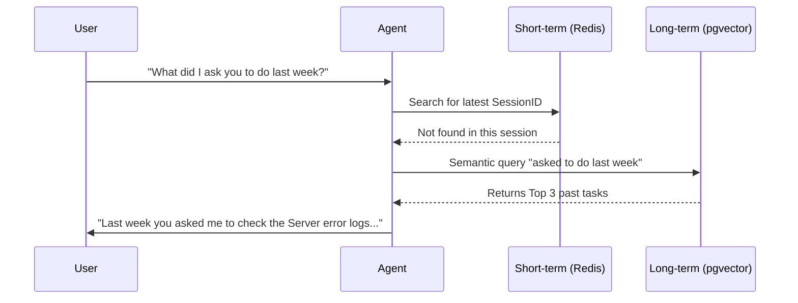

> **Prerequisite:** To firmly grasp the foundational concepts of Memory Architecture in AI systems, please review [Comprehensive AI-Native System Architecture](/series/ai-driven-playbook/part-8-ai-native-system-architecture/).

After solving the Agent communication challenge in [Part 1](/series/agentic-system-architecture/part-1-topology/), we must face the LLM's greatest enemy: **Context Window limits**. Even the best Orchestrator is useless if Worker Agents forget the User's initial request after just a few tool-calling turns.

## 2.1. The Context Window Problem and Why Agents "Forget"

Large Language Models (LLMs) are inherently Stateless. Every time you send a prompt, the LLM rereads the entire text from beginning to end.

When an Agent makes multiple consecutive Tool calls, the returned payloads (JSON logs, long text, webpage content) rapidly fill the Context Window (e.g., 128k tokens for GPT-4). When full, you are forced to trim the beginning (sliding window).

As a result, the Agent "forgets" the User's original goal. It starts generating random actions (hallucinations) based on the fragmented context that remains.

## 2.2. Short-term Memory (In-session) vs Long-term Memory (Cross-session)

To build a robust system, we divide memory into two tiers.

### Short-term Memory (Working Memory)
This memory is used **within a single HTTP Session**. Whenever the User opens a new browser tab or clears cookies, this memory is reset.
- **Storage:** Redis (key-value structure with TTL) or Python dicts (in-memory, reset upon process restart).
- **Responsibility:** Stores the `GraphState`, intermediate steps of the current conversation.

### Long-term Memory (Episodic Memory)
This memory **persists across multiple Sessions**. When a User returns after a week, the Agent still remembers past requests.
- **Storage:** Vector Database (pgvector, Weaviate, Milvus).
- **Responsibility:** Stores user preferences, past tasks, and knowledge bases (RAG).

> 🔥 **[Production Failure]: Memory Pollution - Chatbot gets "haunted"**
> **Symptom:** Customer A is asking about a product, and the Agent suddenly replies with details from Customer B's confidential contract.
> **Root Cause:** Flawed Session Key management. The system used an In-memory dict, but the key generated from a hashed user ID encountered a hash collision on the load balancer. The Agent crammed both A's and B's conversations into the same memory block.
> 📊 **Impact:** Exposure of Personally Identifiable Information (PII) across 140 tickets, with a Time-to-detect of 12 hours. Forced a complete purge of the Redis cache.
> 📈 **Resolution:** Use UUIDv4 combined with JWTs for Session IDs and apply strict Isolation mechanisms at the Redis DB level. *(Source: Synthesized from public post-mortems - LangChain community issues).*

## 2.3. Integrating Vector Databases (pgvector) for RAG

For Agents to retain long-term knowledge, we integrate the RAG (Retrieval-Augmented Generation) model. The Agent can automatically query the Vector Database before answering.

<!-- markdownlint-disable MD034 -->


## 2.4. Summarization Strategies to Save Tokens

When Short-term memory expands too rapidly, we cannot dump everything into VectorDB. We must employ a "Compression" (Summarization) or truncation strategy.

Besides **Rolling Summarization** (where instead of keeping all messages, the Agent calls the LLM to summarize an older block of messages into a short paragraph and discards the originals), there are other strategies:

- **Truncation:** Cutting out the middle section (keeping the first + last messages). Simple, but loses intermediate context.
- **OpenAI `messages_to_json`:** The SDK automatically compresses old messages into a hidden system message.
- **Token budget allocation:** Setting specific budgets for the system prompt vs history vs user input.

### Python Example: Rolling Summary Technique

```python
"""
Module: Memory Manager
Description: Provides a Rolling Summarization strategy for Short-term memory
to save Tokens and prevent Context Window overflow.
"""
from typing import List

class MemoryManager:
    def __init__(self, max_messages: int = 10):
        self.max_messages = max_messages
        self.history: List[str] = []
        self.summary: str = ""

    def add_message(self, role: str, content: str):
        self.history.append(f"{role}: {content}")
        # If the limit is exceeded, start compression
        if len(self.history) > self.max_messages:
            self._compress_memory()

    def _compress_memory(self):
        print(">> Compressing (Summarizing) memory to save Tokens...")
        # Take the first half of the history to compress
        chunk_to_compress = "\\n".join(self.history[:5])
        
        # Simulate LLM summarization call
        new_summary = f"[Old Summary: {self.summary}] + [Added: {chunk_to_compress}]"
        
        # Update state
        self.summary = new_summary
        # Retain the second half of the history (Latest context)
        self.history = self.history[5:]

    def get_current_context(self) -> str:
        return f"SUMMARY:\\n{self.summary}\\n\\nRECENT:\\n{'\\n'.join(self.history)}"

# Test Memory Manager
memory = MemoryManager(max_messages=4)
for i in range(6):
    memory.add_message("User", f"Question number {i}")
    memory.add_message("Agent", f"Answer number {i}")

print(memory.get_current_context())

# Expected output:
# >> Compressing (Summarizing) memory to save Tokens...
# >> Compressing (Summarizing) memory to save Tokens...
# SUMMARY:
# [Old Summary: ] + [Added: User: Question number 0
# Agent: Answer number 0
# User: Question number 1
# Agent: Answer number 1
# User: Question number 2]
#
# RECENT:
# User: Question number 3
# Agent: Answer number 3
# User: Question number 4
# Agent: Answer number 4
# User: Question number 5
# Agent: Answer number 5
```

By doing this, the Agent always retains the **Core Context (Summary)** and the **Most Recent Details (Recent History)**, without ever crashing due to exceeding the Token Limit.

---
🔗 **Next Step:** The Agent remembers enough and coordinates smoothly — but when it uses that knowledge to "Call Tools" (e.g., deleting files, querying DB), who protects the system from security risks? Find out in [Part 3 — Secure Tool Calling & Guardrails](/series/agentic-system-architecture/part-3-tool-calling/).
