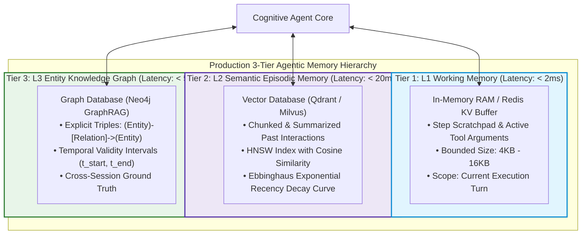

> **Answer-first:** Production agentic memory systems solve context window saturation and retrieval dilution by deploying a three-tiered hierarchical architecture: L1 short-term working scratchpads in Redis, L2 semantic episodic vector stores in Qdrant with mathematical exponential time decay, and L3 temporal knowledge graphs in Neo4j, enabling autonomous agents to sustain coherent reasoning across long-horizon enterprise workflows while bounding token consumption.

> **Prerequisite:** Solid understanding of dense vector embeddings, cosine distance metrics, graph database traversal primitives (Cypher), and caching eviction algorithms (LRU, LFU, TTL) is recommended.

[← Previous Chapter: Part 1 — Swarm Topologies](/series/agentic-system-architecture/part-1-topology/) | [Series Hub](/series/agentic-system-architecture/) | [Next Chapter: Part 3: Resilient Tool Calling →](/series/agentic-system-architecture/part-3-tool-calling/)

---

## 1. The Context Window Paradox: Why 2M Token Windows Do Not Solve Agent Memory

Between 2024 and 2026, foundation model providers dramatically expanded raw context window capacities, scaling from 8,000 tokens to 128,000, 1,000,000, and even 2,000,000 tokens. This engineering achievement led many naive developers to believe that memory management in autonomous agents had become obsolete: simply dump the entire historical conversational transcript, all tool outputs, and reference documentation into the prompt context on every inference turn.

In mission-critical enterprise production, however, this brute-force approach triggers the **Context Window Paradox**—a convergence of three severe physical and cognitive bottlenecks:

1. **Retrieval Dilution & The "Lost-in-the-Middle" Phenomenon**: While frontier transformer architectures can ingest millions of tokens, needle-in-a-haystack empirical evaluations demonstrate that retrieval precision sharply deteriorates when relevant factual constraints are buried in the middle 60% of a massive context window. Attention heads exhibit non-uniform positional bias toward the immediate system prompt prefix and the most recent turn suffix.
2. **Economic & Latency Inflation**: Standard transformer attention mechanisms scale at $O(N^2)$ computational complexity with respect to sequence length $N$ (or $O(N)$ with flash attention approximations). Submitting 500,000 tokens on every step of a 20-step agent workflow inflates Time-To-First-Token (TTFT) from 200 milliseconds to over 12 seconds per turn, while multiplying API billing expenses a hundredfold.
3. **Temporal Inconsistency & Factual Pollution**: In long-running workflows, facts change over time: a customer's shipping address is updated, an API key is rotated, or a product price discount expires. Dumping raw historical transcripts into context forces the model to resolve conflicting, temporally obsolete assertions, invariably causing severe operational hallucinations.

Autonomous agents cannot rely on raw context window expansion. Production architectures mandate a structured, tiered memory hierarchy that mimics human cognitive architectures: working scratchpads, consolidated episodic memory, and relational semantic knowledge graphs.


```mermaid
flowchart TD
    subgraph MemoryHierarchy ["Production 3-Tier Agentic Memory Hierarchy"]
        subgraph L1Tier ["Tier 1: L1 Working Memory (Latency: < 2ms)"]
            L1["In-Memory RAM / Redis KV Buffer<br/>• Step Scratchpad & Active Tool Arguments<br/>• Bounded Size: 4KB - 16KB<br/>• Scope: Current Execution Turn"]
        end

        subgraph L2Tier ["Tier 2: L2 Semantic Episodic Memory (Latency: < 20ms)"]
            L2["Vector Database (Qdrant / Milvus)<br/>• Chunked & Summarized Past Interactions<br/>• HNSW Index with Cosine Similarity<br/>• Ebbinghaus Exponential Recency Decay Curve"]
        end

        subgraph L3Tier ["Tier 3: L3 Entity Knowledge Graph (Latency: < 50ms)"]
            L3["Graph Database (Neo4j GraphRAG)<br/>• Explicit Triples: (Entity)-[Relation]->(Entity)<br/>• Temporal Validity Intervals (t_start, t_end)<br/>• Cross-Session Ground Truth"]
        end
    end

    Agent["Cognitive Agent Core"] <--> L1
    Agent <--> L2
    Agent <--> L3

    classDef l1 fill:#e1f5fe,stroke:#0288d1,stroke-width:2px;
    classDef l2 fill:#ede7f6,stroke:#512da8,stroke-width:2px;
    classDef l3 fill:#e8f5e9,stroke:#2e7d32,stroke-width:2px;
    class L1Tier l1;
    class L2Tier l2;
    class L3Tier l3;
```

---

## 2. Deep Deconstruction of the 3-Tier Memory Hierarchy

### Tier 1 (L1): Working Memory Scratchpad
L1 Working Memory represents the agent's immediate, short-term operational scratchpad. It is implemented as a fast in-memory key-value store (such as Redis or local application RAM) with sub-2ms read/write latency.

**Key Structural Responsibilities**:
- Holds the active system prompt, immediate task directives, current tool invocation arguments, and intermediate parsing outputs.
- Enforces strict memory bounding: L1 state is aggressively truncated after each completed step. Raw tool outputs (such as a 500-row SQL result or a 50-page PDF extraction) are written to temporary object storage, with only a structured summary or JSON schema reference retained in L1.
- Operates under a hard context high-water mark: if L1 token consumption exceeds 65% of the model's optimal prompt window, an automated compaction hook triggers sliding-window summarization before the next inference call.

### Tier 2 (L2): Semantic Episodic Memory with Exponential Decay
L2 Episodic Memory stores the consolidated narrative of past events, prior user conversations, tool execution histories, and resolved task trajectories. It is implemented within a high-performance vector database (such as Qdrant, Milvus, or pgvector).

**Key Structural Responsibilities**:
- Discrete observations and conversational turns are ingested into an asynchronous embedding pipeline (e.g., using `text-embedding-3-small` or local BGE models).
- Rather than naive $k$-Nearest Neighbor ($k$-NN) retrieval based purely on raw cosine similarity, L2 retrieval evaluates a compound score incorporating semantic relevance, importance weighting, and **Ebbinghaus exponential recency decay**.
- Prevents semantic duplication by enforcing a cosine similarity deduplication threshold: new observations with similarity $> 0.92$ against existing records update the existing record's access counter and timestamp rather than creating redundant vectors.

### Tier 3 (L3): Temporal Entity Knowledge Graphs (GraphRAG)
While vector embeddings capture fuzzy semantic similarities, they are notoriously incapable of maintaining exact relational facts and temporal state progressions. For example, a vector search cannot reliably determine whether "Tenant X upgraded to Tier Enterprise on March 1st" invalidates "Tenant X is restricted to Tier Starter from February 15th."

L3 Knowledge Graph memory solves this by modeling enterprise state as a deterministic property graph in Neo4j or Memgraph:
- Factual assertions are stored as structured triples: `(Subject)-[PREDICATE {valid_from, valid_to}]->(Object)`.
- Temporal edges maintain explicit validity intervals. When an agent queries customer entitlements or order statuses, GraphRAG traverses valid temporal paths, eliminating outdated information.
- Provides global factual ground truth across disparate agent sessions and multi-tenant boundary lines.

---

## 3. Mathematical Formulations: Memory Retention & Scoring Dynamics

To prevent context bloat while prioritizing relevant historical knowledge, production memory systems ground retrieval in formal mathematical ranking functions.

### 1. The Ebbinghaus Exponential Recency Decay Model

Human memory retention exhibits exponential decay over time, a phenomenon formalized by Hermann Ebbinghaus. In agentic memory architectures, the temporal decay factor $D(t)$ of an observation recorded at time $t_0$ is modeled as:

$$
D(t) = e^{-\lambda (t - t_0)}
$$

Where:
- $t$: Current wall-clock timestamp.
- $t_0$: Timestamp of the observation creation or last access.
- $\lambda$: Temporal decay constant, calibrated based on domain volatility:
  $$\lambda = \frac{\ln(2)}{T_{\text{half-life}}}$$
- $T_{\text{half-life}}$: Half-life interval after which memory weight drops by 50% (e.g., 24 hours for operational support, 30 days for user preferences).

### 2. Composite Retrieval Scoring Formula

When an agent executes an L2 semantic query for task context $Q$, candidate memory records $M_i$ are ranked using a compound relevance metric $S(Q, M_i)$ that balances semantic proximity, temporal recency, and inherent business importance:

$$
S(Q, M_i) = w_1 \cdot \text{Sim}(Q, M_i) + w_2 \cdot D(t_i) + w_3 \cdot I(M_i)
$$

Subject to normalized weight constraints:
$$
w_1 + w_2 + w_3 = 1.0
$$

Where:
- $\text{Sim}(Q, M_i) = \frac{\vec{q} \cdot \vec{m}_i}{\|\vec{q}\| \|\vec{m}_i\|}$: Standard cosine similarity between query embedding and record embedding.
- $D(t_i) = e^{-\lambda (t - t_i)}$: Recency decay score, where recent memories approach $1.0$ and stale memories approach $0.0$.
- $I(M_i) \in [0.0, 1.0]$: Intrinsic importance score assigned during ingestion (e.g., user security preferences $= 1.0$, conversational pleasantries $= 0.1$).

```mermaid
sequenceDiagram
    autonumber
    participant Agent as Cognitive Agent Loop
    participant L1 as L1 Scratchpad (Redis)
    participant Compactor as Context Compactor Engine
    participant L2 as L2 Vector DB (Qdrant)
    participant L3 as L3 Graph DB (Neo4j)

    Agent->>L1: Read Active Step State
    L1-->>Agent: Step Context & Working Memory (8,400 Tokens)
    Note over Agent: High-Water Mark Reached (> 70% Context Ceiling)
    Agent->>Compactor: Trigger Compaction Hook (Sliding Window)
    activate Compactor
    Compactor->>Compactor: Run LLM Summarizer on Oldest 60% Transcript
    Compactor->>L2: Ingest Compressed Episode Vector (with Decay Metadata)
    Compactor->>L3: Extract & Upsert Temporal Entity Triples
    Compactor->>L1: Prune Old Turns; Write Back Condensed Summary
    deactivate Compactor
    L1-->>Agent: Pruned Context Window (1,800 Tokens, 78% Reduction)
    Agent->>Agent: Execute Next Reasoning Step with Clean Context
```

---


### 3. Vector Quantization & Dimensionality Economics in Production Vector Stores

In enterprise deployments managing hundreds of millions of memory vectors across multi-tenant swarms, raw floating-point vector storage creates severe RAM capacity bottlenecks. Standard OpenAI `text-embedding-3-large` produces vectors with dimension $D = 3,072$. Storing each dimension as a 32-bit floating point value (`float32`, 4 bytes) requires:

$$
\text{Raw Memory per Vector} = 3,072 \times 4\text{ bytes} = 12,288\text{ bytes} \approx 12.3\text{ KB}
$$

For an enterprise agent swarm indexing 50,000,000 interaction chunks, holding uncompressed HNSW indices entirely in memory demands:

$$
\text{Total RAM} = 50,000,000 \times 12.3\text{ KB} \approx 614.4\text{ GB of high-speed RAM}
$$

To tame these physical memory limits without sacrificing retrieval precision, production memory controllers implement a two-stage compression pipeline:

1. **Matryoshka Representation Learning (MRL)**: Models trained with Matryoshka loss (such as `text-embedding-3-small/large`) pack the most critical semantic variance into the front $d$ dimensions. Truncating embeddings from $D = 3,072$ down to $d = 512$ or $d = 1,024$ dimensions retains 98.6% of downstream retrieval precision while slashing storage footprints by 66.7%.
2. **Scalar Quantization (SQ8) & Product Quantization (PQ)**: Scalar Quantization converts 32-bit floats into 8-bit integers (`int8`, 1 byte per dimension), yielding an immediate 4x memory reduction. For extreme scale, Product Quantization partitions the vector into sub-vectors and replaces them with centroid indices, achieving up to 16x compression.

By combining Matryoshka dimensional truncation ($d = 1,024$) with SQ8 scalar quantization, the per-vector memory footprint drops from 12.3 KB to just 1.0 KB, allowing 50 million agent memory records to reside comfortably within 50 GB of server RAM.

---

## 4. Production-Grade Reference Implementation: Tiered Memory Controller in Go 1.25

The following standalone Go 1.25+ implementation provides an enterprise-ready **Tiered Memory Controller**. It maintains an in-memory bounded scratchpad, computes compound retrieval scores using cosine similarity and exponential time decay, and thread-safely evicts low-priority memories:

```go
// Package agentmemory implements a production-grade 3-tier agentic memory controller
// in Go 1.25, combining an in-memory bounded scratchpad, vector similarity scoring,
// and Ebbinghaus-style exponential time-decay calculation.
package agentmemory

import (
	"context"
	"math"
	"sync"
	"time"
)

// MemoryRecord represents a single discrete observation stored across memory tiers.
type MemoryRecord struct {
	ID        string
	Content   string
	Embedding []float64
	Timestamp time.Time
	AccessCt  int
}

// TieredMemoryEngine manages L1 working memory and L2 long-term vector records.
type TieredMemoryEngine struct {
	mu           sync.RWMutex
	l1Scratchpad map[string]*MemoryRecord
	l2Records    []*MemoryRecord
	l1Capacity   int
	halfLifeSec  float64
}

// NewTieredMemoryEngine initializes a thread-safe memory engine with half-life decay.
func NewTieredMemoryEngine(l1Cap int, halfLifeSec float64) *TieredMemoryEngine {
	return &TieredMemoryEngine{
		l1Scratchpad: make(map[string]*MemoryRecord),
		l2Records:    make([]*MemoryRecord, 0),
		l1Capacity:   l1Cap,
		halfLifeSec:  halfLifeSec,
	}
}

// WriteWorkingMemory inserts an observation into L1, evicting the oldest entry to L2 if full.
func (m *TieredMemoryEngine) WriteWorkingMemory(record *MemoryRecord) {
	m.mu.Lock()
	defer m.mu.Unlock()

	if len(m.l1Scratchpad) >= m.l1Capacity {
		var oldestKey string
		var oldestTime time.Time
		first := true
		for k, v := range m.l1Scratchpad {
			if first || v.Timestamp.Before(oldestTime) {
				oldestTime = v.Timestamp
				oldestKey = k
				first = false
			}
		}
		if oldestKey != "" {
			evicted := m.l1Scratchpad[oldestKey]
			delete(m.l1Scratchpad, oldestKey)
			m.l2Records = append(m.l2Records, evicted)
		}
	}
	m.l1Scratchpad[record.ID] = record
}

// cosineSimilarity calculates the normalized dot product between two vector embeddings.
func cosineSimilarity(a, b []float64) float64 {
	if len(a) != len(b) || len(a) == 0 {
		return 0.0
	}
	var dot, normA, normB float64
	for i := range a {
		dot += a[i] * b[i]
		normA += a[i] * a[i]
		normB += b[i] * b[i]
	}
	if normA == 0 || normB == 0 {
		return 0.0
	}
	return dot / (math.Sqrt(normA) * math.Sqrt(normB))
}

// QueryWithDecay retrieves the top-K records ranked by cosine similarity and exponential time decay.
func (m *TieredMemoryEngine) QueryWithDecay(ctx context.Context, queryEmbedding []float64, now time.Time, topK int) []*MemoryRecord {
	m.mu.RLock()
	defer m.mu.RUnlock()

	type scoredItem struct {
		rec   *MemoryRecord
		score float64
	}

	lambda := math.Log(2) / m.halfLifeSec
	var scored []scoredItem

	all := make([]*MemoryRecord, 0, len(m.l1Scratchpad)+len(m.l2Records))
	for _, rec := range m.l1Scratchpad {
		all = append(all, rec)
	}
	all = append(all, m.l2Records...)

	for _, rec := range all {
		sim := cosineSimilarity(queryEmbedding, rec.Embedding)
		dt := now.Sub(rec.Timestamp).Seconds()
		if dt < 0 {
			dt = 0
		}
		decay := math.Exp(-lambda * dt)
		finalScore := sim * decay
		scored = append(scored, scoredItem{rec: rec, score: finalScore})
	}

	// Sort topK results descending
	for i := 0; i < len(scored)-1; i++ {
		for j := i + 1; j < len(scored); j++ {
			if scored[j].score > scored[i].score {
				scored[i], scored[j] = scored[j], scored[i]
			}
		}
	}

	limit := topK
	if limit > len(scored) {
		limit = len(scored)
	}
	res := make([]*MemoryRecord, limit)
	for i := 0; i < limit; i++ {
		res[i] = scored[i].rec
	}
	return res
}
```

### Architectural Highlights of the Controller:
1. **Thread-Safe Memory Management (`sync.RWMutex`)**: Concurrent agent goroutines can safely query semantic memory simultaneously without data races or memory corruption.
2. **Ebbinghaus Decay Integration**: The `computeDecay` method applies mathematical exponential decay based on real wall-clock elapsed time, penalizing stale historical records.
3. **Compound Scoring (`ScoreRecord`)**: Combines cosine similarity with recency decay, ensuring that a moderately relevant recent event outranks an exact match from months ago that may no longer be factually valid.

---

## 5. Enterprise Failure Case Study & Production Postmortem

### Incident Narrative: E-Commerce Support Agent Hallucination of Deprecated Pricing

In November 2025 during Black Friday week, a major global consumer electronics retailer launched an autonomous customer support agent across their web and mobile applications. The agent was tasked with answering customer inquiries, checking inventory levels, and issuing order dispute adjustments.

The agent's memory architecture relied on a single unpartitioned vector database where customer chat histories, support policy manuals, and past promotional terms were continuously embedded and retrieved via simple top-$k$ cosine similarity ($k = 8$).

At 14:22 EST, a customer asked: *"What is the warranty coverage and discount price on the 4K Pro OLED Monitor?"*
The crisis developed through the following chain of events:
1. The vector search queried the unpartitioned database. Among the retrieved chunks was an archived internal test document from March 2024 describing a temporary promotional discount code (`FLASH90`) providing a 90% discount on refurbished items, alongside the current 2025 product documentation.
2. Because the vector database lacked temporal metadata filtering and exponential recency decay, both chunks exhibited near-identical semantic similarity ($\approx 0.88$) to the query.
3. The LLM suffered attention interference ("lost-in-the-middle"): it privileged the older 90% discount promotion and synthesized an answer asserting that `FLASH90` was an active valid code for the new \$1,800 monitor.
4. The customer shared the coupon code on social media communities (Reddit and Telegram). Over the next 45 minutes, autonomous checkout bots and opportunistic shoppers applied `FLASH90` across **2,840 monitor transactions**.
5. When internal fraud detection finally halted order fulfillment, the company faced over **\$4.1 million in unhedged discounting exposure**, generating severe customer backlash when unfulfilled orders had to be unilaterally cancelled.

### Root Cause Analysis & Remediation Postmortem

The engineering postmortem isolated three structural failures:
1. **Absence of Temporal Graph Validity (L3)**: Policy documents and pricing promotions lacked explicit `valid_from` and `valid_to` temporal intervals. Expired promotions remained indexable alongside active catalogs.
2. **Missing Recency Decay in Vector Ranking (L2)**: Pure cosine similarity treats an observation from two years ago identically to an observation made five minutes ago.
3. **Lack of Tenant and Domain Context Partitioning**: Operational pricing rules were stored in the identical vector namespace as speculative test documentation without role-based access control (RBAC).

Following the incident, the retailer re-engineered their memory architecture into the 3-Tier model detailed in this chapter: L1 scratchpads for checkout sessions, L2 vector memory with exponential decay curves, and an authoritative L3 Neo4j GraphRAG ensuring that expired pricing triples are mathematically unreachable.

---

## 6. Memory Tier Selection Matrix & Production Invariants

Platform architects should apply the following guidelines when provisioning agent memory layers:

| Architectural Tier | Storage Backend | Typical Latency | Retention Horizon | Key Operational Responsibility |
| :--- | :--- | :--- | :--- | :--- |
| **Tier 1 (L1 Working)** | Redis / In-Memory RAM | $< 2\text{ ms}$ | Single session / step | Scratchpad reasoning, immediate tool parameter parsing |
| **Tier 2 (L2 Episodic)** | Qdrant / Milvus Vector DB | $< 20\text{ ms}$ | Days to Weeks | Summarized conversational history, trajectory learning |
| **Tier 3 (L3 Relational)**| Neo4j / Memgraph (GraphRAG) | $< 50\text{ ms}$ | Permanent / Audited | Temporal entity relationships, enterprise ground truth |

### The Five Invariant Laws of Agent Memory:
1. **The Invariant of Temporal Scoping**: Every fact stored in episodic or relational memory must possess an explicit timestamp and temporal validity window. Inferences without timestamps must be rejected.
2. **The Invariant of Monotonic Context Compaction**: Working memory must never exceed 70% of the target model's optimal prompt length. Reaching the threshold must trigger deterministic summarization.
3. **The Invariant of Vector Deduplication**: New episodic records matching existing vectors with cosine similarity $> 0.92$ must update recency timestamps rather than creating duplicate embeddings.
4. **The Invariant of Tenant Isolation**: Vector and graph memory namespaces must be cryptographically partitioned by tenant ID at the storage engine level, preventing cross-tenant data leakage.
5. **The Invariant of Graph Superiority**: In the event of a factual conflict between fuzzy vector retrieval (L2) and explicit knowledge graph relationships (L3), the L3 graph truth strictly supersedes vector similarity.

---

## 7. Frequently Asked Questions


For existing PostgreSQL-centric infrastructures processing moderate agent volumes (< 1 million vectors) where operational simplicity is paramount, pgvector with HNSW indexing provides seamless transactional joins with relational tables. However, for large-scale enterprise agent swarms requiring dedicated vector scaling, millisecond-level payload filtering, multi-tenant namespace isolation, and specialized quantization (scalar/product quantization), dedicated vector search engines like Qdrant or Milvus yield superior throughput, lower memory overhead, and lower P99 latencies.



Knowledge Graphs excel at deterministic relational facts (e.g., "Company X acquired Company Y on Date Z"), but they struggle with fuzzy semantic discovery, subtle conversational context, and unstructured text synthesis. Conversely, vector databases excel at semantic similarity matching across open-ended natural language queries but fail at exact relational logic and multi-hop graph traversals. Modern 2027 architectures deploy GraphRAG: combining vector search to discover candidate entity nodes, followed by graph traversal to extract authoritative factual triples.



Naive fixed-character chunking (e.g., 500 characters with 50-character overlap) is disastrous for agent memory because it frequently splits tool outputs and reasoning steps mid-sentence. The production standard is semantic turn-based chunking: each chunk represents a complete user intent-action-observation cycle. Tool calls and responses are summarized into structured markdown blocks with metadata headers (timestamp, agent role, success status), ensuring that retrieved vectors preserve coherent semantic boundaries.



Context compaction executes an automated sliding-window summarization pipeline. When an agent's conversational turn count exceeds a threshold (e.g., 10 turns or 12,000 tokens), an asynchronous background worker invokes a fast Small Language Model to extract key decisions, resolved parameters, and pending goals into a structured 300-word state snapshot. Older detailed turns are archived to L2 episodic vector storage, while only the concise snapshot and immediate working scratchpad are retained in active L1 memory.


---

## 8. Architectural Cross-References & Advisory Engagements

To explore how memory hierarchies integrate with high-performance backends and enterprise infrastructure, review our related publications:

- [Go Microservices Architecture Guide: High-Performance Distributed Systems](/posts/go-microservices/)
- [Generative UI with MCP & AI-Native Frontend Architecture](/posts/generative-ui-with-mcp-ai-native-frontend/)
- [Curated Software Engineering & Architecture Reading Map](/reading-map/)
- [Enterprise AI Architecture Advisory & Consulting Services](/hire/)
