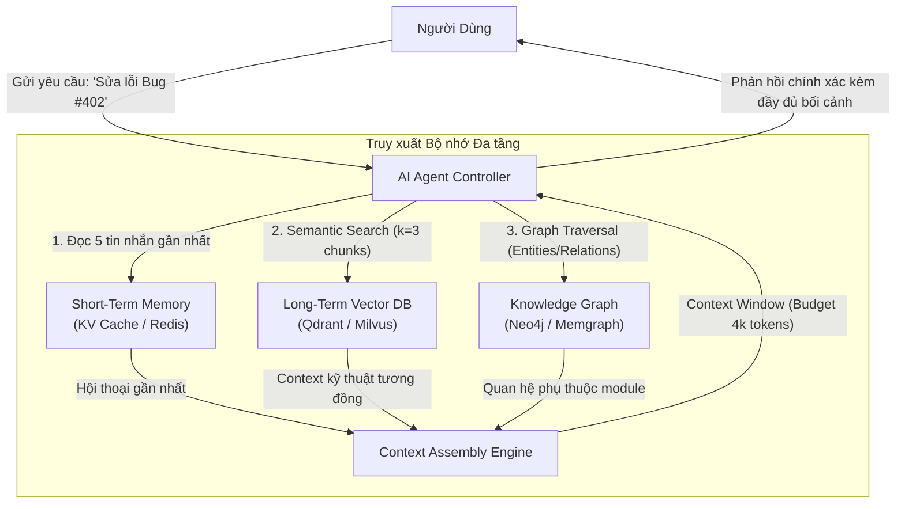

[← Chương trước: Phần 1: Agent Topology & Orchestration](/series/agentic-system-architecture/part-1-topology/) | [Mục lục Series](/series/agentic-system-architecture/) | [Chương tiếp theo: Phần 3: Secure Tool Calling & Guardrails →](/series/agentic-system-architecture/part-3-tool-calling/)

> **Answer-first:** Quản trị bộ nhớ AI Agent phân tầng thành In-session Working Memory, Short-term Buffer lưu hội thoại gần, và Long-term Semantic Memory trên Vector DB. Chiến lược nén ngữ cảnh và phân mảnh bộ nhớ ngăn chặn tràn context window và hiện tượng suy giảm trí nhớ qua các phiên làm việc kéo dài.

---

> **Prerequisite:** Để nắm vững các khái niệm nền tảng về Memory Architecture trong hệ thống AI, vui lòng xem lại [Kiến Trúc Hệ Thống AI-Native Toàn Diện](/series/ai-driven-playbook/part-8-ai-native-system-architecture/).

Sau khi đã giải quyết bài toán giao tiếp giữa các Agent ở [Phần 1](/series/agentic-system-architecture/part-1-topology/), chúng ta phải đối mặt với "kẻ thù" lớn nhất của LLM: **Giới hạn Context Window**. Một Orchestrator giỏi đến mấy cũng vô dụng nếu các Worker Agent quên mất yêu cầu ban đầu của User chỉ sau vài lượt (turns) chạy tool.

## 2.1. Vấn đề Context Window và tại sao Agent "quên" giữa chừng

Các mô hình ngôn ngữ (LLM) bản chất là Stateless (không lưu trạng thái). Mỗi lần bạn gửi một prompt, LLM đọc lại toàn bộ text từ đầu đến cuối.

Khi một Agent gọi nhiều Tools liên tiếp, lượng kết quả trả về (JSON log, text dài, webpage content) sẽ nhanh chóng lấp đầy Context Window (ví dụ: 128k tokens của GPT-4). Khi đầy, bạn buộc phải cắt bớt đoạn đầu (trượt cửa sổ). 

Hậu quả là Agent "quên" mất mục tiêu ban đầu của User. Nó bắt đầu sinh ra chuỗi hành động ngẫu nhiên (hallucination) dựa trên những context ngắn ngủn còn sót lại.

## 2.2. Short-term memory (In-session) vs Long-term memory (Cross-session)

Để hệ thống vững chãi, chúng ta chia bộ nhớ làm hai tầng.

### Short-term memory (Working Memory)
Đây là bộ nhớ dùng **trong một HTTP Session duy nhất**. Mỗi khi User mở browser mới hoặc clean cookies, memory này bị reset.
- **Lưu trữ:** Redis (cấu trúc key-value với TTL) hoặc Python dict (in-memory, reset khi process restart). Ở thời điểm 2026, các giải pháp State Store tích hợp trực tiếp vào orchestration graph (như LangGraph checkpointer) là tiêu chuẩn ngành.
- **Nhiệm vụ:** Lưu `GraphState`, intermediate steps của current conversation.

### Long-term memory (Episodic Memory)
Đây là bộ nhớ **tồn tại qua nhiều Session**. Khi User quay lại sau 1 tuần, Agent vẫn nhớ các yêu cầu cũ.
- **Lưu trữ:** Vector Database (pgvector, Weaviate, Milvus).
- **Nhiệm vụ:** Lưu user preferences, past tasks, knowledge base (RAG).

> 🔥 **[Production Failure]: Memory Pollution - Chatbot bị "ám"**
> **Symptom:** Khách hàng A đang chat hỏi về sản phẩm, đột nhiên Agent trả lời bằng chi tiết hợp đồng bảo mật của Khách hàng B.
> **Root Cause:** Quản lý Session Key sai lầm. Hệ thống dùng In-memory dict nhưng key tạo từ hash ID user bị trùng lặp (hash collision) trên load balancer. Agent nhét chung hội thoại của cả A và B vào cùng một bộ nhớ.
> 📊 **Impact:** Lộ thông tin cá nhân (Personally Identifiable Information - PII) của 140 tickets, Time-to-detect lên tới 12 tiếng. Buộc phải purge toàn bộ Redis cache.
> 📈 **Khắc phục:** Sử dụng UUIDv4 kết hợp JWT cho Session ID và áp dụng cơ chế Cô lập (Isolation) nghiêm ngặt ở mức DB Redis. *(Source: Tổng hợp từ public post-mortems - LangChain community issues).*

## 2.3. Tích hợp Vector Database (pgvector) cho RAG

Để Agent nhớ kiến thức dài hạn, ta kết hợp mô hình RAG (Retrieval-Augmented Generation). Agent có thể tự động query Vector Database trước khi trả lời.

<!-- markdownlint-disable MD034 -->

```mermaid
flowchart TD
    User["Người Dùng"] -->|"Gửi yêu cầu: 'Sửa lỗi Bug #402'"| Agent["AI Agent Controller"]
    
    subgraph Memory_Retrieval["Truy xuất Bộ nhớ Đa tầng"]
        Agent -->|"1. Đọc 5 tin nhắn gần nhất"| Buffer["Short-Term Memory<br/>(KV Cache / Redis)"]
        Agent -->|"2. Semantic Search (k=3 chunks)"| Vector["Long-Term Vector DB<br/>(Qdrant / Milvus)"]
        Agent -->|"3. Graph Traversal (Entities/Relations)"| Graph["Knowledge Graph<br/>(Neo4j / Memgraph)"]
        
        Buffer -->|"Hội thoại gần nhất"| Context["Context Assembly Engine"]
        Vector -->|"Context kỹ thuật tương đồng"| Context
        Graph -->|"Quan hệ phụ thuộc module"| Context
    end

    Context -->|"Context Window (Budget 4k tokens)"| Agent
    Agent -->|"Phản hồi chính xác kèm đầy đủ bối cảnh"| User
```

## 2.4. Chiến lược Summarization để tiết kiệm Token

Khi Short-term memory phình to quá nhanh, ta không thể nhét tất cả vào VectorDB. Phải có chiến lược "Nén" (Summarization).

Ngoài **Rolling Summarization** (thay vì giữ toàn bộ tin nhắn, Agent sẽ gọi LLM để tóm tắt một block tin nhắn cũ thành 1 đoạn ngắn và xoá tin gốc đi), còn có các strategies khác:

- **Truncation:** Cắt bớt phần giữa (giữ first + last messages). Đơn giản nhưng mất context ở giữa.
- **OpenAI `messages_to_json`:** SDK tự động nén messages cũ thành system message ẩn.
- **Token budget allocation:** Đặt budget cụ thể cho system prompt vs history vs user input.

### Code mẫu Python: Kỹ thuật Rolling Summary

```python
"""
Module: Memory Manager
Description: Cung cấp chiến lược Rolling Summarization cho Short-term memory
nhằm tiết kiệm Token, chặn đứng lỗi tràn Context Window.
"""
from typing import List

class MemoryManager:
    def __init__(self, max_messages: int = 10):
        self.max_messages = max_messages
        self.history: List[str] = []
        self.summary: str = ""

    def add_message(self, role: str, content: str):
        self.history.append(f"{role}: {content}")
        # Nếu vượt giới hạn, tiến hành nén
        if len(self.history) > self.max_messages:
            self._compress_memory()

    def _compress_memory(self):
        print(">> Đang nén (Summarize) bộ nhớ để tiết kiệm Token...")
        # Lấy nửa đầu của history để nén
        chunk_to_compress = "\\n".join(self.history[:5])
        
        # Giả lập gọi LLM tóm tắt
        new_summary = f"[Tóm tắt cũ: {self.summary}] + [Thêm: {chunk_to_compress}]"
        
        # Cập nhật state
        self.summary = new_summary
        # Giữ lại nửa sau của history (Context mới nhất)
        self.history = self.history[5:]

    def get_current_context(self) -> str:
        return f"SUMMARY:\\n{self.summary}\\n\\nRECENT:\\n{'\\n'.join(self.history)}"

# Test thử Memory Manager
memory = MemoryManager(max_messages=4)
for i in range(6):
    memory.add_message("User", f"Câu hỏi số {i}")
    memory.add_message("Agent", f"Trả lời số {i}")

print(memory.get_current_context())

# Expected output:
# >> Đang nén (Summarize) bộ nhớ để tiết kiệm Token...
# >> Đang nén (Summarize) bộ nhớ để tiết kiệm Token...
# SUMMARY:
# [Tóm tắt cũ: ] + [Thêm: User: Câu hỏi số 0
# Agent: Trả lời số 0
# User: Câu hỏi số 1
# Agent: Trả lời số 1
# User: Câu hỏi số 2]
#
# RECENT:
# User: Câu hỏi số 3
# Agent: Trả lời số 3
# User: Câu hỏi số 4
# Agent: Trả lời số 4
# User: Câu hỏi số 5
# Agent: Trả lời số 5
```

Bằng cách này, Agent luôn giữ được **Ngữ cảnh cốt lõi (Summary)** và **Chi tiết gần nhất (Recent History)**, mà không bao giờ lo bị crash do vượt quá Token Limit.

---
🔗 **Bước tiếp theo:** Agent đã nhớ đủ và phối hợp nhịp nhàng — nhưng khi nó sử dụng các kiến thức đó để "Gọi Tool" (ví dụ: xoá file, query DB), ai sẽ là người bảo vệ hệ thống khỏi rủi ro bảo mật? Mời bạn đón đọc [Part 3 — Secure Tool Calling & Guardrails](/series/agentic-system-architecture/part-3-tool-calling/).

---

[← Chương trước: Phần 1: Agent Topology & Orchestration](/series/agentic-system-architecture/part-1-topology/) | [Mục lục Series](/series/agentic-system-architecture/) | [Chương tiếp theo: Phần 3: Secure Tool Calling & Guardrails →](/series/agentic-system-architecture/part-3-tool-calling/)


---

## ❓ Câu Hỏi Thường Gặp (FAQ)

### Q1: State, Memory & Context Management giải quyết vấn đề cốt lõi nào trong kiến trúc hệ thống?
Giải bài toán giới hạn Context Window, phân biệt In-session/Cross-session memory và chiến lược tích hợp Vector DB để Agent không bao giờ 'quên'.

### Q2: Những lưu ý quan trọng nhất khi triển khai thực tế là gì?
Cần chú trọng phân tầng ranh giới trách nhiệm (bounded context), thiết lập cơ chế fallback dự phòng, và giám sát chặt chẽ qua metrics OpenTelemetry để phát hiện sớm các điểm nghẽn.

### Q3: Làm sao để kiểm thử và đánh giá hiệu quả sau khi áp dụng?
Áp dụng kiểm thử tải (load test), benchmark độ trễ P95/P99 trước và sau triển khai, kết hợp tracing phân tán để xác minh tính ổn định dưới tải cao.
