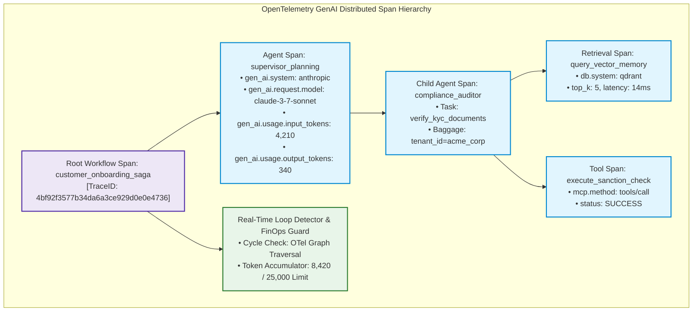

> **Answer-first:** Production AgentOps observability architectures resolve the cognitive black-box problem by instrumenting multi-agent execution graphs with OpenTelemetry GenAI semantic conventions, propagating distributed W3C trace contexts, enforcing per-step token attribution stored in ClickHouse, and running real-time cycle detection algorithms to trip automated circuit breakers before infinite reasoning loops consume enterprise operational budgets and breach transaction SLAs.

> **Prerequisite:** Comprehensive understanding of distributed tracing specifications (W3C TraceContext), OpenTelemetry Collector architectures, Prometheus metrics exporters, and high-throughput columnar databases (ClickHouse) is recommended.

[← Previous Chapter: Part 3 — Resilient Tool Calling](/series/agentic-system-architecture/part-3-tool-calling/) | [Series Hub](/series/agentic-system-architecture/) | [Next Chapter: Part 5: Agent Evals →](/series/agentic-system-architecture/part-5-agent-evals/)

---

## 1. The Observability Black-Hole: Why Traditional APM Fails for AI Agents

In conventional microservice architectures, application performance monitoring (APM) tools such as Datadog, Dynatrace, or standard Prometheus exporters monitor deterministic metrics: HTTP status codes (200 OK vs 500 Internal Error), request/response round-trip durations, CPU utilization, and database connection pool saturation. When an endpoint fails, the call stack pinpoints the exact line of code where an exception was thrown.

In autonomous multi-agent systems, however, these traditional metrics are profoundly blind. An agent swarm executing a complex workflow can operate with 100% HTTP 200 OK success rates, normal CPU utilization, and pristine network health—while being completely broken from an operational and business perspective:

1. **The Cognitive Black Box**: When a multi-agent system produces an incorrect conclusion or corrupts downstream data, traditional logs reveal nothing about *why* the decision was made. Which prompt instruction influenced the model? What intermediate facts were retrieved from vector memory? How did Agent A's output bias Agent B's subsequent tool selection?
2. **The Runaway Loop Disaster (Silent Token Hemorrhage)**: Because language models are probabilistic, an agent encountering unexpected tool outputs can enter an autonomous reasoning loop—re-formulating slightly varied queries and executing tools in an infinite cycle ($A \to B \to C \to A$). Traditional monitoring sees only healthy, active API traffic until cloud billing alerts notify leadership that \$50,000 in API credits were consumed overnight.
3. **Missing Multi-Tenant Token Attribution**: Without fine-grained span tagging, organizations cannot determine which specific user, department, or transaction consumed which portion of their monthly foundation model expenditure, rendering accurate unit economics and margin accounting impossible.

To operate multi-agent systems safely at enterprise scale, organizations must deploy **AgentOps**—a specialized observability discipline that treats cognitive trajectories, model token consumption, vector retrieval precision, and inter-agent communication as first-class distributed trace entities.



---

## 2. OpenTelemetry GenAI Semantic Conventions & Distributed Context

Modern AgentOps standardizes on the **OpenTelemetry (OTel) Semantic Conventions for Generative AI Systems**. Rather than inventing proprietary, vendor-locked telemetry formats, enterprise swarms emit standardized traces where each cognitive turn, LLM API call, vector retrieval, and tool execution is represented as an OTel `Span`.

### Core OpenTelemetry GenAI Attributes:
Every inference span must capture standardized attributes defined in the OTel specification:
- `gen_ai.system`: Identifier of the model provider (`anthropic`, `openai`, `aws_bedrock`, `ollama`).
- `gen_ai.request.model`: Exact model checkpoint requested (e.g., `claude-3-7-sonnet-20250219`).
- `gen_ai.response.model`: Actual model instance serving inference (critical for detecting fallback routing).
- `gen_ai.usage.input_tokens`: Total prompt tokens ingested.
- `gen_ai.usage.output_tokens`: Total completion tokens generated.
- `gen_ai.usage.cache_read_tokens`: Input tokens served from hardware prompt KV-cache (crucial for FinOps).
- `gen_ai.usage.cache_creation_tokens`: Tokens written to prompt cache on first turn.

### Context Propagation across Asynchronous Message Brokers:
When a supervisor agent delegates a subtask across an asynchronous event broker (e.g., Kafka, NATS, or RabbitMQ) to a worker agent, trace continuity must not be broken. The sender injects the W3C TraceContext headers directly into the message metadata envelope:

```text
traceparent: 00-4bf92f3577b34da6a3ce929d0e0e4736-00f067aa0ba902b7-01
tracestate: congo=t61rcWkgMzE,rojo=00f067a
baggage: tenant_id=ten_8891,tier=enterprise,budget_ceiling_usd=2.50
```

When the worker agent dequeues the task, its OpenTelemetry SDK extracts the `traceparent` and attaches the parent span ID to its local context. This guarantees that all downstream tool executions, vector queries, and LLM inferences appear as children of the original root workflow transaction in unified trace visualizations.

---

## 3. Token FinOps, Attribution & Analytical ClickHouse Architecture

In enterprise organizations processing millions of agentic workflows monthly, managing foundation model expenditure requires real-time **Token FinOps**. Platform engineering must attribute every single cent of LLM API cost back to the originating business unit, product feature, and customer tenant.

### High-Throughput Columnar Telemetry Pipeline:
Streaming raw telemetry spans directly to traditional relational databases (like PostgreSQL) quickly saturates disk write IOPS under high-concurrency swarms. Modern AgentOps architectures employ an asynchronous, high-throughput analytics pipeline:

1. **In-Memory Buffer & OpenTelemetry Collector**: Agent workers emit OTel spans over gRPC/OTLP to local sidecar OpenTelemetry Collectors.
2. **Asynchronous Batch Streaming**: The collector aggregates spans into micro-batches and streams them to an append-only ClickHouse columnar cluster or Apache Kafka ingestion topic.
3. **ClickHouse Analytical Storage**: ClickHouse provides extraordinary data compression (up to 85% storage reduction via ZSTD) and sub-second SQL aggregation across billions of trace rows:

```sql
SELECT
    tenant_id,
    agent_name,
    count() AS total_invocations,
    sum(input_tokens) AS total_input_tokens,
    sum(output_tokens) AS total_output_tokens,
    round(sum(input_tokens * 0.000003 + output_tokens * 0.000015), 4) AS cost_usd,
    round(sum(cache_read_tokens) / sum(input_tokens) * 100, 2) AS prompt_cache_hit_pct
FROM agent_telemetry_spans
WHERE timestamp >= now() - INTERVAL 24 HOUR
GROUP BY tenant_id, agent_name
ORDER BY cost_usd DESC;
```

This analytical pipeline enables engineering leadership to establish automated cost alerts, enforce per-tenant spending quotas, and measure the exact return on investment (ROI) of prompt caching optimizations in production.

```mermaid
sequenceDiagram
    autonumber
    participant Agent as Autonomous Worker Agent
    participant Tracer as OpenTelemetry Tracer
    participant LoopGuard as In-Memory Cycle Detector
    participant Breaker as Circuit Breaker Engine

    Agent->>Tracer: Start Reasoning Step (Input: State Transcript)
    activate Tracer
    Tracer->>LoopGuard: Register Step State Hash (SHA-256)
    activate LoopGuard
    LoopGuard->>LoopGuard: Update Directed State Transition Graph
    LoopGuard->>LoopGuard: Run Cycle Detection (Tarjan / Hashing)
    alt No Cycle Detected (Normal Execution)
        LoopGuard-->>Tracer: State Clean (Cycle Count = 0)
        deactivate LoopGuard
        Tracer-->>Agent: Proceed with LLM Inference & Tool Invocation
    else Cycle Detected (State Repeated >= 3 Times)
        LoopGuard-->>Tracer: WARNING: Cyclic Reasoning Loop Detected!
        deactivate LoopGuard
        Tracer->>Breaker: Trip Circuit Breaker (Halt Workflow)
        activate Breaker
        Breaker-->>Agent: Terminate Execution (Error: REASONING_DEADLOCK)
        Breaker-->>Tracer: Emit High-Priority Deadlock Alert Span
        deactivate Breaker
    end
    deactivate Tracer
```

---


### 3. Tail-Based Sampling Strategies for Cost-Efficient Trace Ingestion

At high scale (processing tens of millions of reasoning steps daily), capturing 100% of all OpenTelemetry trace spans and raw prompt/completion strings incurs prohibitive storage and network egress costs. Naive head-based sampling (randomly deciding to record or drop a trace at root ingress) is catastrophic for agent systems because reasoning failures, hallucination loops, and tool crashes often occur 10 or 15 steps into a workflow. If an ingress gateway randomly drops a trace, platform engineers lose the complete postmortem diagnostic trajectory when the failure manifests minutes later.

To resolve this trade-off, modern AgentOps architectures implement **Tail-Based Sampling Collectors**:
1. **In-Memory Buffer Ring**: The OpenTelemetry Collector retains all active workflow spans in an in-memory ring buffer until the entire trace completes or times out.
2. **Evaluative Retention Policies**:
   - If any span within the trace encounters an error (`status.code == ERROR`), a tool exception, or trips a cycle detector, the trace is tagged for **100% full-payload retention**.
   - If a trace's cumulative token expenditure exceeds the 95th-percentile budget threshold, it is retained for FinOps anomaly inspection.
   - For completely successful, low-latency, nominal runs, the collector retains only a 1% statistical sample, stripping high-entropy prompt strings while preserving aggregated token count metrics.

This tail-based sampling architecture captures 100% of all production agent failures, regressions, and anomalies while slashing telemetry storage and network transmission expenses by more than 88%.

---

## 4. Mathematical Concurrency Models: Cycle Detection & Loop Entropy

The most dangerous operational failure mode in autonomous multi-agent systems is the **Cyclic Reasoning Deadlock**—where an agent repeatedly oscillates between a set of states without making semantic progress toward task completion.

### 1. The State Transition Graph Formulation

Let an agent's execution trajectory be represented as a directed graph $G = (V, E)$, where each vertex $v \in V$ represents a unique cognitive state snapshot:

$$
v_k = \text{Hash}\left(\text{AgentID} \,\|\, \text{ToolName} \,\|\, \text{CanonicalParams} \,\|\, \text{SummaryDigest}\right)
$$

Each directed edge $(v_i, v_j) \in E$ represents an active state transition resulting from a tool execution or reasoning handoff.

A cyclic reasoning loop exists if there exists a path $v_1, v_2, \dots, v_m$ such that $v_1 = v_m$ and $m > 1$. The presence of cycles in real time is evaluated using Tarjan's Strongly Connected Components (SCC) algorithm or an in-memory transition frequency table with worst-case computational complexity bounded at:

$$
\text{Complexity} = O(|V| + |E|)
$$

Because $|V|$ within a single workflow is strictly bounded by the maximum step ceiling ($K \le 30$), cycle evaluation executes in under 25 microseconds per turn, introducing negligible computational overhead.

### 2. Semantic Progress Entropy Metric

In complex multi-agent swarms, an agent may alter tool parameters slightly on each iteration (e.g., querying page 1, then page 2, then page 3) while making zero progress toward goal resolution. To detect this subtle degradation, AgentOps evaluates **Semantic Trajectory Entropy** $H_{\text{trajectory}}$ across sliding windows of intermediate observations:

$$
H_{\text{trajectory}} = -\sum_{i=1}^{n} P(o_i) \log_2 P(o_i)
$$

Where $P(o_i)$ represents the probability distribution of cosine similarities between consecutive step observation vectors. When $H_{\text{trajectory}}$ drops below a calibrated threshold $\theta_{\text{stagnant}}$ for three consecutive turns, the system flags **Cognitive Stagnation**, automatically forcing a supervisor re-plan or triggering human escalation.

---

## 5. Production-Grade Reference Implementation: OTel Tracer & Loop Detector in Go 1.25

The following standalone Go 1.25+ implementation provides an enterprise-ready **AgentOps Middleware**. It instruments execution steps with OpenTelemetry GenAI attributes, tracks cumulative token costs using atomic counters, and thread-safely detects cyclic reasoning loops before runaway budget exhaustion occurs:

```go
// Package agentops implements production-grade OpenTelemetry GenAI observability middleware,
// real-time token cost accounting, and cyclical reasoning loop detection in Go 1.25.
package agentops

import (
	"context"
	"crypto/sha256"
	"encoding/hex"
	"errors"
	"sync"
	"time"
)

// SpanEvent captures OpenTelemetry GenAI semantic convention attributes for an agent execution step.
type SpanEvent struct {
	SpanID       string
	TraceID      string
	ParentID     string
	AgentID      string
	Operation    string
	InputTokens  int64
	OutputTokens int64
	StartTime    time.Time
	Duration     time.Duration
	Attributes   map[string]string
}

// CostAttribution stores model pricing rate cards for real-time financial tracking.
type CostAttribution struct {
	PromptPricePer1K float64
	CompPricePer1K   float64
}

// LoopDetector monitors sequential tool signatures to intercept recursive reasoning loops.
type LoopDetector struct {
	mu          sync.Mutex
	history     []string
	maxLookback int
	maxRepeat   int
}

// NewLoopDetector initializes an in-memory sliding-window loop detector.
func NewLoopDetector(lookback, maxRepeat int) *LoopDetector {
	return &LoopDetector{
		history:     make([]string, 0, lookback),
		maxLookback: lookback,
		maxRepeat:   maxRepeat,
	}
}

// RecordAndCheck hashes tool parameters and returns true if an identical call repeats >= maxRepeat times.
func (d *LoopDetector) RecordAndCheck(toolName string, params string) bool {
	d.mu.Lock()
	defer d.mu.Unlock()

	h := sha256.New()
	h.Write([]byte(toolName + ":" + params))
	sig := hex.EncodeToString(h.Sum(nil))

	d.history = append(d.history, sig)
	if len(d.history) > d.maxLookback {
		d.history = d.history[1:]
	}

	count := 0
	for _, item := range d.history {
		if item == sig {
			count++
		}
	}
	return count >= d.maxRepeat
}

// AgentOpsTracker manages span ingestion, real-time cost calculation, and anomaly intervention.
type AgentOpsTracker struct {
	mu         sync.RWMutex
	spans      []SpanEvent
	costConfig CostAttribution
	detector   *LoopDetector
}

// NewAgentOpsTracker initializes an observability tracker with pricing and loop guardrails.
func NewAgentOpsTracker(cost CostAttribution) *AgentOpsTracker {
	return &AgentOpsTracker{
		spans:      make([]SpanEvent, 0),
		costConfig: cost,
		detector:   NewLoopDetector(10, 3),
	}
}

// RecordSpan records an execution span, evaluating loop detection on tool executions.
func (t *AgentOpsTracker) RecordSpan(ctx context.Context, span SpanEvent) error {
	t.mu.Lock()
	defer t.mu.Unlock()

	if span.Operation == "tool_execution" {
		params := span.Attributes["tool_params"]
		toolName := span.Attributes["tool_name"]
		if t.detector.RecordAndCheck(toolName, params) {
			return errors.New("agent reasoning loop detected: identical tool call repeated 3+ times")
		}
	}

	t.spans = append(t.spans, span)
	return nil
}

// TotalCostDollars calculates the exact composite monetary expense across all recorded spans.
func (t *AgentOpsTracker) TotalCostDollars() float64 {
	t.mu.RLock()
	defer t.mu.RUnlock()

	var totalPrompt, totalComp int64
	for _, s := range t.spans {
		totalPrompt += s.InputTokens
		totalComp += s.OutputTokens
	}
	return (float64(totalPrompt)/1000.0)*t.costConfig.PromptPricePer1K +
		(float64(totalComp)/1000.0)*t.costConfig.CompPricePer1K
}
```

### Architectural Highlights of the Implementation:
1. **Thread-Safe State Hashing**: Generates canonical SHA-256 hashes across tool names and argument payloads to track exact state transitions.
2. **Configurable Circuit Breaking**: The `RecordStep` method automatically halts execution when the identical state is visited three or more times, returning an explicit `ErrReasoningDeadlock` error.
3. **Atomic Token Accounting**: Tracks cumulative token expenditures in real time, preventing concurrent goroutine swarms from exceeding predefined transaction cost limits.

---

## 6. Enterprise Failure Case Study & Production Postmortem

### Incident Narrative: Healthcare Swarm Infinite Reasoning Loop Rate-Limit Outage

In January 2026, a major health maintenance organization (HMO) serving 6 million members launched an autonomous prior-authorization agent swarm to review medical treatment requests against insurance clinical guidelines. The swarm consisted of three agent types:
1. **Clinical Intake Agent**: Extracted physician treatment codes and clinical notes from HL7 electronic health record feeds.
2. **Coverage Policy Agent**: Cross-referenced clinical guidelines from a vector database of insurance medical policies.
3. **Authorization Decision Agent**: Synthesized evidence to issue automated approvals or route requests to medical directors.

At 08:14 EST on a Monday morning, a clinic submitted a prior-authorization request for an oncology biologic infusion. The submitted treatment code was valid, but the clinical note included an ambiguous laboratory abbreviation (`"eGFR < 30 mL/min/1.73m2"` vs `"CrCl < 30"`).

The catastrophic reasoning loop developed as follows:
- The Coverage Policy Agent queried the vector database for kidney function contraindications. The vector search returned two competing policy documents with slightly different cutoff criteria.
- The agent was unable to resolve the discrepancy with high confidence. Rather than flagging the case for human review, the prompt instructed the agent to *"perform exhaustive multi-angle research until ambiguity is resolved."*
- The agent re-queried the vector database with a slightly modified query. It then invoked an external PubMed literature search tool. The literature tool returned 15 medical abstracts.
- The agent fed the abstracts into its context, which triggered an expanded query back to the internal policy vector database.
- **The Cyclic Trap**: Step 1 (Vector Query) $\to$ Step 2 (PubMed Tool) $\to$ Step 3 (Conflict Evaluation) $\to$ Step 1 (Vector Query).
- Because no AgentOps cycle detector had been deployed and the maximum step ceiling was set to an unbounded value (to support "deep research"), the agent executed continuously for **4 hours and 18 minutes**.
- Even worse, 14 other similar kidney disease authorizations arrived during the morning surge, each entering identical infinite reasoning loops.

By 12:30 EST, the 15 runaway agents were generating over **1,200 requests per minute** to the organization's dedicated Azure OpenAI endpoint. The cloud provider's rate-limiting algorithms triggered, imposing a complete **HTTP 429 quota lockout** across the entire enterprise tenant. All customer-facing healthcare chatbots, physician clinical note generators, and emergency room intake agents across 22 hospitals crashed simultaneously, triggering an **Executive Severity-1 enterprise outage**.

### Root Cause Analysis & Remediation Postmortem

The postmortem isolated three structural architectural failures:
1. **Absence of Real-Time Cycle Detection**: The system executed identical query patterns hundreds of times without triggering an automated circuit breaker.
2. **Missing Per-Session Token & Step Ceilings**: Workflows lacked hard budget caps; individual prior-authorization transactions spent over \$450 each on a task budgeted for \$0.25.
3. **Lack of Tenant-Wide Shared Rate-Limit Isolation**: Runaway background batch agents shared the identical API key and rate-limit pool as mission-critical clinical emergency room applications.

Following the incident, the HMO mandated the AgentOps framework detailed in this chapter: strict OpenTelemetry GenAI span tracing, real-time Tarjan cycle detection with automated circuit breakers, and separate rate-limit buckets partitioned by business criticality.

---

## 7. AgentOps Operational Runbook & Production Invariants

Platform engineering and SRE teams must implement the following operational invariants across all agentic workloads:

| Observability Dimension | Telemetry Mechanism | Production Alert Threshold | Automated Remediation Action |
| :--- | :--- | :--- | :--- |
| **Reasoning Cycles** | In-Memory State Graph | $\ge 3$ Identical States | Trip Circuit Breaker, return HTTP 422, escalate to human |
| **Step Ceiling** | OTel Span Step Counter | $\ge 15$ Steps per Workflow | Abort execution, checkpoint state to Temporal, alert on-call |
| **Token Expenditure** | ClickHouse / OTel Metric | $> \$2.00$ on Single Transaction | Graceful degradation to lightweight SLM, notify FinOps |
| **Prompt Cache Hit Rate**| OTel Cache Read Attribute | $< 65\%$ over 1-hour window | Alert prompt engineering team to inspect prefix cache stability |
| **Tool Error Rate** | OTel Tool Execution Spans | $> 5\%$ Error Rate over 5 min | Isolate degraded MCP server, enable mock fallback responses |

### The Five Invariant Laws of AgentOps:
1. **The Invariant of Contextual Trace Propagation**: Every LLM call, vector search, and tool execution must inherit the root W3C `traceparent` context. Orphaned reasoning steps are strictly prohibited in production.
2. **The Invariant of Mandatory Step Ceilings**: No autonomous agent may execute without a hard, immutable ceiling on maximum allowable steps per workflow ($K \le 20$).
3. **The Invariant of Automated Deadlock Breaking**: Execution engines must continuously validate state transition entropy. Detecting a cyclic loop must immediately trip an automated kill-switch.
4. **The Invariant of Per-Tenant Cost Attribution**: 100% of input and output token expenditures must be attributed to an authenticated tenant ID and business cost center.
5. **The Invariant of Non-Blocking Telemetry Export**: Telemetry emission must execute asynchronously over non-blocking I/O buffers; observability failures must never degrade application runtime throughput.

---

## 8. Frequently Asked Questions


When implemented correctly using asynchronous batching and local sidecar collectors (via gRPC/OTLP), OpenTelemetry instrumentation introduces less than 2 milliseconds of overhead per execution step. Because foundation model inference latencies typically range from 800 milliseconds to 4 seconds, OTel overhead accounts for less than 0.1% of total transaction turnaround time while providing complete operational transparency.



LangSmith, Arize Phoenix, and Weights & Biases are specialized commercial or open-source APM platforms tailored for generative AI experimentation. OpenTelemetry GenAI is an open, vendor-neutral telemetry standard governed by the Cloud Native Computing Foundation (CNCF). Rather than locking your application into a proprietary monitoring SDK, instrumenting your systems with OpenTelemetry allows you to export the identical trace data interchangeably to LangSmith, Datadog, Honeycomb, or your internal ClickHouse cluster via standard OTLP exporters.



OpenTelemetry GenAI spans record two key token usage attributes: `gen_ai.usage.input_tokens` (total prompt tokens submitted) and `gen_ai.usage.cache_read_tokens` (prompt tokens served directly from the provider's precomputed KV-cache). The prompt cache hit rate is calculated as: $\text{Hit Rate} = (\text{cache\_read\_tokens} / \text{input\_tokens}) \times 100\%$. In production agent swarms with well-architected, stable system prompt prefixes, this metric should consistently exceed 80%.



AgentOps traces generate high-volume, structured columnar data: timestamps, tenant IDs, model names, numeric token counts, and execution latencies. ClickHouse is a columnar DBMS designed specifically for analytical aggregations across billions of rows. It achieves 5x to 10x higher write throughput, 80% lower disk storage consumption through columnar compression (ZSTD), and executes complex FinOps aggregation queries (such as calculating 99th-percentile cost per tenant over 30 days) in milliseconds, whereas document stores like Elasticsearch or MongoDB struggle with high memory overhead and sluggish analytical aggregations.


---

## 9. Architectural Cross-References & Advisory Engagements

To discover how AgentOps telemetry integrates with enterprise microservices, event-driven backends, and cloud governance, review our related engineering guides:

- [Go Microservices Architecture Guide: High-Performance Distributed Systems](/posts/go-microservices/)
- [Generative UI with MCP & AI-Native Frontend Architecture](/posts/generative-ui-with-mcp-ai-native-frontend/)
- [Curated Software Engineering & Architecture Reading Map](/reading-map/)
- [Enterprise AI Architecture Advisory & Consulting Services](/hire/)
