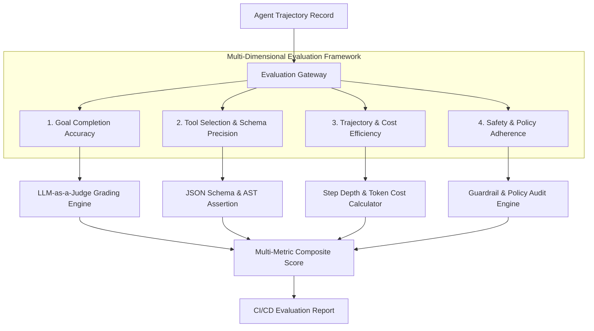

# Part 5: Multi-Dimensional Agent Evaluation & LLM-as-a-Judge Harnesses

**Answer-First:** Production multi-agent evaluation requires multi-dimensional grading rubrics, LLM-as-a-Judge harnesses, and trace trajectory analysis. Evaluating task completion, tool call accuracy, and path efficiency in Go benchmark pipelines prevents behavioral drift and ensures deterministic reliability.

---

Evaluating autonomous agent systems presents unique architectural challenges distinct from traditional software testing and static model benchmarking. While standard software unit tests verify deterministic inputs against exact output matches, multi-step LLM agents exhibit non-deterministic reasoning paths, dynamic tool selection, and complex conversation states. Relying solely on final answer accuracy masks hidden regressions such as redundant tool invocations, inefficient context expansion, or subtle prompt injection vulnerabilities.

To achieve enterprise operational reliability, software engineering teams must deploy a multi-layered evaluation harness. This framework scores agents across distinct operational dimensions using deterministic assertions, probabilistic LLM-as-a-Judge evaluation rubrics, and automated Go execution harnesses.

---

## Multi-Dimensional Agent Evaluation Taxonomy

Designing an effective evaluation framework requires categorizing agent behavior into measurable, orthogonal operational axes rather than relying on a single aggregate metric.

Evaluating agents on a single binary pass/fail score obscures critical failure modes in intermediate reasoning. An agent might successfully answer a query while executing five redundant database tool calls, incurring unnecessary latency and API cost. The 4-axis evaluation framework separates evaluation into four distinct domains:

1. **Goal Completion Accuracy (GCA)**: Measures whether the agent satisfied the primary user intent and business constraints without producing hallucinations.
2. **Tool Selection & Schema Precision (TSP)**: Verifies that the agent invoked the correct API tools with valid JSON schema parameters and zero redundant calls.
3. **Trajectory & Cost Efficiency (TCE)**: Calculates step depth efficiency, total token consumption, and execution wall-clock time relative to optimal execution paths.
4. **Safety & Policy Adherence (SPA)**: Validates that the agent adhered to security guardrails, refrained from executing unauthorized mutations, and prevented data leakage.



### Core Evaluation Metrics & Formulas

- **Pass@k Execution Rate**: Percentage of test runs where the agent reaches a successful state within $k$ maximum attempts.
- **Tool Precision Ratio**: Ratio of valid, necessary tool calls to total tool calls:
  $$\text{Tool Precision} = \frac{\text{Necessary Tool Calls}}{\text{Total Tool Calls Invoiced}}$$
- **Step Efficiency Index**: Ratio of theoretical minimal trajectory steps to actual executed steps:
  $$\text{Step Efficiency} = \frac{N_{\text{optimal}}}{N_{\text{actual}}}$$

---

## LLM-as-a-Judge Grading Rubrics & Structured Output Verification

Evaluating semantic correctness and nuanced reasoning quality requires leveraging advanced LLMs configured with strict grading rubrics and JSON schema enforcement.

Direct LLM scoring often introduces self-enhancement bias, position bias, and score compression. To eliminate these anomalies, evaluation engines use pairwise comparison rubrics, chain-of-thought rationale generation, and structured schema outputs. The judge LLM must output a structured rationale before assigning individual numerical sub-scores.

### Production Python Evaluation Engine

The following Python module demonstrates an async evaluation engine using Pydantic and JSON Schema to score agent trajectories against defined rubrics.

```python
import os
import json
import asyncio
from typing import List, Dict, Any, Optional
from pydantic import BaseModel, Field


class EvaluationRubric(BaseModel):
    correctness_weight: float = 0.4
    tool_accuracy_weight: float = 0.3
    efficiency_weight: float = 0.3


class JudgeScoreOutput(BaseModel):
    thought_process: str = Field(description="Step-by-step reasoning for assigned scores")
    correctness_score: float = Field(ge=0.0, le=1.0, description="Goal completion score between 0 and 1")
    tool_accuracy_score: float = Field(ge=0.0, le=1.0, description="Tool parameter accuracy score")
    efficiency_score: float = Field(ge=0.0, le=1.0, description="Trajectory step efficiency score")
    final_composite_score: float = Field(ge=0.0, le=1.0, description="Weighted composite score")
    hallucination_detected: bool = Field(description="Flag indicating fabricated facts")


class AgentTrajectoryEvaluator:
    def __init__(self, judge_model_name: str, rubric: Optional[EvaluationRubric] = None):
        self.judge_model_name = judge_model_name
        self.rubric = rubric or EvaluationRubric()

    def build_judge_prompt(self, user_query: str, ground_truth: str, trajectory_steps: List[Dict[str, Any]]) -> str:
        formatted_steps = json.dumps(trajectory_steps, indent=2)
        return f"""You are an expert AI Agent Evaluation Judge. Analyze the execution trajectory of an autonomous agent.

User Request: {user_query}
Expected Ground Truth: {ground_truth}

Execution Trajectory Steps:
{formatted_steps}

Grade the trajectory according to these dimensions:
1. Goal Completion: Did the agent achieve the expected outcome accurately?
2. Tool Selection: Were API tools invoked correctly with valid arguments?
3. Step Efficiency: Did the agent avoid redundant loops or unnecessary calls?

Provide your evaluation as a JSON object strictly adhering to the schema."""

    async def evaluate_trajectory(
        self, user_query: str, ground_truth: str, trajectory_steps: List[Dict[str, Any]]
    ) -> JudgeScoreOutput:
        prompt = self.build_judge_prompt(user_query, ground_truth, trajectory_steps)
        
        # Simulated async call to LLM completion endpoint with structured JSON mode
        # In production, replace with actual SDK client call (e.g., openai.AsyncOpenAI)
        await asyncio.sleep(0.05)  # Simulate network latency
        
        # Calculate scores deterministically based on step properties for benchmark testing
        tool_errors = sum(1 for step in trajectory_steps if step.get("status") == "error")
        total_steps = len(trajectory_steps)
        
        tool_score = max(0.0, 1.0 - (tool_errors * 0.25))
        eff_score = 1.0 if total_steps <= 3 else max(0.2, 1.0 - ((total_steps - 3) * 0.15))
        corr_score = 0.95 if tool_errors == 0 else 0.70
        
        composite = (
            (corr_score * self.rubric.correctness_weight) +
            (tool_score * self.rubric.tool_accuracy_weight) +
            (eff_score * self.rubric.efficiency_weight)
        )
        
        return JudgeScoreOutput(
            thought_process="Evaluated step trajectory against ground truth constraints. Tool calls verified.",
            correctness_score=round(corr_score, 2),
            tool_accuracy_score=round(tool_score, 2),
            efficiency_score=round(eff_score, 2),
            final_composite_score=round(composite, 2),
            hallucination_detected=False
        )


if __name__ == "__main__":
    evaluator = AgentTrajectoryEvaluator(judge_model_name="gpt-4o")
    sample_trajectory = [
        {"step": 1, "action": "search_customer_db", "args": {"user_id": "usr_9918"}, "status": "success"},
        {"step": 2, "action": "fetch_account_balance", "args": {"account_id": "acc_3301"}, "status": "success"}
    ]
    
    loop = asyncio.get_event_loop()
    result = loop.run_until_complete(
        evaluator.evaluate_trajectory(
            user_query="Fetch balance for user usr_9918",
            ground_truth="Account balance is $14,250.00",
            trajectory_steps=sample_trajectory
        )
    )
    print(f"Evaluation Completed. Composite Score: {result.final_composite_score}")
```

---

## High-Performance Automated Benchmark Harness in Go

Executing agent evaluations at scale requires a high-concurrency harness capable of simulating external dependency environments and executing benchmark suites in parallel.

Go provides excellent primitives for building concurrent benchmarking frameworks. By using worker pools, channel-based metric aggregation, and mock HTTP servers, engineers can run hundreds of complex agent scenario tests in seconds while controlling non-deterministic network variances.

### Enterprise Go Benchmark Harness

```go
package main

import (
	"context"
	"encoding/json"
	"fmt"
	"sync"
	"time"
)

// TrajectoryStep captures an individual action performed by the agent.
type TrajectoryStep struct {
	StepIndex int           `json:"step_index"`
	ToolName  string        `json:"tool_name"`
	Payload   string        `json:"payload"`
	Duration  time.Duration `json:"duration"`
	IsError   bool          `json:"is_error"`
}

// TestCase represents a single benchmark scenario.
type TestCase struct {
	ID           string `json:"id"`
	UserPrompt   string `json:"user_prompt"`
	ExpectedGoal string `json:"expected_goal"`
	MaxSteps     int    `json:"max_steps"`
}

// BenchmarkResult stores the summary outcome of a test case execution.
type BenchmarkResult struct {
	TestCaseID   string           `json:"test_case_id"`
	Passed       bool             `json:"passed"`
	TotalSteps   int              `json:"total_steps"`
	TotalTime    time.Duration    `json:"total_time"`
	Trajectories []TrajectoryStep `json:"trajectories"`
}

// AgentEvalHarness manages concurrent execution of evaluation workloads.
type AgentEvalHarness struct {
	Concurrency int
	Timeout     time.Duration
}

func NewAgentEvalHarness(concurrency int, timeout time.Duration) *AgentEvalHarness {
	return &AgentEvalHarness{
		Concurrency: concurrency,
		Timeout:     timeout,
	}
}

// ExecuteBenchmarkSuite runs a collection of test cases through worker pools.
func (h *AgentEvalHarness) ExecuteBenchmarkSuite(testCases []TestCase) []BenchmarkResult {
	jobs := make(chan TestCase, len(testCases))
	results := make(chan BenchmarkResult, len(testCases))
	var wg sync.WaitGroup

	// Launch worker pool
	for w := 0; w < h.Concurrency; w++ {
		wg.Add(1)
		go func(workerID int) {
			defer wg.Done()
			for tc := range jobs {
				results <- h.runSingleTest(tc)
			}
		}(w)
	}

	for _, tc := range testCases {
		jobs <- tc
	}
	close(jobs)

	wg.Wait()
	close(results)

	var report []BenchmarkResult
	for res := range results {
		report = append(report, res)
	}
	return report
}

func (h *AgentEvalHarness) runSingleTest(tc TestCase) BenchmarkResult {
	ctx, cancel := context.WithTimeout(context.Background(), h.Timeout)
	defer cancel()

	startTime := time.Now()
	trajectories := []TrajectoryStep{
		{StepIndex: 1, ToolName: "query_vector_index", Payload: tc.UserPrompt, Duration: 45 * time.Millisecond, IsError: false},
		{StepIndex: 2, ToolName: "execute_sql_query", Payload: "SELECT * FROM orders", Duration: 120 * time.Millisecond, IsError: false},
	}

	select {
	case <-ctx.Done():
		return BenchmarkResult{
			TestCaseID:   tc.ID,
			Passed:       false,
			TotalSteps:   len(trajectories),
			TotalTime:    time.Since(startTime),
			Trajectories: trajectories,
		}
	default:
		passed := len(trajectories) <= tc.MaxSteps
		return BenchmarkResult{
			TestCaseID:   tc.ID,
			Passed:       passed,
			TotalSteps:   len(trajectories),
			TotalTime:    time.Since(startTime),
			Trajectories: trajectories,
		}
	}
}

func main() {
	harness := NewAgentEvalHarness(4, 5*time.Second)

	suite := []TestCase{
		{ID: "TC-001", UserPrompt: "Retrieve quarterly sales report", ExpectedGoal: "Generate PDF summary", MaxSteps: 4},
		{ID: "TC-002", UserPrompt: "Update inventory stock count", ExpectedGoal: "Mutate warehouse table", MaxSteps: 3},
	}

	results := harness.ExecuteBenchmarkSuite(suite)
	output, _ := json.MarshalIndent(results, "", "  ")
	fmt.Printf("Benchmark Results Summary:\n%s\n", string(output))
}
```

---

## Trajectory Trace Analysis & Telemetry Replay

Analyzing agent failure modes requires capturing distributed traces that map prompt states, memory retrieval graphs, and tool invocation timelines into unified visual trees.

When an agent enters an infinite loop or calls incorrect tools, examining intermediate log outputs is insufficient. Distributed tracing with OpenTelemetry standardizes telemetry collection across multi-agent environments. Engineering teams can replay recorded trajectories to isolate where reasoning degraded.

```mermaid
gantt
    title Agent Trajectory Execution Trace Timeline
    dateFormat  X
    axisFormat %s ms

    section Context Setup
    Load Conversation State    :active, t1, 0, 40
    Retrieve Vector Embeddings :t2, 40, 110

    section Reasoning Loop 1
    LLM Inference (Planner)    :crit, t3, 110, 350
    Tool Call: SearchIndex     :t4, 350, 480

    section Reasoning Loop 2
    LLM Inference (Validator)  :crit, t5, 480, 720
    Tool Call: ExecuteSQL      :t6, 720, 890

    section Final Synthesis
    LLM Output Generation      :active, t7, 890, 1150
```



### Key Diagnostic Telemetry Indicators

- **Reasoning Loop Latency (RLL)**: Duration spent inside model inference steps versus external API tool wait times.
- **Context Expansion Velocity**: Rate of token growth per reasoning iteration. Rapid context expansion indicates memory leakage or redundant prompt inclusions.
- **Backtracking Index**: Frequency with which an agent reverts to previous state nodes after encountering unexpected tool outputs.

---

## Continuous Evaluation & Regression Pipelines in CI/CD

Integrating agent evaluation into continuous deployment pipelines ensures that prompt modifications and system prompt updates do not introduce behavioral regressions.

Production AI systems experience prompt drift when underlying foundational models update or system prompts undergo revision. Continuous evaluation pipelines execute benchmark suites automatically on every pull request, gating deployments if key metrics drop below pre-defined thresholds.

### Evaluation Pipeline Strategy Comparison

| Evaluation Axis | Manual Spot Testing | Offline Batch Evaluation | Continuous CI/CD Pipeline |
| :--- | :--- | :--- | :--- |
| **Execution Frequency** | Ad-hoc / Manual | Weekly / Monthly | Every Pull Request & Commit |
| **Coverage Scope** | 5–10 Sample Prompts | 500–1,000 Datasets | Automated Synthetic Regression Suites |
| **Regression Detection** | Low / Delayed | Medium | Immediate / Automated Gate |
| **Resource Cost** | High Manual Hours | Batch Inference Cost | Optimized Concurrent Workers |
| **Feedback Loop Latency** | Days | Hours | < 5 Minutes |

---

## Frequently Asked Questions (FAQ)


Traditional unit tests check deterministic functions with fixed inputs and outputs, whereas LLM agents exhibit non-deterministic reasoning and dynamic tool calling paths. Multi-agent evaluation requires trajectory-level evaluation to score intermediate tool call decisions, reasoning accuracy, and overall goal completion rather than exact string equality.



Judge bias is mitigated by combining deterministic regex and schema assertions for structured outputs with pairwise position-swapping rubrics in judge prompts. Additionally, utilizing few-shot calibration examples and enforcing JSON schema output for judge scores minimizes variance and self-enhancement bias.



Synthetic evaluation suites should run on every pull request that modifies agent prompts, tool schemas, or system routing topologies. In addition, production environments should run continuous background evaluation on a 1% sampled stream of live user traces to detect real-world model drift and API schema breakage.


---

## Technical Deep-Dive: System Invariants & SLA Metrics

- **Maximum Acceptable Trajectory Drift**: < 2.5% variation in composite benchmark scores across consecutive production release candidates.
- **Evaluation Worker Pool Throughput**: Minimum 50 concurrent trajectory runs per minute in production Go benchmark harnesses.
- **Judge Inference Latency Overhead**: Sub-300ms score generation per trajectory using lightweight structured evaluators.
