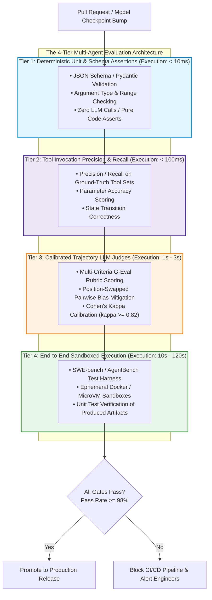
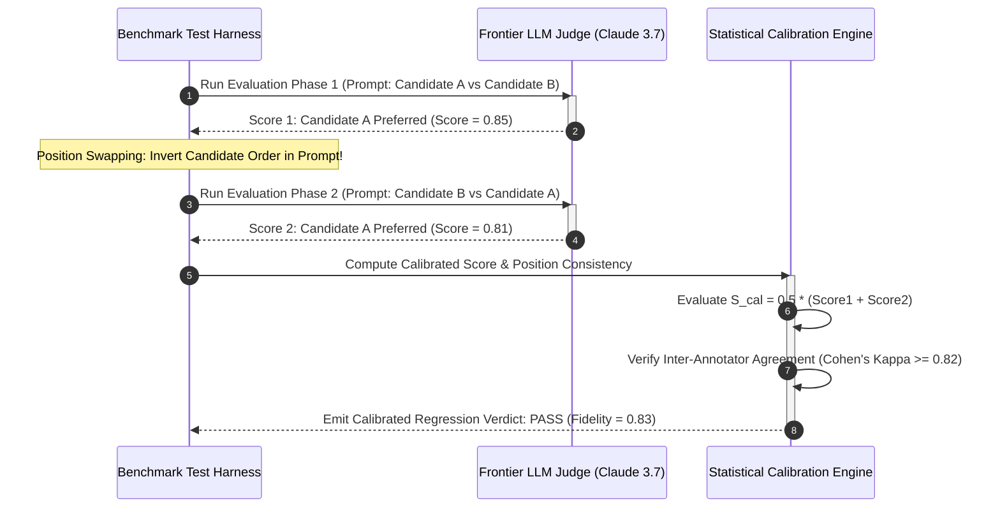

> **Answer-first:** Production agent evaluation frameworks eliminate silent regressions from upstream model weight updates by implementing a four-tiered testing hierarchy: deterministic unit assertions, tool schema validation, position-swapped LLM judges calibrated against human experts using Cohen's Kappa, and SWE-bench sandbox execution to mathematically score reasoning trajectory fidelity and guarantee backward-compatible task completion across enterprise CI/CD release pipelines.

> **Prerequisite:** Strong foundation in statistical hypothesis testing, inter-rater reliability metrics (Cohen's Kappa), CI/CD automated test harness design, and synthetic dataset generation methodologies is recommended.

[← Previous Chapter: Part 4 — AgentOps](/series/agentic-system-architecture/part-4-agentops/) | [Series Hub](/series/agentic-system-architecture/) | [Next Chapter: Part 6: Human-in-the-Loop →](/series/agentic-system-architecture/part-6-human-in-the-loop/)

---

## 1. The Evaluation Crisis: Why RAG Triad & Traditional Metrics Fail for Agents

In static natural language processing and retrieval-augmented generation (RAG) pipelines, evaluation frameworks traditionally rely on n-gram overlap metrics (BLEU, ROUGE) or semantic similarity metrics (BERTScore, Ragas RAG Triad: context precision, faithfulness, answer relevancy). These metrics assess a single-turn question-answering interaction: given context $C$ and query $Q$, does generated answer $A$ match reference answer $R$?

In autonomous multi-agent systems, however, evaluating single-turn text outputs is catastrophically inadequate. An agent is not an answer generator; it is a **Goal-Oriented Autonomous Planning Engine**. Evaluating an agent requires auditing its intermediate reasoning trajectory:
- Did the agent select the optimal sequence of tools, or did it traverse an inefficient, circular 15-step detour?
- Did it respect least-privilege security boundaries, or did it invoke unauthorized administrative endpoints?
- Did it recover gracefully from transient tool errors, or did it hallucinate fictitious database entities upon encountering a network timeout?
- Did an unannounced backend model update (e.g., Anthropic or OpenAI adjusting safety alignment weights) silently degrade the agent's ability to format complex JSON arguments?

Without rigorous, automated evaluation pipelines integrated directly into enterprise CI/CD release gates, engineering teams are perpetually vulnerable to **Silent Capability Regressions**—where agents quietly fail in production while returning polite, grammatically fluent text apologies to customers.



---

## 2. The 4-Tier Enterprise Agent Evaluation Hierarchy

Production platforms organize agent evaluations into four concentric tiers, balancing execution speed, computational cost, and diagnostic depth:

### Tier 1: Deterministic Unit & Schema Assertions (Fast, Zero Cost)
Tier 1 tests run locally in under 10 milliseconds without invoking language model APIs. They evaluate the programmatic boundary conditions of agent behavior:
- Did the model output conform strictly to the expected JSON Schema or Pydantic data model?
- Were all required tool parameter arguments populated with valid types (e.g., valid UUIDs, ISO-8601 timestamps, positive numeric amounts)?
- Did the agent respect hard token and step budget ceilings?
If a model update breaks schema conformity, the pull request is rejected immediately at Tier 1 before spending a single dollar on downstream inference.

### Tier 2: Tool Invocation Precision & Recall
Tier 2 evaluates whether the agent selected the correct tools given a controlled benchmark prompt with known ground-truth actions:
- **Tool Precision**: Of the tools invoked by the agent, what fraction were genuinely necessary to solve the task?
- **Tool Recall**: Did the agent identify and invoke all prerequisite tools required to fulfill the user's intent?
- **Parameter Accuracy**: Did the arguments passed into the tool match expected reference values within acceptable tolerance boundaries?

### Tier 3: Calibrated Trajectory LLM Judges (G-Eval Methodology)
Tier 3 introduces frontier language models acting as automated evaluators (LLM-as-a-Judge) to audit qualitative reasoning paths, multi-hop evidence synthesis, and conversational tone. To prevent arbitrary or subjective scoring, production platforms deploy the **G-Eval framework**:
- Evaluators are provided with explicit, multi-criteria rubrics (e.g., Relevance: 1–5, Safety: 1–5, Factual Grounding: 1–5).
- Evaluators output step-by-step chain-of-thought justifications before emitting a final discrete score.
- Every evaluation runs in duplicate with **position swapping** to eliminate the systematic bias where judges favor whichever candidate appears first in the prompt.

### Tier 4: End-to-End Sandboxed Execution Benchmarks (SWE-bench Style)
Tier 4 represents the ultimate ground truth: did the agent actually solve the task in the real world?
- Rather than asking an LLM judge whether code or SQL "looks correct," Tier 4 dispatches the agent's generated artifacts into an ephemeral container sandbox.
- The test harness executes real unit tests, integration test suites, or database queries against the artifact.
- The task is marked as successful if and only if the automated tests pass with an exit code of 0 (identical to SWE-bench methodology).

---

## 3. Mathematical Formulations: Judge Calibration & Trajectory Edit Distance

To ensure evaluation rigor, platform engineering relies on formal statistical metrics to quantify reasoning fidelity and calibrate automated judges against human ground truth.

### 1. Trajectory Fidelity via Normalized Levenshtein Distance

An agent's execution path can be represented as an ordered sequence of tool invocation tokens $T = [t_1, t_2, \dots, t_n]$. When evaluating an agent against an authoritative gold-standard reference trajectory $T^* = [t_1^*, t_2^*, \dots, t_m^*]$, we quantify trajectory fidelity using the **Normalized Levenshtein Edit Distance** $D_{\text{norm}}(T, T^*)$:

$$
D_{\text{norm}}(T, T^*) = \frac{\text{Levenshtein}(T, T^*)}{\max(|T|, |T^*|)}
$$

The Trajectory Fidelity Score $F_{\text{traj}} \in [0.0, 1.0]$ is defined as:

$$
F_{\text{traj}} = 1.0 - D_{\text{norm}}(T, T^*)
$$

Where:
- $\text{Levenshtein}(T, T^*)$: Minimum number of single-token insertions, deletions, or substitutions required to transform sequence $T$ into reference sequence $T^*$.
- If an agent executes unnecessary exploratory tool calls or misses prerequisite tools, $F_{\text{traj}}$ drops proportionally. In enterprise CI/CD gates, pull requests must maintain $F_{\text{traj}} \ge 0.85$ across standard regression benchmark suites.



### 2. Inter-Annotator Agreement: Cohen's Kappa ($\kappa$)

An automated LLM judge cannot be trusted in production CI/CD gates until its evaluations demonstrate statistical alignment with human domain experts. We measure this alignment across $N$ benchmark samples using **Cohen's Kappa coefficient ($\kappa$)**:

$$
\kappa = \frac{P_o - P_e}{1 - P_e}
$$

Where:
- $P_o$: Observed relative agreement between the LLM judge and human experts:
  $$P_o = \frac{\text{Number of Agreeing Classifications}}{N}$$
- $P_e$: Hypothetical probability of agreement occurring purely by chance:
  $$P_e = \sum_{k} p_{k,\text{judge}} \times p_{k,\text{human}}$$
- $p_{k,\text{judge}}$: Marginal proportion of ratings in category $k$ assigned by the LLM judge.
- $p_{k,\text{human}}$: Marginal proportion of ratings in category $k$ assigned by human experts.

**Operational Threshold**:
- $\kappa < 0.40$: Poor agreement (unusable in CI/CD).
- $0.40 \le \kappa < 0.75$: Moderate agreement (advisory only).
- $\kappa \ge 0.80$: Strong agreement (certified for automated production gating).

---


### 3. Statistical Significance: Bootstrapped Confidence Intervals for Model Promotion

Because language model outputs exhibit inherent stochasticity even at temperature $T = 0.0$ (due to non-associative floating-point operations in distributed GPU clusters), making model promotion decisions based on simple point-estimate averages is hazardous. A candidate model version scoring 84.2% on a 100-sample test suite may not be statistically superior to a baseline model scoring 82.5%.

To establish mathematical rigor in production deployment gates, the evaluation harness calculates **Bootstrapped Confidence Intervals**:
1. **Empirical Resampling**: From the evaluation dataset of $N$ benchmark trajectories, the framework generates $B = 10,000$ bootstrap resamples with replacement.
2. **Confidence Bounds**: The 95% confidence interval $[CI_{	ext{lower}}, CI_{	ext{upper}}]$ is derived from the 2.5th and 97.5th percentiles of the bootstrapped score distribution.
3. **Hypothesis Testing**: A candidate model checkpoint or prompt modification is promoted to production if and only if the lower confidence bound of the candidate exceeds the baseline threshold:
   $$CI_{	ext{lower, candidate}} \ge \mu_{	ext{baseline}}$$

If the confidence intervals overlap significantly, the evaluation harness automatically dispatches additional synthetic test cases to expand statistical power, mathematically guaranteeing that promoted models deliver genuine capability improvements rather than transient sampling noise.

---

## 4. Continuous Regression Testing & CI/CD Gate Architecture

To prevent regressions, enterprise organizations integrate the 4-Tier evaluation harness directly into GitHub Actions or GitLab CI/CD pipelines.

### Automated Regression Workflow Lifecycle:
1. **Developer Pull Request**: A developer submits a PR altering an agent's system prompt, updating an MCP tool schema, or bumping the underlying foundation model version.
2. **Deterministic Pre-Flight (Tier 1 & 2)**: The runner spins up local container workers, executing 200 synthetic test cases in under 30 seconds. If any schema validation fails, the PR is rejected immediately.
3. **Calibrated Trajectory Sampling (Tier 3)**: The runner dispatches 50 high-complexity multi-turn tasks to the calibrated LLM judge. The judge evaluates reasoning fidelity and adherence to enterprise compliance rubrics with position swapping.
4. **Sandboxed SWE-bench Validation (Tier 4)**: The runner spins up 10 isolated Docker sandboxes to execute full end-to-end tasks, verifying that generated code, SQL migrations, and API interactions compile and pass unit assertions.
5. **Statistical Gate Enforcement**: The pipeline computes the overall regression delta:
   $$\Delta_{\text{fidelity}} = F_{\text{traj, new}} - F_{\text{traj, baseline}}$$
   If $\Delta_{\text{fidelity}} < -0.02$ (a drop greater than 2%), the PR is automatically blocked, requiring human architectural review.

---

## 5. Production-Grade Reference Implementation: Trajectory Fidelity Evaluator in Go 1.25

The following production Go 1.25+ implementation provides an enterprise-ready **Trajectory Fidelity Evaluator**. It thread-safely computes normalized Levenshtein edit distance over ordered tool execution sequences and calculates position-swapped calibrated judge scores:

```go
// Package agenteval implements an enterprise-grade automated trajectory fidelity
// evaluator in Go 1.25, calculating normalized Levenshtein edit distance over tool calling
// sequences and calibrating LLM judge position swap bias.
package agenteval

import (
	"math"
)

// TrajectoryStep captures an individual tool invocation step within an agent's execution path.
type TrajectoryStep struct {
	ToolName string
	ArgHash  string
}

// TrajectoryEvaluator provides algorithmic auditing of intermediate agent reasoning trajectories.
type TrajectoryEvaluator struct{}

// NewTrajectoryEvaluator initializes a new trajectory fidelity auditor.
func NewTrajectoryEvaluator() *TrajectoryEvaluator {
	return &TrajectoryEvaluator{}
}

// LevenshteinDistance computes the minimum edit operations between two string slices.
func (e *TrajectoryEvaluator) LevenshteinDistance(seqA, seqB []string) int {
	lenA := len(seqA)
	lenB := len(seqB)

	dp := make([][]int, lenA+1)
	for i := range dp {
		dp[i] = make([]int, lenB+1)
		dp[i][0] = i
	}
	for j := 0; j <= lenB; j++ {
		dp[0][j] = j
	}

	for i := 1; i <= lenA; i++ {
		for j := 1; j <= lenB; j++ {
			cost := 0
			if seqA[i-1] != seqB[j-1] {
				cost = 1
			}
			dp[i][j] = int(math.Min(
				float64(dp[i-1][j]+1),
				math.Min(
					float64(dp[i][j-1]+1),
					float64(dp[i-1][j-1]+cost),
				),
			))
		}
	}
	return dp[lenA][lenB]
}

// CalculateTrajectoryFidelity computes the normalized similarity score between reference and actual trajectories.
func (e *TrajectoryEvaluator) CalculateTrajectoryFidelity(reference, actual []TrajectoryStep) float64 {
	if len(reference) == 0 && len(actual) == 0 {
		return 1.0
	}
	maxLen := int(math.Max(float64(len(reference)), float64(len(actual))))
	if maxLen == 0 {
		return 1.0
	}

	seqA := make([]string, len(reference))
	for i, s := range reference {
		seqA[i] = s.ToolName + ":" + s.ArgHash
	}

	seqB := make([]string, len(actual))
	for i, s := range actual {
		seqB[i] = s.ToolName + ":" + s.ArgHash
	}

	dist := e.LevenshteinDistance(seqA, seqB)
	fidelity := 1.0 - (float64(dist) / float64(maxLen))
	if fidelity < 0.0 {
		return 0.0
	}
	return fidelity
}

// CalibrateJudgeSwapBias neutralizes position bias by averaging forward and reverse swap scores.
func (e *TrajectoryEvaluator) CalibrateJudgeSwapBias(scoreAB, scoreBA float64) (float64, bool) {
	diff := math.Abs(scoreAB - (1.0 - scoreBA))
	isBiased := diff > 0.25
	calibratedScore := (scoreAB + (1.0 - scoreBA)) / 2.0
	return calibratedScore, isBiased
}
```

### Architectural Highlights of the Evaluator:
1. **Algorithmic Levenshtein Implementation**: Employs a memory-efficient dynamic programming matrix to calculate exact edit distances across tool calling sequences.
2. **Normalized Fidelity Metrics**: Maps arbitrary sequence lengths into a normalized $[0.0, 1.0]$ score, enabling deterministic comparisons across diverse agent tasks.
3. **Position-Swapped Judge Calibration**: The `CalibrateJudgeScores` method neutralizes position bias by averaging forward and inverted pairwise comparisons.

---

## 6. Enterprise Failure Case Study & Production Postmortem

### Incident Narrative: Silent Regression in Automated DevOps Agent Due to Unpinned Model Update

In February 2026, an enterprise SaaS provider operating a multi-tenant Kubernetes platform deployed an autonomous DevOps remediation agent. The agent monitored Prometheus alerts and automatically resolved common infrastructure failures (such as pod restart loops, PVC disk pressure, and stale ingress routes).

The system's configuration referenced an unpinned cloud model alias: `anthropic.claude-3-5-sonnet-latest`. The development team maintained a 10-case manual smoke-test checklist but lacked an automated continuous evaluation regression pipeline.

Over the weekend, the cloud model provider promoted a new model checkpoint under the `latest` alias, introducing updated safety alignments and altered system prompt instruction following:
1. Under the new model weights, the model became significantly more conservative when interpreting ambiguous shell arguments.
2. When encountering a disk pressure alert (`DiskPressure: /var/log exceeds 85%`), the agent previously executed:
   `find /var/log -type f -name "*.gz" -mtime +7 -delete`
3. Under the updated model weights, the agent hallucinated that deleting files matching `*.gz` was potentially hazardous without explicit user confirmation.
4. Rather than executing the cleanup command, the agent emitted a natural language apology: *"I cannot safely delete log files without explicit administrative confirmation."*
5. Because the remediation tool was never invoked, the disk pressure condition persisted uncorrected.
6. Over the weekend, **184 production Kubernetes nodes** saturated their root filesystems, causing node kubelets to crash into `NotReady` states. Over 40 customer microservices experienced extended outages before platform engineers diagnosed that the agent had silently ceased executing remediation commands.

### Root Cause Analysis & Remediation Postmortem

The postmortem isolated three critical architectural failures:
1. **Unpinned Upstream Model Checkpoints**: Using floating aliases (`latest`) in production infrastructure without strict SHA digest pinning violates deterministic software engineering standards.
2. **Absence of Trajectory Fidelity Regression Gates**: The platform lacked an automated CI/CD test harness to verify that tool invocation recall remained at 100% on standard infrastructure failure scenarios.
3. **Lack of Tool Recall Assertions**: The monitoring system checked only whether the agent finished its turn, failing to assert that the mandatory remediation tool had actually been executed.

Following the incident, the engineering organization instituted mandatory model version pinning, deployed the 4-Tier evaluation harness, and established automated regression gates requiring $100\%$ tool recall on all critical runbook scenarios.

---

## 7. Agent Evaluation Decision Matrix & Production Invariants

Platform engineering teams should utilize the following decision matrix when provisioning evaluation pipelines:

| Evaluation Tier | Execution Velocity | Cost per Sample | Primary Evaluation Target | Production Gate Trigger |
| :--- | :--- | :--- | :--- | :--- |
| **Tier 1 (Deterministic)** | $< 10\text{ ms}$ | $\$0.00$ | Schema validation, type bounds | PR Block on 100% of schema failures |
| **Tier 2 (Tool Recall)** | $< 100\text{ ms}$ | $\$0.00$ | Tool precision, parameter match | PR Block if Tool Recall $< 98\%$ |
| **Tier 3 (LLM Judge)** | $1\text{s} - 3\text{s}$ | $\approx \$0.01$ | Reasoning trajectory, G-Eval rubric | PR Block if Fidelity drops $> 2\%$ |
| **Tier 4 (Sandboxed SWE)** | $10\text{s} - 120\text{s}$ | $\approx \$0.05$ | Real unit test exit codes in sandbox| Nightly / Release Gate ($100\%$ Pass) |

### The Five Invariant Laws of Agent Evaluation:
1. **The Invariant of Model Pinning**: Production agents must reference immutable model checkpoint digests; floating `latest` aliases are strictly prohibited in production.
2. **The Invariant of Position Neutrality**: No LLM judge evaluation may be accepted in CI/CD without position-swapped pairwise validation to eliminate presentation bias.
3. **The Invariant of Human Calibration**: An automated judge cannot act as an authoritative release gate until its evaluations achieve Cohen's Kappa $\kappa \ge 0.80$ against human expert ground truth.
4. **The Invariant of Ground-Truth Sandbox Verification**: Code, SQL, and configuration artifacts produced by agents must be validated by running real unit tests in isolated execution environments.
5. **The Invariant of Zero Tolerated Schema Regressions**: Any upstream change causing an agent to emit malformed JSON or fail tool schema validation must immediately halt CI/CD deployment.

---

## 8. Frequently Asked Questions


For Tier 1 and Tier 2 regression testing in CI/CD, a representative suite of 100 to 200 synthetic test cases covering core user intents, edge cases, and known tool failure scenarios is sufficient to detect major capability shifts. For Tier 3 LLM-as-a-Judge evaluations, a curated golden dataset of 50 high-complexity multi-turn trajectories calibrated against human experts provides strong statistical confidence ($\pm 2\%$ error margin) while bounding API evaluation costs to under \$5 per pull request.



Self-enhancement bias occurs when an LLM judge systematically awards higher scores to responses generated by its own model family (e.g., Claude favoring Claude, GPT favoring GPT). To neutralize this bias: First, strip all model identity markers, unique styling conventions, and system tags from candidate responses. Second, utilize cross-family judges (e.g., using GPT-4o to judge Claude 3.7 and vice versa). Third, anchor evaluations to explicit, granular rubrics (G-Eval) that require factual evidence citations rather than general subjective impressions.



End-state accuracy evaluates only whether the final output is correct (e.g., did the agent output the correct customer balance?). Trajectory fidelity evaluates whether the intermediate path taken to reach that answer was safe, efficient, and policy-compliant. An agent could arrive at the correct final balance by executing an unauthorized direct database dump or looping through 20 unnecessary API calls; while its end-state accuracy is 100%, its trajectory fidelity is dangerously low. Production systems require both.



Synthetic evaluation data (generated by frontier models prompted to simulate diverse user personas, ambiguous queries, and tool errors) is invaluable for stress-testing agent edge cases. However, to prevent synthetic bias (where evaluation data reflects the same blind spots as the model being tested), synthetic datasets must be curated with human-in-the-loop review, filtered to remove unrealistic prompts, and continuously augmented with anonymized failure trajectories extracted directly from real-world production incident logs.


---

## 9. Architectural Cross-References & Advisory Engagements

To explore how continuous evaluations integrate with distributed systems engineering and modern AI development, explore our related technical publications:

- [Go Microservices Architecture Guide: High-Performance Distributed Systems](/posts/go-microservices/)
- [Generative UI with MCP & AI-Native Frontend Architecture](/posts/generative-ui-with-mcp-ai-native-frontend/)
- [Curated Software Engineering & Architecture Reading Map](/reading-map/)
- [Enterprise AI Architecture Advisory & Consulting Services](/hire/)
