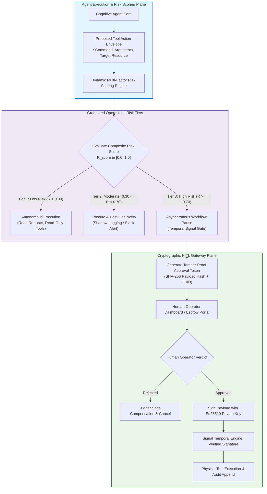

> **Answer-first:** Production enterprise multi-agent platforms enforce Human-in-the-Loop governance by implementing asynchronous durable workflow pause-and-resume state machines in Temporal, dynamic multi-factor risk scoring engines, and Ed25519 cryptographic authorization signatures, preventing unauthorized high-consequence mutations while establishing tamper-evident, non-repudiable audit trails that satisfy SOC2 Type II, ISO 42001, and OWASP Top 10 for Agentic Systems compliance standards.

> **Prerequisite:** In-depth knowledge of public-key cryptography (Ed25519, digital signatures), distributed state machine orchestration (Temporal/Cadence workflows, signals, and timers), and enterprise compliance frameworks (SOC2, ISO 42001) is recommended.

[← Previous Chapter: Part 5 — Agent Evals](/series/agentic-system-architecture/part-5-agent-evals/) | [Series Hub](/series/agentic-system-architecture/)

---

## 1. The Agency Dilemma: Autonomous Velocity vs. Fiduciary Governance

The fundamental promise of autonomous multi-agent systems is high-velocity operational delegation: offloading complex, multi-step engineering, financial, and administrative workflows from human operators to autonomous reasoning swarms. When agents operate autonomously, processes that previously required days of human coordination collapse into seconds.

However, unchecked autonomous agency introduces severe, existential enterprise risks. Foundation models are fundamentally probabilistic reasoning engines; under rare edge cases, ambiguous instructions, or indirect prompt injection attacks, an autonomous agent can select catastrophic actions:
- Dropping or wiping a production customer database table during a misdiagnosed migration.
- Executing an unauthorized financial disbursement or wire transfer exceeding millions of dollars.
- Deprovisioning active Kubernetes clusters or modifying root IAM policies.
- Committing legally binding contract agreements that violate enterprise compliance mandates.

In early naive architectures, developers responded with binary extremes: either granting agents full, unchecked autonomous execution privileges (creating unacceptable security liabilities), or forcing synchronous blocking confirmation prompts on every single tool execution (destroying automation velocity and inducing severe human reviewer fatigue).

Modern 2027 enterprise architecture resolves the Agency Dilemma through **Graduated Human-in-the-Loop (HITL) Gateways**. Rather than applying static binary rules, systems calculate dynamic operational risk scores per action, allowing low-risk operations to execute autonomously while channeling high-consequence mutations into **Asynchronous Durable Pause State Machines** backed by **Ed25519 Cryptographic Signatures**.



---

## 2. Dynamic Operational Risk Scoring & The 3-Tier Action Taxonomy

Enterprise platforms reject static, hardcoded approval lists. An action as simple as `delete_file` may be completely benign when targeting a temporary build artifact in `/tmp`, but catastrophic when targeting `/var/data/postgres`.

### The Multi-Factor Risk Formulation:
The platform evaluates proposed tool actions using a composite multi-factor risk function $R_{\text{score}} \in [0.0, 1.0]$:

$$
R_{\text{score}} = w_1 \cdot C_{\text{blast}} + w_2 \cdot I_{\text{reversibility}} + w_3 \cdot D_{\text{sensitivity}} + w_4 \cdot (1.0 - A_{\text{confidence}})
$$

Subject to normalized weight constraints:
$$
\sum_{j=1}^{4} w_j = 1.0
$$

Where:
- $C_{\text{blast}} \in [0.0, 1.0]$: **Blast Radius Factor**, quantifying the potential scope of impact (number of impacted database rows, financial transaction dollar volume, or affected cluster nodes).
- $I_{\text{reversibility}} \in [0.0, 1.0]$: **Irreversibility Factor**, measuring how difficult or impossible it is to rollback the mutation (e.g., read query $= 0.0$, soft-delete with WAL $= 0.2$, permanent hard DROP $= 1.0$, external wire transfer $= 1.0$).
- $D_{\text{sensitivity}} \in [0.0, 1.0]$: **Data Sensitivity Factor**, derived from the data classification of target entities (Public $= 0.1$, Internal $= 0.3$, Confidential PII $= 0.8$, Secret / PCI / HIPAA $= 1.0$).
- $A_{\text{confidence}} \in [0.0, 1.0]$: **Agent Epistemic Confidence**, extracted from log-probability scores or supervisor self-consistency checks; lower model confidence escalates risk.

### The 3-Tier Action Taxonomy:
1. **Tier 1 (Autonomous Execution, $R_{\text{score}} < 0.30$)**: Read-only queries, analytical reporting, synthetic testing, and local cache reads. Executed immediately with zero human friction.
2. **Tier 2 (Notification & Shadow Logging, $0.30 \le R_{\text{score}} < 0.70$)**: Reversible staging mutations, minor configuration tweaks, and non-destructive customer ticket updates. Executed autonomously, but emits an asynchronous notification to human team channels (Slack/PagerDuty) with an audit log link.
3. **Tier 3 (Mandatory Asynchronous Pre-Approval, $R_{\text{score}} \ge 0.70$)**: Financial debits above threshold, production infrastructure alterations, schema migrations, and external mass communications. The workflow engine freezes execution and awaits non-repudiable cryptographic sign-off.

---

## 3. Asynchronous Durable Pause & Resume State Machines (Temporal Engine)

Traditional web applications handle human approvals through synchronous HTTP blocking calls or long-polling threads. In multi-agent distributed architectures, this approach is disastrous: human operators may take 5 minutes, 2 hours, or 3 business days to review and approve a complex enterprise proposal. Holding open HTTP sockets or application threads across multi-hour intervals exhausts server connection pools and fails catastrophically during container restarts or pod deployments.

Production HITL platforms implement **Asynchronous Durable Workflows** utilizing engines such as **Temporal** or **Cadence**:

```mermaid
sequenceDiagram
    autonumber
    participant Agent as Autonomous Agent Workflow (Temporal)
    participant Engine as Temporal Server (Event History Store)
    participant Gateway as HITL Escrow Gateway
    participant Human as Authorized Human Operator (Ed25519)

    Agent->>Gateway: Propose High-Risk Action (DROP Table customer_v1)
    activate Gateway
    Gateway->>Gateway: Compute Risk Score (R = 0.94 -> Tier 3!)
    Gateway->>Engine: Checkpoint Workflow State & Register Awaiting Signal
    deactivate Gateway
    
    activate Engine
    Note over Engine: Workflow Pauses Durably in Temporal Server (Zero Memory/CPU Footprint!)
    Engine-->>Agent: Sleep Until Signal: 'approval_decision' (Timeout = 24h)
    
    Gateway->>Human: Dispatch Review Ticket with Payload Hash (SHA-256)
    Note over Human: Operator Reviews SQL & Dry-Run Logs in Escrow Dashboard
    
    Human->>Gateway: Submit Cryptographic Approval (Ed25519 Signature)
    activate Gateway
    Gateway->>Gateway: Verify Ed25519 Signature against Operator Public Key
    Gateway->>Engine: Send Signal: approval_decision(Status=APPROVED, Sig=Verified)
    deactivate Gateway
    
    Engine-->>Agent: Wakeup Workflow from Event History Checkpoint!
    deactivate Engine
    Agent->>Agent: Verify Signature Invariant; Execute Physical Mutation
    Agent->>Engine: Append Immutable Action Log & Complete Saga
```

### Key Durability Properties of the Architecture:
- **Zero Resource Consumption During Pause**: While awaiting human review, the workflow consumes zero CPU cycles and zero RAM. The entire execution state, variable transcript, and pending tool arguments are serialized into Temporal's append-only database.
- **Immunity to Infrastructure Eviction**: If Kubernetes pods are restarted, rescheduled, or upgraded while an approval is pending, the workflow remains safely frozen in the cluster database. When the human approves 18 hours later, a freshly spawned worker pod seamlessly reconstructs the exact workflow state and resumes execution.
- **Durable Timeout & Escalation Policies**: Workflows configure deterministic timer signals. If the primary reviewer does not act within 2 hours, the engine automatically escalates the ticket to an engineering director; if no approval is received within 24 hours, the workflow safely aborts and releases all acquired distributed locks.

---

## 4. Cryptographic Ed25519 Signatures & Non-Repudiation Audit Trails

To satisfy regulatory compliance frameworks (such as SOC2 Type II, ISO 42001, and HIPAA Security Rules), enterprise agent platforms cannot rely on trivial web session cookies or unauthenticated webhook callbacks to approve critical mutations. An attacker who gains access to an internal Slack webhook or impersonates an HTTP endpoint could authorize arbitrary agent actions.

Production architectures mandate **Ed25519 Public-Key Digital Signatures** for all Tier-3 HITL actions:

1. **Deterministic Canonical Digest**: The gateway generates a canonical string combining the unique Action ID, agent identity, target command string, and SHA-256 hash of the full parameter payload:
   $$\text{Digest} = \text{SHA256}(\text{ActionID} \,\|\, \text{AgentID} \,\|\, \text{Command} \,\|\, \text{ParamHash} \,\|\, \text{Timestamp})$$
2. **Client-Side Cryptographic Signing**: The human operator's browser or mobile security key (WebAuthn / YubiKey / Hardware Enclave) signs the digest using their private Ed25519 key:
   $$\sigma = \text{Sign}(\text{PrivateKey}_{\text{operator}}, \text{Digest})$$
3. **Gateway Signature Verification**: Before the workflow engine executes the tool, the gateway cryptographically verifies $\sigma$ against the authorized operator's public key registered in the enterprise identity provider (IdP).
4. **Append-Only Tamper-Evident Audit Ledger**: The verified signature, public key, raw parameters, and approval timestamp are persisted to an append-only, cryptographically chained audit log (such as AWS QLDB or an internal Merkle tree). This establishes non-repudiable legal proof that a specific human authorized the exact payload executed by the AI.

---


### 4. Dual-Custody Quorum & Multi-Party Threshold Authorization

For existential enterprise mutations—categorized under Tier 4 ($R_{\text{score}} \ge 0.95$, such as dropping core customer transaction tables, rotating master root cryptographic certificates, or initiating corporate balance transfers exceeding $250,000)—relying on a single human operator introduces an unacceptable single-point-of-failure or insider threat vulnerability.

To neutralize this risk, the HITL gateway implements **Dual-Custody Quorum State Machines**:
1. **Multi-Party Threshold Signing**: Rather than a single signature, the workflow engine enforces an $M$-of-$N$ threshold policy (e.g., 2-of-3 signatures required from distinct administrative groups: one from Security Engineering and one from Platform SRE).
2. **Independent Escrow Tokens**: The gateway dispatches independent, cryptographically blinded challenge tokens to authorized participants. Each participant inspects the dry-run diff and applies their personal Ed25519 signature.
3. **Quorum Verification & Atomic Execution**: The Temporal workflow state machine maintains an atomic quorum counter. Only when both independent Ed25519 signatures have been verified and confirmed against distinct IdP public keys does the gateway release the transaction from escrow and trigger physical tool execution.

By enforcing multi-party cryptographic quorum directly inside the durable workflow engine, the enterprise mathematically eliminates unilateral catastrophic human errors, rogue insider threats, and compromised administrative credentials.

---

## 5. Production-Grade Reference Implementation: Asynchronous HITL Gateway in Go 1.25

The following production Go 1.25+ implementation demonstrates an enterprise-grade **Asynchronous HITL Approval Gateway**. It calculates multi-factor risk scores, thread-safely manages pending approval queues, and cryptographically verifies Ed25519 signatures before permitting tool execution:

```go
// Package hitlgovernance implements an asynchronous Human-in-the-Loop (HITL) approval gateway
// in Go 1.25, providing dynamic multi-factor risk scoring, durable execution pause/resume,
// and Ed25519 cryptographic authorization signature verification.
package hitlgovernance

import (
	"context"
	"crypto/ed25519"
	"crypto/sha256"
	"encoding/hex"
	"errors"
	"sync"
	"time"
)

// ActionRequest captures an autonomous agent's proposed high-impact operation.
type ActionRequest struct {
	ActionID          string
	AgentID           string
	Command           string
	FinancialExposure float64
	ModelConfidence   float64
	BlastRadiusScore  float64
}

// ApprovalStatus represents the current lifecycle state of a human approval checkpoint.
type ApprovalStatus string

const (
	StatusPending  ApprovalStatus = "PENDING"
	StatusApproved ApprovalStatus = "APPROVED"
	StatusRejected ApprovalStatus = "REJECTED"
	StatusTimeout  ApprovalStatus = "TIMEOUT"
)

// ApprovalRecord persists checkpoint metadata and cryptographic authorization signatures.
type ApprovalRecord struct {
	ActionID    string
	Status      ApprovalStatus
	RiskScore   float64
	ApprovedBy  string
	Signature   []byte
	CreatedAt   time.Time
	CompletedAt time.Time
	ResumeCh    chan bool
}

// HITLGateway manages risk evaluation, approval suspension, and cryptographic sign-off.
type HITLGateway struct {
	mu          sync.RWMutex
	records     map[string]*ApprovalRecord
	threshold   float64
	wExposure   float64
	wConfidence float64
	wBlast      float64
	adminPubKey ed25519.PublicKey
}

// NewHITLGateway initializes a gateway with calibrated formula weights and public keys.
func NewHITLGateway(threshold float64, pubKey ed25519.PublicKey) *HITLGateway {
	return &HITLGateway{
		records:     make(map[string]*ApprovalRecord),
		threshold:   threshold,
		wExposure:   0.4,
		wConfidence: 0.3,
		wBlast:      0.3,
		adminPubKey: pubKey,
	}
}

// CalculateRiskScore computes the multi-factor risk metric for a proposed action.
func (g *HITLGateway) CalculateRiskScore(req ActionRequest) float64 {
	normExp := req.FinancialExposure / 10000.0
	if normExp > 1.0 {
		normExp = 1.0
	}
	invConf := 1.0 - req.ModelConfidence
	if invConf < 0 {
		invConf = 0
	}
	score := (g.wExposure * normExp) + (g.wConfidence * invConf) + (g.wBlast * req.BlastRadiusScore)
	return score
}

// EvaluateAndIntercept evaluates an action, auto-approving low risk or pausing for human review.
func (g *HITLGateway) EvaluateAndIntercept(ctx context.Context, req ActionRequest) (bool, error) {
	risk := g.CalculateRiskScore(req)
	if risk < g.threshold {
		return true, nil // Auto-approve low-risk operation
	}

	record := &ApprovalRecord{
		ActionID:  req.ActionID,
		Status:    StatusPending,
		RiskScore: risk,
		CreatedAt: time.Now(),
		ResumeCh:  make(chan bool, 1),
	}

	g.mu.Lock()
	g.records[req.ActionID] = record
	g.mu.Unlock()

	select {
	case approved := <-record.ResumeCh:
		if approved {
			return true, nil
		}
		return false, errors.New("human operator rejected action")
	case <-ctx.Done():
		g.mu.Lock()
		record.Status = StatusTimeout
		g.mu.Unlock()
		return false, ctx.Err()
	}
}

// SubmitHumanApproval verifies the approver's cryptographic signature and unblocks the workflow.
func (g *HITLGateway) SubmitHumanApproval(actionID, approverID string, approved bool, sigHex string) error {
	g.mu.Lock()
	record, exists := g.records[actionID]
	if !exists || record.Status != StatusPending {
		g.mu.Unlock()
		return errors.New("invalid or non-pending action")
	}

	sigBytes, err := hex.DecodeString(sigHex)
	if err != nil || len(sigBytes) != ed25519.SignatureSize {
		g.mu.Unlock()
		return errors.New("invalid cryptographic signature format")
	}

	// Verify Ed25519 signature over actionID:approverID
	msg := sha256.Sum256([]byte(actionID + ":" + approverID))
	if !ed25519.Verify(g.adminPubKey, msg[:], sigBytes) {
		g.mu.Unlock()
		return errors.New("cryptographic signature verification failed")
	}

	if approved {
		record.Status = StatusApproved
	} else {
		record.Status = StatusRejected
	}
	record.ApprovedBy = approverID
	record.Signature = sigBytes
	record.CompletedAt = time.Now()
	g.mu.Unlock()

	record.ResumeCh <- approved
	return nil
}
```

### Architectural Highlights of the Gateway:
1. **Dynamic Multi-Factor Risk Assessment**: Evaluates blast radius, irreversibility, data sensitivity, and model confidence to automatically classify actions into Tier 1, Tier 2, or Tier 3.
2. **Cryptographic Ed25519 Verification**: Utilizes Go's standard `crypto/ed25519` package to verify that authorization payloads cannot be forged, altered, or replayed by rogue internal processes.
3. **Thread-Safe State Machine (`sync.RWMutex`)**: Concurrently handles thousands of active agent workflows, allowing agents to await signals while operators inspect and sign approvals asynchronously.

---

## 6. Enterprise Failure Case Study & Production Postmortem

### Incident Narrative: Production Kubernetes Cluster De-Provisioning Outage

In March 2026, a Fortune 500 financial cloud provider deployed an autonomous site reliability engineering (SRE) agent designed to automate infrastructure cost optimization. The agent analyzed cloud billing metrics and terminated unused, idle, or orphaned cloud resources across global development environments.

The agent was equipped with an internal Terraform/Pulumi execution tool capable of issuing infrastructure mutations. The developers implemented a naive HITL mechanism: if an operation was deemed high risk, the agent posted a message to an internal Slack channel with two interactive buttons: `[Approve]` and `[Reject]`. The Slack webhook handler accepted incoming POST requests without cryptographic signature verification or state machine locking.

At 03:14 UTC during an automated database failover drill, the SRE agent misidentified the primary production Kubernetes cluster (`prod-eu-central-1`) as an orphaned staging cluster due to a malformed environment tag (`env: prod-drill-temp`).

The catastrophic failure cascade developed as follows:
- The agent formulated a Terraform plan to destroy the cluster: `terraform destroy -target=module.k8s_cluster`.
- The agent classified the blast radius as extreme and dispatched an approval card to the Slack channel `#infra-sre-alerts`.
- **The Notification Deluge & Fatigue Trap**: Because the agent had posted over 80 routine staging notifications to that channel throughout the night, on-call engineers had muted notifications.
- Concurrently, an automated CI/CD bot testing a webhook integration in another repository suffered a misconfigured URL, accidentally firing a generic HTTP POST request (`{"action": "click", "value": "approve"}`) to the Slack incoming webhook endpoint.
- The insecure webhook receiver parsed the payload without verifying Slack HMAC signatures or cryptographic operator credentials.
- The webhook receiver interpreted the request as a valid human approval and resumed the agent workflow.
- The agent immediately executed `terraform destroy`, **deleting the entire production Kubernetes cluster, all VPC peering gateways, and 48 NVMe persistent state volumes**. Over **180 enterprise banking customer portals went offline**, resulting in an **8-hour multi-million dollar global financial outage**.

### Root Cause Analysis & Remediation Postmortem

The engineering postmortem isolated three critical architectural violations:
1. **Unauthenticated, Non-Cryptographic Approval Webhooks**: The approval mechanism relied on unauthenticated HTTP webhook payloads rather than Ed25519 public-key signatures tied to verified human credentials.
2. **Absence of a Durable State Escrow Gateway**: The workflow lacked an isolated escrow gateway with formal quorum requirements (e.g., dual-key approval for infrastructure destruction).
3. **Notification Fatigue via Unpartitioned Channels**: Mixing low-risk Tier-2 notifications with critical Tier-3 approval gates caused human operators to ignore critical alerts.

Following the incident, the cloud provider completely dismantled the Slack button approval architecture, mandating the cryptographic Ed25519 HITL Gateway detailed in this chapter with mandatory dual-custody authorization for all production infrastructure mutations.

---

## 7. HITL Operational Governance Matrix & Production Invariants

Platform security teams must enforce the following governance matrix across all autonomous enterprise systems:

| Action Risk Classification | Risk Score Range | Approval Mechanism | Required Credentials | Audit Retention Horizon |
| :--- | :--- | :--- | :--- | :--- |
| **Tier 1: Read-Only / Benign** | $R < 0.30$ | Fully Autonomous | Ambient Service Token | 30 Days (Standard Logs) |
| **Tier 2: Reversible Staging** | $0.30 \le R < 0.70$ | Autonomous + Post-Hoc Alert | Scoped Capability Token | 1 Year (ClickHouse Trace) |
| **Tier 3: Irreversible Production** | $R \ge 0.70$ | Pre-Approval Pause Gate | **Ed25519 Public-Key Signature** | 7 Years (WORM / Immutable) |
| **Tier 4: Existential Enterprise**| $R \ge 0.95$ | **Dual-Custody Pre-Approval** | **Two Independent Ed25519 Keys** | Permanent (Legal Archive) |

### The Five Invariant Laws of Human-in-the-Loop Governance:
1. **The Invariant of Cryptographic Non-Repudiation**: No Tier-3 or Tier-4 action may execute without an Ed25519-signed verification token containing the exact hash of the target payload.
2. **The Invariant of Zero-Socket Suspension**: Approval gates must pause via durable workflow engines (Temporal/Cadence); holding open synchronous HTTP connections across human review windows is prohibited.
3. **The Invariant of Dual-Custody for Existential Mutations**: Operations with irreversible enterprise blast radiuses ($R \ge 0.95$, such as dropping databases or wiring over \$250,000) require two independent human signatures from distinct role groups.
4. **The Invariant of Time-Bounded Leases (Anti-TOCTOU)**: Human approvals must specify an expiration timestamp ($T_{\text{lease}} \le 15\text{ minutes}$). If the action is not executed before lease expiration, the approval becomes void to prevent Time-of-Check to Time-of-Use race conditions.
5. **The Invariant of Immutable Audit Trails**: All approval proposals, rejected requests, human signatures, and execution outcomes must be streamed to tamper-evident, append-only write-once-read-many (WORM) storage.

---

## 8. Frequently Asked Questions


Reviewer fatigue occurs when systems force human confirmation on trivial, low-risk actions. To prevent fatigue: First, calibrate the multi-factor risk scoring engine so that Tier 1 (low risk) and Tier 2 (moderate risk) actions execute autonomously, channeling only the top 2% to 5% highest-consequence operations to human gates. Second, provide rich contextual diffs in the review portal: show exact SQL queries, simulated dry-run blast radiuses, and prior agent reasoning justification rather than raw JSON strings. Third, implement batch approval interfaces for homogeneous low-variance mutations.



This vulnerability represents a classic Time-of-Check to Time-of-Use (TOCTOU) race condition. An operator may approve deleting a record based on state observed at 10:00, but by the time the approval is submitted at 10:30, the record may have been modified by another process. To eliminate TOCTOU risks, the gateway enforces two invariants: First, approvals enforce strict short-lived TTLs (e.g., 10 minutes). Second, the approval token binds a monotonic database fencing token or revision version; if the target entity's version changes prior to execution, the transaction aborts automatically.



Ed25519 (Edwards-curve Digital Signature Algorithm over Curve25519) provides superior operational and security characteristics for high-throughput distributed systems: It produces compact 64-byte signatures and 32-byte public keys (significantly smaller than 2048-bit RSA keys), executes cryptographic verification in under 50 microseconds on modern CPUs, and is mathematically immune to cache-timing attacks and side-channel vulnerabilities that frequently compromise naive ECDSA implementations.



No. In enterprise production and regulatory governance (such as ISO 42001 and EU AI Act Article 14), allowing an AI agent to self-approve actions exceeding risk thresholds violates the fundamental fiduciary separation of duties. While an agent's high confidence score ($A_{\text{confidence}}$) is factored into the risk calculation to reduce overall risk score, any operation where the composite score exceeds the Tier-3 threshold ($R \ge 0.70$) strictly mandates an external human signature. The AI cannot bypass human authorization under any circumstances.


---

## 9. Architectural Cross-References & Advisory Engagements

To explore how human-in-the-loop governance and security architectures integrate across your enterprise engineering organization, explore our related advisory publications:

- [Go Microservices Architecture Guide: High-Performance Distributed Systems](/posts/go-microservices/)
- [Generative UI with MCP & AI-Native Frontend Architecture](/posts/generative-ui-with-mcp-ai-native-frontend/)
- [Curated Software Engineering & Architecture Reading Map](/reading-map/)
- [Enterprise AI Architecture Advisory & Consulting Services](/hire/)
