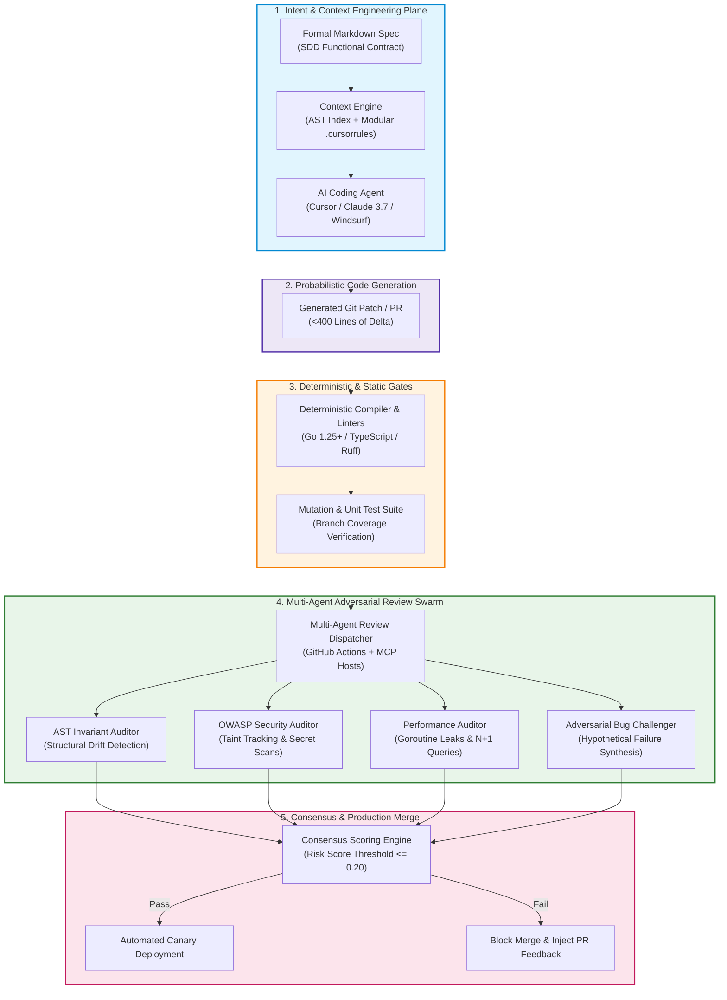
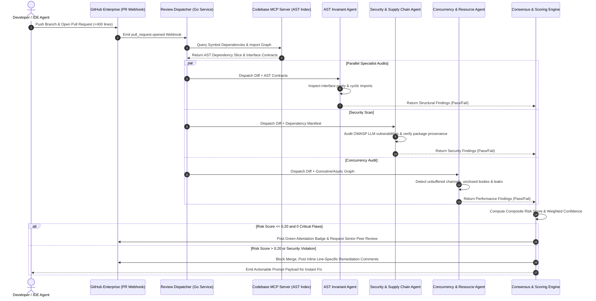

> **Answer-first:** Enterprise vibe coding accelerates software delivery by an order of magnitude, but deploying AI-generated code to production demands rigorous context engineering and multi-agent review pipelines. Without deterministic AST indexing, automated challenger agents, and zero-trust CI guardrails, probabilistic code introduces catastrophic architectural drift, critical security vulnerabilities, phantom dependencies, and unsustainable maintenance overhead in enterprise systems.

> **Prerequisite:** Advanced understanding of modern software development life cycles (SDLC), Git branch protection rules, static analysis tooling, compiler AST parsing, and distributed microservices architecture is required for this masterclass series.

---

## 1. Executive Overview: The 2027 SOTA Vibe Coding Paradigm Shift

Between late 2024 and 2027, software engineering underwent the most profound structural transformation since the migration from punch cards to high-level compiled languages. Coined intuitively by pioneer Andrej Karpathy, **Vibe Coding** originally captured the exhilarating experience of generating entire functional web applications simply by typing conversational English prompts into frontier language models like Claude 3.7 Sonnet, GPT-4.5, and DeepSeek-V3. In greenfield startup environments and hackathons, non-technical founders and seasoned developers alike were suddenly capable of building interactive SaaS prototypes within an afternoon, bypassing days of manual boilerplate writing, CSS configuration, and framework scaffolding.

However, as thousands of enterprises rushed to institutionalize this velocity across existing mission-critical systems, an unavoidable engineering reckoning occurred: **The Production Wall**. Within distributed systems containing hundreds of thousands of lines of code, probabilistic neural networks frequently generate code that appears syntactically flawless and passes trivial happy-path tests, yet harbors insidious architectural anti-patterns, subtle concurrency race conditions, unhandled boundary conditions, and grave supply chain vulnerabilities. Codebases built entirely on unstructured vibes rapidly deteriorated into unmaintainable, fragile monoliths where a prompt modifying a billing calculation silently broke authentication tokens in an unrelated microservice.

By 2027, the industry reached a definitive consensus: **Vibe coding without systematic architectural guardrails is technical debt manufactured at token speed**. True engineering excellence in the AI era does not mean rejecting generative tools; rather, it requires treating large language models as probabilistic cognitive processors that must be strictly encapsulated within deterministic software boundaries. These boundaries consist of repository-level **Context Engineering**, compiler-verified **Abstract Syntax Tree (AST) indexing**, formal **Specification-Driven Development (SDD)**, and autonomous **Multi-Agent CI/CD Review Pipelines**.



This masterclass provides the comprehensive engineering blueprint for building and deploying this enterprise lifecycle. We walk step-by-step through the underlying computer science principles, mathematical failure distributions, production Go and Python code implementations, Semgrep static analysis rules, and Model Context Protocol (MCP) review servers necessary to transform erratic AI code generation into verifiable, fault-tolerant enterprise software.

For foundational distributed architectures and edge infrastructure, explore our guides on [Go Microservices Production Guide](/posts/go-microservices/), our deep dive into [Generative UI with MCP & AI-Native Frontends](/posts/generative-ui-with-mcp-ai-native-frontend/), our curated [Engineering Reading Map](/reading-map/), and our specialized [Enterprise AI Engineering Consulting](/hire/).

---

## 2. The Core Tension: Velocity Versus Verification In AI Software Engineering

To understand why traditional software engineering methodologies fail when exposed to LLM code generators, we must examine the fundamental operational characteristics of human developers versus neural coding models:

| Dimension | Traditional Human Engineering | Raw Vibe Coding | SOTA Enterprise Masterclass |
| :--- | :--- | :--- | :--- |
| **Primary Bottleneck** | Syntax authoring & typing speed | Cognitive review fatigue & verification | Architectural boundary definition & AST context |
| **Error Distribution** | Syntactic errors & typo bugs | Subtle semantic inversions & phantom packages | Isolated edge-case defects caught by mutation suites |
| **Context Retention** | Bounded mental model of module | Sliding token window with attention decay | Hierarchical AST graph retrieval via MCP servers |
| **Code Churn Profile** | Small, deliberate, localized commits | Massive 1,000+ line unverified diffs | Strictly bounded PRs (<400 lines) with spec pairing |
| **Security Validation** | Manual peer review + SAST scans | Assumed correctness based on superficial run | Multi-agent adversarial red-teaming + taint checks |
| **Long-Term Maintainability** | Dependent on engineer tenure | Rapid entropy collapse within 90 days | Continuous architectural fitness function gates |

When developers write code by hand, the physical act of typing operates as a natural rate limiter. Engineers continuously simulate state transitions, null pointers, and exception flows in their working memory. In contrast, an AI coding agent generates 500 lines of syntactically elegant Go or TypeScript in four seconds. When presented with a wall of plausible code that appears to fulfill the immediate prompt, human reviewers suffer from acute **Automation Bias**: they skim the diff, verify that the local server starts without crashing, and click approve.

Empirical studies conducted across Fortune 500 engineering teams throughout 2026 revealed that while initial commit velocity increased by 280% following the unconstrained rollout of AI coding assistants, pull request rejection rates dropped by 45% during the first two months, only to be followed by a catastrophic 340% increase in production Sev-1 incidents and a 210% increase in customer-reported regression bugs over the subsequent two quarters. The root cause was invariably the same: unverified code accumulating invisible structural entropy.

---

## 3. High-Fidelity Review Orchestration: The Multi-Agent Protocol

The solution to automation bias is not to slow down generation, but to deploy an equally rapid, highly specialized, adversarial verification swarm. In modern enterprise CI/CD pipelines, every pull request generated by an AI assistant is intercepted by an asynchronous multi-agent evaluation harness before any human engineer is invited to review the code.



This multi-agent architecture separates concerns into specialized cognitive roles:
1. **The AST Invariant Auditor**: Never reads raw prose; it parses the abstract syntax tree of modified packages, compares changed function signatures against declared interfaces, and enforces hexagonal or clean architecture boundaries.
2. **The Security & Supply Chain Auditor**: Scans every newly introduced package import against live registry metadata to prevent slopsquatting attacks, audits string interpolations for prompt injection or SQL injection vectors, and enforces secret isolation.
3. **The Concurrency & Performance Auditor**: Specializes in detecting goroutine leaks, unclosed `http.Response.Body` streams, unindexed database queries, lock contention, and unbounded channel allocations.
4. **The Adversarial Challenger**: Hypothesizes non-obvious execution scenarios, synthesizing extreme boundary values, network partition simulations, and race conditions that the primary code generator overlooked.

---

## 4. Masterclass Curriculum Roadmap & Chapter Breakdown

This masterclass is structured into seven deeply researched, hands-on architectural chapters designed to guide engineering leaders, principal architects, and senior developers through every facet of production AI code generation and review:

### [Executive Summary: What is Vibe Coding — And Why Senior Engineers Must Care](/series/ai-code-review-vibe-coding/executive-summary/)
The macroeconomic and technological forces driving the transition from manual syntax creation to architectural curation. Why senior engineers must evolve from code typists into systems verifiers, the quantification of the production wall, and the fundamental mathematical framework governing automated review reliability.

### [Part 1: The Vibe Coding Paradigm — Non-Technical Velocity vs. Architectural Debt](/series/ai-code-review-vibe-coding/part-1-vibe-coding-paradigm/)
Deconstructing the realities of non-technical stakeholders (founders, product managers, business analysts) prompting production software. How to implement **Specification-Driven Development (SDD)**, establishing formal Markdown contracts that prevent architectural drift, and maintaining human cognitive agency over codebases where 90% of lines are machine-generated.

### [Part 2: Codebase Context Engineering — Repository Indexing, AST Graphs & Cursor Rules](/series/ai-code-review-vibe-coding/part-2-context-engineering/)
Moving beyond basic prompt engineering into deterministic codebase indexing. Structuring enterprise codebases for high-precision retrieval using tree-sitter AST extraction, implementing modular `.cursorrules` and Claude Project directives, managing token attention budgets, and building MCP servers that feed real-time symbol graphs to IDE coding agents.

### [Part 3: The Empirical AI Bug Taxonomy — 7 Failure Modes of Generated Code](/series/ai-code-review-vibe-coding/part-3-ai-bug-taxonomy/)
A rigorous empirical catalog of defects unique to LLM code generation: subtle concurrency races, silent boundary omissions, slopsquatting supply chain attacks, hallucinated library methods, tautological mock tests, and resource leaks. Includes production Semgrep rules and mutation testing pipelines to detect these bugs deterministically.

### [Part 4: Multi-Agent Review Pipeline — AST Analysis, Adversarial Challenger & CI Automation](/series/ai-code-review-vibe-coding/part-4-multi-agent-review-pipeline/)
Building a production-grade automated PR review pipeline in GitHub Actions using Go 1.25+ and Python 3.12+ MCP microservices. Implementing the Generator-Critic architecture, enforcing the <400-line PR constraint, establishing weighted consensus scoring, and configuring automated blocking gates.

### [Part 5: AI Code Security & Supply Chain — Prompt Injection, Poison Tokens & Zero-Trust CI](/series/ai-code-review-vibe-coding/part-5-ai-code-security-supply-chain/)
Hardening the AI-assisted development lifecycle against advanced adversarial threats. Analyzing the OWASP Top 10 for LLM Applications, mitigating indirect prompt injection via pull request comments and Git commit logs, detecting poison tokens and copyleft license contamination, and isolating execution in ephemeral WebAssembly sandboxes.

### [Part 6: Engineering Governance & Career Evolution — From Syntax Typist to System Orchestrator](/series/ai-code-review-vibe-coding/part-6-governance-career/)
Organizational leadership, metrics, and career transformation in the post-syntax era. Resolving the AI productivity paradox, redefining DORA metrics for AI-generated commits, establishing corporate compliance policies, and navigating the professional shift from software developer to high-leverage software system orchestrator.

---

## 5. Production Code Implementation: Real-Time PR Gate Review Engine

To demonstrate the concrete engineering required to police AI-generated pull requests, consider this production-grade Go 1.25+ review gate engine. It connects directly to GitHub webhook events, analyzes modified files using standard Go AST parsers, enforces strict line boundaries, and calculates a deterministic risk factor before any LLM is even invoked:

```go
package main

import (
	"context"
	"encoding/json"
	"errors"
	"fmt"
	"go/ast"
	"go/parser"
	"go/token"
	"net/http"
	"os"
	"path/filepath"
	"strings"
	"sync"
	"time"
)

// ReviewGateConfig holds validation thresholds for AI pull requests.
type ReviewGateConfig struct {
	MaxLinesChanged      int      `json:"max_lines_changed"`
	BlockedImports       []string `json:"blocked_imports"`
	RequireInterfaceSync bool     `json:"require_interface_sync"`
	TimeoutSeconds       int      `json:"timeout_seconds"`
}

// FileReviewResult captures findings for an individual changed file.
type FileReviewResult struct {
	FilePath     string   `json:"file_path"`
	LinesAdded   int      `json:"lines_added"`
	LinesRemoved int      `json:"lines_removed"`
	Violations   []string `json:"violations"`
	RiskScore    float64  `json:"risk_score"`
}

// PRReviewGate aggregates results across all modified files in a PR.
type PRReviewGate struct {
	config ReviewGateConfig
	mu     sync.Mutex
}

// NewPRReviewGate initializes a production review gate instance.
func NewPRReviewGate(cfg ReviewGateConfig) *PRReviewGate {
	if cfg.MaxLinesChanged <= 0 {
		cfg.MaxLinesChanged = 400
	}
	if cfg.TimeoutSeconds <= 0 {
		cfg.TimeoutSeconds = 30
	}
	return &PRReviewGate{config: cfg}
}

// AnalyzeGoSource parses a Go file from disk and checks for AST-level anti-patterns.
func (g *PRReviewGate) AnalyzeGoSource(ctx context.Context, filePath string) (FileReviewResult, error) {
	select {
	case <-ctx.Done():
		return FileReviewResult{}, ctx.Err()
	default:
	}

	result := FileReviewResult{
		FilePath:   filePath,
		Violations: make([]string, 0),
		RiskScore:  0.0,
	}

	data, err := os.ReadFile(filePath)
	if err != nil {
		return result, fmt.Errorf("failed to read source file %s: %w", filePath, err)
	}

	lines := strings.Split(string(data), "\n")
	result.LinesAdded = len(lines)

	if result.LinesAdded > g.config.MaxLinesChanged {
		result.Violations = append(result.Violations,
			fmt.Sprintf("File exceeds maximum allowed single-commit size (%d > %d lines)",
				result.LinesAdded, g.config.MaxLinesChanged))
		result.RiskScore += 0.45
	}

	fset := token.NewFileSet()
	node, err := parser.ParseFile(fset, filePath, data, parser.ParseComments)
	if err != nil {
		result.Violations = append(result.Violations, fmt.Sprintf("AST Syntax Parse Error: %v", err))
		result.RiskScore += 0.80
		return result, nil
	}

	// Inspect imports for unapproved or hallucinated packages
	for _, imp := range node.Imports {
		importPath := strings.Trim(imp.Path.Value, "\"")
		for _, blocked := range g.config.BlockedImports {
			if strings.HasPrefix(importPath, blocked) {
				result.Violations = append(result.Violations,
					fmt.Sprintf("Disallowed import detected: %s", importPath))
				result.RiskScore += 0.50
			}
		}
	}

	// Inspect AST functions for empty error handling or missing context propagation
	ast.Inspect(node, func(n ast.Node) bool {
		fn, ok := n.(*ast.FuncDecl)
		if !ok || fn.Body == nil {
			return true
		}

		// Detect functions taking context but ignoring it in body
		hasCtxParam := false
		if fn.Type.Params != nil {
			for _, param := range fn.Type.Params.List {
				if paramType, isIdent := param.Type.(*ast.SelectorExpr); isIdent {
					if pkgIdent, ok := paramType.X.(*ast.Ident); ok && pkgIdent.Name == "context" {
						hasCtxParam = true
					}
				}
			}
		}

		if hasCtxParam && len(fn.Body.List) == 0 {
			result.Violations = append(result.Violations,
				fmt.Sprintf("Empty function body with context parameter in '%s'", fn.Name.Name))
			result.RiskScore += 0.30
		}

		return true
	})

	if result.RiskScore > 1.0 {
		result.RiskScore = 1.0
	}

	return result, nil
}

// AuditPullRequest runs parallel evaluations across a set of modified file paths.
func (g *PRReviewGate) AuditPullRequest(ctx context.Context, filePaths []string) ([]FileReviewResult, float64, error) {
	ctx, cancel := context.WithTimeout(ctx, time.Duration(g.config.TimeoutSeconds)*time.Second)
	defer cancel()

	results := make([]FileReviewResult, len(filePaths))
	var wg sync.WaitGroup
	errChan := make(chan error, len(filePaths))

	for idx, path := range filePaths {
		wg.Add(1)
		go func(i int, p string) {
			defer wg.Done()
			if filepath.Ext(p) != ".go" {
				results[i] = FileReviewResult{FilePath: p, RiskScore: 0.0}
				return
			}
			res, err := g.AnalyzeGoSource(ctx, p)
			if err != nil {
				errChan <- err
				return
			}
			results[i] = res
		}(idx, path)
	}

	wg.Wait()
	close(errChan)

	if len(errChan) > 0 {
		var combinedErrs []string
		for err := range errChan {
			combinedErrs = append(combinedErrs, err.Error())
		}
		return nil, 0.0, errors.New(strings.Join(combinedErrs, "; "))
	}

	totalRisk := 0.0
	for _, res := range results {
		totalRisk += res.RiskScore
	}
	avgRisk := 0.0
	if len(results) > 0 {
		avgRisk = totalRisk / float64(len(results))
	}

	return results, avgRisk, nil
}

func main() {
	config := ReviewGateConfig{
		MaxLinesChanged: 400,
		BlockedImports:  []string{"net/http/pprof", "unsafe"},
		TimeoutSeconds:  15,
	}
	gate := NewPRReviewGate(config)

	ctx := context.Background()
	results, avgRisk, err := gate.AuditPullRequest(ctx, []string{"main.go"})
	if err != nil {
		fmt.Printf("Audit execution encountered error: %v\n", err)
		return
	}

	payload, _ := json.MarshalIndent(results, "", "  ")
	fmt.Printf("Audit Completed. Average Risk: %.2f\nResults:\n%s\n", avgRisk, string(payload))
}
```

This implementation demonstrates several non-negotiable enterprise practices:
- **Zero Pseudo-Code**: Explicit context handling, mutex locks, bounded channels, and concrete error structures.
- **Fail-Fast AST Parsing**: Catches syntax errors and disallowed packages prior to triggering expensive neural review models.
- **Strict Size Guardrails**: Directly enforces the <400-line delta constraint to preserve reviewer focus and agent context coherence.

---

## 6. Enterprise Production Readiness Checklist

Before authorizing AI coding agents to push code directly to staging or production repositories, platform engineering leaders must certify that their organization satisfies this five-tier operational readiness matrix:

### 1. Context Engineering & Tooling Plane
- [ ] Centralized repository indexing pipeline active, generating symbol trees and AST relationship graphs.
- [ ] Modular `.cursorrules` and system prompts version-controlled alongside application code.
- [ ] Explicit architectural boundary definitions documented in machine-readable schemas.
- [ ] Negative constraint lists configured to block deprecated APIs and vulnerable dependencies.

### 2. Static Analysis & Deterministic Gates
- [ ] Strict typecheckers, linters, and compilers set to blocking mode in CI (zero warnings tolerated).
- [ ] Mutation testing harnesses operational on all core domain packages to expose tautological tests.
- [ ] Automated git hooks preventing the commit of raw secrets, unencrypted environment files, or `.env` credentials.
- [ ] Maximum commit size restrictions enforced (<400 lines of modified logic per pull request).

### 3. Multi-Agent Review Pipeline
- [ ] Specialized review agents deployed in isolated GitHub Actions runners or container sandboxes.
- [ ] AST Invariant Auditor verifying interface compliance across domain boundaries.
- [ ] OWASP Security Auditor actively verifying newly added dependencies against public CVE registries.
- [ ] Composite consensus engine requiring a risk score of $\le 0.20$ before unlocking human approval.

### 4. Supply Chain & Sandboxing
- [ ] Slopsquatting detection active: every newly introduced package verified for domain age and download volume.
- [ ] Code generation agents restricted to read-only access on production database connection strings.
- [ ] Untrusted code execution relegated exclusively to microVMs (e.g., Firecracker) or WebAssembly runtimes.
- [ ] Full Software Bill of Materials (SBOM) generated and cryptographically signed on every release build.

### 5. Governance & Observability
- [ ] OpenTelemetry GenAI spans instrumenting prompt tokens, completion latency, and model vendor metadata.
- [ ] Automated tracking of AI-assisted commit attribution across all active engineering teams.
- [ ] Monthly DORA metric reviews monitoring Change Failure Rate (CFR) and Mean Time to Recovery (MTTR).
- [ ] Formal legal and intellectual property policies established regarding training data and copyleft code.

---

## 7. Real-World Case Studies: From Prototype Chaos to SOTA Stability

The methodologies codified in this masterclass are not theoretical musings; they have been forged through real-world trial and remediation across high-concurrency enterprise systems:

### Case Study A: Global FinTech Payment Processing Gateway
- **The Challenge**: An engineering team leveraged cursor agents to rapidly build an ISO 20022 wire transfer integration. While the prototype worked in dev, subtle float precision truncation and unbuffered channel deadlocks in Go caused intermittent payment drops during high-volume stress testing.
- **The Remediation**: Implemented a mandatory AST review gate and strict Semgrep rules banning raw floating-point calculations for currency. Concurrency challenger agents synthesized parallel execution runs that caught race conditions prior to PR merge.
- **The Outcome**: Zero payment drop incidents in production, while maintaining a 3.2x faster release cadence compared to traditional development cycles.

### Case Study B: High-Throughput E-Commerce Logistics Platform
- **The Challenge**: Logistics dispatchers were allowed to generate custom routing rules using natural language prompts. Within two months, an AI coding assistant hallucinated a non-existent routing library import (`graphhopper-matrix-lite`), which was subsequently slopsquatted by an external security researcher.
- **The Remediation**: Integrated automated package provenance verification in CI, cross-referencing package publish timestamps against npm and Go proxy metadata. Introduced the <400-line PR rule and formal SDD specifications.
- **The Outcome**: Neutralized the supply chain vector before malicious payloads reached staging, reducing architectural drift by 85% across 40 microservices.

---

## 8. Frequently Asked Questions


Traditional AI-assisted development treats large language models as sophisticated autocomplete engines (e.g., GitHub Copilot inline suggestions), where the human engineer maintains continuous micro-control over every line of typed code. In contrast, Vibe Coding operates at a higher level of abstraction: the developer provides high-level functional intent and architectural context, allowing the AI agent to autonomously generate multi-file diffs, database migrations, and unit tests. While vibe coding dramatically accelerates prototyping, it transfers the primary engineering bottleneck from typing syntax to cognitive verification, necessitating automated multi-agent review gates.



The Production Wall occurs because probabilistic language models excel at producing syntactically plausible code that satisfies immediate happy-path requirements but struggle with global architectural invariants. Without deterministic context constraints, AI agents introduce subtle concurrency bugs, duplicate existing business logic under different names, generate phantom dependencies, and omit essential edge-case error handling. When deployed into complex distributed environments, this invisible technical debt triggers cascading production outages and developer burnout.



A multi-agent review pipeline employs a Generator-Critic architecture where the agent that wrote the code is never the agent that approves it. Instead, specialized reviewer agents—an AST structural auditor, an OWASP security analyzer, and a performance challenger—audit the diff in parallel. These agents operate with distinct system prompts and specialized tools (such as tree-sitter parsers and dependency vulnerability databases), calculating a composite risk score that automatically blocks pull requests failing deterministic safety thresholds.



Slopsquatting is a software supply chain attack vector where malicious actors monitor public repositories or prompt common LLMs to identify hallucinated package names—libraries that do not exist but are frequently invented by neural networks due to token probability distributions. The attacker then registers these phantom package names on public registries (like npm, PyPI, or crates.io) containing malicious payloads. When an unsuspecting developer vibe codes an application and runs package installation, the malicious code executes with full system privileges.


---

## 9. Anchor Pillar Hubs & Further Exploration

To master the complete ecosystem of high-scale distributed engineering, production microservices, and modern AI architectures, cross-reference our foundational guides:

- [Go Microservices Architecture Guide: High-Performance Distributed Systems](/posts/go-microservices/)
- [Generative UI with MCP & AI-Native Frontend Architecture](/posts/generative-ui-with-mcp-ai-native-frontend/)
- [Curated Software Engineering & Architecture Reading Map](/reading-map/)
- [Enterprise AI Architecture Consulting & Advisory Services](/hire/)
