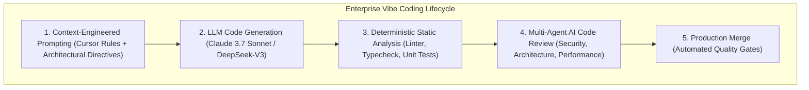

> **Answer-first:** "Vibe Coding" accelerates initial prototyping by 10x, but without rigorous **Context Engineering** and **Automated AI Code Review Pipelines**, it introduces severe technical debt, security vulnerabilities (OWASP LLM Top 10), and subtle logic bugs. This series provides an engineering framework to transform rapid AI code generation into verifiable, production-ready enterprise software.

---
## 🎯 Series Overview: Balancing Velocity with Rigor

The 2026 software engineering landscape is defined by a paradox:
1. **Unprecedented Velocity:** Non-technical founders and senior engineers alike can prompt an entire full-stack application into existence within hours.
2. **The Verification Crisis:** AI-generated code is prone to silent hallucinations, phantom packages, security misconfigurations, and subtle concurrency race conditions.

---

## 🗺️ Masterclass Chapters

- **[Executive Summary: What is Vibe Coding — And Why Senior Engineers Must Care](/series/ai-code-review-vibe-coding/executive-summary/)**  
  *The paradigm shift from manual typing to context curation and adversarial code verification.*
- **[Part 1: Vibe Coding for Leaders — Turning Intent into Working Software](/series/ai-code-review-vibe-coding/part-1-vibe-coding-non-technical/)**  
  *How engineering leaders and product managers leverage AI coding agents without technical compromise.*
- **[Part 2: Context Engineering — Structuring Codebases for Maximum AI Precision](/series/ai-code-review-vibe-coding/part-2-context-engineering-codebase/)**  
  *Modular `.cursorrules`, semantic indexing, and architectural constraints that eliminate AI hallucinations.*
- **[Part 3: The AI Bug Taxonomy — 7 Failure Modes of Generated Code](/series/ai-code-review-vibe-coding/part-3-ai-bug-taxonomy/)**  
  *Identifying phantom dependencies, subtle edge-case omissions, and semantic drift.*
- **[Part 4: Building a Multi-Agent AI Code Review Pipeline](/series/ai-code-review-vibe-coding/part-4-review-pipeline-multi-agent/)**  
  *Orchestrating specialized review agents in GitHub Actions to audit PRs automatically.*
- **[Part 5: AI Code Security — OWASP LLM Top 10 & Supply-Chain Hardening](/series/ai-code-review-vibe-coding/part-5-ai-code-security/)**  
  *Detecting prompt injection attacks, malicious package hallucinations, and insecure secrets handling.*
- **[Part 6: Governance, Observability & The Future of Engineering Careers](/series/ai-code-review-vibe-coding/part-6-governance-observability-career/)**  
  *How engineering organizations scale safely with AI metrics, quality scorecards, and evolving engineering roles.*
