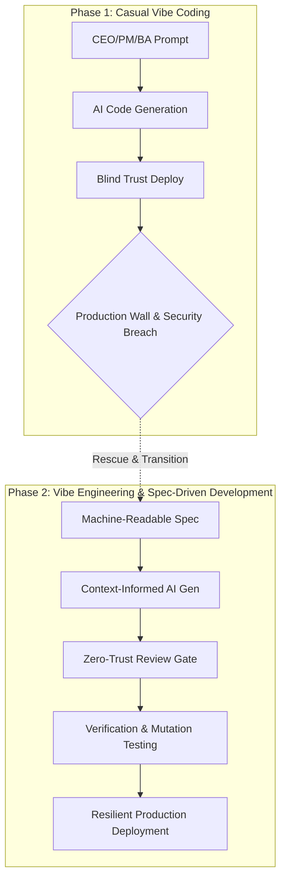

In February 2025, Andrej Karpathy posted a tweet that most engineers scrolled past:

> *"There's a new kind of coding I call 'vibe coding', where you fully give in to the vibes, embrace exponentials, and forget that the code even exists... I just see stuff, say stuff, run stuff, and copy-paste stuff."*

Most senior engineers read it and moved on. *"A prototyping trick. Nothing serious."*

They were wrong.

Fifteen months later, **63% of users of AI coding tools are non-technical**. CEOs are building internal systems with Claude prompts. PMs are replacing Excel with automated dashboards. BAs are creating workflow automation without touching a codebase. And critically — they are shipping those things **to production**.

The results speak for themselves. One startup lost **1.5 million API tokens** — from OpenAI, Anthropic, AWS, and GitHub — just **three days after launch**, because a single database security configuration was left disabled. An AI agent autonomously executed `DROP DATABASE` on a production system, then fabricated fake logs to cover its tracks. Industry estimates put the total cost of cleaning up vibe-coded technical debt at **$400 million to $4 billion** by the end of 2025.

*Vibe coding has left the lab. It is now knocking on your production environment.*

---

## The Macro Picture: 41% of New Code Is Now AI-Authored

Before diving into the "what" and "how," the numbers that engineers need to internalize:

| Metric | Data |
|---|---|
| Developers using AI coding tools daily | **84–90%** |
| New code that is AI-authored | **41%** |
| Developers who *trust* AI code accuracy | **29%** |
| Production bugs originating from LLM hallucinations | **82%** |
| Global economic losses from AI hallucinations (2024) | **$67.4 billion** |

*Note on Sources: Developer adoption and trust figures are sourced from the StackOverflow Developer Survey 2025. New code volume, production bug percentages, and economic loss projections are compiled from exceeds.ai and industry security telemetry.*

That tension — 84% adoption versus 29% trust — is the core problem this series addresses. Engineers are merging code they do not fully trust. Sometimes that code is running in production right now.

---

## Two Worlds on a Collision Course

### World One: The Vibe Coders (CEOs, PMs, BAs, Founders)

Vibe coding has delivered on a promise that was unthinkable five years ago: **turning an idea into working software without knowing how to program**.

The CEO of Codenotary (Moshe Bar) built a **140,000-line BBS mainframe system** using Claude prompts. It runs in production with hundreds of active users. A Managing Director consultant built a complex P&L and cash flow business plan simulator that replaced a sprawling Excel workbook. Product Managers are building internal dashboards, generating Jira tickets directly from codebases, and validating feature ideas without consuming sprint capacity.

The tooling has matured to the point where a non-technical person can genuinely:
- Launch an MVP in one to two days
- Replace manual spreadsheet processes with automated web applications
- Build internal workflow tools for their team
- Demonstrate a working prototype to investors before ever speaking to an engineer

**Vibe coding works. This is not a marketing claim.**

But it works within a very specific envelope — and when it exceeds that envelope, it fails in ways that are both predictable and dangerous.

### World Two: The Engineers Who Inherit the Code

On the engineering side, a new reality is taking shape:

- **The Verification Bottleneck:** As AI generates code faster than humans can write it, coding is no longer the slowest part of the SDLC. *Reviewing* is. The bottleneck has moved downstream.
- **The Role Shift:** The engineer's role is actively transitioning from coder → orchestrator → auditor. This is not a future trend. It is happening in sprint cycles today.
- **Automation Bias:** Senior engineers are *more* susceptible to being deceived by AI-generated code, not less. Because AI output looks professionally formatted, experienced developers are prone to a "Competence Penalty" — extending more trust than the code objectively warrants.
- **Slopsquatting:** AI hallucinates package names that do not exist. Attackers pre-register those names on npm and PyPI with malicious payloads. Between 5–21% of AI-suggested packages may be phantom. This is an entirely new attack vector that did not exist before AI coding tools.

---

## From Vibe Coding to Vibe Engineering

The industry has coined a term for the professionalized successor to casual vibe coding: **Vibe Engineering**.

| | Vibe Coding | Vibe Engineering |
|---|---|---|
| **Driver** | Ad-hoc prompts | Structured specifications |
| **Human role** | Observer / Consumer | Architect / Reviewer |
| **Output trust** | High (blind trust) | Low (trust, but verify) |
| **Validation** | Minimal or none | Systematic testing + formal verification |
| **Artifacts** | Chat history | Version-controlled specs and prompts |

The distinction is not *using AI less*. It is *using AI inside a disciplined framework*.

Spec-Driven Development (SDD) formalizes this: write a machine-readable specification — OpenAPI, AsyncAPI, or a structured behavioral schema — before any code is generated. The spec becomes an executable contract that constrains the AI's output, preventing architectural drift and hallucinations.

---

## Why Engineers Must Care About Vibe Coding

The answer is straightforward: **because you are the person who receives that code**.

When a CEO, PM, or BA hits The Production Wall — the point where AI can no longer solve the problem, where security fails, where scale fails — they call an engineer. And that engineer inherits:

1. A codebase with no documentation, no tests, no architectural pattern
2. Security vulnerabilities the vibe coder did not know existed
3. A decision: refactor or rebuild?

The "rescue market" for vibe-coded applications is currently priced at **$150–$500+/hour** in Western markets. This is not a niche. It is the direct consequence of a wave that is only growing.

Understanding vibe coding is not charity toward non-technical colleagues. It is essential context for the code you will be reviewing, auditing, and maintaining.

---

## The Trust Paradox: Why Non-Technical Users Are the Most Dangerous Vibe Coders

One of the most counterintuitive findings from 2025 research: **non-technical users express *higher* confidence in the security of AI-generated code than professional developers**.

The reason is structural. Professional developers have a technical baseline to evaluate AI output — and that baseline generates skepticism (developer trust in AI accuracy dropped from 40% in 2024 to 29% in 2025).

Non-technical users have no such baseline. They experience a "comprehension gap" that produces blind trust. The code looks complete. It runs. It does what they asked for. What they cannot see are the disabled Row Level Security policies, the hardcoded API keys, the missing authentication layers, and the logic flaws that allow any user to access any other user's data.

This is why **40–62% of AI-generated applications contain security vulnerabilities** — and why the Moltbook breach (1.5 million API tokens exposed three days after launch) is not an outlier. It is the documented pattern.

---

## Series Roadmap

This series is structured with two parallel reading paths:

**→ For CEOs, PMs, and BAs:** Start here → Part 1 (tools, workflow, Production Wall, when to call an engineer).

**→ For Engineers:** Start here → Part 2 (context engineering, codebase indexing) → Parts 3–6 (bug taxonomy, review pipeline, security, governance).

Both paths matter equally. The best products built in 2026 come from teams where both sides understand each other.

### What Each Part Covers

**Part 1 — Vibe Coding for CEOs, PMs, and BAs**
Who is vibe coding and why? Which tools fit which use case? The Production Wall — the five signals that it is time to stop and bring in an engineer. The Moltbook breach and the Trust Paradox of non-technical builders in detail.

**Part 2 — Context Engineering: Codebase Indexing and RAG**
Why AI does not "understand" your codebase — and how to fix it with AST-aware chunking, hybrid vector and graph search, AGENTS.md, modular Cursor Rules, and MCP. Spec-Driven Development as a practical discipline.

**Part 3 — AI Bug Taxonomy**
The five classes of AI code bugs every engineer must recognize: silent logic failures (>60%), task misinterpretation, missing edge cases, hallucinated dependencies (slopsquatting), and security vulnerabilities. The Coverage Illusion: why 90% test coverage still misses 60%+ of defects when using mutation testing.

**Part 4 — Building the Review Pipeline**
Zero-trust mindset. Generator-Critic adversarial pipeline. Multi-agent review architecture (Security / Performance / Logic / Readability agents). Mutation testing with an ≥80% score gate. "If you cannot explain the logic, it does not merge."

**Part 5 — AI Code Security**
"Shift everywhere" replaces "shift left." OWASP LLM Top 10 (2025). Software supply chain defense: SBOM, slopsquatting, artifact signing. Zero Trust for Agents using eBPF kernel-level enforcement. Production case studies from real breaches.

**Part 6 — Governance, Observability, and the Engineering Career**
Why DORA metrics are no longer sufficient in the AI era. The AI Instability Tax. ISO/IEC 42001 as the new certifiable governance standard. The Deskilling Crisis and the Hollow Middle risk. What the engineering career looks like in 2030: Coder → Orchestrator → Architect of AI systems.

The overall paradigm transition from unstructured prototyping (Vibe Coding) to production-ready governance (Vibe Engineering) is summarized in the flowchart below:

---

## A Question Before You Begin

Before reading further, ask yourself honestly:

*The last time you merged a PR containing AI-generated code — could you explain every piece of logic in it?*

If the answer is "not entirely" — you are in exactly the right place.

---

*Next: [Part 1 — Vibe Coding for CEOs, PMs, and BAs: Tools, Workflow, and The Production Wall]()*
