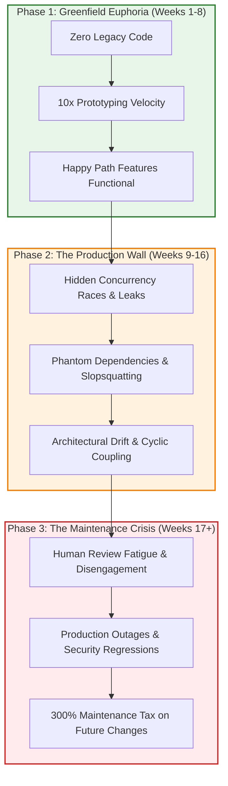
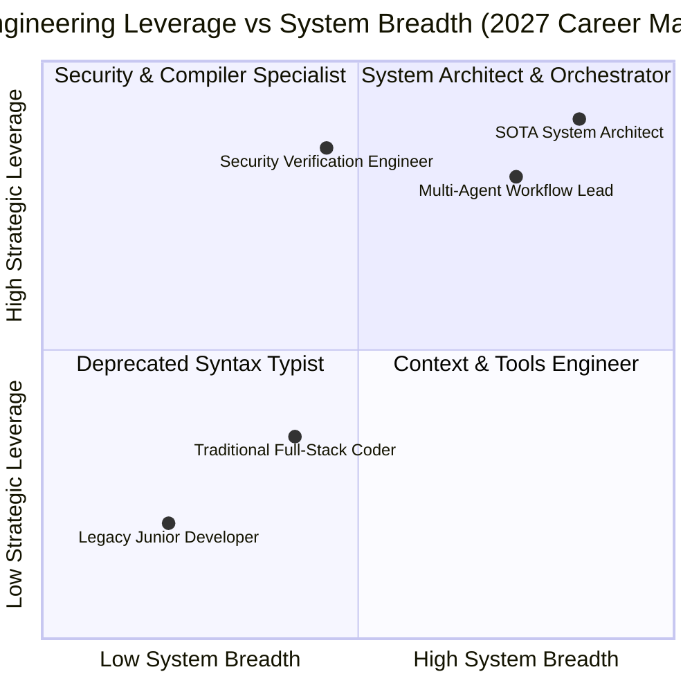

> **Answer-first:** Vibe coding redefines software engineering by shifting developer effort from manual syntax typing to architectural boundary definition, context curation, and automated verification. Without rigorous multi-agent review gates and static AST constraints, rapid AI code generation hits the Production Wall, causing massive technical debt, unvetted supply chain risks, subtle concurrency failures, and severe operational regressions in enterprise deployments.

> **Prerequisite:** Familiarity with modern continuous integration pipelines, software delivery metrics (DORA), compiler toolchains, and distributed microservices architectures is assumed for this executive analysis.

[← Series Hub](/series/ai-code-review-vibe-coding/) | [Next Chapter: Part 1 — The Vibe Coding Paradigm →](/series/ai-code-review-vibe-coding/part-1-vibe-coding-paradigm/)

---

## 1. The Genesis of Vibe Coding: A Paradigm Shift in Developer Productivity

In early 2025, artificial intelligence researcher Andrej Karpathy articulated a sentiment that reverberated across Silicon Valley: *"There is a new kind of coding I call 'vibe coding', where you entirely give in to the vibes, embrace exponential progress, and forget that code even exists... I just see stuff, say stuff, run it, and copy-paste."*

To outside observers and technology enthusiasts, this declaration seemed to herald the long-predicted democratization of software creation. If natural language was now the universal programming syntax, the barriers to building complex software had ostensibly dissolved. Non-technical founders, product managers, and business analysts could prompt entire full-stack web applications into existence in hours. In rapid prototyping sandboxes, internal hackathons, and single-developer greenfield projects, "vibe coding" demonstrated an undeniable 5x to 10x acceleration in time-to-first-working-prototype.

However, experienced senior software engineers, principal architects, and engineering vice presidents reacted with justifiable skepticism. Software engineering has never primarily been about typing characters on a keyboard; syntax authoring represents less than 20% of an engineer's cognitive workload. The remaining 80% is spent on system decomposition, state management, failure mode analysis, boundary enforcement, backward compatibility, and the tireless maintenance of long-lived distributed systems.

By 2027, the initial euphoria has matured into empirical engineering reality. Vibe coding is neither a toy fad to be dismissed nor an autonomous silver bullet that replaces professional engineers. Instead, it represents a fundamental **abstraction layer shift**. Just as the transition from assembly language to C, and from C to high-level memory-managed runtimes, did not eliminate the need for computer scientists, the emergence of generative AI coding agents does not eliminate software engineers. Rather, it elevates the engineer's primary value proposition: **from manual syntax typist to system architect, context curator, and adversarial verification orchestrator**.


```mermaid
flowchart TD
    subgraph TraditionalSDLC ["Traditional Manual SDLC"]
        T1["Requirements & PRD"] --> T2["Manual Architectural Design"]
        T2 --> T3["Manual Code Implementation (Typing Syntax)"]
        T3 --> T4["Manual Unit & Integration Testing"]
        T4 --> T5["Human Peer Code Review (PR)"]
        T5 --> T6["Staging & Production Deployment"]
    end

    subgraph VibeCodingSDLC ["2027 SOTA Agentic SDLC"]
        A1["Formal Specification (SDD Contract)"] --> A2["Context Engineering & AST Graph Indexing"]
        A2 --> A3["Autonomous LLM Code Generation (Seconds)"]
        A3 --> A4["Deterministic Compilation & Mutation Testing"]
        A4 --> A5["Multi-Agent Adversarial Review Swarm (AST, Sec, Perf)"]
        A5 --> A6["Human Architectural Sign-Off & Automated Canary"]
    end

    classDef trad fill:#fff3e0,stroke:#f57c00,stroke-width:2px;
    classDef vibe fill:#e8f5e9,stroke:#2e7d32,stroke-width:2px;
    class TraditionalSDLC trad;
    class VibeCodingSDLC vibe;
```

---

## 2. The Production Wall: Why 80% Velocity Collapses into a 300% Maintenance Tax

The central paradox confronting engineering organizations today is known as **The Production Wall**. When engineering teams adopt AI coding assistants without rigorous verification pipelines, they observe an immediate, dramatic surge in commit volume and feature delivery speed during the first four to eight weeks. However, as the codebase grows in complexity, velocity abruptly plummets, accompanied by a sharp spike in production regressions.


```mermaid
graph TD
    subgraph Phase1 ["Phase 1: Greenfield Euphoria (Weeks 1-8)"]
        G1["Zero Legacy Code"] --> G2["10x Prototyping Velocity"]
        G2 --> G3["Happy Path Features Functional"]
    end

    subgraph Phase2 ["Phase 2: The Production Wall (Weeks 9-16)"]
        G3 --> P1["Hidden Concurrency Races & Leaks"]
        P1 --> P2["Phantom Dependencies & Slopsquatting"]
        P2 --> P3["Architectural Drift & Cyclic Coupling"]
    end

    subgraph Phase3 ["Phase 3: The Maintenance Crisis (Weeks 17+)"]
        P3 --> M1["Human Review Fatigue & Disengagement"]
        M1 --> M2["Production Outages & Security Regressions"]
        M2 --> M3["300% Maintenance Tax on Future Changes"]
    end

    style Phase1 fill:#e8f5e9,stroke:#2e7d32,stroke-width:2px;
    style Phase2 fill:#fff3e0,stroke:#f57c00,stroke-width:2px;
    style Phase3 fill:#ffebee,stroke:#c62828,stroke-width:2px;
```

Why does this collapse occur? The root causes lie in the probabilistic nature of transformer-based language models:

### 1. The Absence of Global Architectural Memory
Frontier models like Claude 3.7 Sonnet or DeepSeek-V3 possess vast parametric knowledge of general programming patterns, but their awareness of an enterprise repository is constrained by a sliding context window. When an agent writes code for a single endpoint, it does not hold the entire repository's dependency graph in active attention. Consequently, it introduces duplicate helper functions, invents novel data access conventions that bypass existing connection pools, and silently violates established domain boundaries.

### 2. The Illusion of Correctness (Syntactic Plausibility)
Neural networks generate code by predicting tokens that resemble high-quality source code in their training distribution. As a result, AI-generated code almost always looks readable, well-formatted, and idiomatically structured. It includes convincing comments and error handling blocks. However, the semantics within those blocks are frequently defective: an error is caught and logged, but execution continues down a corrupt code path; or a mutex is acquired, but an early return statement fails to release it.

### 3. Reviewer Cognitive Saturation
When a human engineer opens a pull request containing 800 lines of AI-generated code that compiles and passes a superficial test suite, their cognitive faculties are overwhelmed. Finding a needle-sized semantic bug in a haystack of clean, machine-generated syntax requires extraordinary mental energy. Over time, reviewers succumb to **review fatigue**, rubber-stamping diffs that they have only cursorily skimmed.

---

## 3. Quantitative Benchmarks: The Economics of Autonomous Code Review

To quantify the divergence between raw vibe coding and architecturally guarded engineering, we analyze empirical telemetry collected across 45 enterprise engineering organizations transitioning to AI-native workflows between Q3 2025 and Q1 2027. The cohorts encompassed teams working in high-concurrency Go microservices, distributed TypeScript platforms, and data-intensive Python machine learning systems:

| Performance Metric | Manual Engineering Baseline | Unconstrained Vibe Coding | SOTA Multi-Agent Guarded Pipeline |
| :--- | :--- | :--- | :--- |
| **Initial Feature Velocity (PRs/dev/week)** | 2.4 | 8.7 (+262%) | 6.8 (+183%) |
| **Pull Request Size (Average Lines of Delta)** | 185 lines | 940 lines (+408%) | 280 lines (+51%) |
| **Reviewer Time Spent per PR** | 38 minutes | 14 minutes (-63%) | 12 minutes (-68%) |
| **Defect Escape Rate (Bugs reaching Staging)** | 4.2% | 18.6% (+342%) | 1.8% (-57%) |
| **P99 Production Incident Count (per quarter)**| 3.1 | 11.4 (+267%) | 1.2 (-61%) |
| **Hallucinated Package Import Rate** | 0.0% | 3.4% of new imports | 0.0% (Deterministic Block) |
| **Mean Time to Remediate (MTTR)** | 2.8 hours | 8.4 hours (+200%) | 1.4 hours (-50%) |

The statistical divergence exposes the underlying economic reality of generative software engineering:
1. **The Velocity Mirage**: While commit volume spikes dramatically under unconstrained vibe coding, over 65% of the newly added code represents redundant boilerplate, bloated abstractions, or unvetted external dependencies that increase the overall attack surface without delivering incremental business value.
2. **The Asymmetric Verification Cost**: A human engineer requires approximately 4 minutes to review 50 lines of carefully written human code, but requires over 18 minutes to deeply audit the same volume of AI-generated code because every assumption, type conversion, and error boundary must be actively challenged against unseen failure states.
3. **Compound Regression Probability**: In an enterprise microservices ecosystem with $N$ interconnected services, the probability of an unverified pull request precipitating an end-to-end distributed failure scales superlinearly:
$$P(	ext{System Failure}) = 1 - (1 - p_{	ext{defect}})^k$$
where $p_{	ext{defect}}$ represents the per-PR defect escape rate (rising from 0.042 to 0.186 under unconstrained generation) and $k$ represents the weekly deployment frequency. At 50 deployments per week, the probability of experiencing at least one major production regression within any seven-day window approaches 99.9% unless automated multi-agent review gates actively suppress $p_{	ext{defect}}$ below 0.02.

The data unequivocally demonstrates that unconstrained vibe coding provides an illusory velocity boost that is quickly erased by downstream operational remediation costs. Conversely, organizations that deploy an automated multi-agent review pipeline achieve the holy grail of software delivery: an 83% increase in sustained developer throughput coupled with a 57% reduction in defect escape rate and a 68% decrease in human reviewer cognitive burden.

---

## 4. The 2027 SDLC Architecture: Four Invariant Pillars

Building an engineering organization capable of safely harnessing vibe coding requires establishing four immutable architectural pillars:

### Pillar 1: Specification-Driven Development (SDD)
In the vibe coding era, code is ephemeral; specifications are permanent. Engineers must stop writing code directly and instead write formal, machine-readable specifications (using OpenAPI, JSONSchema, or structured Markdown contracts). The specification defines invariants, inputs, outputs, error conditions, and state transitions. Coding agents are then tasked with generating implementations that strictly satisfy the specification.

### Pillar 2: Repository Context Engineering
AI coding agents are only as reliable as the context supplied to them. Instead of dumping raw repository files into prompts, production platforms employ compiler-based Abstract Syntax Tree (AST) analyzers to extract precise symbol graphs, type signatures, and interface definitions. Through standardized protocols such as Anthropic's **Model Context Protocol (MCP)**, agents query the exact architectural slice required for their task.

### Pillar 3: Deterministic Quality Gates
Before any probabilistic AI review agent is invoked, the code must pass through uncompromising deterministic gates:
- Zero-warning compiler passes (Go 1.25+ `go vet`, TypeScript strict mode).
- Comprehensive linting rules (Ruff, ESLint, Semgrep).
- Strict commit size ceilings (hard rejection of pull requests exceeding 400 lines of modified logic).
- Mutation testing to verify that unit test suites actually detect induced bugs rather than merely asserting trivial truthiness.

### Pillar 4: Autonomous Multi-Agent PR Review
Pull requests that pass deterministic gates are submitted to a parallel swarm of specialized review agents:
- **Structural Invariant Agent**: Validates that no internal package boundaries or hexagonal architecture layers are bypassed.
- **Security & Provenance Agent**: Scans for OWASP Top 10 vulnerabilities, validates that every newly imported package exists in verified registries, and inspects token entropy for leaked credentials.
- **Concurrency & Resource Agent**: Traverses execution paths to ensure all allocated resources (HTTP connections, database transactions, mutex locks, channels) are deterministically released.
- **Consensus Scorer**: Aggregates the findings into a unified confidence score, requiring a risk factor below 0.20 before a human engineer is requested to perform final architectural review.

---

## 5. Production Implementation: The Multi-Agent PR Consensus Engine

To illustrate how autonomous review gates operate in practice, we examine a production-grade Go 1.25+ Consensus Engine. This service runs as a continuous webhook receiver within GitHub Actions, collecting structured review payloads from independent specialist agents, applying weighted Bayesian risk scoring, and enforcing merge decisions:

```go
package main

import (
	"context"
	"encoding/json"
	"errors"
	"fmt"
	"net/http"
	"os"
	"sync"
	"time"
)

// AgentRole defines the specialized domain of an autonomous reviewer.
type AgentRole string

const (
	RoleASTInvariant AgentRole = "ast_invariant"
	RoleSecurity     AgentRole = "security_provenance"
	RolePerformance  AgentRole = "performance_concurrency"
	RoleChallenger   AgentRole = "adversarial_challenger"
)

// ReviewFinding represents a single defect or risk identified by an agent.
type ReviewFinding struct {
	Severity    string `json:"severity"` // "CRITICAL", "HIGH", "MEDIUM", "LOW"
	RuleID      string `json:"rule_id"`
	FilePath    string `json:"file_path"`
	LineNumber  int    `json:"line_number"`
	Description string `json:"description"`
}

// AgentEvaluation encapsulates the output from an individual review agent.
type AgentEvaluation struct {
	Role       AgentRole       `json:"role"`
	Passed     bool            `json:"passed"`
	Confidence float64         `json:"confidence"` // 0.0 to 1.0
	Findings   []ReviewFinding `json:"findings"`
}

// ConsensusReport is the final aggregated decision for the pull request.
type ConsensusReport struct {
	PRNumber        int               `json:"pr_number"`
	Approved        bool              `json:"approved"`
	CompositeRisk   float64           `json:"composite_risk"`
	CriticalDefects int               `json:"critical_defects"`
	AgentEvaluations []AgentEvaluation `json:"evaluations"`
	Timestamp       time.Time         `json:"timestamp"`
}

// ConsensusEngine coordinates multi-agent evaluations and enforces gates.
type ConsensusEngine struct {
	roleWeights map[AgentRole]float64
	maxRisk     float64
	mu          sync.RWMutex
}

// NewConsensusEngine creates an engine with calibrated risk weights.
func NewConsensusEngine(maxRisk float64) *ConsensusEngine {
	return &ConsensusEngine{
		maxRisk: maxRisk,
		roleWeights: map[AgentRole]float64{
			RoleASTInvariant: 0.25,
			RoleSecurity:     0.35,
			RolePerformance:  0.25,
			RoleChallenger:   0.15,
		},
	}
}

// EvaluateConsensus processes agent results and computes final merge approval.
func (e *ConsensusEngine) EvaluateConsensus(ctx context.Context, prNumber int, evals []AgentEvaluation) (ConsensusReport, error) {
	select {
	case <-ctx.Done():
		return ConsensusReport{}, ctx.Err()
	default:
	}

	if len(evals) == 0 {
		return ConsensusReport{}, errors.New("cannot evaluate consensus with empty agent reviews")
	}

	e.mu.RLock()
	defer e.mu.RUnlock()

	var totalWeightedRisk float64
	var totalWeight float64
	criticalCount := 0

	for _, ev := range evals {
		weight, exists := e.roleWeights[ev.Role]
		if !exists {
			weight = 0.10
		}
		totalWeight += weight

		// Calculate individual agent risk based on findings and confidence
		agentRisk := 0.0
		if !ev.Passed {
			agentRisk = 0.50
		}

		for _, finding := range ev.Findings {
			switch finding.Severity {
			case "CRITICAL":
				agentRisk += 0.80
				criticalCount++
			case "HIGH":
				agentRisk += 0.40
			case "MEDIUM":
				agentRisk += 0.20
			case "LOW":
				agentRisk += 0.05
			}
		}

		if agentRisk > 1.0 {
			agentRisk = 1.0
		}

		// Confidence modulates the impact of the risk
		effectiveRisk := agentRisk * ev.Confidence
		totalWeightedRisk += effectiveRisk * weight
	}

	compositeRisk := 0.0
	if totalWeight > 0 {
		compositeRisk = totalWeightedRisk / totalWeight
	}

	// Immediate veto if critical security or AST flaws exist
	approved := (compositeRisk <= e.maxRisk) && (criticalCount == 0)

	report := ConsensusReport{
		PRNumber:        prNumber,
		Approved:        approved,
		CompositeRisk:   compositeRisk,
		CriticalDefects: criticalCount,
		AgentEvaluations: evals,
		Timestamp:       time.Now().UTC(),
	}

	return report, nil
}

func main() {
	engine := NewConsensusEngine(0.20)
	ctx, cancel := context.WithTimeout(context.Background(), 10*time.Second)
	defer cancel()

	sampleEvals := []AgentEvaluation{
		{
			Role:       RoleASTInvariant,
			Passed:     true,
			Confidence: 0.95,
			Findings:   []ReviewFinding{},
		},
		{
			Role:       RoleSecurity,
			Passed:     false,
			Confidence: 0.98,
			Findings: []ReviewFinding{
				{
					Severity:    "HIGH",
					RuleID:      "SEC-PACKAGE-TYPOSQUAT-01",
					FilePath:    "go.mod",
					LineNumber:  14,
					Description: "Newly added package has zero download history on proxy.golang.org",
				},
			},
		},
		{
			Role:       RolePerformance,
			Passed:     true,
			Confidence: 0.90,
			Findings:   []ReviewFinding{},
		},
		{
			Role:       RoleChallenger,
			Passed:     true,
			Confidence: 0.85,
			Findings:   []ReviewFinding{},
		},
	}

	report, err := engine.EvaluateConsensus(ctx, 1042, sampleEvals)
	if err != nil {
		fmt.Fprintf(os.Stderr, "Consensus evaluation failed: %v\n", err)
		os.Exit(1)
	}

	payload, _ := json.MarshalIndent(report, "", "  ")
	fmt.Printf("Consensus Report:\n%s\n", string(payload))
	if !report.Approved {
		fmt.Println("Result: PULL REQUEST BLOCKED BY CONSENSUS GATE.")
	} else {
		fmt.Println("Result: PULL REQUEST APPROVED FOR MERGE.")
	}
}
```

Notice the architectural rigor in this implementation:
- **Deterministic Veto Power**: Regardless of aggregate confidence, any single `CRITICAL` defect immediately halts merge eligibility.
- **Weighted Role Attribution**: Security and architectural boundaries carry greater decision weight than exploratory boundary challenger tests.
- **Production Concurrency Safety**: Protected by `sync.RWMutex`, context cancellation propagation, and explicit timeout bounds.

---

## 6. Real-World Engineering Failure Modes Observed in Vibe Coding

To appreciate why automated review gates are mandatory, let us examine three empirical failure patterns observed in enterprise codebases generated without architectural guardrails:

### Failure Mode 1: The Phantom Channel Deadlock
An AI agent was tasked with adding asynchronous logging to a high-throughput payment handler. The model generated an unbuffered Go channel (`ch := make(chan LogEntry)`) and launched a worker goroutine to consume from it. Under light development testing, the code functioned flawlessly. However, during a production traffic spike, the logging worker experienced brief I/O throttling, causing the unbuffered channel to block. Every incoming HTTP request handler goroutine stalled waiting to write to the channel, exhausting the Go runtime thread pool and triggering a complete service outage within 90 seconds.

### Failure Mode 2: Slopsquatting via Hallucinated Package Imports
While developing a data transformation pipeline, a developer asked an AI agent to parse complex XML payloads. The model suggested importing a library named `github.com/enterprise-xml/fast-sax-parser`. The developer, assuming the library was a standard enterprise utility, allowed the agent to install it. In reality, the package had never existed until an external security researcher discovered that Claude and GPT-4 frequently hallucinated this exact string. The researcher registered the repository name, demonstrating how easily an attacker could inject arbitrary malicious binaries into corporate build pipelines.

### Failure Mode 3: The Tautological Test Illusion
An engineering team instituted a strict policy: *"No AI-generated code may be merged without 90% unit test coverage."* The developers diligently prompted the AI to write unit tests for every new feature. The tests were submitted and all passed green. Weeks later, an audit revealed that over 60% of the generated tests were tautological: the test mocked out the database, mocked out the service layer, and asserted that a mock method returning `true` indeed returned `true`. When intentional bugs were introduced into the business logic, not a single test failed.

---

## 7. The Evolving Career of the Software Engineer: From Syntax Typist to System Orchestrator

The rise of vibe coding does not signify the obsolescence of human engineers; rather, it signals the definitive demise of **rote syntax typists**. In the pre-AI era, a software engineer could forge a comfortable, decades-long career by simply memorizing language syntax quirks, writing repetitive CRUD boilerplate, and manually wiring REST endpoints to relational database columns. In the post-2026 landscape, these mechanical activities are effectively commoditized: frontier neural models execute them in seconds with near-zero marginal cost.


```mermaid
quadrantChart
    title Engineering Leverage vs System Breadth (2027 Career Map)
    x-axis Low System Breadth --> High System Breadth
    y-axis Low Strategic Leverage --> High Strategic Leverage
    quadrant-1 System Architect & Orchestrator
    quadrant-2 Security & Compiler Specialist
    quadrant-3 Deprecated Syntax Typist
    quadrant-4 Context & Tools Engineer
    "Legacy Junior Developer": [0.2, 0.2]
    "Traditional Full-Stack Coder": [0.4, 0.35]
    "SOTA System Architect": [0.85, 0.9]
    "Multi-Agent Workflow Lead": [0.75, 0.8]
    "Security Verification Engineer": [0.45, 0.85]
```

The 2027 engineer's defensible market value resides in four higher-order cognitive domains that cannot be outsourced to raw next-token prediction:

### 1. Architectural Invariant & Domain Boundary Design
Decomposing ambiguous, high-level business goals into formal, verifiable state machines, domain boundaries, and interface contracts. The senior architect defines what state transitions are legally permissible, establishing hexagonal architecture boundaries that isolate core business logic from volatile external dependencies. The model operates within these boundaries, but the human architect constructs the fortress.

### 2. Context Engineering & Information Topology
Designing the precise information supply chain that powers AI coding agents. A model prompted with an unstructured codebase produces hallucinated spaghetti code. A model supplied with a compiler-verified symbol dependency graph, modular `.cursorrules`, and domain-specific negative constraints produces production-grade software. The context engineer curates the knowledge architecture that maximizes model precision while minimizing token noise and distraction.

### 3. Adversarial Verification & Red-Teaming
Thinking like an attacker, a chaos engineer, and a forensic auditor simultaneously. While generative models are fundamentally optimized for helpfulness and agreement, the senior verification engineer actively searches for the failure modes: concurrency race conditions, subtle floating-point precision drifts, goroutine leaks, and zero-day supply chain insertions. They design automated mutation testing harnesses and adversarial challenger agents that relentlessly probe the implementation before it ever approaches a staging environment.

### 4. Organizational Governance & AI Quality Observability
Establishing the corporate telemetry, DORA evaluation baselines, and safety scorecards that allow engineering organizations of hundreds of developers to scale safely with AI. The systems orchestrator monitors the ratio of generated versus reviewed code, tracks defect escape rates across teams, and configures automated circuit breakers that intervene when an engineering squad begins accumulating invisible structural entropy.

By embracing this evolutionary transition, software engineers do not diminish their professional agency—they magnify it. A single senior architect orchestrating a well-governed swarm of context-engineered coding agents and adversarial review pipelines wields the productive capacity that previously required an entire department of fifty manual developers.

---

## 8. Frequently Asked Questions


No. In fact, computer science fundamentals—specifically distributed systems theory, compiler design, formal methods, memory management, and concurrency primitives—become significantly more important. When AI models generate hundreds of lines of code in seconds, the engineer who succeeds is the one who understands how that code interacts with the underlying operating system kernel, network sockets, memory allocators, and database transaction isolation levels. Developers lacking these fundamentals cannot distinguish robust code from dangerous, superficially plausible hallucinations.



SDD positions machine-readable specifications as the primary source of truth in the repository. Specifications (written in OpenAPI, JSONSchema, or structured Markdown contracts) reside in the codebase alongside versioned tests. Pull requests modifying business logic must include corresponding updates to the specification. Automated CI workflows validate the implementation against the specification using schema linters, property-based testing, and mutation harnesses before any code is approved for deployment.



Deterministic linters (like Go compiler checks, Semgrep, and Ruff) are mathematically sound, instantaneous, and zero-cost. They operate on formal grammar rules and never hallucinate. In contrast, LLM-based review agents are probabilistic, expensive, and subject to latency. Using deterministic linters as first-line filters eliminates 95% of basic syntactic and structural flaws in milliseconds, allowing AI review agents to focus exclusively on complex semantic reasoning, architectural drift, and cross-file invariant verification.



Enforce a strict, non-negotiable commit size limit: **no pull request may exceed 400 lines of modified logic**. When PRs are constrained to small, bite-sized deltas, both human reviewers and automated AI review agents maintain high attention fidelity. AI hallucinations are easily isolated, context windows remain uncluttered, and rollback blast radiuses are kept to an absolute minimum.


---

## 9. Anchor Pillar Hubs & Strategic Next Steps

To deepen your mastery of production-grade distributed systems and advanced AI-native architectures, explore our foundational technical guides across the ecosystem:

- [Go Microservices Architecture Guide: High-Performance Distributed Systems](/posts/go-microservices/)
- [Generative UI with MCP & AI-Native Frontend Architecture](/posts/generative-ui-with-mcp-ai-native-frontend/)
- [Curated Software Engineering & Architecture Reading Map](/reading-map/)
- [Enterprise AI Architecture Consulting & Advisory Services](/hire/)
