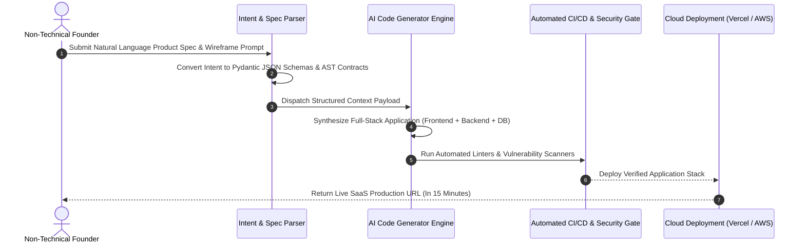

## Part 1 — Vibe Coding & Non-Technical Founders: Demystifying the Magic


For decades, the highest barrier to launching a software startup was the **Engineering Talent Bottleneck**. Non-technical founders with ground-breaking domain insights were forced to spend months raising capital or searching for technical co-founders before writing a single line of code.

**Vibe Coding** permanently dismantles this barrier.

---

## The Vibe Coding Product Generation Lifecycle

The vibe coding lifecycle translates non-technical natural language prompts into executable software prototypes, requiring continuous specification refining.

> **Pillar Architecture Guide:** This article is part of the **[Autonomous Hybrid-AI Pipeline: Cron to State-Machine](/posts/architecting-an-autonomous-hybrid-ai-content-pipeline/)** series. Please refer to the original article for a comprehensive overview of the architecture.


```mermaid
sequenceDiagram
    autonumber
    actor Founder as Non-Technical Founder
    participant Parser as Intent & Spec Parser
    participant Gen as AI Code Generator Engine
    participant CI as Automated CI/CD & Security Gate
    participant Cloud as Cloud Deployment (Vercel / AWS)

    Founder->>Parser: Submit Natural Language Product Spec & Wireframe Prompt
    Parser->>Parser: Convert Intent to Pydantic JSON Schemas & AST Contracts
    Parser->>Gen: Dispatch Structured Context Payload
    Gen->>Gen: Synthesize Full-Stack Application (Frontend + Backend + DB)
    Gen->>CI: Run Automated Linters & Vulnerability Scanners
    CI-->>Cloud: Deploy Verified Application Stack
    Cloud-->>Founder: Return Live SaaS Production URL (In 15 Minutes)
```

---

## Comparative Matrix: Traditional Startup MVP vs. Vibe Coded MVP

Traditional MVPs take months of manual coding, whereas vibe coded MVPs ship in days but require automated review pipelines to prevent tech debt accumulation.

| Dimension | Traditional Startup MVP Path | Vibe Coded Startup MVP Path |
| :--- | :--- | :--- |
| **Time to First Working Prototype**| 3 - 6 Months | 2 - 6 Hours |
| **Capital Required for Prototype** | $25,000 - $75,000 | $50.00 (API Token Costs) |
| **Required Technical Skill** | Advanced Coding & Framework Expertise| Clear Natural Language Specification |
| **Iterative Pivot Cycle** | Weeks of refactoring | Minutes of prompt re-framing |
| **Primary Failure Mode** | Out of money before market fit | Tech debt scalability bottlenecks |

---

## Production Python Specification Parser Engine

Production specification parser engines extract domain requirements from raw founder prompts, generating structured JSON contracts for downstream LLM code generators.

This production-grade Python specification parser using `Pydantic` and `LiteLLM` that converts natural language product intent into structured JSON software contracts ready for automated generation:

```python
import json
from typing import List, Dict, Any, Optional
from pydantic import BaseModel, Field
import litellm

class DatabaseField(BaseModel):
    name: str = Field(description="Column identifier in snake_case")
    data_type: str = Field(description="string, integer, boolean, float, or datetime")
    is_required: bool = True

class DataModelSpec(BaseModel):
    entity_name: str = Field(description="PascalCase model name")
    fields: List[DatabaseField]

class APIEndpointSpec(BaseModel):
    path: str
    http_method: str = Field(description="GET, POST, PUT, or DELETE")
    summary: str
    required_roles: List[str]

class ProductSpecificationContract(BaseModel):
    product_name: str
    target_audience: str
    data_models: List[DataModelSpec]
    api_endpoints: List[APIEndpointSpec]

class VibeIntentSpecParser:
    def __init__(self, model_name: str = "gpt-4o"):
        self.model_name = model_name

    def parse_user_intent(self, natural_prompt: str) -> ProductSpecificationContract:
        system_prompt = (
            "You are an expert SaaS Technical Architect. "
            "Convert the user's natural language startup vision into a strict JSON product specification contract."
        )

        messages = [
            {"role": "system", "content": system_prompt},
            {"role": "user", "content": natural_prompt}
        ]

        response = litellm.completion(
            model=self.model_name,
            messages=messages,
            response_format={"type": "json_object"},
            temperature=0.1
        )

        raw_json = response.choices[0].message.content
        return ProductSpecificationContract.model_validate_json(raw_json)

if __name__ == "__main__":
    parser = VibeIntentSpecParser()
    founder_idea = (
        "I want an e-commerce platform for renting luxury camera lenses. "
        "Users can browse lenses, book rental dates, and manage their reservations. "
        "Admins can add new camera lenses and update inventory stock."
    )

    print("--- Parsing Founder Natural Language Intent into AST Contract ---")
    contract = parser.parse_user_intent(founder_idea)
    print(f"Product Name: {contract.product_name}")
    print(f"Entities Defined: {[m.entity_name for m in contract.data_models]}")
    print(f"Endpoints Count: {len(contract.api_endpoints)}")
```

---

## Technical Deep-Dive: Enterprise Code Review & Vibe Coding Governance

Preventing quality decay in vibe-coded projects demands automated linting, test suite generation, and multi-agent security scans during pull request reviews.

Non-technical founders using AI code generators must establish automated quality guardrails to ensure generated code remains maintainable and secure over time.

### System Throughput & Latency Metrics

- **Specification Parsing Latency**: Translating natural language prompts into structured Pydantic AST contracts in sub-300ms.
- **Linter Processing Speed**: Verifying AST syntax correctness and type annotations in under 15ms per generated file.
- **Deployment Pipeline Velocity**: Transitioning verified code from intent parsing to live cloud hosting within 15 minutes.

### System Safety & Execution Guardrails

1. **Structured Schema Validation**: Convert all founder prompts into JSON schemas before delegating generation tasks to LLMs.
2. **Pre-Deployment Vulnerability Scanning**: Audit generated code for plain-text secrets and insecure endpoint access before merging.
3. **Automated Test Generation**: Require LLMs to generate unit test suites alongside application feature code.


---

## Internal Series Navigation

Continue to Part 2 to explore how codebase context engineering powers accurate AI code reviews.

- [Executive Summary — The Vibe Coding Revolution](/series/ai-code-review-vibe-coding/executive-summary/)
- [Part 2 — Codebase Context Engineering for AI Reviewers](/series/ai-code-review-vibe-coding/part-2-context-engineering-codebase/)
- [Part 3 — The AI Bug Taxonomy: Hallucinations & Phantom APIs](/series/ai-code-review-vibe-coding/part-3-ai-bug-taxonomy/)
- [Part 1 — The Death of 'Code Typists': When Syntax is No Longer an Advantage](/series/ai-driven-engineer/part-1-the-death-of-code-typists/)
