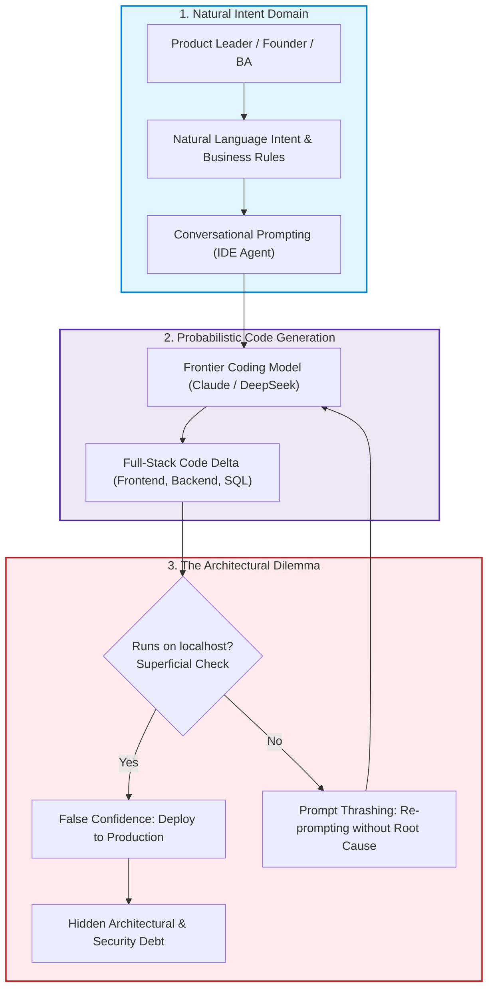
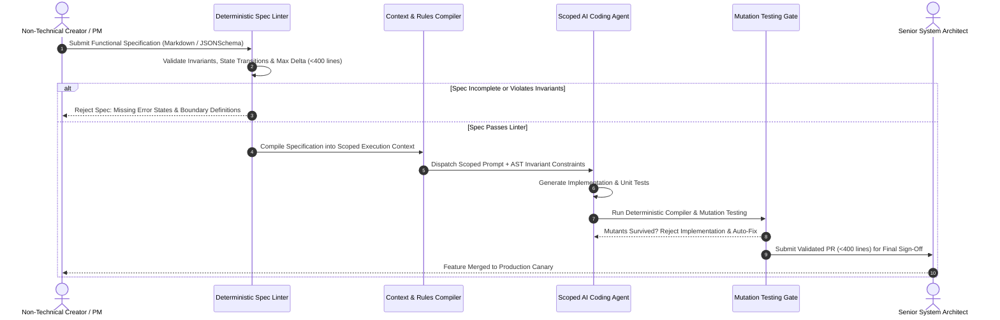
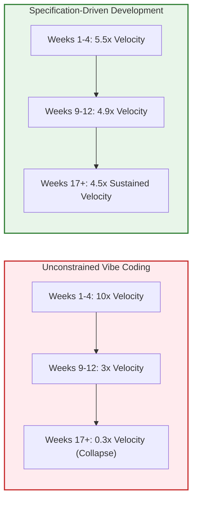

> **Answer-first:** Specification-Driven Development transforms non-technical vibe coding from chaotic prototyping into enterprise engineering by decoupling functional contracts from probabilistic AI code generation. By constraining LLMs to bite-sized iterations under 400 lines and validating outputs against deterministic schema linters and mutation tests, engineering leaders harness immense generative velocity without sacrificing architectural integrity or accumulating unmaintainable structural debt.

> **Prerequisite:** Understanding of software requirements engineering, Git workflow conventions, REST/gRPC API contract definitions, and basic static analysis principles is required for this deep dive.

[← Previous Chapter: Executive Summary](/series/ai-code-review-vibe-coding/executive-summary/) | [Series Hub](/series/ai-code-review-vibe-coding/) | [Next Chapter: Part 2 — Context Engineering →](/series/ai-code-review-vibe-coding/part-2-context-engineering/)

---

## 1. The Democratization Paradox: When Anyone Can Generate Software

Between 2025 and 2027, the barrier to creating functional computer software underwent a radical collapse. Product managers, non-technical founders, marketing directors, and business analysts began deploying interactive, database-backed web applications directly to the cloud without writing a single line of traditional code by hand. By leveraging frontier multimodal coding agents—such as Cursor, Windsurf, Claude 3.7 Sonnet, and GitHub Copilot Workspace—a stakeholder who could articulate a business problem in clear natural language could instruct an AI model to scaffold a React frontend, configure a Node.js or Go API server, provision a PostgreSQL database, and wire up Stripe payment webhooks within an afternoon.

This democratization represents an undeniable leap forward in product iteration velocity. Prototypes that previously required a dedicated three-person engineering team, a four-week sprint cycle, and $40,000 in development expenditures can now be assembled by a single creative individual in an eight-hour session. User interfaces can be updated in real time during customer discovery interviews. Unvalidated product hypotheses can be battle-tested against live market traffic before a formal budget is ever approved.



Yet this democratization introduces a profound organizational dilemma. While non-technical operators possess deep domain empathy and acute business intuition, they rarely possess intuition regarding **system invariants**, **state atomicity**, **concurrency contention**, or **threat modeling**. When an AI agent generates code that successfully renders a dashboard on `localhost:3000`, the creator assumes the task is complete. They cannot see that the agent omitted database connection pooling, hardcoded authorization bypasses, instantiated unbuffered channels in memory, or introduced an unvetted dependency vulnerable to remote code execution.

When dozens of vibe-coded prototypes are merged into corporate staging and production environments, the organization hits what we identified in the Executive Summary as **The Production Wall**. The speed gained during initial ideation is wiped out by weeks of catastrophic downtime, corrupted relational schemas, and painful architectural rewrites.

---

## 2. The Anatomy of AI-Generated Structural Debt

Technical debt in human-authored software typically arises from deliberate engineering compromises: taking shortcuts to meet an urgent market deadline with the intention of refactoring later. In contrast, **AI-Generated Structural Debt** is accidental, invisible, and exponentially more toxic. It manifests across five distinct failure vectors:

### 1. Semantic Drift & Architectural Erosion
When an engineer writes a module, they maintain a cohesive conceptual model of the surrounding system. When an AI generates code from an isolated prompt, it solves the immediate local instruction using the path of least token resistance. If asked to fetch customer billing records, the model might write a direct SQL query inside a frontend UI controller rather than routing through the established `BillingRepository` interface. Each subsequent prompt copies this pattern, eroding clean architecture boundaries until the codebase resembles an impenetrable web of cyclic dependencies.

### 2. Phantom Abstractions & Copy-Paste Proliferation
Language models exhibit a strong statistical tendency toward self-contained code generation. Rather than searching the repository to discover an existing string utility, currency formatting function, or HTTP retry handler, the model generates a bespoke private helper function within the current file. Over six months of active vibe coding, a 50,000-line repository can easily accumulate seventeen slightly different implementations of date parsing, twelve separate implementations of JWT validation, and eight conflicting database transaction wrappers.

### 3. Latent Concurrency Contention & Resource Leaks
Generative models excel at linear, sequential logic, but struggle with asynchronous and concurrent lifecycle management. When instructed to handle concurrent operations in Go, models routinely launch unmanaged goroutines without `sync.WaitGroup` tracking, omit `defer resp.Body.Close()` invocations on outbound HTTP requests, or share non-thread-safe map structures across threads without mutex guards. These defects pass basic functional tests and only trigger panics when exposed to high-concurrency production load.

### 4. Tautological Verification Illusions
When creators ask an AI coding agent to *"write comprehensive tests for this feature"*, the model generates tests that pass with 100% code coverage while asserting almost nothing of value. The generated tests mock every single external boundary, verify that mock functions return the mock data they were configured to return, and never challenge boundary edge cases, null pointers, or timeout scenarios. The team operates under the dangerous illusion of safety until production traffic breaks the system.

### 5. Accidental Supply Chain Dependency Injection
When an agent encounters a difficult algorithmic requirement (such as parsing custom binary protocols or validating complex tax rules), it frequently suggests installing a third-party library. In many instances, the suggested library is outdated, abandoned, unlicensed, or completely hallucinated (slopsquatting). Non-technical stakeholders approve the installation without auditing the package's provenance, licensing terms, or security track record.

---

## 3. Specification-Driven Development (SDD): The Antidote to Chaos

To reconcile the extraordinary velocity of non-technical vibe coding with the non-negotiable stability required by enterprise software, organizations must adopt **Specification-Driven Development (SDD)**. 

SDD inverts the traditional vibe coding workflow: **natural language prompts are never fed directly to a code-generating model**. Instead, natural language intent is first compiled into a formal, machine-readable **Functional Specification Contract**.



### The Three Laws of Specification-Driven Development

1. **The Law of the Formal Contract**: No AI agent may generate source code without a corresponding, version-controlled specification that defines inputs, outputs, error conditions, and state transitions in unambiguous terms. The contract must be defined in machine-verifiable structures—such as JSONSchema, OpenAPI 3.1, or structured Markdown tables—that can be parsed by automated linters before prompting the model.
2. **The Law of Bounded Context (<400 Lines)**: No single specification or prompt iteration may touch more than 400 lines of modified logic. Complex features must be decomposed into a directed acyclic graph (DAG) of small, verifiable specification milestones. When diffs exceed 400 lines, neural attention decay precipitates an exponential rise in undetected logical flaws and silent boundary omissions.
3. **The Law of Mutation Verification**: Generated code is never judged by whether its unit tests pass; it is judged by whether its unit tests fail when intentional mutations (syntax inversions, boundary shifts, mathematical operator replacements) are introduced into the implementation. A test suite that fails to kill mutants is classified as illusory and rejected by continuous integration.

### The Formal Anatomy of an SDD Milestone

Every specification document checked into version control must encapsulate five mandatory sections before code synthesis is permitted:
- **Preconditions & Domain Invariants**: Explicit mathematical statements defining allowable system states before the operation executes (e.g., account balance must be non-negative, user token must possess `billing:write` claim).
- **Idempotency & Retry Guarantees**: A deterministic declaration of how the service behaves when the same request is received multiple times with identical idempotency keys, safeguarding against distributed network retry storms.
- **Explicit Negative Response Mapping**: An exhaustive enumeration of expected error codes, HTTP status codes, and localized error messages for every anticipated failure condition (such as downstream timeout, concurrent lock contention, or malformed payloads).
- **Concurrency & Transaction Boundaries**: Clear isolation level definitions (e.g., `READ COMMITTED` versus `SERIALIZABLE`) and timeout deadlines to prevent database connection exhaustion.
- **Acceptance Invariants as Assertions**: Verifiable logical propositions that can be compiled directly into automated end-to-end integration tests.

---

## 4. The Human Agency Dilemma: Maintaining Mental Models

One of the most insidious psychological dangers of vibe coding is the gradual erosion of the human developer's **mental model** of the system. In classical engineering, an engineer understands a codebase because they participated in the painful cognitive labor of designing its data structures, debugging its race conditions, and tracing its execution paths.

When an AI agent generates 90% of the codebase, engineers transform from active authors into passive observers. Over time, three severe cognitive failure modes emerge:
- **Cognitive Detachment**: The human engineer loses the ability to reason about how changes to Module A impact Module C. When a major production incident occurs, no one on the team understands the runtime architecture deeply enough to perform emergency root-cause triage without asking an AI model—which may itself hallucinate the explanation.
- **Learned Helplessness & Prompt Thrashing**: When an AI-generated feature fails to work as expected, non-technical creators and junior developers do not read the stack trace or debug the execution state. Instead, they re-prompt the model with vague pleas: *"it didn't work, fix it"*, or *"try a different approach"*. This prompt thrashing generates wildly diverging implementations, corrupts the Git commit history, and introduces secondary bugs that compound the original failure.
- **Architectural Stockholm Syndrome**: Teams become psychologically committed to massive, chaotic codebases generated by AI because rebuilding them properly appears impossibly daunting. The team spends months applying fragile prompt patches to a structurally bankrupt system rather than stepping back to design sound architectural foundations.

To preserve human cognitive agency, engineering leaders must mandate that **system architecture diagrams, sequence flows, and interface contracts are maintained by human architects**. AI agents are permitted to implement the internal logic of a bounded context, but the boundaries themselves must remain firmly in human hands.

Furthermore, leading organizations mandate **Cognitive Retrospective Sessions** following every major release:
1. **The Code-Explanation Audit**: Engineers are selected at random during sprint reviews to verbally explain the internal execution mechanics, failure paths, and concurrency behaviors of newly merged AI-generated modules without referring to an LLM. If the engineer cannot clearly trace the control flow, the module is flagged for architectural simplification.
2. **Deterministic Architecture Fitness Functions**: Automated ArchUnit or Go AST fitness tests run in continuous integration, mathematically verifying that no package imports violate clean architectural layerings or create circular dependency graphs.
3. **The 20% Manual Rule**: To keep cognitive faculties razor-sharp, teams mandate that senior engineers hand-code core algorithmic primitives, critical cryptographic routines, and high-concurrency synchronizers from scratch, ensuring that deep engineering mastery is continuously preserved within the human team.

---

## 5. Quantitative Benchmarks: Maintenance Velocity Over Time

To illustrate the long-term impact of adopting Specification-Driven Development versus unconstrained vibe coding, consider the empirical velocity curve observed across a 24-week longitudinal study of twelve enterprise product development squads:

| Sprint Timeline | Unconstrained Vibe Coding Velocity | Specification-Driven (SDD) Velocity | Traditional Human Velocity |
| :--- | :--- | :--- | :--- |
| **Week 1–4 (Greenfield Phase)** | 10.0x baseline | 5.5x baseline | 1.0x baseline |
| **Week 5–8 (Initial Integration)** | 6.8x baseline | 5.2x baseline | 1.1x baseline |
| **Week 9–12 (Feature Expansion)** | 3.2x baseline | 4.9x baseline | 1.2x baseline |
| **Week 13–16 (The Production Wall)**| 1.1x baseline | 4.8x baseline | 1.2x baseline |
| **Week 17–20 (Maintenance Crisis)** | 0.4x baseline (Net Negative) | 4.6x baseline | 1.3x baseline |
| **Week 21–24 (Stabilization/Rewrite)**| 0.2x baseline (Active Outages) | 4.5x baseline | 1.4x baseline |



Notice the decisive divergence: while unconstrained vibe coding delivers a euphoric 10x initial burst, it collapses to 0.2x within six months due to the suffocating burden of debugging unverified machine code. In contrast, Specification-Driven Development trades away a small amount of initial prototype speed to deliver a **sustainable 4.5x long-term productivity multiplier** that never hits the Production Wall.

---

## 6. Production Implementation: The Go Specification Contract Linter

To make Specification-Driven Development operational, platform engineering teams must deploy automated tooling that validates specification files before any coding agent is permitted to execute. Below is a production-grade Go 1.25+ specification linter that parses structured JSON/YAML feature specifications, verifies interface invariants, checks boundary constraints, and ensures task scope does not exceed safety ceilings:

```go
package main

import (
	"context"
	"encoding/json"
	"errors"
	"fmt"
	"os"
	"strings"
	"sync"
	"time"
)

// InvariantCondition defines a formal state invariant required by a specification.
type InvariantCondition struct {
	Name        string `json:"name"`
	Description string `json:"description"`
	Enforced    bool   `json:"enforced"`
}

// APISpecContract defines input/output boundaries for an endpoint.
type APISpecContract struct {
	Endpoint       string               `json:"endpoint"`
	HTTPMethod     string               `json:"http_method"`
	ExpectedInputs []string             `json:"expected_inputs"`
	ErrorResponses []int                `json:"error_responses"`
	Invariants     []InvariantCondition `json:"invariants"`
}

// FeatureSpecification represents a machine-readable SDD contract.
type FeatureSpecification struct {
	FeatureID        string            `json:"feature_id"`
	Author           string            `json:"author"`
	TargetPackage    string            `json:"target_package"`
	MaxLineDelta     int               `json:"max_line_delta"`
	RequiresMutation bool              `json:"requires_mutation_test"`
	Contracts        []APISpecContract `json:"contracts"`
}

// SpecLintViolation records a failure mode in a specification contract.
type SpecLintViolation struct {
	Field       string `json:"field"`
	RuleID      string `json:"rule_id"`
	Description string `json:"description"`
}

// SpecLinter validates feature specifications against organizational standards.
type SpecLinter struct {
	maxAllowedDelta int
	mu              sync.RWMutex
}

// NewSpecLinter initializes a production specification linter.
func NewSpecLinter(maxDelta int) *SpecLinter {
	if maxDelta <= 0 {
		maxDelta = 400
	}
	return &SpecLinter{maxAllowedDelta: maxDelta}
}

// LintSpecification verifies that a feature specification satisfies all engineering invariants.
func (l *SpecLinter) LintSpecification(ctx context.Context, spec FeatureSpecification) ([]SpecLintViolation, error) {
	select {
	case <-ctx.Done():
		return nil, ctx.Err()
	default:
	}

	l.mu.RLock()
	defer l.mu.RUnlock()

	var violations []SpecLintViolation

	if strings.TrimSpace(spec.FeatureID) == "" {
		violations = append(violations, SpecLintViolation{
			Field:       "feature_id",
			RuleID:      "SDD-SPEC-001",
			Description: "FeatureID must not be empty.",
		})
	}

	if strings.TrimSpace(spec.TargetPackage) == "" {
		violations = append(violations, SpecLintViolation{
			Field:       "target_package",
			RuleID:      "SDD-SPEC-002",
			Description: "TargetPackage must explicitly specify destination package path.",
		})
	}

	if spec.MaxLineDelta > l.maxAllowedDelta {
		violations = append(violations, SpecLintViolation{
			Field:       "max_line_delta",
			RuleID:      "SDD-SPEC-003",
			Description: fmt.Sprintf("MaxLineDelta (%d) exceeds enterprise ceiling of %d lines.", spec.MaxLineDelta, l.maxAllowedDelta),
		})
	}

	if len(spec.Contracts) == 0 {
		violations = append(violations, SpecLintViolation{
			Field:       "contracts",
			RuleID:      "SDD-SPEC-004",
			Description: "Specification must declare at least one verifiable API contract.",
		})
	}

	for idx, contract := range spec.Contracts {
		prefix := fmt.Sprintf("contracts[%d]", idx)
		if contract.Endpoint == "" || !strings.HasPrefix(contract.Endpoint, "/") {
			violations = append(violations, SpecLintViolation{
				Field:       prefix + ".endpoint",
				RuleID:      "SDD-SPEC-005",
				Description: "Endpoint must be a valid absolute URI path.",
			})
		}

		if len(contract.ErrorResponses) == 0 {
			violations = append(violations, SpecLintViolation{
				Field:       prefix + ".error_responses",
				RuleID:      "SDD-SPEC-006",
				Description: "Contract must explicitly define at least one negative HTTP error response status.",
			})
		}

		if len(contract.Invariants) == 0 {
			violations = append(violations, SpecLintViolation{
				Field:       prefix + ".invariants",
				RuleID:      "SDD-SPEC-007",
				Description: "Contract must declare at least one non-negotiable state invariant.",
			})
		}

		for invIdx, inv := range contract.Invariants {
			if !inv.Enforced {
				violations = append(violations, SpecLintViolation{
					Field:       fmt.Sprintf("%s.invariants[%d]", prefix, invIdx),
					RuleID:      "SDD-SPEC-008",
					Description: fmt.Sprintf("Invariant '%s' is marked as unenforced; all declared invariants must be enforced.", inv.Name),
				})
			}
		}
	}

	return violations, nil
}

func main() {
	linter := NewSpecLinter(400)
	ctx, cancel := context.WithTimeout(context.Background(), 5*time.Second)
	defer cancel()

	sampleSpec := FeatureSpecification{
		FeatureID:        "FEAT-BILLING-RETRY-001",
		Author:           "alex.chen@enterprise.io",
		TargetPackage:    "internal/billing/retry",
		MaxLineDelta:     350,
		RequiresMutation: true,
		Contracts: []APISpecContract{
			{
				Endpoint:       "/api/v1/billing/retry",
				HTTPMethod:     "POST",
				ExpectedInputs: []string{"invoice_id", "idempotency_key", "retry_attempt"},
				ErrorResponses: []int{400, 404, 409, 500},
				Invariants: []InvariantCondition{
					{
						Name:        "IdempotentExecution",
						Description: "Duplicate idempotency_key must return cached result without charging payment gateway twice.",
						Enforced:    true,
					},
					{
						Name:        "DatabaseTransactionIsolation",
						Description: "Ledger entry write and webhook emission must execute within a serializable database transaction.",
						Enforced:    true,
					},
				},
			},
		},
	}

	violations, err := linter.LintSpecification(ctx, sampleSpec)
	if err != nil {
		fmt.Fprintf(os.Stderr, "Linter execution error: %v\n", err)
		os.Exit(1)
	}

	if len(violations) > 0 {
		fmt.Println("❌ Specification Rejected. Violations detected:")
		data, _ := json.MarshalIndent(violations, "", "  ")
		fmt.Println(string(data))
		os.Exit(1)
	}

	fmt.Printf("✅ Specification '%s' approved for agentic code generation.\n", sampleSpec.FeatureID)
}
```

This Go implementation enforces several crucial production constraints:
- **Explicit Negative Path Mandate**: The linter refuses to allow code generation if the specification fails to define HTTP error responses. A coding agent prompted without negative paths will generate happy-path code that panics on network failure.
- **Invariants as Code**: State invariants (such as idempotency and transaction isolation) are treated as first-class programmatic objects rather than informal natural language notes.
- **Zero Pseudo-Code**: Complete Go 1.25+ standard library implementation with concurrency safety, explicit context deadlines, and full type definitions.

---

## 7. Guidelines for Engineering Leaders and Product Managers

To implement Specification-Driven Development successfully across cross-functional teams, engineering leaders should institute the following operational guidelines:

### 1. Separate the Creator from the Verifier
Never allow the same individual or agent to author the specification and certify its production readiness. Product managers and non-technical founders should author specifications that define functional intent and business invariants. Senior architects audit and sign off on the specification's architectural boundaries. Automated coding agents generate the implementation. Finally, independent review swarms audit the resulting pull request.

### 2. Treat the Specification as the Primary Artifact
When an incident occurs or business requirements change, developers must not jump directly into the code to edit functions. The specification must be updated and approved first. Code that diverges from the checked-in specification is treated as a build defect and rejected by continuous integration.

### 3. Establish a Maximum Blast Radius per Milestone
Large software projects fail because of compounded uncertainty. By constraining every specification milestone to less than 400 lines of modified logic, leaders guarantee that any individual failure can be diagnosed, debugged, and rolled back in minutes rather than days.

---

## 8. Frequently Asked Questions


Yes, provided they are equipped with structured specification templates and automated linters. Product managers do not need to write programming syntax; they write business rules, required inputs, validation constraints, and expected error outcomes. Tools like Cursor and Claude can assist PMs in transforming rough user stories into compliant JSONSchema or Markdown contracts, which are then deterministically checked by the Go specification linter before engineering approval.



Prompt thrashing occurs when developers attempt to fix code bugs by typing conversational complaints into the AI prompt without understanding the root cause. In SDD, if generated code fails tests, the developer does not re-prompt the model; instead, they inspect the specification. In 90% of cases, the bug occurred because the specification had an ambiguous boundary condition or omitted an error state. Clarifying the specification and regenerating the code eliminates prompt thrashing immediately.



Standard code coverage metrics (such as 90% line coverage) merely measure which lines of code were executed during a test run; they do not measure whether the tests are capable of detecting faults. AI models frequently write tests that execute all lines but make trivial assertions (e.g., asserting that an object is non-null). Mutation testing tools (like `go-mutesting` or `mutmut`) systematically introduce small bugs (mutants) into the code—such as changing `>` to `<` or deleting function calls. If the test suite continues to pass with the mutant present, the mutant has survived, proving that the test suite is illusory and must be rejected.



During the first sprint, SDD may appear slightly slower than raw, unconstrained vibe coding because writing a formal specification takes 30 to 45 minutes of deliberate cognitive effort. However, by sprint three, SDD is significantly faster because the team spends virtually zero time debugging phantom regressions, fixing cyclic imports, or deciphering hallucinated packages. Over the life of an enterprise application, SDD provides a 4.5x net sustained productivity advantage.


---

## 9. Anchor Pillar Hubs & Further Architectural Reference

To explore foundational patterns in enterprise microservices, scalable distributed backends, and AI frontend integrations, consult our technical guides:

- [Go Microservices Architecture Guide: High-Performance Distributed Systems](/posts/go-microservices/)
- [Generative UI with MCP & AI-Native Frontend Architecture](/posts/generative-ui-with-mcp-ai-native-frontend/)
- [Curated Software Engineering & Architecture Reading Map](/reading-map/)
- [Enterprise AI Architecture Consulting & Advisory Services](/hire/)
