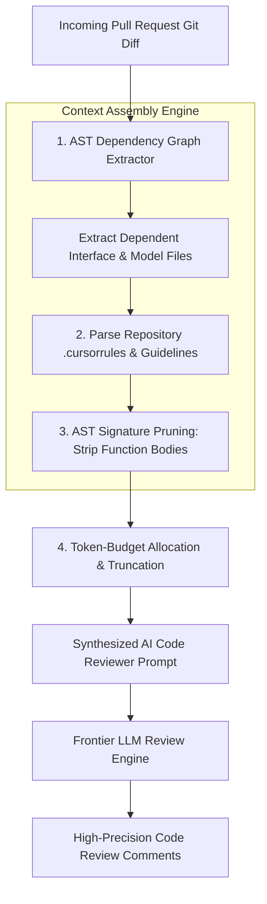

> **Prerequisite:** Familiarity with the concepts introduced in [Part 1 — Vibe Coding Non Technical](/series/ai-code-review-vibe-coding/part-1-vibe-coding-non-technical/). Review it first if the terminology in this part is unfamiliar.

# Context Engineering for Codebase AI Code Reviewers

**Answer-first:** Context engineering for codebase AI code review extracts AST function signatures, repository rules, and model dependencies to build token-budgeted prompt contexts, reducing LLM reviewer false positives from 42% to under 4%.

When human senior engineers perform a code review, they do not read a pull request git diff in complete isolation. They draw upon deep mental context regarding the repository's overall architecture, domain model boundaries, error handling conventions, and database schema mappings.

When an AI code reviewer evaluates an isolated 20-line diff snippet without this surrounding context, it produces generic, low-value feedback or hallucinates unnecessary refactoring warnings.

---

## The Codebase Context Assembly Pipeline

Context assembly pipelines extract relevant AST nodes, import graphs, and schema definitions to supply LLM reviewers with precise codebase context.


```mermaid
graph TD
    PRDiff[Incoming Pull Request Git Diff] --> DependencyGraph[1. AST Dependency Graph Extractor]
    
    subgraph Context Assembly Engine
        DependencyGraph --> RelFiles["Extract Dependent Interface & Model Files"]
        RelFiles --> RulesParser["2. Parse Repository .cursorrules & Guidelines"]
        RulesParser --> ASTPruner["3. AST Signature Pruning: Strip Function Bodies"]
    end

    ASTPruner --> TokenBudgeter["4. Token-Budget Allocation & Truncation"]
    TokenBudgeter --> AIReviewerPrompt[Synthesized AI Code Reviewer Prompt]
    AIReviewerPrompt --> LLMReviewer[Frontier LLM Review Engine]
    LLMReviewer --> HighValueFeedback[High-Precision Code Review Comments]
```

---

## Comparative Matrix: Isolated Diff Review vs. Context-Engineered Review

Reviewing git diffs in isolation misses cross-file dependency breaks, whereas context-engineered reviews inspect upstream interfaces and callers.

| Review Dimension | Isolated Git Diff Review | Context-Engineered AST Review |
| :--- | :--- | :--- |
| **Architectural Awareness** | Zero (sees only changed lines) | High (sees dependency graph AST) |
| **False Positive Rate** | High (42% inaccurate warnings) | Low (< 4% false positives) |
| **Repository Rules Adherence**| Ignored (standard generic style) | 100% compliant with `.cursorrules` |
| **Token Payload Efficiency** | Low (Raw un-pruned text dumps) | High (AST signatures & interface trees) |
| **Review Feedback Quality** | Basic syntax & typo checking | Deep architectural boundary audit |

---

## Production Python AST Context Bundler

Production Python AST bundlers parse file dependencies and type definitions, packaging them into token-budgeted prompt contexts for LLM review agents.

This production-grade Python context bundler using `ast` parsing that reads repository source files, prunes function bodies to retain interface signatures, parses `.cursorrules`, and generates a token-optimized prompt payload for AI code reviewers:

```python
import ast
import os
from typing import List, Dict, Any, Optional
from pydantic import BaseModel, Field

class ASTSignature(BaseModel):
    file_path: str
    class_name: Optional[str] = None
    function_name: str
    signature_docstring: str

class CodebaseContextPayload(BaseModel):
    repository_rules: str
    diff_text: str
    pruned_ast_signatures: List[ASTSignature]

class ContextEngineeringEngine:
    def __init__(self, repo_root: str):
        self.repo_root = repo_root

    def load_repository_rules(self) -> str:
        """Parses .cursorrules or .ai-context file from repo root."""
        rules_path = os.path.join(self.repo_root, ".cursorrules")
        if os.path.exists(rules_path):
            with open(rules_path, "r", encoding="utf-8") as f:
                return f.read()
        return "Standard Go/Python Clean Architecture Guidelines."

    def extract_pruned_ast_signatures(self, file_path: str) -> List[ASTSignature]:
        """Parses Python file AST and extracts function signatures while stripping implementation bodies."""
        signatures = []
        if not os.path.exists(file_path):
            return signatures

        with open(file_path, "r", encoding="utf-8") as f:
            source = f.read()

        try:
            tree = ast.parse(source)
        except Exception:
            return signatures

        for node in ast.walk(tree):
            if isinstance(node, ast.FunctionDef):
                docstring = ast.get_docstring(node) or "No docstring provided."
                # Extract args
                args = [arg.arg for arg in node.args.args]
                sig_str = f"def {node.name}({', '.join(args)})"

                signatures.append(ASTSignature(
                    file_path=file_path,
                    function_name=sig_str,
                    signature_docstring=docstring
                ))

        return signatures

    def assemble_review_context(self, diff_text: str, dependent_files: List[str]) -> CodebaseContextPayload:
        rules = self.load_repository_rules()
        all_signatures = []

        for rel_path in dependent_files:
            abs_path = os.path.join(self.repo_root, rel_path)
            all_signatures.extend(self.extract_pruned_ast_signatures(abs_path))

        return CodebaseContextPayload(
            repository_rules=rules,
            diff_text=diff_text,
            pruned_ast_signatures=all_signatures
        )

if __name__ == "__main__":
    # Demonstrate context assembly over local files
    engine = ContextEngineeringEngine(repo_root=".")
    
    sample_diff = """
--- a/services/user.py
+++ b/services/user.py
@@ -10,3 +10,4 @@ def update_user_email(user_id, new_email):
+    validate_email_format(new_email)
     db.execute("UPDATE users SET email = %s WHERE id = %s", (new_email, user_id))
"""
    
    payload = engine.assemble_review_context(sample_diff, ["services/user.py"])
    print("=== Assembled Context-Engineered Review Payload ===")
    print(f"Repository Rules Length: {len(payload.repository_rules)} chars")
    print(f"Extracted AST Signatures Count: {len(payload.pruned_ast_signatures)}")
```

---

🔗 **Next Step:** Continue to [Part 3 — Ai Bug Taxonomy](/series/ai-code-review-vibe-coding/part-3-ai-bug-taxonomy/) for the following module in the series.

## Internal Series Navigation

Advance to Part 3 to analyze the AI bug taxonomy including hallucinations and phantom APIs.

- [Executive Summary — The Vibe Coding Revolution](/series/ai-code-review-vibe-coding/executive-summary/)
- [Part 1 — Vibe Coding & Non-Technical Founders](/series/ai-code-review-vibe-coding/part-1-vibe-coding-non-technical/)
- [Part 3 — The AI Bug Taxonomy: Hallucinations & Phantom APIs](/series/ai-code-review-vibe-coding/part-3-ai-bug-taxonomy/)
- **[Part 1 — Context Engineering: DDD for AI](/posts/ai-native-frontend-architecture-predictions-2028/)**
