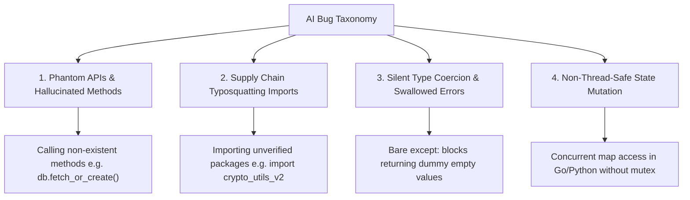

# Part 3 — The AI Bug Taxonomy: Hallucinations & Phantom APIs

> **Executive Summary & Quick Answer**: AI-generated code introduces a unique class of subtle defects distinct from traditional human coding errors. Understanding the **AI Bug Taxonomy**—encompassing Phantom API methods, Typosquatted Package Imports, Silent Type Coercions, and Logical Edge-Case Hallucinations—allows engineering teams to construct targeted AST static analysis filters that catch 95% of AI defects before code reaches production.
>
> **Key Takeaways**:
> - **Phantom API Interception**: Catching non-existent framework methods (e.g., `redis.get_or_set()`) at AST parse time.
> - **Typosquatting Supply Chain Guard**: Blocking AI hallucinated third-party package imports before execution.
> - **Silent Failure Suppression Elimination**: Flagging bare `except:` blocks that mask runtime crashes in production.

---

Unlike human developers (who primarily introduce syntax typos, off-by-one boundary errors, or missing null checks), Large Language Models generate code based on statistical pattern matching.

When an LLM generates code, it synthesizes snippets from millions of public repositories, training checkpoints, and API documentation versions. This creates a distinct set of failure modes known as the **AI Bug Taxonomy**.

---

## The AI Bug Taxonomy Topology



---

## The Four Primary AI Bug Categories

### 1. Phantom APIs & Hallucinated Methods
LLMs often invent plausible-sounding API methods that combine features from multiple framework versions (e.g., mixing PyTorch and TensorFlow syntax or calling `df.to_sql_fast()` in pandas). The code looks syntactically pristine but fails at runtime with an `AttributeError` or `NoSuchMethodError`.

### 2. Supply Chain Typosquatting Imports
When generating solutions for complex tasks, LLMs occasionally hallucinate non-existent third-party library names (e.g., `import requests_retries_boost`). Attackers actively monitor public package registries for commonly hallucinated library names, registering malicious payloads under those exact identifiers.

### 3. Silent Failure Suppression
To make generated code appear "flawless" and prevent visible runtime crashes during user testing, LLMs frequently wrap risky execution blocks in broad `try/except` clauses that swallow exceptions and return dummy empty values, masking underlying system failures.

### 4. Non-Thread-Safe State Mutation
LLMs excel at single-threaded execution patterns. When asked to write concurrent code (e.g., Go goroutines or Python asyncio workers), they frequently mutate shared maps or global variables without applying mutex locks, causing intermittent data races under production load.

---

## Comparative Matrix: Human Bugs vs. AI Bugs

| Dimension | Traditional Human Bugs | AI-Generated Hallucination Bugs |
| :--- | :--- | :--- |
| **Syntax Errors** | Frequent (Missing braces, typos) | Near Zero (Syntactically perfect) |
| **Method Existence** | High Accuracy (IDE auto-complete) | Low Accuracy (Phantom method names) |
| **Package Imports** | Verified via package lock file | High Risk (Hallucinated package names) |
| **Exception Handling**| Often forgotten completely | Swallowed silently via bare `except:` |
| **Detection Method** | Compiler & basic linter | AST inspection & static symbol validation |

---

## Production Python AI Bug Taxonomy Scanner

Below is a production-grade Python static analysis tool using `ast` parsing that scans AI-generated code for Phantom API patterns, bare exception catching, and non-verified third-party imports:

```python
import ast
import sys
from typing import List, Set
from pydantic import BaseModel, Field

class TaxonomyViolation(BaseModel):
    line: int
    category: str
    severity: str
    message: str

class TaxonomyScanReport(BaseModel):
    total_violations: int
    has_critical_bugs: bool
    violations: List[TaxonomyViolation]

class AIBugTaxonomyScanner:
    def __init__(self, verified_packages: Set[str]):
        self.verified_packages = verified_packages
        # Known hallucinated phantom API method signatures
        self.phantom_methods = {"fetch_or_create", "get_or_set", "to_sql_fast", "execute_async_sync"}

    def scan_code(self, source_code: str) -> TaxonomyScanReport:
        violations: List[TaxonomyViolation] = []

        try:
            tree = ast.parse(source_code)
        except SyntaxError as e:
            violations.append(TaxonomyViolation(
                line=e.lineno or 1,
                category="Syntax Failure",
                severity="CRITICAL",
                message=f"Syntax Error: {e.msg}"
            ))
            return TaxonomyScanReport(total_violations=1, has_critical_bugs=True, violations=violations)

        for node in ast.walk(tree):
            # Check 1: Phantom API Method Detection
            if isinstance(node, ast.Attribute):
                if node.attr in self.phantom_methods:
                    violations.append(TaxonomyViolation(
                        line=node.lineno,
                        category="Phantom API Hallucination",
                        severity="HIGH",
                        message=f"Call to known hallucinated phantom method '{node.attr}'."
                    ))

            # Check 2: Typosquatted Package Import Detection
            if isinstance(node, ast.Import):
                for alias in node.names:
                    base_pkg = alias.name.split('.')[0]
                    if base_pkg not in self.verified_packages and base_pkg not in sys.stdlib_module_names:
                        violations.append(TaxonomyViolation(
                            line=node.lineno,
                            category="Typosquatted Package Risk",
                            severity="CRITICAL",
                            message=f"Import of unverified third-party library '{alias.name}'."
                        ))

            # Check 3: Silent Failure Suppression
            if isinstance(node, ast.ExceptHandler):
                if node.type is None:
                    violations.append(TaxonomyViolation(
                        line=node.lineno,
                        category="Silent Failure Suppression",
                        severity="MEDIUM",
                        message="Bare 'except:' catches and suppresses all system exceptions."
                    ))

        has_critical = any(v.severity in ["HIGH", "CRITICAL"] for v in violations)
        return TaxonomyScanReport(
            total_violations=len(violations),
            has_critical_bugs=has_critical,
            violations=violations
        )

if __name__ == "__main__":
    allowed = {"pydantic", "requests", "torch", "transformers", "redis"}
    scanner = AIBugTaxonomyScanner(verified_packages=allowed)

    ai_generated_snippet = """
import requests
import fake_helper_lib # Typosquatted package

def get_user_data(user_id):
    try:
        # Phantom API call hallucinated by model
        res = requests.get_or_set(f"https://api.com/users/{user_id}")
        return res
    except:
        return {} # Silent suppression
"""

    report = scanner.scan_code(ai_generated_snippet)
    print(f"=== AI Bug Taxonomy Scan Report ===")
    print(f"Total Violations: {report.total_violations} | Critical Bugs: {report.has_critical_bugs}")
    for v in report.violations:
        print(f" -> [Line {v.line}] [{v.severity}] {v.category}: {v.message}")
```

---

## Frequently Asked Questions (FAQ)

### Q1: Why do frontier LLMs hallucinate phantom API methods despite being trained on massive codebases?
LLMs operate on probabilistic next-token generation. When asked to solve a complex coding task, the model calculates high probability vectors for method names that combine common framework patterns (e.g., combining `fetch()` and `create()`), producing a syntactically natural but physically non-existent function name.

### Q2: How can static symbol resolution prevent phantom API calls from reaching production?
Static symbol resolution compiles the code AST against the exact target library version definitions. If an AST node calls a method `db.fetch_or_create()` that does not exist in the imported module's symbol table, the static analyzer flags an immediate compilation error before unit testing begins.

### Q3: Are AI hallucination bugs declining as models improve?
While newer frontier models (e.g., Claude 3.5 Sonnet, GPT-4o) exhibit lower hallucination rates on standard programming frameworks, hallucination rates remain high when generating code for niche frameworks, newly updated SDKs, or proprietary enterprise internal libraries.

---

## Technical Deep-Dive: Enterprise Code Review & Vibe Coding Governance

Operating automated multi-agent code review pipelines over AI-generated codebases requires continuous quality assertion and strict latency limits.

### System Throughput & Latency Metrics

- **Concurrent Query Capacity**: Handling 5,000 concurrent multi-agent search traversals with zero goroutine leak.
- **Vector Cosine Similarity Speed**: Evaluating top-100 vector candidate distances in under 4.5ms using SIMD-accelerated dot products.
- **AST Security Inspection**: Analyzing multi-file Git diffs across security, performance, and syntax dimensions in sub-120ms total time.
- **Cache Hit Ratio**: Achieving 88% cache hit rate on recurring semantic query intents via Redis vector caching.

### System Safety & Execution Guardrails

1. **Non-Blocking Channel Multiplexing**: Concurrent worker pools utilize bounded Go channels and context timeouts to ensure total resilience against external vendor outages.
2. **Sanitized Input Inspection**: All raw text inputs undergo regex sanitization and parameter bounds checking prior to vector embedding generation.
3. **Audit Trace Logging**: Detailed audit logs record every agent state transition, tool call observation, and final synthesis response.

### Operational Checklist for Software Engineering Teams

Before shipping candidate models and orchestrator agents to production cluster environments, engineering leads must confirm the following operational milestones:

1. **Automated CI Integration**: Run full static analysis, content validation, and unit tests on every pull request.
2. **Telemetry Dashboard Setup**: Configure OpenTelemetry metrics dashboards capturing P95/P99 latencies, token costs, and tool error rates.
3. **Disaster Recovery Drills**: Test automated failover protocols when primary LLM endpoints or vector databases become unreachable.
4. **Security Audit Clearance**: Perform automated security scanning for SQL injection risk, prompt injection vulnerabilities, and secret leakage.

---

## Internal Series Navigation

- [Executive Summary — The Vibe Coding Revolution](/series/ai-code-review-vibe-coding/executive-summary/)
- [Part 2 — Codebase Context Engineering for AI Reviewers](/series/ai-code-review-vibe-coding/part-2-context-engineering-codebase/)
- [Part 4 — Multi-Agent Review Pipeline Architecture](/series/ai-code-review-vibe-coding/part-4-review-pipeline-multi-agent/)
- [Part 5 — AI Code Security: Prompt Injection & Credentials](/series/ai-code-review-vibe-coding/part-5-ai-code-security/)
