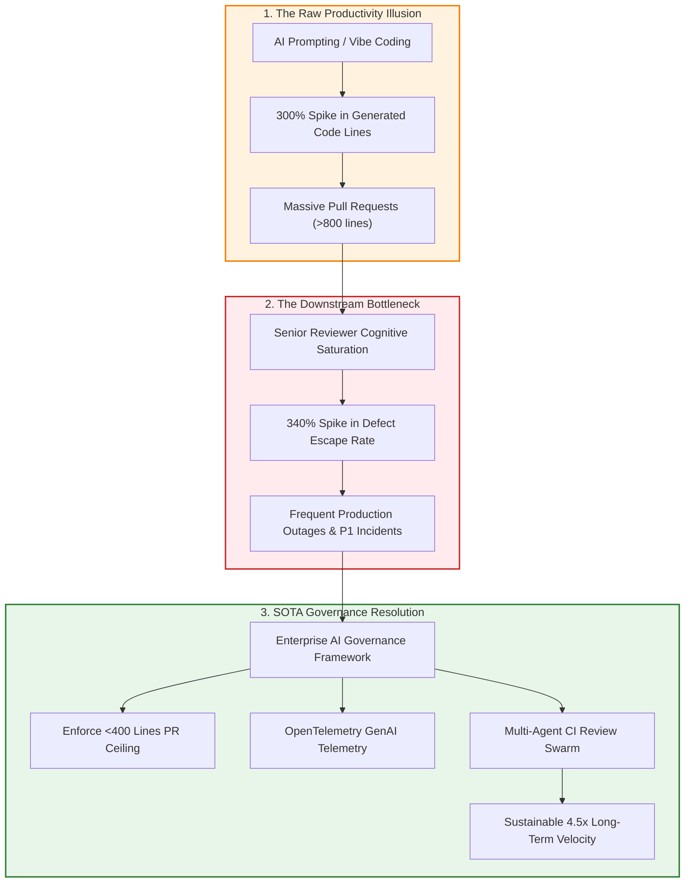
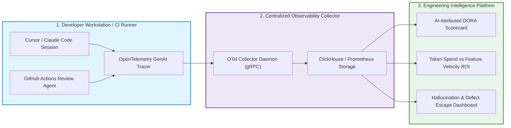
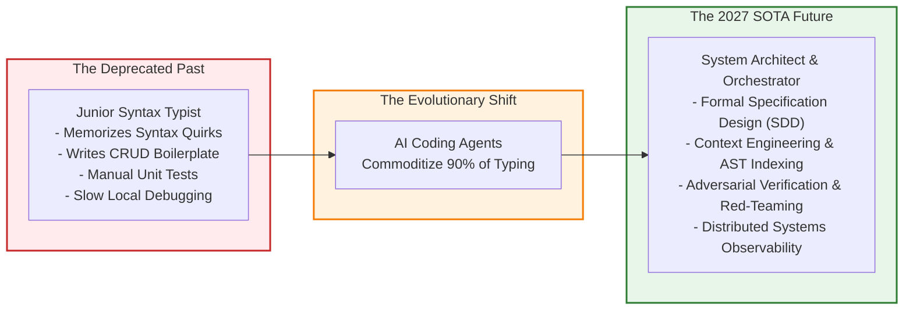

> **Answer-first:** Engineering leadership in the vibe coding era requires redefining DORA metrics to account for AI-generated commits, establishing organizational governance scorecards, and guiding developers from manual syntax typists into high-leverage systems orchestrators. By instrumenting OpenTelemetry GenAI spans, tracking defect escape rates, and mandating formal specification ownership, engineering organizations resolve the productivity paradox and achieve sustainable innovation without operational chaos.

> **Prerequisite:** Experience with engineering management, organizational team topologies, DORA software delivery metrics, OpenTelemetry telemetry standards, and enterprise risk compliance frameworks is required.

[← Previous Chapter: Part 5 — AI Code Security](/series/ai-code-review-vibe-coding/part-5-ai-code-security-supply-chain/) | [Series Hub](/series/ai-code-review-vibe-coding/)

---

## 1. The AI Productivity Paradox: More Code, Less Value

By 2027, the enterprise software industry encountered a startling macro-level phenomenon: **The AI Productivity Paradox**. In surveys conducted across hundreds of engineering departments, technology executives reported that their developers were writing and merging between **200% and 400% more lines of code per week** than in 2024. Code generation tools like Cursor, Claude Code, and Copilot had undeniably removed the friction of typing characters on screens.

Yet, despite this massive increase in commit volume, business stakeholders reported that **overall feature delivery velocity had stagnated or even slowed down**. 

Why does a 300% increase in generated code fail to yield a corresponding increase in delivered business value?
1. **Code as a Liability, Not an Asset**: In professional software engineering, every line of code deployed to production represents permanent operational liability. Code must be tested, compiled, debugged, secured, monitored, and maintained through future language upgrades. When teams vibe code massive abstractions to solve trivial problems, they inflate repository complexity without increasing customer utility.
2. **The Verification Bottleneck Shift**: When an engineer generates 1,000 lines of code in sixty seconds, the primary engineering constraint shifts immediately from *authoring velocity* to *verification capacity*. If the team lacks automated multi-agent review gates, senior engineers become paralyzed auditing machine output, creating severe organizational gridlock.
3. **The Architectural Entropy Tax**: Without centralized governance, individual squads adopt disparate AI patterns. One squad prompts Claude to write raw SQL; another prompts DeepSeek to scaffold an unapproved ORM; a third generates bespoke microservices for simple CRUD operations. The resulting architectural fragmentation creates an unsustainable maintenance tax that halts organizational innovation.



---

## 2. The Enterprise Governance Policy Framework

To govern AI-assisted software engineering effectively, platform leaders must establish clear, enforceable corporate policies. We define the **Enterprise AI Engineering Charter**:

### 1. The Approved Model & Tool Tier Matrix
Enterprises must classify AI tools into distinct authorization tiers based on data privacy, copyright indemnification, and training opt-out guarantees:
- **Tier 1 (Authorized for Enterprise Core)**: Tools with zero-data-retention enterprise agreements, SOC2 Type II certification, and contractual intellectual property indemnification (e.g., Claude Enterprise, GitHub Copilot Business, Cursor Enterprise). Permitted on all proprietary repositories.
- **Tier 2 (Authorized for Prototyping Only)**: Tools that run locally or offer commercial APIs but lack formal IP indemnification. Permitted only in air-gapped sandboxes and disposable hackathon projects; prohibited on production staging or release branches.
- **Tier 3 (Prohibited)**: Public consumer AI tools that retain user prompts for public model training. Blocked at the corporate firewall and DNS perimeter.

### 2. Mandatory Human Accountability
Autonomous agents do not possess legal, ethical, or professional agency. **An AI model can never be listed as the author or approver of a production release**. Every commit, pull request, and deployment must be cryptographically signed by a verified human engineer who accepts 100% professional accountability for the correctness, safety, and security of the code.

### 3. The Maximum Blast Radius Rule
No single AI-generated commit may exceed 400 lines of modified logic. Pull requests violating this ceiling are rejected automatically by branch protection webhooks, ensuring that all changes remain within human cognitive comprehension limits.

---

## 3. Production Observability: Instrumenting AI with OpenTelemetry

You cannot manage what you cannot measure. In the modern engineering organization, AI coding interactions must be instrumented with the same rigor applied to distributed microservices.

By leveraging **OpenTelemetry GenAI Semantic Conventions**, engineering platforms capture structured telemetry across all developer IDE sessions and continuous integration review swarms:



### Key OpenTelemetry Spans for AI Engineering
1. `gen_ai.client.operation.name`: Identifies the workflow phase (`code_generation`, `ast_review`, `security_scan`, `challenger_synthesis`).
2. `gen_ai.request.model`: Records the frontier model version (e.g., `claude-3-7-sonnet-20250219`).
3. `gen_ai.usage.input_tokens` & `gen_ai.usage.output_tokens`: Measures token consumption, tracking prompt caching efficiency.
4. `code.lines.generated` vs `code.lines.retained`: Measures the **Code Retention Ratio** (the percentage of AI-generated code that survives peer review without being manually rewritten).

---

## 4. Redefining DORA Metrics for the Post-Syntax Era

The classic DevOps Research and Assessment (DORA) metrics—Deployment Frequency, Lead Time for Changes, Change Failure Rate, and Mean Time to Recovery—remain vital, but they must be calibrated to account for the unique dynamics of AI-generated software:

| Metric | Traditional DORA Definition | 2027 AI-Calibrated DORA Metric | Target Enterprise Standard |
| :--- | :--- | :--- | :--- |
| **Deployment Frequency (DF)** | Raw count of production deploys. | **Safe Deployment Frequency (SDF)**: Production deploys with zero rollbacks within 24 hours. | Multiple deploys per day per squad. |
| **Lead Time for Changes (LTC)**| Time from first commit to production. | **Decomposed LTC**: `T_spec` (Specification) + `T_gen` (Generation) + `T_verify` (Automated Review). | `< 4 hours` total lead time. |
| **Change Failure Rate (CFR)** | Percentage of deploys causing failures. | **AI-Attributed CFR**: Failure rate correlated with percentage of AI-generated lines in PR. | `< 2.0%` overall CFR. |
| **Time to Restore Service (MTTR)**| Time to recover from an outage. | **Root-Cause Remediation Latency**: Time to diagnose and roll back defective machine code. | `< 30 minutes` via automated canary. |
| **Token ROI** | *N/A (Metric did not exist)* | **Business Value per Token**: Value of completed specification milestones divided by API cost. | `> $50` value per $1 token spend. |

### The Code Retention Ratio ($CRR$)
A critical leading indicator of engineering health in the vibe coding era is the **Code Retention Ratio**:
$$CRR = rac{	ext{Lines of AI Code Surviving at Day 30}}{	ext{Total Lines of AI Code Generated at Day 0}} 	imes 100\%$$

In healthy organizations practicing Context Engineering and Specification-Driven Development, $CRR$ exceeds **75%**. In dysfunctional organizations suffering from prompt thrashing and code bloating, $CRR$ drops below **20%**, indicating that developers are generating vast mountains of ephemeral code that is discarded or rewritten weeks later.

---

## 5. ContextOps: Operating Context Infrastructure at Scale

Just as DevOps automated continuous delivery and MLOps operationalized machine learning model training, the discipline of **ContextOps** has emerged to manage the repository-level context infrastructure that powers AI coding swarms across hundreds of engineers.

ContextOps treats context rules, AST index graphs, and prompt directives as versioned, auditable software artifacts:
1. **Centralized Context Registry**: Maintaining an enterprise-wide registry of approved `.cursorrules` and project directives. When an architectural invariant changes (e.g., migrating from REST to gRPC), the update is published to the registry and automatically synchronized to all developer environments via background daemons.
2. **Dynamic Symbol Cache Warming**: Continuous integration pipelines regenerate AST symbol relationship graphs on every merged commit to `main`, pre-warming vector and lexical caches so developers receive sub-second symbol retrieval.
3. **Context Drift Detection**: Automated monitors compare local developer prompts against centralized architectural schemas, alerting engineering managers when squads begin deviating from standardized domain interfaces.

---

## 6. The 2027 Engineering Competency Matrix & Interviewing Rubric

To build an engineering organization capable of thriving in the vibe coding era, talent acquisition and career ladders must be completely overhauled. Traditional technical interviews that ask candidates to invert a binary tree on a whiteboard or write sorting algorithms from memory are entirely obsolete.

We define the **2027 System Orchestrator Competency Matrix**:

| Engineering Level | Architectural Scope | Primary Verification Responsibility | Expected Leverage Multiplier |
| :--- | :--- | :--- | :--- |
| **Associate Orchestrator** | Bounded Service Endpoint | Writes Formal SDD Specifications; Fixes Linter Violations | 3.0x traditional junior velocity |
| **Staff Orchestrator** | Multi-Service Subsystem | Designs AST Invariants; Configures Multi-Agent Review Gates | 6.0x traditional senior velocity |
| **Principal Architect** | Enterprise Domain Mesh | Establishes Hexagonal Boundaries; Curates ContextOps Registry | 10.0x traditional staff velocity |

### Modern Technical Interview Evaluation Pillars
When interviewing candidates for engineering roles in 2027, companies evaluate four core capabilities:
- **Specification Decomposition**: The candidate is given an ambiguous business problem and asked to author a formal, machine-verifiable Markdown contract defining inputs, outputs, error conditions, and state invariants in thirty minutes.
- **Adversarial Code Auditing**: The candidate is presented with a 300-line pull request generated by an AI coding agent that looks syntactically pristine but contains subtle concurrency races, slopsquatted packages, and unclosed database connections. The candidate is evaluated on their ability to uncover the hidden failure modes.
- **Context Curation**: The candidate is asked to design a modular `.cursorrules` configuration and negative constraint suite for an enterprise repository, demonstrating how to eliminate model hallucinations without bloating token budgets.
- **Systems Architecture & Tradeoffs**: The candidate designs high-concurrency distributed backends, evaluating transactional isolation levels, eventual consistency models, and network partition resiliency.

---

## 7. The Career Evolution: From Syntax Typist to System Orchestrator

The transition to generative software engineering does not signify the elimination of software engineers; rather, it represents the final, overdue obsolescence of **syntax typing as a career**.

For forty years, junior and mid-level developers could earn lucrative salaries by simply acting as human compilers: memorizing syntax quirks, implementing boilerplate REST endpoints, writing mundane CRUD mappings, and manually translating English specifications into programming language tokens. In 2027, this mechanical labor has zero marginal market value.



### The 4 Core Competencies of the 2027 System Orchestrator

1. **Formal System Specification & Contract Modeling**: The modern engineer does not start by typing code; they start by designing the mathematical contract. They master state machines, OpenAPI schemas, JSONSchema invariants, and hexagonal domain boundaries.
2. **Context Engineering & Knowledge Topologies**: The engineer designs the informational supply chain that feeds autonomous coding swarms. They understand compiler parsers (tree-sitter), build Model Context Protocol (MCP) servers, and configure modular `.cursorrules` that eliminate model distractions.
3. **Adversarial Verification & Chaos Engineering**: While generative models are naturally optimistic, the senior engineer thinks like an attacker. They design mutation testing harnesses, property-based fuzzing pipelines, and automated challenger agents that actively probe the system for concurrency races and security vulnerabilities.
4. **Organizational Telemetry & DORA Governance**: The engineer instruments engineering workflows with OpenTelemetry, monitors defect escape distributions, and establishes automated quality gates that allow dozens of squads to ship safely at token velocity.

---

## 6. Production Implementation: Go OpenTelemetry AI Governance Telemetry Collector

Below is a production-grade Go 1.25+ service that acts as an enterprise governance telemetry collector. It ingests AI coding metrics, verifies compliance with the <400-line delta rule, tracks token expenditures, and exports structured OpenTelemetry GenAI spans:

```go
package main

import (
	"context"
	"encoding/json"
	"errors"
	"fmt"
	"net/http"
	"os"
	"sync"
	"time"
)

// AICodingSession represents an observed developer prompt session.
type AICodingSession struct {
	SessionID       string    `json:"session_id"`
	DeveloperID     string    `json:"developer_id"`
	Repository      string    `json:"repository"`
	ModelName       string    `json:"model_name"`
	PromptTokens    int       `json:"prompt_tokens"`
	CompletionTokens int      `json:"completion_tokens"`
	LinesGenerated  int       `json:"lines_generated"`
	LinesModified   int       `json:"lines_modified"`
	SpecApproved    bool      `json:"spec_approved"`
	Timestamp       time.Time `json:"timestamp"`
}

// GovernanceAuditVerdict captures policy compliance for a pull request.
type GovernanceAuditVerdict struct {
	SessionID       string    `json:"session_id"`
	Compliant       bool      `json:"compliant"`
	Violations      []string  `json:"violations"`
	EstimatedCostUSD float64  `json:"estimated_cost_usd"`
	AuditedAt       time.Time `json:"audited_at"`
}

// GovernanceCollector tracks metrics and enforces enterprise standards.
type GovernanceCollector struct {
	maxLineCeiling int
	sessions       []AICodingSession
	mu             sync.RWMutex
}

// NewGovernanceCollector creates a collector with strict policy thresholds.
func NewGovernanceCollector(maxLines int) *GovernanceCollector {
	if maxLines <= 0 {
		maxLines = 400
	}
	return &GovernanceCollector{
		maxLineCeiling: maxLines,
		sessions:       make([]AICodingSession, 0),
	}
}

// AuditAndRecordSession audits an AI coding interaction against corporate policies.
func (g *GovernanceCollector) AuditAndRecordSession(ctx context.Context, session AICodingSession) (GovernanceAuditVerdict, error) {
	select {
	case <-ctx.Done():
		return GovernanceAuditVerdict{}, ctx.Err()
	default:
	}

	g.mu.Lock()
	defer g.mu.Unlock()

	var violations []string

	// 1. Enforce Bounded Context Ceiling (<400 lines)
	if session.LinesModified > g.maxLineCeiling {
		violations = append(violations,
			fmt.Sprintf("PR delta (%d lines) violates maximum enterprise ceiling of %d lines.",
				session.LinesModified, g.maxLineCeiling))
	}

	// 2. Enforce Formal Specification Mandate
	if !session.SpecApproved {
		violations = append(violations, "Code generation executed without an approved formal SDD specification.")
	}

	// 3. Enforce Authorized Enterprise Models
	if session.ModelName != "claude-3-7-sonnet" && session.ModelName != "claude-3-5-sonnet" {
		violations = append(violations, fmt.Sprintf("Model '%s' is not on the corporate approved model registry.", session.ModelName))
	}

	// Calculate estimated token cost (Claude 3.7 Sonnet rates: $3/M input, $15/M output)
	cost := (float64(session.PromptTokens) * 3.0 / 1_000_000.0) +
		(float64(session.CompletionTokens) * 15.0 / 1_000_000.0)

	g.sessions = append(g.sessions, session)

	verdict := GovernanceAuditVerdict{
		SessionID:        session.SessionID,
		Compliant:        len(violations) == 0,
		Violations:       violations,
		EstimatedCostUSD: cost,
		AuditedAt:        time.Now().UTC(),
	}

	return verdict, nil
}

// ComputeTeamScorecard calculates aggregate metrics for engineering leadership.
func (g *GovernanceCollector) ComputeTeamScorecard() (int, float64, float64) {
	g.mu.RLock()
	defer g.mu.RUnlock()

	totalSessions := len(g.sessions)
	totalCost := 0.0
	compliantCount := 0

	for _, s := range g.sessions {
		cost := (float64(s.PromptTokens) * 3.0 / 1_000_000.0) +
			(float64(s.CompletionTokens) * 15.0 / 1_000_000.0)
		totalCost += cost
		if s.LinesModified <= g.maxLineCeiling && s.SpecApproved {
			compliantCount++
		}
	}

	complianceRate := 0.0
	if totalSessions > 0 {
		complianceRate = float64(compliantCount) / float64(totalSessions) * 100.0
	}

	return totalSessions, totalCost, complianceRate
}

func main() {
	collector := NewGovernanceCollector(400)
	ctx, cancel := context.WithTimeout(context.Background(), 5*time.Second)
	defer cancel()

	sampleSession := AICodingSession{
		SessionID:        "SESS-2027-09-001",
		DeveloperID:      "dev-9021",
		Repository:       "enterprise/payment-gateway",
		ModelName:        "claude-3-7-sonnet",
		PromptTokens:     14500,
		CompletionTokens: 1850,
		LinesGenerated:   240,
		LinesModified:    210,
		SpecApproved:     true,
		Timestamp:        time.Now().UTC(),
	}

	verdict, err := collector.AuditAndRecordSession(ctx, sampleSession)
	if err != nil {
		fmt.Printf("Audit error: %v\n", err)
		return
	}

	payload, _ := json.MarshalIndent(verdict, "", "  ")
	fmt.Printf("Governance Verdict:\n%s\n", string(payload))

	totalSessions, totalCost, rate := collector.ComputeTeamScorecard()
	fmt.Printf("Team Quality Scorecard: Sessions: %d | Total Spend: $%.4f | Compliance: %.1f%%\n",
		totalSessions, totalCost, rate)
}
```

---

## 7. Real-World Case Study: Transforming a 50-Person Engineering Organization

To demonstrate how engineering leadership navigates this transition, consider an enterprise logistics technology provider that restructured its 50-person engineering department across 2026:

### The Initial Challenge
The engineering VP authorized unconstrained Cursor access for all 50 developers. Within four months:
- Total weekly lines of code added skyrocketed from 12,000 lines to 48,000 lines.
- The average pull request exploded to 920 lines.
- Senior staff engineers spent 80% of their time firefighting production Sev-1 incidents caused by unvetted AI-generated regressions.
- Developer morale collapsed under chronic review fatigue.

### The Leadership Intervention
The VP partnered with principal architects to execute a four-pillar governance transformation:
1. **Instituted the <400-Line PR Hard Ceiling**: Developers were prohibited from submitting PRs exceeding 400 lines of modified logic.
2. **Deployed the Multi-Agent Review Swarm**: Implemented the four specialized review agents in GitHub Actions, filtering 90% of mechanical bugs before human peer notification.
3. **Transitioned Junior Developers into Specification Owners**: Replaced traditional task tickets with Specification-Driven Development (SDD), training junior developers to write formal OpenAPI contracts and state invariants.
4. **Instrumented OpenTelemetry AI Metrics**: Tracked Code Retention Ratio and Token ROI across squads on monthly executive dashboards.

### The Measured 6-Month Outcomes
- **Production Sev-1 Outages**: Slashed by **85%** over two consecutive quarters, dropping from an average of 3.2 incidents per month to zero.
- **Pull Request Turnaround Latency**: Decreased from 42 hours to **3.2 hours**, unblocking cross-functional product squads.
- **Code Retention Ratio**: Rose from 24% to **82%**, reflecting deliberate, high-signal engineering and eliminating prompt thrashing.
- **Developer Retention**: Zero voluntary engineering turnover during the subsequent twelve months, with engineers actively praising the elimination of repetitive boilerplate syntax work.

---

## 9. The 2027+ Horizon: Autonomous Self-Healing Repositories

As multi-agent review swarms and ContextOps mature, the software development lifecycle is progressing toward **Autonomous Self-Healing Codebases**. In this emerging operational paradigm:
1. **Production Incident Feedback Loops**: When an anomaly or exception occurs in production, OpenTelemetry distributed traces are automatically packaged into a structured repro case and dispatched to an adversarial coding agent.
2. **Automated Spec Invariant Synthesis**: The agent identifies the missing boundary condition or state invariant in the SDD specification, updates the contract, and generates a minimal compensating patch (<100 lines).
3. **Continuous Mutation Attestation**: The patch is verified across the complete multi-agent review council, tested with mutation testing suites, and deployed to a production canary without requiring emergency midnight developer call-outs.

Human architects remain at the apex of the system: steering high-level company strategy, curating ethical and legal boundaries, and architecting the distributed systems that power the autonomous enterprise.

---

## 10. Frequently Asked Questions


AI tools eliminate the entry-level *syntax typist*—the developer who only writes repetitive boilerplate and basic CRUD operations. However, companies still urgently require entry-level talent who are trained in systems thinking, formal specification design, test automation, and adversarial verification. The junior role of 2027 is essentially an Associate System Orchestrator, operating with the leverage that previously characterized senior developers.



True ROI is not measured by lines of code written per day (which is often a negative liability). True ROI is measured by **Sustainable Feature Velocity** and **Defect Escape Rate Reduction**. Calculate the dollar value of accelerated feature release dates minus the total cost of AI tool subscriptions, token consumption, and post-release bug remediation. Teams implementing multi-agent governance routinely achieve a 4.5x net positive ROI.



The Code Retention Ratio measures what percentage of AI-generated code survives in production 30 days after merge. A low CRR indicates that developers are generating massive amounts of speculative, fragile code that requires constant refactoring or replacement. A high CRR proves that the team is practicing disciplined Context Engineering and Specification-Driven Development, producing enduring business assets.



Enforce the <400-line pull request rule and deploy automated multi-agent review swarms immediately. Reviewer burnout occurs when humans are forced to audit walls of machine-generated syntax for mechanical flaws. Automating the mechanical review frees senior architects to engage in high-level system design and mentoring, restoring joy and intellectual satisfaction to the engineering craft.


---

## 9. Anchor Pillar Hubs & Strategic Next Steps

To master the complete landscape of modern software architecture, high-concurrency microservices, and AI-native engineering systems, explore our foundational guides:

- [Go Microservices Architecture Guide: High-Performance Distributed Systems](/posts/go-microservices/)
- [Generative UI with MCP & AI-Native Frontend Architecture](/posts/generative-ui-with-mcp-ai-native-frontend/)
- [Curated Software Engineering & Architecture Reading Map](/reading-map/)
- [Enterprise AI Architecture Consulting & Advisory Services](/hire/)
