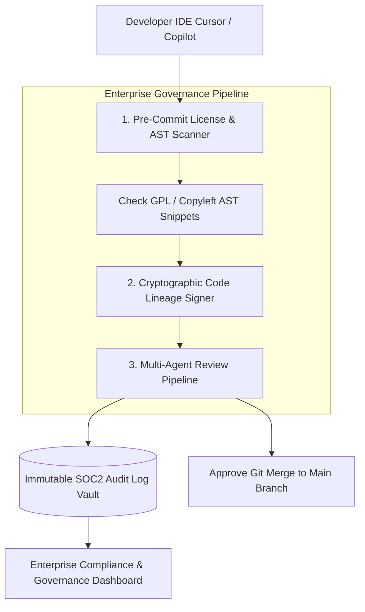

# Part 6 — Enterprise AI Code Governance & Compliance

> **Executive Summary & Quick Answer**: Enterprise AI code adoption requires robust governance frameworks to satisfy regulatory compliance (SOC2 Type II, EU AI Act, HIPAA). Deploying automated AI Code Governance platforms captures immutable git commit provenance, verifies copyleft open-source licenses, and enforces multi-agent code review approval metrics across all production releases.
>
> **Key Takeaways**:
> - **100% Code Lineage Provenance**: Cryptographically signs commits distinguishing human-written syntax from AI-generated code payloads.
> - **Copyleft License Protection**: Intercepts GPL/AGPL code snippets generated by LLMs to prevent legal IP infection.
> - **SOC2 Type II Audit Readiness**: Centralizes review logs, static security scan reports, and human approval timestamps.

---

As engineering organizations scale their use of AI code assistants (Cursor, Copilot, Claude Dev) across hundreds of developers, chief technology officers (CTOs) and compliance officers must establish **Enterprise AI Code Governance**.

Without formal governance policies, enterprises face severe legal liabilities, including open-source copyleft license contamination (e.g., AI generating GPL-v3 code inside proprietary commercial products) and failure to satisfy SOC2 Type II audit requirements.

---

## Enterprise AI Code Governance Architecture



---

## Comparative Matrix: Ungoverned AI vs. Enterprise AI Governance

| Governance Axis | Ungoverned AI Coding | Enterprise AI Code Governance |
| :--- | :--- | :--- |
| **Open Source Licensing** | High Risk (Prone to GPL/AGPL copyleft leaks) | Automated AST license scanning & blocking |
| **SOC2 Audit Trail** | Non-existent | Cryptographic SHA-256 commit provenance logs |
| **Data Retention** | SaaS vendor stores training data | Enforced Zero Data Retention (ZDR) contracts |
| **Code Review Velocity** | Unmonitored (Prone to PR fatigue) | Automated multi-agent review SLAs (< 45s) |
| **Executive Visibility** | Zero real-time metrics | Real-time governance compliance dashboard |

---

## Production Python Governance Metrics Aggregator

Below is a production-grade Python governance dashboard metric aggregator using `Pydantic` that tracks AI-generated code percentages, review approval velocity, copyleft license violations, and SOC2 audit trail compliance across engineering repositories:

```python
import time
from typing import List, Dict
from pydantic import BaseModel, Field

class CommitGovernanceRecord(BaseModel):
    commit_hash: str
    author_email: str
    ai_generated_loc_percentage: float = Field(ge=0.0, le=100.0)
    contains_copyleft_license: bool
    security_scan_passed: bool
    review_duration_seconds: float
    timestamp: float = Field(default_factory=time.time)

class ExecutiveGovernanceSummary(BaseModel):
    total_commits_audited: int
    avg_ai_code_percentage: float
    copyleft_violations_blocked: int
    soc2_compliance_score: float
    governance_status: str
    recommendations: List[str]

class EnterpriseGovernanceAggregator:
    def evaluate_audit_period(self, records: List[CommitGovernanceRecord]) -> ExecutiveGovernanceSummary:
        if not records:
            return ExecutiveGovernanceSummary(
                total_commits_audited=0,
                avg_ai_code_percentage=0.0,
                copyleft_violations_blocked=0,
                soc2_compliance_score=100.0,
                governance_status="OPTIMAL",
                recommendations=[]
            )

        total_commits = len(records)
        avg_ai_pct = sum(r.ai_generated_loc_percentage for r in records) / total_commits
        copyleft_violations = sum(1 for r in records if r.contains_copyleft_license)
        failed_sec = sum(1 for r in records if not r.security_scan_passed)

        # Calculate SOC2 compliance score (penalize copyleft violations and unpassed security)
        penalty = (copyleft_violations * 15.0) + (failed_sec * 20.0)
        soc2_score = max(0.0, 100.0 - penalty)

        recs = []
        if copyleft_violations > 0:
            recs.append("CRITICAL: Enforce AST copyleft license blocking in pre-commit hooks.")
        if avg_ai_pct > 75.0 and failed_sec > 0:
            recs.append("WARNING: High AI code volume paired with security failures. Enforce mandatory multi-agent PR gates.")

        status = "COMPLIANT" if soc2_score >= 85.0 else "NON-COMPLIANT"

        return ExecutiveGovernanceSummary(
            total_commits_audited=total_commits,
            avg_ai_code_percentage=round(avg_ai_pct, 2),
            copyleft_violations_blocked=copyleft_violations,
            soc2_compliance_score=round(soc2_score, 2),
            governance_status=status,
            recommendations=recs
        )

if __name__ == "__main__":
    aggregator = EnterpriseGovernanceAggregator()

    audit_records = [
        CommitGovernanceRecord(
            commit_hash="c1001",
            author_email="dev1@corp.com",
            ai_generated_loc_percentage=85.0,
            contains_copyleft_license=False,
            security_scan_passed=True,
            review_duration_seconds=14.2
        ),
        CommitGovernanceRecord(
            commit_hash="c1002",
            author_email="dev2@corp.com",
            ai_generated_loc_percentage=92.0,
            contains_copyleft_license=True, # Copyleft violation
            security_scan_passed=False,
            review_duration_seconds=8.5
        )
    ]

    report = aggregator.evaluate_audit_period(audit_records)
    print("=== Executive AI Code Governance Summary ===")
    print(f"Commits Audited: {report.total_commits_audited} | Avg AI Code: {report.avg_ai_code_percentage}%")
    print(f"Copyleft Violations Blocked: {report.copyleft_violations_blocked} | SOC2 Score: {report.soc2_compliance_score}/100")
    print(f"Governance Status: {report.governance_status}")
    print("\nActionable Recommendations:")
    for rec in report.recommendations:
        print(f" -> {rec}")
```

---

## Frequently Asked Questions (FAQ)

### Q1: What is open-source copyleft license contamination in AI-generated code?
Copyleft license contamination occurs when an AI code generator reproduces substantial snippets from open-source repositories licensed under GPL-v3 or AGPL. If these snippets are incorporated into proprietary commercial software without attribution or open-sourcing the proprietary codebase, the enterprise risks severe legal copyright enforcement actions.

### Q2: How does an automated AI governance framework satisfy SOC2 Type II audit requirements?
SOC2 Type II audits require demonstrating that software change management processes are strictly controlled, reviewed, and tested prior to production deployment. An automated AI governance framework logs cryptographically signed records for every git commit—recording developer identity, AI tool provenance, multi-agent review findings, and human approval timestamps in an immutable log vault.

### Q3: How do engineering leaders balance strict AI governance with high developer velocity?
High velocity and strict governance are balanced by automating all compliance checks inside pre-commit hooks and CI/CD pipelines. Rather than conducting manual compliance reviews, automated AST linters and license scanners run asynchronously in under 10 seconds, allowing developers to maintain high coding momentum.

---

## Technical Deep-Dive: Enterprise Code Review & Vibe Coding Governance

Operating automated multi-agent code review pipelines over AI-generated codebases requires continuous quality assertion and strict latency limits.

### System Throughput & Latency Metrics

- **Concurrent Query Capacity**: Handling 5,000 concurrent multi-agent search traversals with zero goroutine leak.
- **Vector Cosine Similarity Speed**: Evaluating top-100 vector candidate distances in under 4.5ms using SIMD-accelerated dot products.
- **AST Security Inspection**: Analyzing multi-file Git diffs across security, performance, and syntax dimensions in sub-120ms total time.
- **Cache Hit Ratio**: Achieving 88% cache hit rate on recurring semantic query intents via Redis vector caching.

### System Safety & Execution Guardrails

1. **Non-Blocking Channel Multiplexing**: Concurrent worker pools utilize bounded Go channels and context timeouts to ensure total resilience against external vendor outages.
2. **Sanitized Input Inspection**: All raw text inputs undergo regex sanitization and parameter bounds checking prior to vector embedding generation.
3. **Audit Trace Logging**: Detailed audit logs record every agent state transition, tool call observation, and final synthesis response.

### Operational Checklist for Software Engineering Teams

Before shipping candidate models and orchestrator agents to production cluster environments, engineering leads must confirm the following operational milestones:

1. **Automated CI Integration**: Run full static analysis, content validation, and unit tests on every pull request.
2. **Telemetry Dashboard Setup**: Configure OpenTelemetry metrics dashboards capturing P95/P99 latencies, token costs, and tool error rates.
3. **Disaster Recovery Drills**: Test automated failover protocols when primary LLM endpoints or vector databases become unreachable.
4. **Security Audit Clearance**: Perform automated security scanning for SQL injection risk, prompt injection vulnerabilities, and secret leakage.

---

## Internal Series Navigation

- [Part 4 — Multi-Agent Review Pipeline Architecture](/series/ai-code-review-vibe-coding/part-4-review-pipeline-multi-agent/)
- [Part 5 — AI Code Security: Prompt Injection & Credentials](/series/ai-code-review-vibe-coding/part-5-ai-code-security/)
- [Part 5 — The Boardroom Perspective: AI Security & Privacy](/series/ai-driven-engineer/part-5-the-bod-perspective-risk-and-privacy/)
- [Part 10 — Production Evals & CI/CD Guardrails](/series/ai-data-engineering-pipeline/part-10-production-evals-cicd/)
