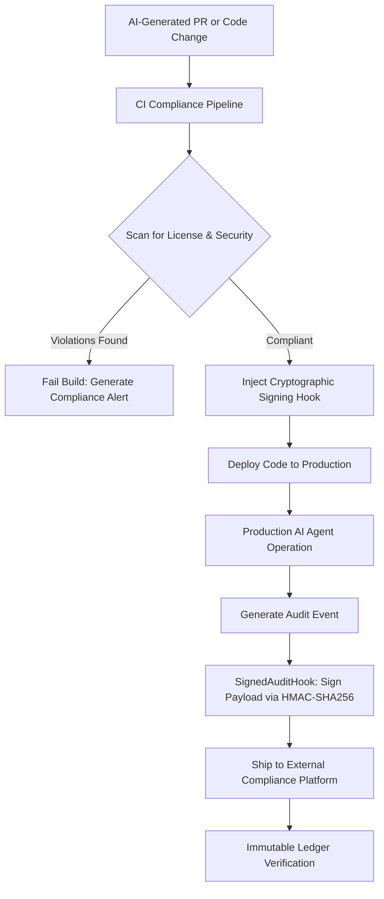

> **Prerequisite:** [AI Code Security: OWASP LLM Top 10, RAG Poisoning & Zero Trust]()

As highlighted earlier in this series, the METR study (2025) revealed a striking paradox: experienced developers using AI tools were actually **19% slower** on complex real-world tasks, even while believing they were 24% faster.

The perception-reality gap in that study is not a finding about AI capability. It is a finding about organizational maturity. The developers were not using AI badly. They were using AI excellently — for the wrong measurement system. They were fast at generating code. The slowdown came from the verification overhead, the architectural corrections, the context limitations that caused AI to generate code for a system it did not understand, and the integration friction of working with AI in a complex existing codebase.

The teams winning the AI transition are not the ones that generate the most code. They are the ones that have built the operational infrastructure — governance, observability, context engineering, and structured workflows — that makes AI-generated code reliable enough to ship at speed, safe enough to trust, and maintainable enough to survive its own velocity.

This final part covers that infrastructure.

> **Scope note:** This article covers governance and observability *as applied to AI code review teams and the code they produce* — tool policies, data classification, spec-first workflows, and the production monitoring specific to AI-assisted development. For the **career mindset shift** from engineer to orchestrator at depth, see [From Coder to AI Orchestrator]() in the AI-Driven Engineer series. For **platform-level AI observability** — inference monitoring, eval frameworks, and model performance dashboards — see [AI Observability & Evals]() in the AI-Driven Playbook series.

---

## The AI Productivity Paradox: Why More Code Generates Less Value

Before addressing the solutions, the problem requires honest framing. AI coding tools have created a counterintuitive dynamic that enterprises are now navigating:

**Individual speed vs. organizational velocity**

Individual developers complete scoped coding tasks faster with AI. This is well-documented and real. The productivity gains — 55% faster task completion in scoped scenarios, faster boilerplate, faster documentation — are genuine.

But organizational delivery velocity — measured by DORA metrics (deployment frequency, lead time for changes, change failure rate, time to restore service) — shows much more modest improvements at the team and company level. Industry telemetry suggests PR throughput increases of 5–15% in practice, not the 2–10× often claimed.

**The bottleneck migration**

AI does not eliminate work; it moves it. Gains in code generation are offset by:

- Increased review time (more PRs, each requiring careful verification)
- Higher defect rates in AI-assisted PRs (leading to more rework cycles)
- "Semantic entropy" — AI generates new implementations of existing functionality rather than reusing it, creating redundant code that no one fully understands
- Context thrash — engineers spending significant time managing AI sessions, crafting prompts, and correcting context-unaware output

**The 10× myth**

The claim that AI makes developers 10× more productive is not supported by any rigorous study. What the evidence shows: AI meaningfully accelerates boilerplate-heavy tasks, documentation, and well-defined feature implementation with clear specifications. It does not yet meaningfully accelerate architectural decision-making, complex debugging, system design, or any work where the bottleneck is understanding rather than typing.

Teams that measure productivity by lines of code or PR count will appear highly productive while accumulating technical debt, security vulnerabilities, and architectural entropy at an accelerating rate.

**The path forward:** measure outcomes, not output. The metrics that matter are: cycle time from requirements to production, defect escape rate, security incident frequency, and system reliability — not commits per day.

---

## Enterprise Governance: The Policy Framework

Organizations that have attempted AI coding adoption without governance have consistently encountered the same failure modes: shadow AI (unapproved tools exposing sensitive data), inconsistent code quality (different teams operating with different standards), and security incidents from AI-generated vulnerabilities that bypassed an informal review process.

The governance framework that works is structured but not bureaucratic. Its components:

### Vibe Coding Governance Checklist: Getting Started

Before deploying AI coding tools across a team, these are the minimum governance controls that prevent the most common failure modes:

**1. Context Infrastructure (AGENTS.md + Cursor Rules)**
- [ ] Create `/AGENTS.md` at the repo root — defines architecture boundaries, tech stack, testing requirements, and which code patterns are forbidden for AI to generate
- [ ] Create `.cursor/rules` (or equivalent) for tool-specific constraints: "never generate database migrations directly", "always add error wrapping with context", "use our internal logger, not fmt.Println"
- [ ] Gate pull requests: AGENTS.md must be updated before any architectural changes are AI-assisted
- [ ] Review AGENTS.md quarterly as the codebase evolves

**2. Tool Classification (Approved / Restricted / Prohibited)**
- [ ] Maintain a living document of approved AI tools with data classification scope per tool
- [ ] Prohibited by default: free-tier tools that train on input data, tools without SOC 2 compliance for Confidential/Restricted data
- [ ] Require enterprise-licensed accounts for any AI tool touching customer PII or financial data

**3. Review Gates**
- [ ] All AI-generated code passes the same review checklist as human code (linting, security scan, unit test coverage)
- [ ] High-risk paths (auth, payments, data deletion) require explicit human sign-off even with AI assistance
- [ ] Track AI-generated code provenance in commit messages (e.g., `[AI-assisted]` tag) for audit trail

**4. Observability**
- [ ] Log all AI tool invocations in regulated environments (EU AI Act, HIPAA, PCI-DSS contexts)
- [ ] Set up behavioral drift alerts: monitor output quality metrics weekly, not just system metrics
- [ ] Designate a Model Owner for every production AI system — a named engineer, not a team

**5. Onboarding**
- [ ] New team members complete 30-minute AI governance orientation before first commit with AI tools
- [ ] Publish AI tool policy in the same place as coding standards — not in a separate HR portal

> **For the practical AGENTS.md setup and Cursor Rules configuration**, see [Part 2 — Context Engineering: AGENTS.md & Cursor Rules]() and [What is Vibe Coding? Why AI Code Review is the Future](/posts/vibe-coding-and-ai-code-review-future/).

### AI Tool Classification: Approved, Restricted, Prohibited

Every engineering team needs an explicit, maintained list of AI tool categories:

**Approved tools**: Tools that have passed security and privacy review, are accessed through corporate accounts with data isolation guarantees, and are appropriate for the data classification level of the projects they will be used on. Examples: enterprise Claude, GitHub Copilot Enterprise, Cursor with appropriate configuration.

**Restricted tools**: Tools that may be used for specific, low-sensitivity tasks under defined constraints. Example: free-tier AI tools for public documentation drafting, never for code that handles customer data.

**Prohibited tools**: Tools that have failed security assessment, involve data sharing for model training without explicit organizational approval, or are not accessible through corporate accounts with appropriate data handling agreements.

The tool list should be reviewed quarterly. The AI landscape changes rapidly; tools that were high-risk six months ago may have resolved their concerns, and approved tools may have changed their data handling practices.

### Data Classification for AI Usage

The most practical governance control: map your existing data classification scheme to AI usage rules.

| Data Classification | AI Tool Restriction |
|---|---|
| Public | Any approved tool |
| Internal | Enterprise-grade approved tools only |
| Confidential | Enterprise tools with explicit data isolation; log all usage |
| Restricted (PII, PHI, financial) | No AI processing without case-by-case approval and legal sign-off |

The practical implementation: engineers should not need to re-learn data classification for AI. If they already know a dataset is "Confidential," they should automatically know the AI usage rule.

### The AI Governance Committee

Enterprise AI governance cannot be managed through ad hoc decisions. A formal governance committee — cross-functional, meeting regularly — handles:

- Tool approval decisions
- Risk classification for new AI use cases
- Incident review for AI-related security events
- Policy updates as the landscape evolves
- Escalation path for engineers facing ambiguous cases

The committee should include: CISO or security leadership, CTO or engineering leadership, Data Protection Officer (or equivalent), and Legal representation. The engineering voice is essential — governance that engineers experience as purely top-down generates shadow AI faster than any security risk.

### Accountability: The Model Owner Role

For any production system that incorporates AI (inference, agentic workflows, AI-assisted generation), designate an explicit "Model Owner" — a named engineer responsible for that system's AI performance, safety, and compliance. This is not bureaucratic overhead; it is the difference between "someone is responsible for this" and "everyone assumes someone else is responsible for this."

---

## Spec-First Development: The Discipline That Makes AI Reliable

The most effective workflow change that engineering teams have adopted for working with AI is deceptively simple: **write the specification before you write the code, not after you review it.**

Traditional development allows significant ambiguity at the beginning of implementation — the engineer writes code, discovers edge cases, and documents them in retrospect. AI coding at speed amplifies the cost of this ambiguity: the AI makes decisions about every ambiguous point (often silently, often incorrectly), and those decisions are embedded in code that needs to be reviewed, corrected, and documented afterward.

**The spec-first workflow:**

1. **Specify**: Define what the system must do, what it must not do, its boundaries, security requirements, performance requirements, and failure modes. Store this as a structured document (`SPEC.md`, `PLAN.md`, or equivalent) in the project directory.

2. **Plan**: Generate an implementation plan from the specification. Have the AI propose an architecture, identify risks, and surface gaps in the specification. Review and refine before any code is generated.

3. **Break down**: Decompose the implementation into atomic, independently testable tasks — each small enough that the AI's output can be verified without understanding the entire implementation.

4. **Implement and verify**: Generate code for each task, verify against the specification and acceptance criteria, commit before proceeding to the next task.

**Why this matters for AI specifically:**

When AI has a clear specification, it stops guessing and starts executing. The output requires substantially less correction. The generated tests are more meaningful because they can be written from the acceptance criteria rather than inferred from the implementation. The review is faster because the reviewer can compare the code to the specification rather than inferring intent from the code alone.

The specification also functions as durable documentation — it persists after the session ends, prevents context loss between sessions, and can be used to bring a new AI session up to speed without re-establishing all the context manually.

---

## ContextOps: Operating Context Infrastructure at Scale

For organizations beyond the single-team scale, context engineering (Part 2) evolves into **ContextOps**: the organizational discipline of building, operating, and governing the context pipelines that make AI agents work reliably.

The operational distinction:

- **Context engineering** (Part 2): the team-level practice of writing AGENTS.md, maintaining memory banks, managing session discipline
- **ContextOps**: the organizational-level infrastructure that serves context to AI agents across multiple teams, repositories, and services

The ContextOps operational loop:

```
Ingest → Validate → Structure → Serve → Audit → Refine
```

**Ingest**: Systematically collect organizational knowledge from all its sources — ADRs, runbooks, architectural diagrams, post-mortems, on-call playbooks, code review patterns. The key insight: implicit knowledge held by senior engineers must be made explicit and machine-readable.

**Validate**: Verify that ingested content is accurate, current, and not contradictory. A knowledge base with conflicting information is worse than no knowledge base — the AI will confidently synthesize contradictory guidance.

**Structure**: Format content for AI consumption. This is not just readability — it is explicit structure: "DO NOT do X" rather than "X is generally not preferred," "ALWAYS use Y" rather than "Y is the standard approach." AI processes explicit instruction more reliably than implied convention.

**Serve**: Via MCP servers, RAG pipelines, or direct file injection depending on the tool and team. The serving layer should be transparent to engineers — context should arrive in AI sessions automatically, not require manual curation for each task.

**Audit**: Monitor whether AI outputs are consistent with the served context. If the same architectural violation keeps appearing in PRs despite explicit prohibition in AGENTS.md, the context is unclear, incorrect, or not being reliably served.

**Refine**: Update context based on audit findings. This is the continuous improvement loop that makes ContextOps a living system rather than a static documentation project.

---

## Production Observability for AI Systems

When AI moves from code generation assistance to production inference and agentic workflows, the observability requirements change fundamentally. Traditional APM — latency, error rate, throughput — is necessary but insufficient. AI systems require additional observability dimensions.

### The Core Metric Stack

**Traditional metrics (still required):**
- Latency (p50, p95, p99 for model inference)
- Error rate (API failures, rate limiting, timeouts)
- Throughput (requests/second, token consumption rate)
- Availability (uptime for inference endpoints)

**AI-specific metrics (additionally required):**
- **Token consumption**: input tokens, output tokens, reasoning tokens — broken down by model, endpoint, and user
- **Cost**: real-time cost per request/session, daily/monthly totals with alerting on anomalies
- **Quality scores**: hallucination rate (where measurable), faithfulness to retrieved context (for RAG systems), output relevance
- **Behavioral drift**: divergence from baseline response distribution — the system is "up" but producing different outputs than baseline
- **Tool call success rates**: for agentic systems, which tools are called, which fail, which are called more than expected
- **Context utilization**: how much of the context window is being used, and whether agents are hitting context limits

### OpenTelemetry as the Foundation

OpenTelemetry has become the industry standard for AI observability instrumentation. The key advantage: vendor-neutral collection that integrates AI-specific signals with traditional infrastructure observability into a single data plane.

The emerging OTel semantic conventions for generative AI standardize attribute names for model interactions — `gen_ai.request.model`, `gen_ai.usage.input_tokens`, `gen_ai.usage.output_tokens` — enabling consistent observability regardless of which AI provider you use.

Distributed tracing across AI workflows is particularly valuable for agentic systems: a single user request may trigger multiple model calls, tool invocations, and retrieval operations. Tracing maps the entire causal chain, enabling root cause analysis when something goes wrong.

### Behavioral Drift: The Invisible Failure Mode

The most insidious failure mode in production AI systems is behavioral drift: the system is technically healthy (no errors, normal latency, 200 responses) but the quality or character of its outputs has shifted. This can result from:

- Model version updates by the provider (without notification)
- Changes in the retrieval corpus (RAG knowledge base drift)
- Prompt injection attacks that have changed system behavior
- Distribution shift in user input patterns

Detecting behavioral drift requires establishing a baseline and monitoring for deviation. The baseline might be: average output length, distribution of response categories, sentiment distribution, or task completion rate (for agentic systems). Meaningful deviation from baseline triggers investigation.

### Alerting That Matters

The common failure mode in AI observability is alerting on everything and acting on nothing. Alert fatigue in AI systems mirrors alert fatigue everywhere else — too many alerts, too low signal quality, too little action.

Prioritize alerts for:
- **Cost spikes**: any 30-minute window where AI spend exceeds 3× normal rate
- **Error rate elevation**: AI API error rate exceeding 5% (investigate before it becomes an outage)
- **Context window exhaustion**: agents routinely hitting context limits (symptom of context engineering problems)
- **Behavioral drift**: output distribution deviating more than 2 standard deviations from baseline
- **Tool failure rate**: agentic tool calls failing more than 10% (symptom of environment or permission problems)

Non-alert observability — the data you review proactively but do not trigger alerts on — covers the quality scores, usage patterns, and cost trends that inform optimization decisions.

### Cryptographic Auditing and Compliance in Go

In enterprise environments, particularly under regulatory frameworks like the EU AI Act or ISO/IEC 42001, audit trails must be secure and tamper-evident. The following Go code demonstrates a custom logging hook designed to ship cryptographically signed audit payloads to an external platform. By using HMAC-SHA256 signatures, the compliance platform can verify that logs have not been modified or fabricated since generation.

```go
package compliance

import (
	"bytes"
	"context"
	"crypto/hmac"
	"crypto/sha256"
	"encoding/hex"
	"encoding/json"
	"fmt"
	"net/http"
	"time"
)

// AuditPayload represents a compliance audit log entry.
type AuditPayload struct {
	Timestamp string    `json:"timestamp"`
	Actor     string    `json:"actor"`
	Action    string    `json:"action"`
	Resource  string    `json:"resource"`
	Status    string    `json:"status"`
	Details   string    `json:"details"`
}

// SignedAuditHook signs audit payloads and ships them to a compliance platform.
type SignedAuditHook struct {
	endpoint  string
	secretKey []byte
	client    *http.Client
}

func NewSignedAuditHook(endpoint string, secretKey []byte) *SignedAuditHook {
	return &SignedAuditHook{
		endpoint:  endpoint,
		secretKey: secretKey,
		client:    &http.Client{Timeout: 5 * time.Second},
	}
}

// LogAndSign ships a cryptographically signed compliance log.
func (h *SignedAuditHook) LogAndSign(ctx context.Context, actor, action, resource, status, details string) error {
	payload := AuditPayload{
		Timestamp: time.Now().UTC().Format(time.RFC3339),
		Actor:     actor,
		Action:    action,
		Resource:  resource,
		Status:    status,
		Details:   details,
	}

	bodyBytes, err := json.Marshal(payload)
	if err != nil {
		return fmt.Errorf("failed to marshal audit payload: %w", err)
	}

	// Cryptographic signing of audit logs using HMAC-SHA256
	mac := hmac.New(sha256.New, h.secretKey)
	mac.Write(bodyBytes)
	signature := hex.EncodeToString(mac.Sum(nil))

	req, err := http.NewRequestWithContext(ctx, "POST", h.endpoint, bytes.NewReader(bodyBytes))
	if err != nil {
		return fmt.Errorf("failed to create http request: %w", err)
	}

	req.Header.Set("Content-Type", "application/json")
	req.Header.Set("X-Audit-Signature", signature)

	resp, err := h.client.Do(req)
	if err != nil {
		return fmt.Errorf("failed to ship audit log: %w", err)
	}
	defer resp.Body.Close()

	if resp.StatusCode != http.StatusOK && resp.StatusCode != http.StatusAccepted {
		return fmt.Errorf("compliance endpoint returned non-2xx status: %d", resp.StatusCode)
	}

	return nil
}
```

The compliance pipeline below outlines how code changes, runtime agent actions, and cryptographic validation link together:



---

## The Career Transition: From Coder to Orchestrator

The engineering career landscape is bifurcating more rapidly in 2026 than at any point in the profession's history. The METR study's finding about perception gaps applies at the career level too: many engineers are confident in their trajectories while the value of their current skills is changing beneath them faster than they realize.

The change is not that engineers are being replaced by AI. The change is that the skills that define an excellent engineer are shifting, and engineers who adapt deliberately will thrive while those who don't adapt will increasingly find their value commoditized.

**What is decreasing in value:**
- Pure syntax fluency (the ability to write correct boilerplate from memory)
- Framework knowledge as the primary differentiator
- Speed of code production

**What is increasing in value:**
- Architectural judgment (the ability to make defensible decisions about system design)
- Context design (the ability to communicate complex system requirements to AI in ways that produce reliable output)
- Security fluency (understanding the threat model for AI-generated code)
- Verification skill (the ability to evaluate AI output critically and efficiently)
- Systems thinking at scale

### The Orchestrator Mental Model

The mental model shift for the AI era is from "programmer" (writes code that tells machines what to do) to "orchestrator" (directs intelligent agents to achieve goals and verifies that they have done so correctly).

An orchestrator:

1. **Defines goals precisely**: "Implement a user authentication endpoint with OAuth2, rate limiting at 10 attempts/minute, TOTP MFA support, and audit logging" — not "implement login."

2. **Designs the verification criteria before implementation**: What does correct behavior look like? What tests will prove it? What security properties must be verified? This happens before the agent begins.

3. **Manages agent workflows**: Which tasks can run in parallel? Which require sequential execution? Where does a human checkpoint need to interrupt the workflow? Where are the irreversible actions that require explicit approval?

4. **Maintains system coherence**: Across multiple AI-generated components, does the system hold together? Are the interfaces correct? Are the failure modes compatible? Does the data model make sense?

5. **Owns the outcomes**: The orchestrator is accountable for what the agents produce, regardless of which agent produced it. "The AI generated that" is not an excuse available to an engineer whose name is on the PR.

### Protecting Fundamentals: The "Manual First" Rule

The career risk of heavy AI dependence is skills atrophy. Engineers who use AI to handle every task they have not done before never develop the deep understanding of those task types — and that understanding is precisely what enables them to evaluate AI output effectively.

The "Manual First" rule: if you have never implemented a specific type of functionality before, implement it once without AI. Learn the shape of the problem: the edge cases, the failure modes, the performance characteristics, the security considerations. Then, when you use AI to generate similar functionality, you know what to look for.

This is not resistance to AI. It is the investment in expertise that makes you valuable as an orchestrator rather than just a consumer of AI output.

**The "Cold Coding" practice:**

Periodically solve problems without AI assistance — code katas, personal projects, hackathons. This is not nostalgia; it is maintenance of the debugging intuition and architectural instinct that comes only from wrestling directly with problems. Engineers who lose this practice lose the baseline that makes critical evaluation of AI output possible.

### The Career Stack for 2026

The skills that compound most effectively in the current environment:

**Foundation (non-negotiable):**
- Distributed systems fundamentals (not just using them — understanding them)
- Security threat modeling and secure coding principles
- Data modeling and query performance analysis
- Debugging methodology (reading logs, traces, and stack traces to identify root causes)

**Differentiating (high leverage):**
- Context engineering and ContextOps
- Multi-agent workflow design
- AI system observability and behavioral monitoring
- Production AI governance and compliance

**Emerging (highest growth):**
- AI security specialization (OWASP LLM Top 10, agentic threat modeling)
- Evaluation engineering (building "evals" that measure AI system quality objectively)
- AI reliability engineering (ensuring AI-integrated systems meet production SLAs)

### The Skill Half-Life Table

To navigate this evolution, focus on developing high-leverage skills that carry a longer half-life, while treating easily automated tasks as commodities:

| Skill Domain | Historical Focus (Decreasing Value / Shorter Half-Life) | AI-Era Focus (Increasing Value / Longer Half-Life) | Est. Half-Life |
|---|---|---|---|
| **Syntax & Coding** | Manual syntax writing, boilerplate generation, basic language API memorization | Code review, bug analysis, context organization, refactoring planning | ~1–2 Years |
| **Testing** | Writing repetitive unit test scripts, manual happy-path assertion coding | Mutation testing, writing edge case specifications, designing robust mock harnesses | ~2–3 Years |
| **System Design** | Traditional application structures, manual dependency wire-ups | Distributed systems patterns, multi-agent workflows, API model contracts, ContextOps | ~5–7 Years |
| **Security & Data** | Simple manual input checks, manual database connection setup | OWASP LLM security, threat modeling, schema/index tuning, zero-trust review gates | ~7–10 Years |

### Regulated Industries: The Strategic Opportunity

The AI adoption curve in regulated industries — banking, healthcare, insurance, pharmaceuticals — is significantly slower than in technology companies. The barriers are real: legacy infrastructure, compliance overhead, risk aversion, explainability requirements.

This creates a structural opportunity: engineers who combine deep domain expertise with AI engineering skills in regulated industries are exceptionally scarce and correspondingly valuable. The regulatory complexity that makes adoption harder also makes it harder for organizations to train the skill in-house — creating sustained demand for engineers who bring both.

---

## The Agentic SDLC: What Comes Next

The trajectory from current practice to the near future:

**2025 (current state):** AI coding tools assist individual developers with code generation. Human engineers write specifications, review AI output, and make architectural decisions. The SDLC is largely unchanged; AI is a productivity tool within an existing process.

**2026–2027 (emerging):** Agentic workflows handle complete task execution — from a ticket description to a tested, ready-for-review PR. Multi-agent systems run in parallel: one agent generates, another verifies, a third produces the documentation. Human engineers shift to specification-writing, verification strategy design, and architectural oversight.

**2027 and beyond (early signs visible now):** Continuous coding loops — AI agents monitoring production metrics, identifying regressions, generating fixes, running tests, and queuing PRs for human approval. The SDLC compresses. The human role focuses on requirements, architecture, governance, and final approval.

The engineers who thrive through this transition share a common characteristic: they have not simply adopted AI tools, they have built the professional infrastructure — context engineering, verification skills, governance knowledge, observability practice — that makes AI output trustworthy at each stage of the capability curve.

---

## Conclusion: The Discipline Behind the Vibe

This series began with a founder who built 140,000 lines of production code using Claude prompts — and a startup that suffered a catastrophic breach three days after launch because AI disabled a security configuration and no engineer caught it before users did.

Both stories are true. Both are instructive. And the gap between them is not a gap in AI capability. It is a gap in engineering discipline.

Vibe coding is real, valuable, and here to stay. The ability to move from idea to working prototype in hours rather than weeks is a genuine capability change that will not be unlearned. The non-technical founders, PMs, and BAs who are building with AI today will continue to build — their tools will only improve.

The engineering profession's job is not to resist this. It is to build the infrastructure that makes AI-generated code safe to ship. That means:

- Context engineering that shapes AI output toward architectural correctness before review
- Bug taxonomy knowledge that makes review efficient and systematically complete
- Review pipelines that automate the automatable and focus human attention where it matters
- Security posture that treats AI-generated code with zero trust by default
- Governance frameworks that make AI adoption consistent, auditable, and compliant
- Observability systems that make AI behavior in production visible and correctable
- Career development that builds the orchestration skills the next decade of engineering requires

The **Vibe Engineer** — the disciplined professional who combines the speed of AI with the rigor of production engineering — is not a new role. It is the current role, adapted. The adaptation requires deliberate investment, not passive exposure to AI tools.

The series stops here. The discipline is ongoing.

---

Need advice on aligning your organization's AI tools with ISO/IEC 42001 or the EU AI Act? [Hire me](/hire/) to design your compliance framework.

🔗 **Next Step:** [Series Index Page]()
