[📖 Bản tiếng Việt (Vietnamese Edition)](https://learn.tanhdev.com/series/ai-data-engineering-pipeline/)

---

> **Answer-first:** The **Enterprise AI Data Pipeline & GraphRAG Architecture (2027 SOTA)** Masterclass provides a complete engineering blueprint for building resilient, low-latency, and hallucination-resistant knowledge engines. By converging **Hierarchical GraphRAG**, **Zero-Copy Vector Lakehouses (Apache Iceberg v3 + LanceDB)**, **ColPali visual document retrieval**, and **streaming Change Data Capture (CDC)**, enterprises eliminate relational blindness, reduce cloud storage costs by 62%, and achieve sub-50ms retrieval latencies under zero-trust governance.

---

## 🏛️ The 2027 Enterprise AI Data Architecture Stack

In modern generative systems, model reasoning fidelity is directly bounded by underlying data pipeline quality. The 2027 enterprise architecture converges across six high-performance layers:

```mermaid
flowchart TD
    subgraph Layer1 ["1. Multimodal Ingestion & Vision Extraction"]
        I1["ColPali (PaliGemma-3B Multi-Vector Patch Retrieval)"]
        I2["Real-time Streaming CDC (Debezium + Redpanda / Kafka)"]
    end

    subgraph Layer2 ["2. Processing & Long-Context Chunking"]
        P1["Late Chunking (Contextual Token Span Pooling)"]
        P2["Entity & Relationship Extractor (Quantized SLMs)"]
    end

    subgraph Layer3 ["3. Zero-Copy Vector & Graph Storage"]
        S1["LanceDB Columnar Vector Lakehouse (Apache Iceberg v3)"]
        S2["Hierarchical Community Knowledge Graph (Kùzu / Neo4j)"]
        S3["Two-Tier Binary Quantized Semantic Cache (Redis)"]
    end

    subgraph Layer4 ["4. Hybrid Retrieval & Ranking Mesh"]
        R1["Tri-Modal RRF: Dense Vector + Sparse SPLADE + Graph Cypher"]
        R2["Cross-Encoder Reranker (BGE-Reranker-Large / Cohere v3)"]
    end

    subgraph Layer5 ["5. Agentic Memory & Cognitive Runtime"]
        M1["Tri-Tier Memory: Working, Episodic, & Semantic"]
        M2["Model Context Protocol (MCP 2.0) Data Mesh"]
    end

    subgraph Layer6 ["6. Continuous Evals & Governance"]
        E1["Automated CI/CD RAG Triad Evals (Ragas / Phoenix)"]
        E2["OpenTelemetry GenAI Semantic Telemetry (v1.30+)"]
    end

    Layer1 --> Layer2 --> Layer3 --> Layer4 --> Layer5 --> Layer6

    style Layer1 fill:#e8f8f5,stroke:#1abc9c,stroke-width:2px
    style Layer2 fill:#fef9e7,stroke:#f1c40f,stroke-width:2px
    style Layer3 fill:#f4ecf7,stroke:#8e44ad,stroke-width:2px
    style Layer4 fill:#d5f5e3,stroke:#27ae60,stroke-width:2px
    style Layer5 fill:#fadbd8,stroke:#e74c3c,stroke-width:2px
    style Layer6 fill:#eaf2f8,stroke:#2980b9,stroke-width:2px
```

---

## 📚 Masterclass Curriculum (10 Comprehensive Chapters)

1. **[Executive Summary: The Disruption of Naive RAG & Enterprise GraphRAG Era](/series/ai-data-engineering-pipeline/executive-summary/)**  
   *Why flat vector search collapses on complex enterprise queries, and how six-layer GraphRAG knowledge runtimes solve multi-hop reasoning and data governance.*
2. **[Part 1: The Convergence: Agentic RAG, GraphRAG & Long-Context LLMs](/series/ai-data-engineering-pipeline/part-1-agentic-graphrag-long-context/)**  
   *Unifying Graph-of-Thought orchestration (The Brain), hierarchical property graphs (The Memory), and 2M+ token windows into an adaptive context layer.*
3. **[Part 2: Agentic Data Ingestion & Multimodal Document Processing](/series/ai-data-engineering-pipeline/part-2-agentic-ingestion-multimodal/)**  
   *Eliminating brittle OCR parsers: indexing complex PDF tables and schematics via ColPali vision patch embeddings and M³KG multimodal knowledge graphs.*
4. **[Part 3: Late Chunking & Contextual Semantic Caching](/series/ai-data-engineering-pipeline/part-3-late-chunking-semantic-caching/)**  
   *Preserving global document context via transformer token pooling, paired with sub-2ms two-tier Binary Quantization (BQ) semantic caching in Redis.*
5. **[Part 4: Real-Time Streaming CDC & Federated GraphRAG Meshes](/series/ai-data-engineering-pipeline/part-4-streaming-cdc-federated-rag/)**  
   *Replacing stale overnight batch runs with sub-second Postgres WAL streaming via Debezium and Redpanda into decentralized domain data meshes.*
6. **[Part 5: Enterprise Security, RBAC & Data Poisoning Defense](/series/ai-data-engineering-pipeline/part-5-enterprise-security-data-poisoning/)**  
   *Hardening RAG against Indirect Prompt Injection, zero-width steganography, and unauthorized chunk leakage via Pre-Retrieval ACL bitmasks.*
7. **[Part 6: From Passive RAG to Autonomous Agents](/series/ai-data-engineering-pipeline/part-6-rise-of-ai-agents/)**  
   *Transitioning from single-turn retrieval to autonomous multi-step reasoning swarms using ReAct, Model Context Protocol (MCP 2.0), and LangGraph.*
8. **[Part 7: Agentic Memory Systems: Episodic, Semantic & Working Tiers](/series/ai-data-engineering-pipeline/part-7-agentic-memory-long-term/)**  
   *Overcoming LLM context amnesia: architecting tri-tier persistent memory with autonomous background compaction and recency decay scoring.*
9. **[Part 8: High-Throughput Inference Optimization with vLLM & SGLang](/series/ai-data-engineering-pipeline/part-8-inference-optimization-vllm/)**  
   *Production inference acceleration: PagedAttention, RadixAttention KV-cache reuse, Speculative Decoding with draft models, and FP4/AWQ quantization.*
10. **[Part 9: Agentic Observability & OpenTelemetry GenAI Governance](/series/ai-data-engineering-pipeline/part-9-agentic-observability-monitoring/)**  
    *Eliminating operational blind spots: tracing reasoning trajectories, token costs, and automated drift detection with Langfuse and OpenTelemetry v1.30+.*
11. **[Part 10: Production Evals & CI/CD for AI Data Systems](/series/ai-data-engineering-pipeline/part-10-production-evals-cicd/)**  
    *Establishing rigorous release quality gates: measuring the RAG Triad (Faithfulness, Context Precision, Answer Relevance) using automated CI/CD harnesses.*

---

## ❓ Frequently Asked Questions (FAQ)


Naive RAG relies on fixed-size sliding token windows that fracture semantic coherence across document sections, rendering the retrieval engine blind to cross-document entity relationships. When answering multi-hop or global synthesis questions ('What systemic risks are present across all Q3 audits?'), top-k cosine similarity returns disjointed snippets that cause model hallucinations.



Traditional architectures duplicate raw data into specialized vector database silos, creating data drift and double storage costs. A Zero-Copy Vector Lakehouse utilizes the Lance columnar format integrated directly with Apache Iceberg v3 metadata on object storage, enabling simultaneous high-speed SQL analytics and vector similarity search without data duplication.



Traditional OCR pipelines attempt to convert visually rich PDFs into linearized plain text, completely destroying table borders, multi-column reading orders, and diagrammatic relationships. ColPali indexes document page images directly using vision-language patch embeddings, preserving full 2D spatial layout and tabular comprehension.

