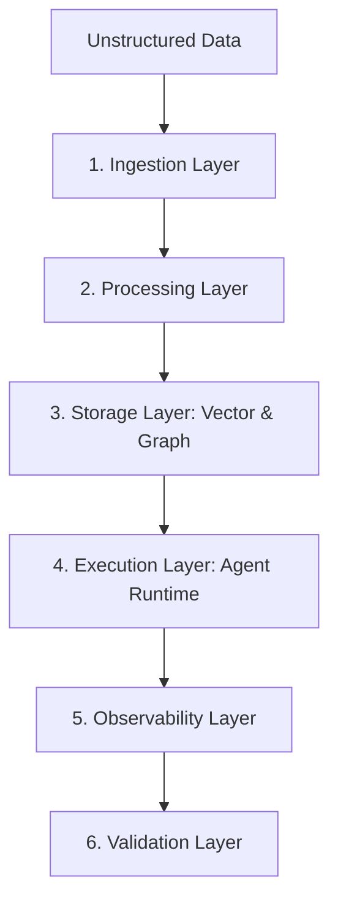

**Answer-First:** Scaling AI in the enterprise requires moving beyond naive RAG towards a robust, event-driven data engineering pipeline powered by GraphRAG and vision-based ingestion, ensuring 100% data freshness, safety, and measurable quality.

> **Prerequisite:** Baseline understanding of software architecture, data pipelines, and basic machine learning concepts.

If you have ever built an internal chatbot for your company by chunking documents, creating embeddings, and stuffing them into Pinecone or Milvus... you have undoubtedly encountered this scenario:

> **User:** "What was the Q3 revenue for product A, and how does it affect the Q4 strategy?"
> **Bot:** (Replies hesitantly, outputs last year's Q2 figures, and completely loses context regarding the strategy).

Welcome to the disruption of **Naive RAG (Retrieval-Augmented Generation)**.

## Why Does Naive RAG Fail at the Enterprise Scale?

Naive RAG operates on keyword/semantic matching within a Vector space. It excels at answering isolated information retrieval queries. However, the Enterprise environment is rarely that simple.

1. **Relational Blindness:** Vectors do not understand relationships. They do not know that "Product A" belongs to "Campaign X" managed by "Employee Y." When a question demands multi-hop reasoning, Vector search is entirely blind.
2. **The Unstructured Nightmare:** Corporate documents are not plain text. They are PDFs containing cross-page tables, business process diagrams, and messy emails. A basic chunker shreds table structures, turning financial data into meaningless gibberish.
3. **The RBAC Minefield:** The CEO and an Intern must not receive the same answer from an LLM if the extracted data pertains to payroll. Basic Vector systems do not support Row-Level Security as well as traditional databases do.
4. **No Evals, No Trust:** How do you know your bot is answering correctly 90% or 40% of the time? "Looks correct" is not an Engineering standard.

## The Solution: Enterprise AI Data Pipeline & GraphRAG

To resolve this issue permanently, the AI Data Pipeline in 2026 has shifted to an entirely new architecture:

- **Knowledge Graph combined with Vectors (GraphRAG):** Data is not only stored as numbers but also as nodes and edges. The LLM can now "traverse" the graph to understand causal relationships.
- **Advanced Ingestion:** Utilizing small Vision models or advanced OCR techniques to accurately extract tables and diagrams before embedding.
- **Metric-Driven Evals:** Using LLM-as-a-Judge (like Ragas or TruLens) to automatically score each answer based on metrics: Context Precision, Answer Relevance, and Faithfulness (No Hallucinations).

In this Series, we will dive deep into each architectural layer, from extracting the first line of a PDF to building a robust Knowledge Graph, and finally establishing an automated evaluation system for the RAG Pipeline.

## The Six-Layer Enterprise AI Data Pipeline Architecture

An enterprise-ready AI system requires a robust data platform. We decompose this platform into six distinct layers:

1. **Ingestion Layer:** Responsible for parsing unstructured files (PDFs, PPTXs, HTML) and structured databases (Postgres, Oracle). It leverages vision models and optical character recognition to extract data from tables, diagrams, and figures.
2. **Processing Layer:** Cleans, normalizes, and segments the raw text. It parses logical document components, resolves relative references, and maps hierarchical relationships between sections.
3. **Storage Layer:** Houses vectors, relational data, and graph entities. This relies on modern hybrid databases like pgvector, Neo4j, or Qdrant.
4. **Execution Layer (Agent Runtime):** Orchestrates the retrieval flow, constructs the prompts, calls tools, and coordinates multi-agent task execution.
5. **Monitoring Layer (Observability):** Captures tracing, token consumption, query latency, and intermediate reasoning steps across all LLM operations.
6. **Validation Layer (Evaluation):** Automatically grades retrieval quality, hallucination metrics, and user satisfaction scores using automated pipelines.



## Comparative Matrix: Traditional RAG vs. GraphRAG

Below is a detailed matrix highlighting the fundamental trade-offs between a basic Vector Search approach (Traditional RAG) and a Knowledge Graph-based approach (GraphRAG):

| Architectural Axis | Traditional RAG (Vector Search) | GraphRAG (Knowledge Graph + Vector) |
| :--- | :--- | :--- |
| **Retrieval Strategy** | K-Nearest Neighbors in Vector Space | Index traversal combined with vector similarity search |
| **Multi-hop Queries** | Fails; cannot traverse relationships logically | Succeeds; jumps from node to node across relationships |
| **Context Utilization** | Often returns redundant chunks of same text | Selects diverse entities and key global summaries |
| **Cold Start Setup** | Fast; embed and write directly to index | Slower; requires graph schema creation and LLM extraction |
| **Access Control (RBAC)** | Hard to map permissions to raw vector chunks | Easy; ACL properties can be attached to nodes and edges |
| **Hallucination Rate** | Higher; interpolates between unrelated concepts | Lower; restricted to explicit, verified node relationships |
| **Scale Behavior** | Performance degrades with high document volumes | Performance remains stable due to localized traversal |

To demonstrate how the Orchestrator works, the following Go code represents a simplified entrypoint for processing data through this pipeline:

```go
package main

import (
	"context"
	"fmt"
	"log"
	"time"
)

type PipelineJob struct {
	ID        string
	SourceURI string
	Status    string
	StartTime time.Time
}

type PipelineOrchestrator struct {
	ActiveJobs []PipelineJob
}

func NewOrchestrator() *PipelineOrchestrator {
	return &PipelineOrchestrator{
		ActiveJobs: make([]PipelineJob, 0),
	}
}

func (o *PipelineOrchestrator) RunJob(ctx context.Context, job PipelineJob) error {
	o.ActiveJobs = append(o.ActiveJobs, job)
	fmt.Printf("[Orchestrator] Starting job %s for %s\n", job.ID, job.SourceURI)

	// Step 1: Ingestion
	if err := o.ingest(ctx, job.SourceURI); err != nil {
		return fmt.Errorf("ingest failed: %w", err)
	}

	// Step 2: Processing
	if err := o.process(ctx, job.SourceURI); err != nil {
		return fmt.Errorf("processing failed: %w", err)
	}

	// Step 3: Indexing
	if err := o.index(ctx, job.SourceURI); err != nil {
		return fmt.Errorf("indexing failed: %w", err)
	}

	fmt.Printf("[Orchestrator] Job %s completed successfully\n", job.ID)
	return nil
}

func (o *PipelineOrchestrator) ingest(ctx context.Context, uri string) error {
	time.Sleep(100 * time.Millisecond) // Mock operation
	return nil
}

func (o *PipelineOrchestrator) process(ctx context.Context, uri string) error {
	time.Sleep(100 * time.Millisecond) // Mock operation
	return nil
}

func (o *PipelineOrchestrator) index(ctx context.Context, uri string) error {
	time.Sleep(100 * time.Millisecond) // Mock operation
	return nil
}

func main() {
	orchestrator := NewOrchestrator()
	job := PipelineJob{
		ID:        "job-9988-abc",
		SourceURI: "s3://company-reports/q3_2026.pdf",
		Status:    "PENDING",
		StartTime: time.Now(),
	}

	ctx := context.Background()
	if err := orchestrator.RunJob(ctx, job); err != nil {
		log.Fatalf("Job execution failed: %v", err)
	}
}
```

Through these structured execution layers, we replace the ad-hoc scripts of early RAG systems with a dependable commerce-grade data pipeline.


---

## The Six-Layer Enterprise AI Data Pipeline Architecture

An enterprise-ready AI system requires a robust data platform. We decompose this platform into six distinct layers:

1. **Ingestion Layer:** Responsible for parsing unstructured files (PDFs, PPTXs, HTML) and structured databases (Postgres, Oracle). It leverages vision models and optical character recognition to extract data from tables, diagrams, and figures.
2. **Processing Layer:** Cleans, normalizes, and segments the raw text. It parses logical document components, resolves relative references, and maps hierarchical relationships between sections.
3. **Storage Layer:** Houses vectors, relational data, and graph entities. This relies on modern hybrid databases like pgvector, Neo4j, or Qdrant.
4. **Execution Layer (Agent Runtime):** Orchestrates the retrieval flow, constructs the prompts, calls tools, and coordinates multi-agent task execution.
5. **Monitoring Layer (Observability):** Captures tracing, token consumption, query latency, and intermediate reasoning steps across all LLM operations.
6. **Validation Layer (Evaluation):** Automatically grades retrieval quality, hallucination metrics, and user satisfaction scores using automated pipelines.


## Comparative Matrix: Traditional RAG vs. GraphRAG

Below is a detailed matrix highlighting the fundamental trade-offs between a basic Vector Search approach (Traditional RAG) and a Knowledge Graph-based approach (GraphRAG):

| Architectural Axis | Traditional RAG (Vector Search) | GraphRAG (Knowledge Graph + Vector) |
| :--- | :--- | :---|
| **Retrieval Strategy** | K-Nearest Neighbors in Vector Space | Index traversal combined with vector similarity search |
| **Multi-hop Queries** | Fails; cannot traverse relationships logically | Succeeds; jumps from node to node across relationships |
| **Context Utilization** | Often returns redundant chunks of same text | Selects diverse entities and key global summaries |
| **Cold Start Setup** | Fast; embed and write directly to index | Slower; requires graph schema creation and LLM extraction |
| **Access Control (RBAC)** | Hard to map permissions to raw vector chunks | Easy; ACL properties can be attached to nodes and edges |
| **Hallucination Rate** | Higher; interpolates between unrelated concepts | Lower; restricted to explicit, verified node relationships |
| **Scale Behavior** | Performance degrades with high document volumes | Performance remains stable due to localized traversal |

To demonstrate how the Orchestrator works, the following Go code represents a simplified entrypoint for processing data through this pipeline:

```go
package main

import (
	"context"
	"fmt"
	"log"
	"time"
)

type PipelineJob struct {
	ID        string
	SourceURI string
	Status    string
	StartTime time.Time
}

type PipelineOrchestrator struct {
	ActiveJobs []PipelineJob
}

func NewOrchestrator() *PipelineOrchestrator {
	return &PipelineOrchestrator{
		ActiveJobs: make([]PipelineJob, 0),
	}
}

func (o *PipelineOrchestrator) RunJob(ctx context.Context, job PipelineJob) error {
	o.ActiveJobs = append(o.ActiveJobs, job)
	fmt.Printf("[Orchestrator] Starting job %s for %s\n", job.ID, job.SourceURI)

	// Step 1: Ingestion
	if err := o.ingest(ctx, job.SourceURI); err != nil {
		return fmt.Errorf("ingest failed: %w", err)
	}

	// Step 2: Processing
	if err := o.process(ctx, job.SourceURI); err != nil {
		return fmt.Errorf("processing failed: %w", err)
	}

	// Step 3: Indexing
	if err := o.index(ctx, job.SourceURI); err != nil {
		return fmt.Errorf("indexing failed: %w", err)
	}

	fmt.Printf("[Orchestrator] Job %s completed successfully\n", job.ID)
	return nil
}

func (o *PipelineOrchestrator) ingest(ctx context.Context, uri string) error {
	time.Sleep(100 * time.Millisecond) // Mock operation
	return nil
}

func (o *PipelineOrchestrator) process(ctx context.Context, uri string) error {
	time.Sleep(100 * time.Millisecond) // Mock operation
	return nil
}

func (o *PipelineOrchestrator) index(ctx context.Context, uri string) error {
	time.Sleep(100 * time.Millisecond) // Mock operation
	return nil
}

func main() {
	orchestrator := NewOrchestrator()
	job := PipelineJob{
		ID:        "job-9988-abc",
		SourceURI: "s3://company-reports/q3_2026.pdf",
		Status:    "PENDING",
		StartTime: time.Now(),
	}

	ctx := context.Background()
	if err := orchestrator.RunJob(ctx, job); err != nil {
		log.Fatalf("Job execution failed: %v", err)
	}
}
```

Through these structured execution layers, we replace the ad-hoc scripts of early RAG systems with a dependable commerce-grade data pipeline.

## Strategic Phase Rollout Plan

Implementing an enterprise AI pipeline requires a structured approach to mitigate operational risks and balance infrastructure costs. The rollout is executed in three distinct phases:

1. **Phase 1: Ingestion & Baseline RAG Setup (Weeks 1-4):**
   Focus on extracting raw text, parsing high-priority documents, and establishing baseline vector search using dense embeddings. The primary metric is Document Parsing Fidelity, ensuring tabular data does not lose schema boundaries during ingestion.
2. **Phase 2: Graph Integration & Routing (Weeks 5-8):**
   Map structural relationships between extracted text blocks. Nodes and edges are defined and loaded into Neo4j. The Query Router is deployed to split user queries: simple retrieval stays on vector search, while compound questions traverse the knowledge graph.
3. **Phase 3: Multi-Agent Automation & Continuous Evals (Weeks 9-12):**
   Autonomous agent execution loops are enabled. Connect tools (APIs, databases) to the ReAct executor. Continuous evaluation test suites run in the CI/CD pipeline, automatically blocking deployments if faithfulness scores drop below the 0.85 threshold.

🔗 **Next Step:** Learn about the convergence of Agentic RAG and GraphRAG in [Part 1: The Convergence - Agentic RAG & GraphRAG]().

*Need help assessing the risks of your own platform migration? → [Book a 1:1 Architecture Consultation](/hire/)*---

[Next Part: Part 1: The Convergence - Agentic RAG & GraphRAG]()
