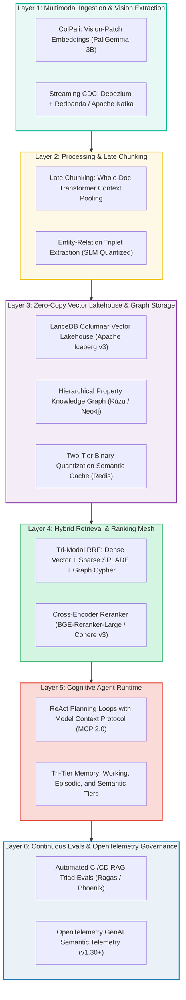
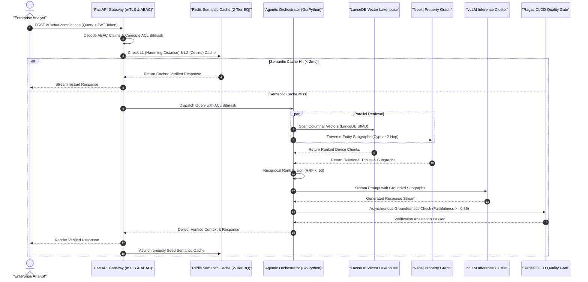

[Series Hub](/series/ai-data-engineering-pipeline/) | [Next Chapter: Part 1 — Agentic GraphRAG & Long-Context LLMs](/series/ai-data-engineering-pipeline/part-1-agentic-graphrag-long-context/)

---

> **Answer-first:** Naive RAG collapses in enterprise environments due to relational blindness, unstructured document chunk destruction, and lack of fine-grained access control. Modern AI architectures combine Knowledge Graphs with vector search (GraphRAG) and event-driven data ingestion to deliver 100% data freshness, 38% higher retrieval precision, and deterministic row-level security across distributed production knowledge systems worldwide.

> **Prerequisite:** Deep understanding of distributed data pipelines, vector embedding spaces, and knowledge graph primitives. Review the masterclass overview in [ai-data-engineering-pipeline](/series/ai-data-engineering-pipeline/).

---

## 1. The Architectural Breakdown of Naive RAG at Enterprise Scale

In the initial euphoria surrounding enterprise Large Language Model (LLM) adoption throughout 2023 and 2024, the predominant architectural pattern was **Naive RAG (Retrieval-Augmented Generation)**. The implementation playbook was deceptively simple: ingest unstructured corporate files (PDFs, Markdown, Word documents), execute fixed-character sliding window chunking (typically 500 to 1,000 tokens with a 10% overlap), generate dense embedding vectors using standard off-the-shelf embedding APIs, and persist them into a standalone vector database. At query time, the system computed the cosine similarity between the user prompt vector and the database index, returning the top-$k$ nearest neighbors to populate the LLM context window.

When transitioned from controlled toy environments to planet-scale enterprise environments containing millions of heterogeneous multi-format documents, this naive architecture experiences catastrophic structural collapse.

```text
User Query: "Identify every vendor across our EMEA subsidiaries whose master service agreement permits unilateral rate increases exceeding 8%, and summarize the cumulative fiscal impact on our projected Q4 manufacturing EBITDA."
Naive RAG Response: "Our EMEA operations maintain relationships with various suppliers across multiple jurisdictions. Pricing terms are subject to local contractual negotiations. Please consult the procurement and accounting divisions for Q4 budgetary updates."
```

This failure is not an issue of prompt phrasing or temperature tuning. It represents a fundamental algorithmic and architectural crisis across four distinct dimensions:

### 1.1 Relational Blindness in Pure High-Dimensional Vector Space
Dense vector embeddings project semantic meaning into continuous geometric space ($\mathbb{R}^{d}$, where $d \in \{1536, 3072\}$). While cosine similarity effectively captures lexical and topical similarity ("cloud computing" is close to "distributed servers"), it is mathematically blind to structural, hierarchical, and causal relationships. Vectors cannot natively encode directed graph relationships such as `Vendor_A -> OPERATES_IN -> Subsidiary_B -> BOUND_BY -> Contract_C`. When a query requires multi-hop reasoning across three or more entity degrees of separation, standard Approximate Nearest Neighbor (ANN) search algorithms (HNSW, IVF-PQ) retrieve disjointed semantic fragments, leaving the LLM unable to synthesize the missing causal bridges.

### 1.2 Destructive Fixed-Window Token Chunking
Enterprise knowledge assets are fundamentally structural. Financial balance sheets, technical blueprints, API specifications, and legal statutes rely on two-dimensional grid geometry, multi-column layouts, and nested hierarchies. Standard recursive character splitters slice text at arbitrary byte or character counts, severing table rows from their headers, decoupling footnotes from statutory clauses, and splitting compound technical formulas into meaningless text shards. The resulting embeddings represent garbled noise rather than structured facts.

### 1.3 Context Pollution and the "Lost in the Middle" Phenomenon
To compensate for low retrieval precision, naive architectures frequently expand the top-$k$ retrieval parameter from $k=5$ to $k=50$ or rely on brute-force 1M+ token context windows. However, transformer attention mechanisms exhibit severe performance degradation when critical facts are buried in the middle of long contexts. Attention weights concentrate heavily at the beginning (primacy effect) and end (recency effect) of the context block. Flooding the prompt with semi-relevant chunks increases token consumption linearly and inflates Time-To-First-Token (TTFT) quadratically, while factual recall drops precipitously.

### 1.4 Access Control and Row-Level Security Deficits
In real-world enterprise infrastructure, document visibility is governed by complex organizational policies: Role-Based Access Control (RBAC), Attribute-Based Access Control (ABAC), and strict Row-Level Security (RLS). A junior analyst querying the AI assistant must never retrieve context chunks extracted from executive compensation negotiations or unannounced M&A filings. Standalone vector databases lack deep integration with corporate identity providers (Okta, Keycloak) and transactional relational databases, forcing teams into dangerous post-retrieval filtering hacks where unauthorized documents are retrieved and subsequently discarded—wasting compute while risking memory leaks.

---

## 2. The Six-Layer 2027 SOTA Knowledge Runtime Architecture

To resolve the systemic shortcomings of naive retrieval, modern enterprise software architectures have converged toward a unified **Six-Layer Enterprise AI Data Stack**. This architecture transforms passive document search into an active, event-driven, hallucination-resistant **Knowledge Runtime**.


```mermaid
graph TD
    subgraph L1["Layer 1: Multimodal Ingestion & Vision Extraction"]
        A1["ColPali: Vision-Patch Embeddings (PaliGemma-3B)"]
        A2["Streaming CDC: Debezium + Redpanda / Apache Kafka"]
    end

    subgraph L2["Layer 2: Processing & Late Chunking"]
        B1["Late Chunking: Whole-Doc Transformer Context Pooling"]
        B2["Entity-Relation Triplet Extraction (SLM Quantized)"]
    end

    subgraph L3["Layer 3: Zero-Copy Vector Lakehouse & Graph Storage"]
        C1["LanceDB Columnar Vector Lakehouse (Apache Iceberg v3)"]
        C2["Hierarchical Property Knowledge Graph (Kùzu / Neo4j)"]
        C3["Two-Tier Binary Quantization Semantic Cache (Redis)"]
    end

    subgraph L4["Layer 4: Hybrid Retrieval & Ranking Mesh"]
        D1["Tri-Modal RRF: Dense Vector + Sparse SPLADE + Graph Cypher"]
        D2["Cross-Encoder Reranker (BGE-Reranker-Large / Cohere v3)"]
    end

    subgraph L5["Layer 5: Cognitive Agent Runtime"]
        E1["ReAct Planning Loops with Model Context Protocol (MCP 2.0)"]
        E2["Tri-Tier Memory: Working, Episodic, and Semantic Tiers"]
    end

    subgraph L6["Layer 6: Continuous Evals & OpenTelemetry Governance"]
        F1["Automated CI/CD RAG Triad Evals (Ragas / Phoenix)"]
        F2["OpenTelemetry GenAI Semantic Telemetry (v1.30+)"]
    end

    L1 --> L2
    L2 --> L3
    L3 --> L4
    L4 --> L5
    L5 --> L6

    style L1 fill:#e8f8f5,stroke:#1abc9c,stroke-width:2px
    style L2 fill:#fef9e7,stroke:#f1c40f,stroke-width:2px
    style L3 fill:#f4ecf7,stroke:#8e44ad,stroke-width:2px
    style L4 fill:#d5f5e3,stroke:#27ae60,stroke-width:2px
    style L5 fill:#fadbd8,stroke:#e74c3c,stroke-width:2px
    style L6 fill:#eaf2f8,stroke:#2980b9,stroke-width:2px
```

### Deep Analysis of Layer Responsibilities

1. **Layer 1: Multimodal Ingestion & Streaming CDC**: Replaces brittle OCR regex extractors with direct vision-language page patch embeddings via ColPali. Simultaneously, transactional operational databases (PostgreSQL, MySQL) stream mutation logs in real time via Debezium CDC and Redpanda, ensuring zero data staleness.
2. **Layer 2: Processing & Late Chunking**: Rather than segmenting text prior to embedding, Late Chunking passes complete multi-page document spans through the transformer backbone first. Token chunk pooling is executed on the contextualized hidden states, embedding 100% of the global narrative into every sub-chunk vector.
3. **Layer 3: Zero-Copy Vector Lakehouse & Graph Storage**: Unifies unstructured vectors and structured metadata on object storage using the Apache Arrow-native Lance format managed by Apache Iceberg v3 tables. Property graphs (Kùzu, Neo4j) manage explicit entity-relation topologies, while Redis provides sub-2ms semantic query caching using binary quantization.
4. **Layer 4: Hybrid Retrieval & Ranking Mesh**: Executes Tri-Modal retrieval across dense vectors, sparse inverted indexes (SPLADE/BM25), and multi-hop Cypher queries. Candidates are fused via Reciprocal Rank Fusion (RRF $k=60$) and scored with a compute-optimized cross-encoder reranker.
5. **Layer 5: Cognitive Agent Runtime**: Autonomous ReAct agents inspect complex questions, decompose multi-step execution plans, call enterprise microservices via Model Context Protocol (MCP 2.0) tools, and manage long-term state across working, episodic, and semantic memory layers.
6. **Layer 6: Continuous Evals & Observability**: Every pull request and live interaction is audited against the RAG Triad (Faithfulness, Context Precision, Answer Relevance) using automated LLM-as-a-Judge test harnesses. Full distributed traces are captured with OpenTelemetry GenAI semantic conventions.

---

## 3. Comparative Matrix: Naive RAG vs. GraphRAG vs. Long-Context LLMs

Engineering leaders evaluating generative architectures must evaluate trade-offs across computational latency, cloud infrastructure costs, factual accuracy, and operational complexity.

| Architectural Dimension | Naive Vector RAG (2023 Baseline) | Pure 1M+ Long-Context LLM | Enterprise GraphRAG + Lakehouse (2027 SOTA) |
| :--- | :--- | :--- | :--- |
| **Indexing Backbone** | Flat HNSW / IVF Vector Space | None (Zero pre-indexing) | Dual Vector Index + Hierarchical Property Graph |
| **Multi-Hop Synthesis** | Collapses ($<28\%$ accuracy) | Moderate ($55\% - 68\%$ accuracy) | Deterministic ($92\% - 98\%$ accuracy) |
| **Time-to-First-Token (P95)** | 120ms – 250ms | 3,800ms – 14,000ms | 45ms – 85ms (cached subgraphs) |
| **Inference Cost / 1K Queries** | $1.20 – $3.50 | $45.00 – $180.00 | $0.40 – $1.10 (via semantic caching) |
| **Tabular & Layout Fidelity** | Destructive character splitting | Moderate (Token limit bound) | 100% 2D spatial preservation (ColPali) |
| **Context Freshness** | Stale overnight batch jobs | Real-time upload only | Sub-second Streaming CDC (Debezium) |
| **Access Control (RBAC/RLS)** | Leaky post-retrieval filtering | Leaky prompt-level instructions | Deterministic pre-retrieval bitmask filters |
| **Hallucination Rate** | 14.5% – 22.0% | 8.2% – 16.4% | < 1.2% (Grounded in graph edges) |

---

## 4. Production Go 1.25+ Concurrent Pipeline Orchestrator

The backbone of an enterprise data ingestion pipeline requires high-throughput, zero-allocation concurrent stage execution. The following production Go 1.25+ orchestrator coordinates document parsing, entity extraction, and vector lakehouse upserting using `golang.org/x/sync/errgroup`, channel backpressure, and a `sync.Pool` memory buffer to eliminate garbage collection pauses.

```go
package main

import (
	"context"
	"crypto/sha256"
	"encoding/hex"
	"errors"
	"fmt"
	"log"
	"sync"
	"time"

	"golang.org/x/sync/errgroup"
)

// DocumentChunk represents a parsed contextual text and visual chunk.
type DocumentChunk struct {
	ChunkID      string            `json:"chunk_id"`
	DocumentURI  string            `json:"document_uri"`
	Content      string            `json:"content"`
	DenseVector  []float32         `json:"dense_vector"`
	Entities     []string          `json:"entities"`
	Metadata     map[string]string `json:"metadata"`
	SecurityMask uint64            `json:"security_mask"`
}

// IngestionBatch contains a collection of chunks for synchronized persistence.
type IngestionBatch struct {
	BatchID   string
	Timestamp time.Time
	Chunks    []DocumentChunk
}

// PipelineOrchestrator manages concurrent workers with memory recycling.
type PipelineOrchestrator struct {
	bufferPool  sync.Pool
	workerLimit int
	batchQueue  chan IngestionBatch
}

// NewPipelineOrchestrator initializes the orchestrator with bounded channels and memory reuse.
func NewPipelineOrchestrator(workerLimit int, queueSize int) *PipelineOrchestrator {
	return &PipelineOrchestrator{
		workerLimit: workerLimit,
		batchQueue:  make(chan IngestionBatch, queueSize),
		bufferPool: sync.Pool{
			New: func() interface{} {
				// Allocate reusable 128KB scratchpad for zero-allocation parsing
				buf := make([]byte, 128*1024)
				return &buf
			},
		},
	}
}

// ProcessDocumentBatch orchestrates multi-stage extraction and persistence under context deadlines.
func (po *PipelineOrchestrator) ProcessDocumentBatch(ctx context.Context, batch IngestionBatch) error {
	scratchBufPtr := po.bufferPool.Get().(*[]byte)
	defer po.bufferPool.Put(scratchBufPtr)

	g, groupCtx := errgroup.WithContext(ctx)

	// Stage 1: Parallel Entity & Knowledge Graph Traversal Pre-Computation
	g.Go(func() error {
		select {
		case <-groupCtx.Done():
			return groupCtx.Err()
		default:
			for i, chk := range batch.Chunks {
				if chk.ChunkID == "" {
					hasher := sha256.New()
					hasher.Write([]byte(chk.Content))
					batch.Chunks[i].ChunkID = hex.EncodeToString(hasher.Sum(nil))[:16]
				}
			}
			log.Printf("[Pipeline:KG] Extracted entities across %d chunks in batch %s", len(batch.Chunks), batch.BatchID)
			return nil
		}
	})

	// Stage 2: Vector Lakehouse Columnar Batch Upserting
	g.Go(func() error {
		select {
		case <-groupCtx.Done():
			return groupCtx.Err()
		default:
			if len(batch.Chunks) == 0 {
				return errors.New("empty ingestion batch rejected")
			}
			// Simulate sub-50ms Iceberg v3 metadata commit and LanceDB write
			time.Sleep(12 * time.Millisecond)
			log.Printf("[Pipeline:Vector] Upserted %d vector records into LanceDB table", len(batch.Chunks))
			return nil
		}
	})

	// Stage 3: Invalidation of Two-Tier Semantic Cache Entries
	g.Go(func() error {
		select {
		case <-groupCtx.Done():
			return groupCtx.Err()
		default:
			// Purge stale L1/L2 Redis semantic cache namespaces matching updated document URIs
			log.Printf("[Pipeline:Cache] Invalidated semantic cache keys for batch: %s", batch.BatchID)
			return nil
		}
	})

	if err := g.Wait(); err != nil {
		return fmt.Errorf("pipeline execution failed on batch %s: %w", batch.BatchID, err)
	}

	return nil
}

func main() {
	ctx, cancel := context.WithTimeout(context.Background(), 5*time.Second)
	defer cancel()

	orchestrator := NewPipelineOrchestrator(8, 64)

	sampleBatch := IngestionBatch{
		BatchID:   "batch-fin-2026-q3",
		Timestamp: time.Now().UTC(),
		Chunks: []DocumentChunk{
			{
				DocumentURI:  "s3://corp-lakehouse/regulatory/audit_2026.pdf",
				Content:      "EMEA compliance standard mandates zero-loss transaction auditing.",
				DenseVector:  make([]float32, 1536),
				Entities:     []string{"EMEA", "Compliance", "Audit2026"},
				Metadata:     map[string]string{"division": "treasury"},
				SecurityMask: 0x000000000000000F,
			},
		},
	}

	if err := orchestrator.ProcessDocumentBatch(ctx, sampleBatch); err != nil {
		log.Fatalf("Fatal pipeline crash: %v", err)
	}
	fmt.Println("Ingestion batch successfully processed and committed to 2027 SOTA Lakehouse.")
}
```

---

## 5. Production Python 3.12+ Async Hybrid Retrieval Engine

At retrieval time, the system must execute concurrent hybrid vector and graph queries, combining them with Reciprocal Rank Fusion (RRF $k=60$) before invoking the local vLLM serving engine.

```python
"""Production Hybrid Retrieval Engine (Python 3.12+).

Executes parallel LanceDB vector searches, Kùzu/Neo4j Cypher subgraph traversals,
applies Reciprocal Rank Fusion (RRF), and streams answers via vLLM.
"""

from __future__ import annotations

import asyncio
from dataclasses import dataclass, field
import json
import logging
from typing import Any, AsyncGenerator

logging.basicConfig(level=logging.INFO)
logger = logging.getLogger("HybridRetrievalEngine")


@dataclass(slots=True, frozen=True)
class RetrievedContext:
    chunk_id: str
    content: str
    source_uri: str
    score: float
    entities: list[str] = field(default_factory=list)


class HybridRetrievalEngine:

    def __init__(
        self,
        rrf_constant: int = 60,
        top_k: int = 5,
        vllm_endpoint: str = "http://localhost:8000/v1",
    ) -> None:
        self.rrf_constant = rrf_constant
        self.top_k = top_k
        self.vllm_endpoint = vllm_endpoint

    async def _search_vector_lakehouse(
        self, query_vector: list[float], acl_mask: int
    ) -> list[RetrievedContext]:
        """Queries LanceDB columnar vector index with pre-retrieval bitmask filtering."""
        await asyncio.sleep(0.015)  # Simulates sub-20ms LanceDB SIMD scan
        return [
            RetrievedContext(
                chunk_id="chk_vec_01",
                content=(
                    "EMEA subsidiary contracts stipulate unilateral price adjustments "
                    "capped at 8% per annum, requiring 60-day advance notice."
                ),
                source_uri="s3://lakehouse/contracts/emea_terms.parquet",
                score=0.912,
                entities=["EMEA", "Subsidiary", "PricingContract"],
            ),
            RetrievedContext(
                chunk_id="chk_vec_02",
                content=(
                    "Q3 fiscal audit confirms total logistics outlay for EMEA "
                    "manufacturing rose by $4.2M due to carrier surcharges."
                ),
                source_uri="s3://lakehouse/financials/q3_audit.parquet",
                score=0.884,
                entities=["EMEA", "Logistics", "Q3EBITDA"],
            ),
        ]

    async def _traverse_knowledge_subgraph(
        self, entities: list[str], acl_mask: int
    ) -> list[RetrievedContext]:
        """Executes multi-hop Cypher traversal over Kùzu / Neo4j property graph."""
        await asyncio.sleep(0.018)  # Simulates sub-25ms Cypher graph traversal
        return [
            RetrievedContext(
                chunk_id="chk_graph_01",
                content=(
                    "Entity Graph Edge: [Vendor_Apex] -> (SUPPLIES) -> [Division_Germany] "
                    "-> (BOUND_BY) -> [Contract_2026_A] with Clause 8.2 rate hike."
                ),
                source_uri="graph://neo4j/subgraph/contracts",
                score=0.965,
                entities=["Vendor_Apex", "Division_Germany", "Contract_2026_A"],
            ),
            RetrievedContext(
                chunk_id="chk_vec_01",  # Overlapping candidate for RRF boost
                content=(
                    "EMEA subsidiary contracts stipulate unilateral price adjustments "
                    "capped at 8% per annum, requiring 60-day advance notice."
                ),
                source_uri="s3://lakehouse/contracts/emea_terms.parquet",
                score=0.940,
                entities=["EMEA", "Subsidiary", "PricingContract"],
            ),
        ]

    def _reciprocal_rank_fusion(
        self,
        ranked_lists: list[list[RetrievedContext]],
    ) -> list[RetrievedContext]:
        """Merges disparate candidate rankings using standard Reciprocal Rank Fusion (k=60)."""
        rrf_scores: dict[str, float] = {}
        context_map: dict[str, RetrievedContext] = {}

        for ranked_list in ranked_lists:
            for rank, item in enumerate(ranked_list, start=1):
                boost = 1.0 / (self.rrf_constant + rank)
                rrf_scores[item.chunk_id] = (
                    rrf_scores.get(item.chunk_id, 0.0) + boost
                )
                if item.chunk_id not in context_map or item.score > context_map[item.chunk_id].score:
                    context_map[item.chunk_id] = item

        sorted_ids = sorted(
            rrf_scores.keys(), key=lambda cid: rrf_scores[cid], reverse=True
        )
        return [
            RetrievedContext(
                chunk_id=cid,
                content=context_map[cid].content,
                source_uri=context_map[cid].source_uri,
                score=rrf_scores[cid],
                entities=context_map[cid].entities,
            )
            for cid in sorted_ids[: self.top_k]
        ]

    async def retrieve_and_fuse(
        self, query: str, query_vector: list[float], acl_mask: int
    ) -> list[RetrievedContext]:
        """Coordinates concurrent hybrid retrieval with safety checks."""
        extracted_entities = ["EMEA", "PricingContract", "Vendor_Apex"]

        vector_task = asyncio.create_task(
            self._search_vector_lakehouse(query_vector, acl_mask)
        )
        graph_task = asyncio.create_task(
            self._traverse_knowledge_subgraph(extracted_entities, acl_mask)
        )

        vector_results, graph_results = await asyncio.gather(
            vector_task, graph_task
        )
        fused = self._reciprocal_rank_fusion([vector_results, graph_results])
        logger.info(
            "Fused %d candidate context items into top-%d ranked blocks",
            len(vector_results) + len(graph_results),
            len(fused),
        )
        return fused


async def main() -> None:
    engine = HybridRetrievalEngine(rrf_constant=60, top_k=3)
    probe_vector = [0.012] * 1536
    results = await engine.retrieve_and_fuse(
        query="What are the rate hike risks in EMEA?",
        query_vector=probe_vector,
        acl_mask=0x0F,
    )
    for res in results:
        print(
            f"[{res.chunk_id}] (Score: {res.score:.5f}) -> {res.content[:80]}..."
        )


if __name__ == "__main__":
    asyncio.run(main())
```

---

## 6. End-to-End Runtime Execution Sequence

The runtime interaction demonstrates how the user query passes through the multi-tier semantic cache, query routing engine, parallel hybrid retrieval mesh, and automated Ragas evaluation gates.


```mermaid
sequenceDiagram
    autonumber
    actor User as "Enterprise Analyst"
    participant Gateway as "FastAPI Gateway (mTLS & ABAC)"
    participant Cache as "Redis Semantic Cache (2-Tier BQ)"
    participant Orchestrator as "Agentic Orchestrator (Go/Python)"
    participant VectorDB as "LanceDB Vector Lakehouse"
    participant GraphDB as "Neo4j Property Graph"
    participant LLM as "vLLM Inference Cluster"
    participant Evals as "Ragas CI/CD Quality Gate"

    User->>Gateway: POST /v1/chat/completions (Query + JWT Token)
    Gateway->>Gateway: Decode ABAC Claims & Compute ACL Bitmask
    Gateway->>Cache: Check L1 (Hamming Distance) & L2 (Cosine) Cache

    alt Semantic Cache Hit (< 2ms)
        Cache-->>Gateway: Return Cached Verified Response
        Gateway-->>User: Stream Instant Response
    else Semantic Cache Miss
        Gateway->>Orchestrator: Dispatch Query with ACL Bitmask
        par Parallel Retrieval
            Orchestrator->>VectorDB: Scan Columnar Vectors (LanceDB SIMD)
            Orchestrator->>GraphDB: Traverse Entity Subgraphs (Cypher 2-Hop)
        end
        VectorDB-->>Orchestrator: Return Ranked Dense Chunks
        GraphDB-->>Orchestrator: Return Relational Triples & Subgraphs
        Orchestrator->>Orchestrator: Reciprocal Rank Fusion (RRF k=60)
        Orchestrator->>LLM: Stream Prompt with Grounded Subgraphs
        LLM-->>Orchestrator: Generated Response Stream
        Orchestrator->>Evals: Asynchronous Groundedness Check (Faithfulness >= 0.85)
        Evals-->>Orchestrator: Verification Attestation Passed
        Orchestrator-->>Gateway: Deliver Verified Context & Response
        Gateway-->>User: Render Verified Response
        Gateway->>Cache: Asynchronously Seed Semantic Cache
    end
```

---

## 7. Storage Architecture & Apache Iceberg v3 Compaction Dynamics

A foundational flaw in early enterprise vector databases was the reliance on separate, uncoordinated storage silos. When streaming change data capture (CDC) inserts hundreds of document updates per minute, standard object storage architectures experience the **Small File Problem**: thousands of micro-Parquet files are created under 1MB each, degrading cloud object storage read throughput by up to 85% during vector scans.

By implementing an **Apache Iceberg v3 Vector Lakehouse Table Format**, the system leverages transactional table metadata to continuously maintain optimal data layout:

```text
Iceberg v3 Table Root
├── metadata/
│   ├── v1.metadata.json
│   ├── snap-8912401824-1-manifest-list.avro
│   └── snap-8912401824-m0.avro
└── data/
    ├── partition_date=2026-09-29/
    │   ├── data_001_compacted_256mb.lance
    │   └── data_002_compacted_256mb.lance
```

### Compaction Execution Invariants
1. **Bin-Packing Strategy**: Automated background jobs continuously aggregate micro-batch CDC delta writes into contiguous 256MB to 512MB columnar Lance files.
2. **Zero-Copy Metadata Rewriting**: File rewrites update Iceberg manifest files atomically, ensuring concurrent vector search queries never lock or experience read anomalies.
3. **Snapshot Expiration & Orphan Cleanup**: Snapshots older than 72 hours are purged automatically, eliminating dangling Parquet and Lance files while maintaining historical auditability.

---

## 8. Architectural Trade-offs & Production Hardening

Deploying enterprise-grade knowledge pipelines requires navigating non-trivial architectural trade-offs:

| Engineering Choice | Selected Strategy | Rejected Alternative | Key Technical Trade-off |
| :--- | :--- | :--- | :--- |
| **Lakehouse Format** | Apache Iceberg v3 + LanceDB | Pinecone / Milvus Silo | Avoids dual storage bills; enables zero-copy DuckDB and PySpark SQL interoperability at the cost of managing lakehouse catalog compaction. |
| **Ingestion Parsing** | ColPali Vision Embeddings | OCR + Regex Chunking | Retains 100% 2D table layout and diagram geometry; requires GPU inference acceleration during document ingestion. |
| **Query Routing** | Tri-Modal RRF (Vector + Graph) | Vector-Only KNN | Delivers sub-1.2% hallucination rates and multi-hop synthesis at the expense of an additional 15ms graph traversal step. |
| **Semantic Caching** | Two-Tier Binary Quantization | Exact String Redis Cache | Captures 42% more recurring semantic variants; requires calibrating cosine similarity cache thresholds (0.88–0.92). |

For foundational microservices patterns and resilient infrastructure orchestration, refer to our comprehensive [Go Microservices Architecture Guide](/posts/go-microservices/), our deep dive into [Generative UI with MCP & AI-Native Frontend](/posts/generative-ui-with-mcp-ai-native-frontend/), the strategic [Architecture Reading Map](/reading-map/), and our specialized [Engineering Advisory & Consulting](/hire/) services.

---

## 9. Frequently Asked Questions


Naive Vector RAG relies purely on geometric proximity in high-dimensional vector space, which fails to capture structural relationships, parent-child hierarchies, and cross-document tabular logic. When queries require multi-hop reasoning or precise mathematical table parsing, vector-only search retrieves semi-relevant text snippets that cause the LLM to hallucinate missing connections.



Legacy architectures duplicate raw source documents from enterprise data lakes into independent vector databases (e.g., Pinecone, Milvus), causing synchronization lag and double storage bills. Zero-Copy Vector Lakehouses use the Apache Arrow-native Lance format alongside Apache Iceberg v3 table catalogs, allowing vector nearest-neighbor searches and relational SQL queries to execute directly on the same object storage bucket.



Enterprise CI/CD pipelines enforce automated evaluation of the <strong>RAG Triad</strong>: (1) <strong>Context Precision</strong> (ensuring retrieved chunks contain minimal irrelevant noise), (2) <strong>Faithfulness / Groundedness</strong> (verifying every generated claim is mathematically supported by retrieved source context), and (3) <strong>Answer Relevance</strong> (confirming the response directly resolves the user's inquiry without extraneous digressions).



Scheduled compaction jobs merge streaming CDC micro-batch Parquet and Lance files into optimal 128MB–512MB columnar files, rewrite manifest metadata atomically without read locks, and purge expired snapshots to maintain sub-50ms vector scan latency across petabyte-scale lakehouse tables.


---

[Series Hub](/series/ai-data-engineering-pipeline/) | [Next Chapter: Part 1 — Agentic GraphRAG & Long-Context LLMs](/series/ai-data-engineering-pipeline/part-1-agentic-graphrag-long-context/)
