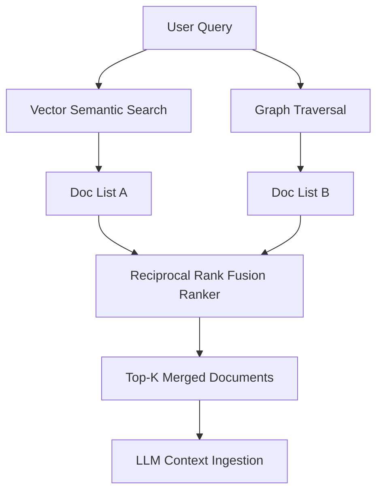

**Answer-First:** Long-context LLMs do not replace retrieval systems; rather, the ultimate architecture combines Agentic RAG and GraphRAG to synthesize multi-hop relational data and pinpoint granular evidence within massive datasets.

> **Prerequisite:** Read the [Executive Summary]() for the overall architecture blueprint and motivation.

## 1. Introduction: Ending the "Meaningless" War

In early 2024, the tech world erupted into a heated debate: *"When LLMs have Context Windows of up to 2 million tokens (like Gemini 1.5 Pro), will RAG die?"* Or *"Will Agentic AI completely replace traditional RAG?"*

By 2026, the answer is clear: **No one was killed.**

The most cutting-edge Enterprise AI systems today do not pick sides. Instead, they run on a **Convergence** architecture. This architecture transforms RAG from a rudimentary Search Engine into a **Knowledge Runtime**.

---

## 2. Anatomy of the 2026 Convergence Architecture: The Adaptive Context Layer

The standard architecture of 2026 is no longer a linear `Retrieve -> Generate` pipeline. It is upgraded to the **Adaptive Context Layer** with 3 main components:

### A. The Brain: Agentic Orchestration
Using frameworks like **LangGraph** or **LlamaAgents**, the system does not immediately search upon receiving a question. It operates on a **Graph-of-Thought (GoT)**:
- **Router/Planner Agent:** Evaluates the complexity of the query.
- **Routing Decision:** Does this query need Vector search (for dynamic documents), Graph search (for relational questions), or no search at all, using a Long-Context LLM directly?
- **Refiner Agent:** Cross-evaluates the results. If the retrieved data is noisy, the Agent automatically rewrites the query (Query Reformulation) and searches again.

### B. The Memory: GraphRAG & NL2GQL
The fatal flaw of Vector RAG is **Relational Blindness**. It only retrieves text segments with similar keywords or semantics but is completely clueless when faced with questions like: *"Which legal risks cross-impact both Vendor A and Vendor C?"*.

To solve this, **GraphRAG** (specifically the Microsoft update) is used as Structural Memory:
- **Community Summarization (Leiden Algorithm):** Clusters related entities into "communities" to answer macro-level summarization questions.
- **NL2GQL (Natural Language to Graph Query Language):** Instead of searching by vectors (Embeddings), the Agent automatically writes graph query code (like Cypher for Neo4j). Traversing Nodes and Edges is **deterministic**, completely eliminating Hallucination and ensuring Auditability.

### C. The Synthesizer: Long-Context LLMs
Stuffing 2 million tokens into an LLM for every query is a **Financial Disaster** and increases Latency by tens of seconds.
In the 2026 architecture, Long-Context LLMs only serve as the "Final Synthesizer":
- RAG performs **Small-to-Big Retrieval** (Finding the most essential snippets of information).
- Then, the system compresses the context (Context-Preserving Compression) and pushes a refined chunk of data (around 50k - 100k tokens) into the Long-Context LLM for **Deep Reasoning**.

---

## 3. Cost Optimization: The TCO (Total Cost of Ownership) Problem

Why don't CTOs of large enterprises completely scrap Vector RAG to switch to 100% GraphRAG? The answer lies in **The Graph Tax**.

| Criteria | Vector RAG | GraphRAG |
| :--- | :--- | :--- |
| **Indexing Cost** | Low. Only costs running the Embedding model. | **Very High.** Requires LLMs to read, extract entities (NER), and map relationships. |
| **Query Cost** | Medium/High for complex questions. | **Extremely cheap.** Graph lookup takes < 1ms and wastes no LLM tokens. |
| **Structure Maintenance** | Easy (Set and forget). | Complex (Requires maintaining Ontology Schemas). |

**2026 Strategy:** To balance TCO, enterprises use **Adaptive RAG**. Vector RAG handles 80% of basic, cheap queries (Policy lookups, keyword searches). GraphRAG is only triggered for the 20% of strategic, Multi-hop analytical questions - where the cost of a mistake (Hallucination) is far more expensive than the cost of building the Graph.

---

## 4. Conclusion

The Convergence Architecture has proven that RAG is not dead. On the contrary, combining the flexibility of **Agents (The Brain)**, the precision of **Graphs (The Memory)**, and the reasoning power of **Long-Context LLMs (The Synthesizer)** is the "Holy Grail" of Enterprise AI in this decade.

However, your graph "Memory" will be useless if you feed it garbage.

In **[Part 2: Agentic Ingestion & Multimodal Knowledge Graphs]()**, we will tackle every Data Engineer's biggest nightmare: How to use AI to accurately read and understand tens of thousands of PDF pages, financial tables, and technical diagrams before ingesting them into GraphRAG.

## Hybrid Retrieval Algorithms: Linking Dense and Relational Graphs

The optimal retrieval architecture leverages both dense vectors (for raw semantic similarity) and knowledge graphs (for structured entities and relationships). The following Go code implements a hybrid ranker that combines dense vector search results and knowledge graph query results using Reciprocal Rank Fusion (RRF). RRF provides a robust mathematical framework to merge disparate ranking lists without normalizing their underlying score distributions.

```go
package main

import (
	"fmt"
	"sort"
)

type RetrievalResult struct {
	DocID string
	Score float64
}

// ReciprocalRankFusion merges dense vector scores and graph traversal scores.
func ReciprocalRankFusion(vectorResults []RetrievalResult, graphResults []RetrievalResult, k float64) []RetrievalResult {
	rrfScores := make(map[string]float64)

	// Process Vector results
	for rank, res := range vectorResults {
		rrfScores[res.DocID] += 1.0 / (k + float64(rank+1))
	}

	// Process Graph results
	for rank, res := range graphResults {
		rrfScores[res.DocID] += 1.0 / (k + float64(rank+1))
	}

	var merged []RetrievalResult
	for docID, score := range rrfScores {
		merged = append(merged, RetrievalResult{DocID: docID, Score: score})
	}

	// Sort descending by RRF score
	sort.Slice(merged, func(i, j int) bool {
		return merged[i].Score > merged[j].Score
	})

	return merged
}

func main() {
	vectorResults := []RetrievalResult{
		{DocID: "doc_a", Score: 0.92},
		{DocID: "doc_b", Score: 0.88},
		{DocID: "doc_c", Score: 0.85},
	}

	graphResults := []RetrievalResult{
		{DocID: "doc_c", Score: 10.0}, // heavily linked node
		{DocID: "doc_a", Score: 8.5},
		{DocID: "doc_d", Score: 5.0},
	}

	merged := ReciprocalRankFusion(vectorResults, graphResults, 60.0)
	for _, res := range merged {
		fmt.Printf("Doc ID: %s, RRF Score: %.6f\n", res.DocID, res.Score)
	}
}
```



## Context Window Optimization Strategies

With modern LLMs claiming million-token context windows, it is tempting to dump raw search outputs directly into the prompt. However, empirical studies in 2026 reveal the "Lost in the Middle" phenomenon: LLMs demonstrate degraded retrieval accuracy for facts placed in the middle of extremely long prompts. 

To mitigate this, the pipeline applies context pruning strategies:
- **Needle Retrieval Validation:** Pre-filtering chunks to verify that they possess semantic overlap with the prompt parameters.
- **Dynamic Context Compression:** Removing boilerplate syntax and repetitive words before packing context.
- **Graph Pruning:** Discarding weakly connected nodes in the local sub-graph to keep the prompt focused.


---## Hybrid Retrieval Algorithms: Linking Dense and Relational Graphs

The optimal retrieval architecture leverages both dense vectors (for raw semantic similarity) and knowledge graphs (for structured entities and relationships). The following Go code implements a hybrid ranker that combines dense vector search results and knowledge graph query results using Reciprocal Rank Fusion (RRF). RRF provides a robust mathematical framework to merge disparate ranking lists without normalizing their underlying score distributions.

```go
package main

import (
	"fmt"
	"sort"
)

type RetrievalResult struct {
	DocID string
	Score float64
}

// ReciprocalRankFusion merges dense vector scores and graph traversal scores.
func ReciprocalRankFusion(vectorResults []RetrievalResult, graphResults []RetrievalResult, k float64) []RetrievalResult {
	rrfScores := make(map[string]float64)

	// Process Vector results
	for rank, res := range vectorResults {
		rrfScores[res.DocID] += 1.0 / (k + float64(rank+1))
	}

	// Process Graph results
	for rank, res := range graphResults {
		rrfScores[res.DocID] += 1.0 / (k + float64(rank+1))
	}

	var merged []RetrievalResult
	for docID, score := range rrfScores {
		merged = append(merged, RetrievalResult{DocID: docID, Score: score})
	}

	// Sort descending by RRF score
	sort.Slice(merged, func(i, j int) bool {
		return merged[i].Score > merged[j].Score
	})

	return merged
}

func main() {
	vectorResults := []RetrievalResult{
		{DocID: "doc_a", Score: 0.92},
		{DocID: "doc_b", Score: 0.88},
		{DocID: "doc_c", Score: 0.85},
	}

	graphResults := []RetrievalResult{
		{DocID: "doc_c", Score: 10.0}, // heavily linked node
		{DocID: "doc_a", Score: 8.5},
		{DocID: "doc_d", Score: 5.0},
	}

	merged := ReciprocalRankFusion(vectorResults, graphResults, 60.0)
	for _, res := range merged {
		fmt.Printf("Doc ID: %s, RRF Score: %.6f\n", res.DocID, res.Score)
	}
}
```


## Context Window Optimization Strategies

With modern LLMs claiming million-token context windows, it is tempting to dump raw search outputs directly into the prompt. However, empirical studies reveal the "Lost in the Middle" phenomenon: LLMs demonstrate degraded retrieval accuracy for facts placed in the middle of extremely long prompts. 

To mitigate this, the pipeline applies context pruning strategies:
- **Needle Retrieval Validation:** Pre-filtering chunks to verify that they possess semantic overlap with the prompt parameters.
- **Dynamic Context Compression:** Removing boilerplate syntax and repetitive words before packing context.
- **Graph Pruning:** Discarding weakly connected nodes in the local sub-graph to keep the prompt focused.

## Context Windows vs Graph Retrieval: Performance and Cost Metrics

While large context windows allow loading entire files into LLMs, the financial and performance overhead makes it unviable for large-scale enterprise production.

* **Latency Scale:** Loading 1,000,000 tokens into Claude or Gemini results in a Time-To-First-Token (TTFT) exceeding 4-6 seconds. In contrast, GraphRAG prunes context down to 5,000 tokens, returning the first token in under 400 milliseconds.
* **Token Economics:** Processing 1,000 queries per day on a 1-million token context costs approximately $15,000 daily in API fees. The GraphRAG architecture reduces context sizes by 99%, dropping API operating costs to less than $150 per day for the same query volume.
* **Accuracy Trade-off:** Long contexts degrade accuracy as the model struggles to index and recall facts from the middle of the prompt. GraphRAG extracts entities beforehand, keeping the context dense and highly relevant.

🔗 **Next Step:** Dive into high-fidelity data extraction in [Part 2: Ingestion & Multimodal Knowledge Graphs]().

*Need help assessing the risks of your own platform migration? → [Book a 1:1 Architecture Consultation](/hire/)*---

[← Previous Part: The Disruption of Naive RAG and the GraphRAG Era]()  |  [Next Part: Part 2: Agentic Ingestion & Multimodal Knowledge Graphs]()
