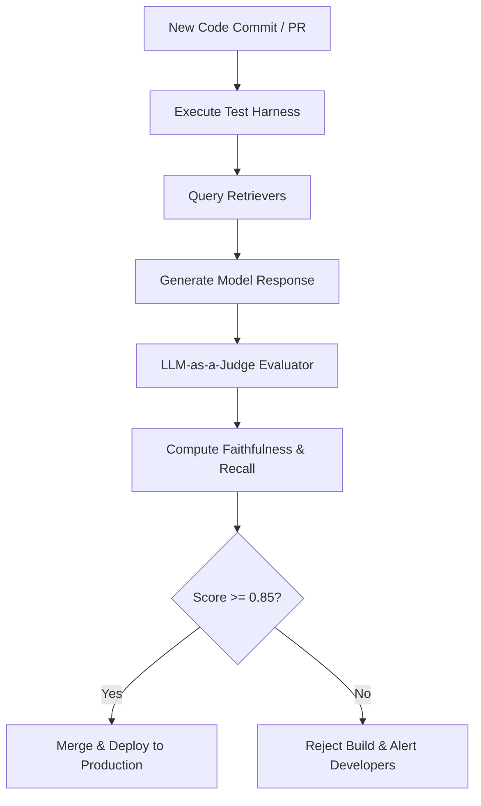

**Answer-First:** Continuous integration for AI systems demands automated validation pipelines using LLM-as-a-Judge frameworks (e.g., Ragas/TruLens) to compute exact quantitative metrics for faithfulness, answer relevance, and context recall before every deployment.

> **Prerequisite:** [Part 9: Agentic Observability - Monitoring & Debugging the AI's Train of Thought]() on operational tracing.

## 1. The End of the "Vibe Check" Era

A few years ago, the process of testing an AI system went like this: The programmer tweaks the Prompt file, types a few questions into the chatbox, skims through to see if the AI's answer sounds reasonable (vibe check), shouts *"Looks Good To Me" (LGTM)*, and hits Deploy to Production.

In 2026, this approach is considered catastrophic.
AI is a **Non-deterministic** system. Today it answers correctly, but tomorrow if you change just 1 word in the Prompt or switch to a new LLM version, it might hallucinate in a corner you never tested. To deploy AI for enterprise service, you must transition from intuitive testing to **statistical probability testing**.

---

## 2. The Invaluable Asset: The Golden Dataset

You cannot use generic online Benchmarks (like MMLU or HumanEval) to test your company's internal Chatbot. You must build your own **Golden Dataset**.

A Golden Dataset is a structured file (JSON/CSV) containing 200 - 500 pairs of `[User Question] -> [Expected Context] -> [Standard Answer]`.
*   **Origin:** Do not make up questions yourself. Get 90% of the data directly from **real-world errors** on Production (thanks to the Observability system in Part 9) and 10% from "Adversarial" cases (Users intentionally trying to break it).
*   **Guarantee:** This dataset is the Quality "Contract". Every new line of code or Prompt must pass this test to be allowed to Merge.

---

## 3. The "Holy Trinity" of RAG Systems

To automatically score AI, the industry has standardized around 3 core metrics (best defined by frameworks like **Ragas** and **TruLens**):

1.  **Context Relevance:** Measures whether the Vector DB retrieved the correct document the User needs. If this score is low, the fault lies with the Data Engineer (poor chunking, embedding).
2.  **Faithfulness / Groundedness:** Measures whether the AI's answer strictly adheres to the provided document, or if it "fabricates" external information. This is the fatal metric to eradicate Hallucinations.
3.  **Answer Relevance:** Sometimes the AI answers very faithfully according to the document, but is... completely off-topic compared to the User's question. This metric evaluates the ultimate usefulness.

---

## 4. LLM-as-a-Judge: Using AI to Grade AI

Human effort cannot manually read and score 500 answers every time a Dev modifies code. The 2026 solution is **LLM-as-a-judge**.
We hire a "Master" model (e.g., GPT-4o or Claude 3.5 Sonnet) acting as the Judge to score a "Junior" model (Llama-3 8B) on a scale from 1-5 based on the 3 RAG Triad criteria.

**⚠️ Bias Warning:**
AI Judges are highly susceptible to *Verbosity Bias* (giving high scores to lengthy answers even if they are empty platitudes) or *Self-Preference Bias* (favoring its "home" model).
To mitigate this, you must force the Judge to print out its **Chain-of-Thought** (Reasoning for the score) before giving the final number, and periodically have humans (Human-in-the-loop) re-score 10% of the data to "recalibrate" the Judge.

---

## 5. CI/CD Gates & Online Evals

The modern AI development lifecycle (LLMOps) is divided into 2 checkpoints:

### **Checkpoint 1: Offline Evals (CI/CD Gates)**
Integrate tools like **Promptfoo**, **DeepEval**, or **Braintrust** into GitHub Actions. You can use the following YAML Snippet for your `.github/workflows/ai-evals.yml` file:

```yaml
name: 'AI Agent Evaluation'
on:
  pull_request:
    paths:
      - 'prompts/**'
      - 'agents/**'
jobs:
  evaluate:
    runs-on: ubuntu-latest
    steps:
      - uses: actions/checkout@v4
      - name: Run promptfoo evaluation (LLM-as-a-judge)
        uses: promptfoo/promptfoo-action@v1
        with:
          openai-api-key: ${{ secrets.OPENAI_API_KEY }}
          config: 'prompts/promptfooconfig.yaml'
          fail-on-error: true # Block Merge if score drops
```

*   **Scenario:** Developer A just modified `system_prompt.txt` and created a Pull Request.
*   **Action:** GitHub Action automatically fetches the new Prompt and runs it through 500 questions in the Golden Dataset. The LLM Judge scores it.
*   **Result:** The *Faithfulness* score drops from 92% to 81% (below the safe threshold of 85%). GitHub Action marks it ❌ **FAILED** and locks the Merge button. The error is intercepted before reaching the User.

### **Checkpoint 2: Online Evals (Production Guard)**
Passing CI/CD doesn't mean it's safe forever, because company data (in the Vector DB) changes daily.
The Online Evals system runs asynchronously. It randomly samples 10% of User chat logs on Production and sends them to the Judge for scoring. If it detects the average score (Drift) declining for 3 consecutive days, it sends an emergency Alert to the Data team's Slack channel.

---

## Series Conclusion

Congratulations! Over the course of 10 articles, we have traversed from the naive concepts of Naive RAG, waded through the quagmire of unstructured data processing, built GraphRAG, equipped AI Agents with Tools, established firewall security, optimized vLLM, and finally locked down quality with CI/CD Evals.

You have officially mastered the **Data Pipeline & Agentic AI Architecture** to the 2026 Enterprise SOTA standard. Instead of just being an "LLM API caller", you are now a true AI Systems Architect.

Thank you for accompanying us through this series!

## Automated CI/CD Evaluation Test Harness

To deploy updates safely, we replace manual "vibe checks" with automated regression testing. The CI/CD pipeline runs a suite of test prompts against the candidate model. The output is evaluated using LLM-as-a-Judge API endpoints (such as Ragas or TruLens) to compute metrics:
- **Faithfulness:** Verifies the answer contains no hallucinations and matches the retrieved context.
- **Answer Relevance:** Verifies the answer directly addresses the query.
- **Context Recall:** Verifies the retriever successfully captured the necessary information.



The following Go code snippet implements a test harness that runs a validation query, sends the query and response to a Judge API, and verifies that the faithfulness score exceeds our minimum quality threshold:

```go
package main

import (
	"context"
	"errors"
	"fmt"
)

type ValidationTest struct {
	Query           string
	ExpectedKeyword string
}

type JudgeResult struct {
	Faithfulness   float64 // Scale 0.0 to 1.0
	AnswerRelevance float64 // Scale 0.0 to 1.0
}

func RunEvaluationSuite(ctx context.Context, tests []ValidationTest) error {
	for _, test := range tests {
		fmt.Printf("[CI Eval] Running validation test: %s\n", test.Query)
		
		// Simulate retrieval + model response generation
		simulatedResponse := "The system balance matches exactly the audited database log."
		simulatedContext := "Audited logs show system balance was correct as of Q3."
		
		// Call Judge API to compute faithfulness
		judge, err := evaluateWithJudge(simulatedResponse, simulatedContext)
		if err != nil {
			return err
		}
		
		fmt.Printf("           Scores: Faithfulness: %.2f, Relevance: %.2f\n", judge.Faithfulness, judge.AnswerRelevance)
		
		if judge.Faithfulness < 0.85 {
			return fmt.Errorf("evaluation failed: faithfulness score %.2f is below quality threshold of 0.85", judge.Faithfulness)
		}
	}
	return nil
}

func evaluateWithJudge(response, context string) (JudgeResult, error) {
	// Simulated response from Judge model API
	return JudgeResult{
		Faithfulness:   0.94,
		AnswerRelevance: 0.89,
	}, nil
}

func main() {
	tests := []ValidationTest{
		{Query: "Is the system balance audited?", ExpectedKeyword: "audited"},
	}
	
	ctx := context.Background()
	if err := RunEvaluationSuite(ctx, tests); err != nil {
		fmt.Println("[CI Eval Result] FAILED:", err)
	} else {
		fmt.Println("[CI Eval Result] ALL TESTS PASSED.")
	}
}
```

Integrating these evaluation suites directly into the CI/CD pipeline ensures that prompt optimizations and code modifications never cause regressions in retrieval quality.


---## Automated CI/CD Evaluation Test Harness

To deploy updates safely, we replace manual "vibe checks" with automated regression testing. The CI/CD pipeline runs a suite of test prompts against the candidate model. The output is evaluated using LLM-as-a-Judge API endpoints (such as Ragas or TruLens) to compute metrics:
- **Faithfulness:** Verifies the answer contains no hallucinations and matches the retrieved context.
- **Answer Relevance:** Verifies the answer directly addresses the query.
- **Context Recall:** Verifies the retriever successfully captured the necessary information.


The following Go code snippet implements a test harness that runs a validation query, sends the query and response to a Judge API, and verifies that the faithfulness score exceeds our minimum quality threshold:

```go
package main

import (
	"context"
	"errors"
	"fmt"
)

type ValidationTest struct {
	Query           string
	ExpectedKeyword string
}

type JudgeResult struct {
	Faithfulness   float64 // Scale 0.0 to 1.0
	AnswerRelevance float64 // Scale 0.0 to 1.0
}

func RunEvaluationSuite(ctx context.Context, tests []ValidationTest) error {
	for _, test := range tests {
		fmt.Printf("[CI Eval] Running validation test: %s\n", test.Query)
		
		// Simulate retrieval + model response generation
		simulatedResponse := "The system balance matches exactly the audited database log."
		simulatedContext := "Audited logs show system balance was correct as of Q3."
		
		// Call Judge API to compute faithfulness
		judge, err := evaluateWithJudge(simulatedResponse, simulatedContext)
		if err != nil {
			return err
		}
		
		fmt.Printf("           Scores: Faithfulness: %.2f, Relevance: %.2f\n", judge.Faithfulness, judge.AnswerRelevance)
		
		if judge.Faithfulness < 0.85 {
			return fmt.Errorf("evaluation failed: faithfulness score %.2f is below quality threshold of 0.85", judge.Faithfulness)
		}
	}
	return nil
}

func evaluateWithJudge(response, context string) (JudgeResult, error) {
	// Simulated response from Judge model API
	return JudgeResult{
		Faithfulness:   0.94,
		AnswerRelevance: 0.89,
	}, nil
}

func main() {
	tests := []ValidationTest{
		{Query: "Is the system balance audited?", ExpectedKeyword: "audited"},
	}
	
	ctx := context.Background()
	if err := RunEvaluationSuite(ctx, tests); err != nil {
		fmt.Println("[CI Eval Result] FAILED:", err)
	} else {
		fmt.Println("[CI Eval Result] ALL TESTS PASSED.")
	}
}
```

Integrating these evaluation suites directly into the CI/CD pipeline ensures that prompt optimizations and code modifications never cause regressions in retrieval quality.

## LLM-as-a-Judge Prompt Engineering Consistency

To guarantee reproducible test metrics, the Judge LLM is configured with a strict system instruction set:

1. **Deterministic Parameters:** Temperature is set to 0.0, and top_p is locked to 1.0.
2. **Step-by-Step Rationale:** The Judge must output its analysis chain before yielding a score, reducing random score variation.
3. **Structured Scoring:** Output is restricted to a structured JSON schema, preventing parsing failures.
4. **Reference Baseline:** The prompt provides explicit grading rubrics, mapping specific logical flaws (e.g. contradiction, extrapolation) to quantitative penalty scores.

🔗 **Next Step:** Explore the full index of the series in the [AI Data Engineering Pipeline Series](/series/ai-data-engineering-pipeline/).

*Need help assessing the risks of your own platform migration? → [Book a 1:1 Architecture Consultation](/hire/)*---

[← Previous Part: Part 9: Agentic Observability - Monitoring & Debugging the AI's Train of Thought]()
