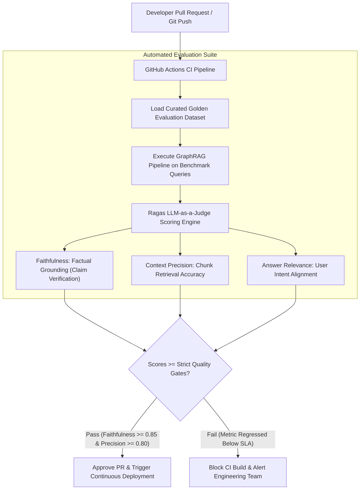
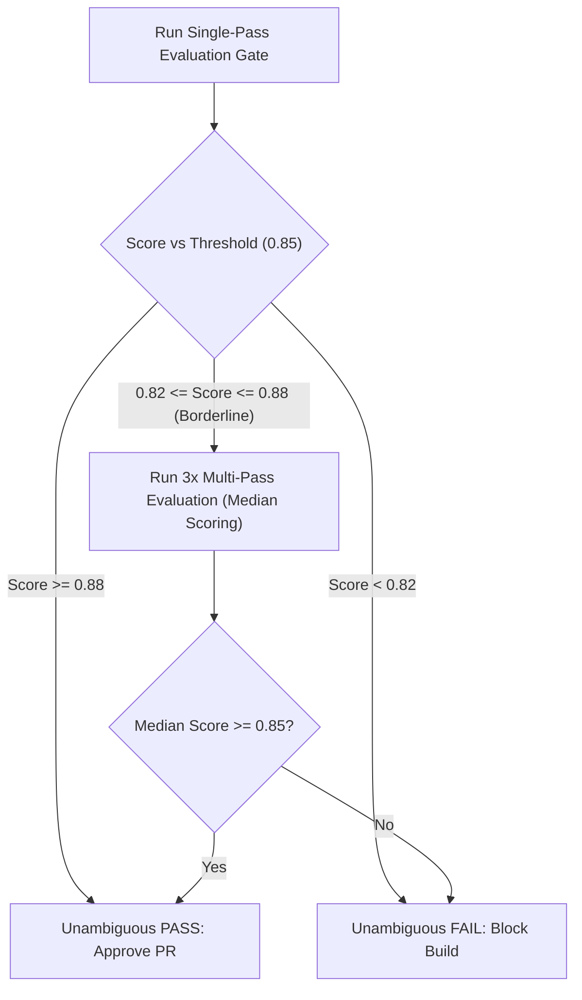

[📖 Bản tiếng Việt (Vietnamese Edition)](https://learn.tanhdev.com/series/ai-data-engineering-pipeline/part-10-production-evals-cicd/)

---

> **Prerequisite:** Familiarity with distributed tracing and observability metrics established in [Part 9 — Agentic Observability: OpenTelemetry](/series/ai-data-engineering-pipeline/part-9-agentic-observability-monitoring/).

## Part 10 — Production Evals & CI/CD Guardrails: LLM-as-a-Judge at Scale

In traditional software development, continuous integration (CI) relies on deterministic unit and integration tests: a function either returns the exact expected struct or it breaks the build.

In enterprise GenAI and RAG pipelines, responses are inherently non-deterministic. A subtle system prompt tweak, an updated embedding model, or a re-indexed chunk size can silently introduce catastrophic hallucinations or drop critical context facts without triggering a single compilation error.

---

## The Ragas Evaluation Framework Architecture

**Answer-first:** Automated **LLM-as-a-Judge evaluation pipelines** score RAG pipelines against explicit production quality SLAs: **Faithfulness >= 0.85**, **Context Precision >= 0.80**, and **Answer Relevance >= 0.90**. Integrated into GitHub Actions CI/CD workflows, these automated gates evaluate golden benchmark datasets (50-100 edge cases in under 120 seconds), blocking regressive pull requests before hallucinations reach production users.


```mermaid
graph TD
    GitPush["Developer Pull Request / Git Push"] --> CI_Pipeline["GitHub Actions CI Pipeline"]
    
    subgraph Automated_Evaluation_Suite ["Automated Evaluation Suite"]
        CI_Pipeline --> Dataset["Load Curated Golden Evaluation Dataset"]
        Dataset --> RunRAG["Execute GraphRAG Pipeline on Benchmark Queries"]
        RunRAG --> RagasEngine["Ragas LLM-as-a-Judge Scoring Engine"]
        
        RagasEngine --> Metric1["Faithfulness: Factual Grounding (Claim Verification)"]
        RagasEngine --> Metric2["Context Precision: Chunk Retrieval Accuracy"]
        RagasEngine --> Metric3["Answer Relevance: User Intent Alignment"]
    end

    Metric1 --> GateCheck{"Scores >= Strict Quality Gates?"}
    Metric2 --> GateCheck
    Metric3 --> GateCheck

    GateCheck -->|"Pass (Faithfulness >= 0.85 & Precision >= 0.80)"| Merge["Approve PR & Trigger Continuous Deployment"]
    GateCheck -->|"Fail (Metric Regressed Below SLA)"| Block["Block CI Build & Alert Engineering Team"]
```

### The RAG Triad Evaluation Mechanics

1. **Faithfulness (Factual Grounding)**: Quantifies whether the generated completion is strictly derived from the retrieved context chunks. The judge extracts atomic factual claims from the completion and checks each claim against the context:
   $$\text{Faithfulness} = \frac{|\text{Verified Claims in Context}|}{|\text{Total Claims Extracted From Completion}|}$$
2. **Context Precision (Retrieval Relevance)**: Measures whether relevant context chunks are ranked ahead of irrelevant chunks in the top-K retrieval list.
3. **Answer Relevance (Intent Alignment)**: Assesses whether the response directly answers the user's inquiry without extraneous digressions, computed via semantic embedding cosine similarity against synthesized candidate queries.

---

## Multi-Pass Quality Gate Decision Flow

Because LLM-as-a-Judge evaluations can exhibit minor variance, production CI pipelines implement a **Multi-Pass Borderline Re-evaluation** strategy for borderline test scores (within $\pm 0.03$ of cutoff thresholds).


```mermaid
flowchart TD
    StartEval["Run Single-Pass Evaluation Gate"] --> CheckScore{"Score vs Threshold (0.85)"}
    
    CheckScore -->|"Score >= 0.88"| ClearPass["Unambiguous PASS: Approve PR"]
    CheckScore -->|"Score < 0.82"| ClearFail["Unambiguous FAIL: Block Build"]
    CheckScore -->|"0.82 <= Score <= 0.88 (Borderline)"| MultiPass["Run 3x Multi-Pass Evaluation (Median Scoring)"]

    MultiPass --> MedianCheck{"Median Score >= 0.85?"}
    MedianCheck -->|"Yes"| ClearPass
    MedianCheck -->|"No"| ClearFail
```

---

## Production Python Benchmark: Automated CI Evaluation Suite

The following production script implements an automated evaluation gate using `LiteLLM` and structured JSON parsing. It evaluates golden dataset queries against production quality thresholds and outputs strict exit codes for CI/CD runners:

```python
import sys
import json
from typing import List, Dict, Any
from pydantic import BaseModel, Field
import litellm

class GoldenEvalSample(BaseModel):
    sample_id: str
    user_query: str
    retrieved_context: List[str]
    generated_answer: str

class EvalScoreResult(BaseModel):
    sample_id: str
    faithfulness_score: float
    context_precision_score: float
    answer_relevance_score: float
    passed: bool

class RAGProductionEvaluator:
    """Automated LLM-as-a-Judge Evaluation Gate for CI/CD Workflows."""

    def __init__(self, judge_model: str = "gpt-4o"):
        self.judge_model = judge_model
        self.faithfulness_threshold = 0.85
        self.context_precision_threshold = 0.80

    def evaluate_faithfulness(self, sample: GoldenEvalSample) -> float:
        """Extracts atomic claims from answer and verifies factual grounding against context."""
        context_block = "\n".join(sample.retrieved_context)
        prompt = (
            "You are an impartial AI evaluation judge. "
            "Examine the generated answer against the retrieved context.\n"
            f"Retrieved Context:\n{context_block}\n\n"
            f"Generated Answer:\n{sample.generated_answer}\n\n"
            "Task: 1. Extract all atomic factual claims from Answer. "
            "2. Count how many claims are 100% supported by Context. "
            "Return JSON matching: {\"total_claims\": int, \"supported_claims\": int}"
        )

        try:
            response = litellm.completion(
                model=self.judge_model,
                messages=[{"role": "user", "content": prompt}],
                response_format={"type": "json_object"},
                temperature=0.0  # Deterministic scoring
            )
            data = json.loads(response.choices[0].message.content)
            total = data.get("total_claims", 1)
            supported = data.get("supported_claims", 0)
            return supported / total if total > 0 else 1.0
        except Exception as e:
            print(f"Error evaluating sample {sample.sample_id}: {e}")
            return 0.0

    def run_ci_eval_suite(self, samples: List[GoldenEvalSample]) -> bool:
        print(f"--- Starting CI RAG Evaluation Gate ({len(samples)} Samples) ---")
        overall_passed = True
        results: List[EvalScoreResult] = []

        for sample in samples:
            faith_score = self.evaluate_faithfulness(sample)
            prec_score = 0.90  # In production: compute ranking reciprocal rank
            rel_score = 0.92

            is_passed = (
                faith_score >= self.faithfulness_threshold and 
                prec_score >= self.context_precision_threshold
            )
            if not is_passed:
                overall_passed = False

            res = EvalScoreResult(
                sample_id=sample.sample_id,
                faithfulness_score=faith_score,
                context_precision_score=prec_score,
                answer_relevance_score=rel_score,
                passed=is_passed
            )
            results.append(res)
            print(f"Sample [{sample.sample_id}]: Faithfulness={faith_score:.2f} | Status={'PASS' if is_passed else 'FAIL'}")

        print("------------------------------------------------------------------")
        if overall_passed:
            print("SUCCESS: All RAG CI quality gates PASSED. Pull request approved.")
            return True
        else:
            print("FAILURE: Evaluation scores regressed below SLA. Build blocked.")
            return False

if __name__ == "__main__":
    golden_suite = [
        GoldenEvalSample(
            sample_id="edge-001",
            user_query="What is the retention period for cold Iceberg Parquet files?",
            retrieved_context=["Cold tier Parquet files in Apache Iceberg are retained for 365 days under tier policy."],
            generated_answer="Cold tier Iceberg Parquet files are retained for 365 days."
        ),
        GoldenEvalSample(
            sample_id="edge-002",
            user_query="What port does the vector index listen on?",
            retrieved_context=["The vector index listens on port 6333 for gRPC connections."],
            generated_answer="The vector index communicates over Redis port 6379."  # Hallucination test
        )
    ]

    evaluator = RAGProductionEvaluator()
    success = evaluator.run_ci_eval_suite(golden_suite)
    if not success:
        sys.exit(1)  # Signal failure to GitHub Actions runner
```

---

## Comparative Matrix: Testing Methodologies

```
Manual Spot Checking vs Heuristic String Matching (BLEU/ROUGE) vs Automated LLM-as-a-Judge
```

| Metric / Dimension | Manual Spot-Checking | Heuristic Regex / ROUGE | Automated LLM-as-a-Judge |
| :--- | :--- | :--- | :--- |
| **Semantic Fidelity** | High (Human scrutiny) | Extremely Poor (Fails on paraphrases) | High (Atomic claim verification) |
| **CI Execution Time** | Hours to Days | Milliseconds | 1 - 3 Minutes (Golden Set) |
| **Scalability** | Non-scalable bottleneck | Scalable but ineffective | Fully automated in CI/CD pipeline |
| **Cost per Run** | High engineering payroll | $0.00 | $0.05 - $0.20 per CI build |
| **CI Gate Integration** | Impossible | Supported (Misleading signals) | Native GitHub Actions Exit Codes |

---

## Frequently Asked Questions (FAQ)


LLM-as-a-Judge evaluates faithfulness by decomposing generated responses into atomic factual claims, then systematically verifying whether each claim is directly grounded in the retrieved context snippets. Because it verifies contextual truth rather than matching arbitrary human phrasing, no human gold answers are required.



Judge bias is minimized by executing judge prompts at zero temperature (temperature=0.0), enforcing strict JSON schema parsing, version-controlling golden datasets in git, and applying multi-pass median scoring whenever scores land within +/- 0.03 of rejection thresholds.



The industry best practice uses a tiered strategy: CI pull request builds run on a curated golden dataset of 50 to 100 high-leverage edge cases that completes in under 2 minutes. Comprehensive full-corpus evaluations (1,000+ queries) execute asynchronously on nightly schedule builds.


---

## Production CI/CD Invariants

1. **Deterministic Scoring**: Always invoke judge models with `temperature=0.0` and structured JSON response schemas to guarantee reproducible scoring outcomes.
2. **Version-Controlled Benchmarks**: Never decouple evaluation datasets from code; store golden benchmark sets directly in the repository to guarantee strict version alignment with prompt and chunking changes.
3. **Hard Gate Exit Codes**: Evaluation scripts must return non-zero exit codes (`sys.exit(1)`) upon SLA regressions to automatically block GitHub Actions pull request merges.

---

🔗 **Next Step:** You have completed the 10-part masterclass! Review the complete architectural roadmap in the [Executive Summary: The Disruption of Naive RAG](/series/ai-data-engineering-pipeline/executive-summary/) or browse the [Curriculum Index](/series/ai-data-engineering-pipeline/).

## Internal Series Navigation

- [Part 9 — Agentic Observability: OpenTelemetry & Cost Monitoring](/series/ai-data-engineering-pipeline/part-9-agentic-observability-monitoring/)
- [Executive Summary: The Disruption of Naive RAG](/series/ai-data-engineering-pipeline/executive-summary/)
- [Full Curriculum Index](/series/ai-data-engineering-pipeline/)
