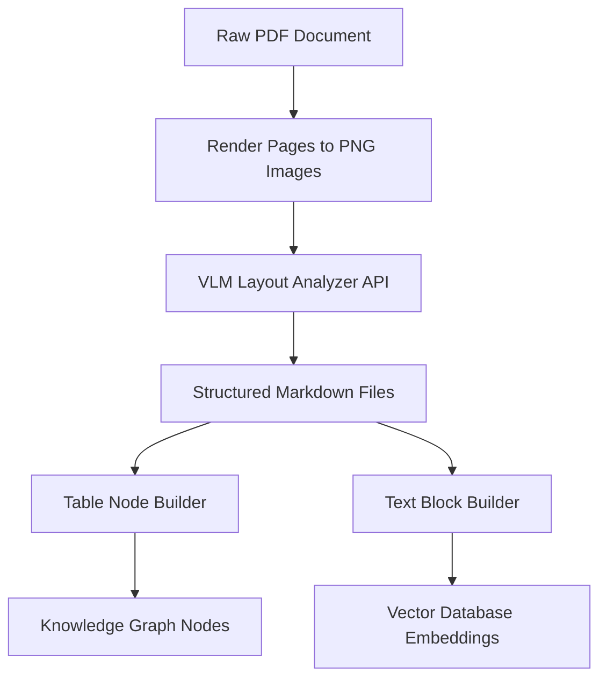

**Answer-First:** High-fidelity ingestion converts complex unstructured PDFs, tables, and charts into structured node-and-edge schemas using multimodal Vision-language models (VLMs) instead of lossy layout-blind text extractors.

> **Prerequisite:** [Part 1: The Convergence - Agentic RAG & GraphRAG]() on relational and vector search integration.

## 1. The Fall of Traditional OCR: The "Garbage In, Garbage Out" Pain

In Enterprise RAG architecture, the most ruthless formula is: **Garbage In = Garbage Out**.

Before 2025, data engineers often used traditional OCR tools (like Tesseract, PyMuPDF) to extract text from PDF documents. The result was a disaster: Financial report table structures were shattered, data columns were merged together, and technical diagrams were completely ignored. When a Vector Database contains a messy, contextless heap of text (Context loss), no matter how powerful the LLM is, the answer you receive will only be a Hallucination.

2026 marks the overthrow of mechanical OCR to enter the era of **Multimodal Document Understanding** — where AI doesn't just "read" text; it "sees" the entire document page.

---

## 2. Agentic Parsing: The Extraction War (LlamaParse vs Unstructured.io)

To feed raw data into LLMs perfectly, enterprises today divide the processing pipeline (Data Pipeline) into distinct strategies, leveraging the power of **Vision-Language Models (VLM)**.

### Unstructured.io: The "Heavy Duty" Platform
- **Role:** The industry standard for large-scale Data Pipelines.
- **Strength:** The ability to "swallow" any format from `.docx`, `.pptx`, `.html` to emails. It offers excellent self-hosting capabilities for enterprises bound by security laws (Air-gapped environments).
- **Strategy:** Use Unstructured to batch-process standard text documents.

### LlamaParse & Docling: The Specialist Squad (Agentic Extraction)
- **Role:** Handling "Hard cases" (Hard PDFs).
- **Strength:** Instead of using rule-based parsing for tables, **LlamaParse** and **Docling (IBM)** use VLM models directly to "look at" the PDF page image, then interpolate and redraw the table structure into Markdown or JSON format.
- **Strategy:** Route complex Financial Reports and Legal Contracts through LlamaParse to ensure not a single number is interpolated incorrectly.

---

## 3. The ColPali Shock: The "Page-as-Image" Retrieval Era

One of the most shocking breakthroughs of 2026 in the RAG space is the birth of **ColPali** (and variants like ColQwen2.5).

Instead of trying to extract text, tables, and images separately (a highly error-prone process), ColPali takes a radical but effective path: **Embedding the entire PDF page as ONE SINGLE IMAGE.**

- **Late Interaction:** When a User asks a question (e.g., *"What is the 2025 revenue in the bar chart?"*), ColPali uses a Late Interaction mechanism to compare the query's tokens directly with the "Image Patches" of the document page.
- **Result:** The system completely bypasses the OCR step. It accurately finds the PDF page containing the chart based on **Visual Understanding**. This is the new Gold Standard for document types heavy on charts and technical diagrams.

---

## 4. M³KG-RAG: Building Multimodal Knowledge Graphs (Audio & Video)

RAG in the Enterprise environment is not just about text. The most massive treasure trove of knowledge often lies in meeting recordings (Zoom/Teams), training videos, or product demos.

The **M³KG-RAG (Multi-hop Multimodal Knowledge Graph-enhanced RAG)** architecture solves this problem through a multi-stream pipeline:

1. **Multi-Stream Processing:** Audio is transcribed perfectly by ASR models (like Whisper), while the video image stream is cut into frames for the Vision LLM to continuously generate captions for ongoing actions.
2. **Triplet Extraction:** Agents automatically extract entities (People, Events, Actions) from Text, Images, and Audio, then connect them into a Knowledge Graph Network.
3. **Time-Anchoring:** This is the "Killer Feature". All data (Nodes) in the graph are tagged with time metadata. When the system answers, it doesn't just provide a text snippet, but also supplies a **Deep Link**, allowing users to click and re-watch the exact **03:15 minute** mark of the original meeting video.

---

## 5. Agentic Chunking: Abandoning Mechanical "Meat Slicing"

After perfectly extracting the data, the final step is to chunk it into small pieces for storage in the Vector DB. In 2026, Fixed-size Chunking (chunking by a fixed token count, e.g., 500 tokens/chunk) is considered mechanical "meat slicing", breaking the meaning of sentences.

SOTA (State-of-the-Art) systems currently use **Agentic Chunking (or Semantic Chunking)**:
- Using a small, high-speed LLM acting as the "Dealer". It skims the document and automatically analyzes semantics to find logical boundaries (e.g., switching to a new topic, ending a chapter, or finishing a data table).
- Although the processing cost is higher, it ensures absolute **Context Preservation**, helping the accurate search rate (Recall) skyrocket.

---

## 6. Conclusion

If **Part 1** provided you with a Brain Architecture (Agentic GraphRAG), then **Part 2** is how you load the purest ingredients into that brain.

However, no matter how clean your data is, if your Embedding and Retrieval strategy is flawed, the system will still crawl at a snail's pace and cost thousands of dollars in API fees.

In **[Part 3: The Art of Chunking & Semantic Caching]()**, we will dive deep into the ultimate technique of 2026: **Late Chunking** (Preserving context before slicing) and how to use Redis as **Semantic Caching** to reduce LLM API costs by 70%.

## Advanced Layout Analysis: Multimodal Document Ingestion

Standard optical character recognition (OCR) fails to preserve document context when dealing with complex multi-column reports, nested tables, and inline charts. The modern approach uses Multimodal Vision-Language Models (VLMs) like Llama 3.2 Vision or Claude 3.5 Sonnet to parse document pages as full images. The VLM processes the visual layout natively and outputs a structured Markdown schema that preserves tables and semantic headings.

The following Go code snippet demonstrates how to parse a PDF page image, convert it to a base64 payload, and dispatch it to a multimodal parsing API endpoint:

```go
package main

import (
	"bytes"
	"encoding/base64"
	"encoding/json"
	"fmt"
	"io"
	"net/http"
	"os"
)

type VLMRequest struct {
	Model    string        `json:"model"`
	Messages []MessageItem `json:"messages"`
}

type MessageItem struct {
	Role    string       `json:"role"`
	Content []ContentItem `json:"content"`
}

type ContentItem struct {
	Type     string         `json:"type"`
	Text     string         `json:"text,omitempty"`
	ImageURL *ImageURLParam `json:"image_url,omitempty"`
}

type ImageURLParam struct {
	URL string `json:"url"`
}

func ParsePageWithVLM(imagePath string, apiKey string) (string, error) {
	file, err := os.Open(imagePath)
	if err != nil {
		return "", err
	}
	defer file.Close()

	imgBytes, err := io.ReadAll(file)
	if err != nil {
		return "", err
	}

	base64Image := base64.StdEncoding.EncodeToString(imgBytes)
	dataURL := fmt.Sprintf("data:image/png;base64,%s", base64Image)

	reqPayload := VLMRequest{
		Model: "llama-3.2-11b-vision-instruct",
		Messages: []MessageItem{
			{
				Role: "user",
				Content: []ContentItem{
					{
						Type: "text",
						Text: "Convert this PDF page image into structured Markdown. Retain all table columns exactly, and extract visual flowcharts as text bullet lists.",
					},
					{
						Type: "image_url",
						ImageURL: &ImageURLParam{
							URL: dataURL,
						},
					},
				},
			},
		},
	}

	jsonBytes, err := json.Marshal(reqPayload)
	if err != nil {
		return "", err
	}

	req, err := http.NewRequest("POST", "https://api.vlm-provider.com/v1/chat/completions", bytes.NewBuffer(jsonBytes))
	if err != nil {
		return "", err
	}
	req.Header.Set("Content-Type", "application/json")
	req.Header.Set("Authorization", "Bearer "+apiKey)

	client := &http.Client{}
	resp, err := client.Do(req)
	if err != nil {
		return "", err
	}
	defer resp.Body.Close()

	respBody, err := io.ReadAll(resp.Body)
	if err != nil {
		return "", err
	}

	return string(respBody), nil
}

func main() {
	// Example call
	// markdownResult, err := ParsePageWithVLM("page_1.png", "YOUR_KEY")
	fmt.Println("VLM Document Ingest Module loaded.")
}
```



By transitioning to vision-based document processing, the database captures not only text fragments but also structural relationships, ensuring complete fidelity during retrieval.


---

## Advanced Layout Analysis: Multimodal Document Ingestion

Standard optical character recognition (OCR) fails to preserve document context when dealing with complex multi-column reports, nested tables, and inline charts. The modern approach uses Multimodal Vision-Language Models (VLMs) like Llama 3.2 Vision or Claude 3.5 Sonnet to parse document pages as full images. The VLM processes the visual layout natively and outputs a structured Markdown schema that preserves tables and semantic headings.

The following Go code snippet demonstrates how to parse a PDF page image, convert it to a base64 payload, and dispatch it to a multimodal parsing API endpoint:

```go
package main

import (
	"bytes"
	"encoding/base64"
	"encoding/json"
	"fmt"
	"io"
	"net/http"
	"os"
)

type VLMRequest struct {
	Model    string        `json:"model"`
	Messages []MessageItem `json:"messages"`
}

type MessageItem struct {
	Role    string       `json:"role"`
	Content []ContentItem `json:"content"`
}

type ContentItem struct {
	Type     string         `json:"type"`
	Text     string         `json:"text,omitempty"`
	ImageURL *ImageURLParam `json:"image_url,omitempty"`
}

type ImageURLParam struct {
	URL string `json:"url"`
}

func ParsePageWithVLM(imagePath string, apiKey string) (string, error) {
	file, err := os.Open(imagePath)
	if err != nil {
		return "", err
	}
	defer file.Close()

	imgBytes, err := io.ReadAll(file)
	if err != nil {
		return "", err
	}

	base64Image := base64.StdEncoding.EncodeToString(imgBytes)
	dataURL := fmt.Sprintf("data:image/png;base64,%s", base64Image)

	reqPayload := VLMRequest{
		Model: "llama-3.2-11b-vision-instruct",
		Messages: []MessageItem{
			{
				Role: "user",
				Content: []ContentItem{
					{
						Type: "text",
						Text: "Convert this PDF page image into structured Markdown. Retain all table columns exactly, and extract visual flowcharts as text bullet lists.",
					},
					{
						Type: "image_url",
						ImageURL: &ImageURLParam{
							URL: dataURL,
						},
					},
				},
			},
		},
	}

	jsonBytes, err := json.Marshal(reqPayload)
	if err != nil {
		return "", err
	}

	req, err := http.NewRequest("POST", "https://api.vlm-provider.com/v1/chat/completions", bytes.NewBuffer(jsonBytes))
	if err != nil {
		return "", err
	}
	req.Header.Set("Content-Type", "application/json")
	req.Header.Set("Authorization", "Bearer "+apiKey)

	client := &http.Client{}
	resp, err := client.Do(req)
	if err != nil {
		return "", err
	}
	defer resp.Body.Close()

	respBody, err := io.ReadAll(resp.Body)
	if err != nil {
		return "", err
	}

	return string(respBody), nil
}

func main() {
	// Example call
	// markdownResult, err := ParsePageWithVLM("page_1.png", "YOUR_KEY")
	fmt.Println("VLM Document Ingest Module loaded.")
}
```


By transitioning to vision-based document processing, the database captures not only text fragments but also structural relationships, ensuring complete fidelity during retrieval.

## Vision LLMs Layout Schema Specs

To extract structured content with high consistency, we define strict schema requirements in our system prompt. The model is instructed to output standard JSON with the following layout properties:

1. **Page Classification:** Categorizes the page layout (e.g. `report`, `flowchart`, `table_sheet`, `mixed_document`).
2. **Text Blocks:** A list of parsed text segments containing block coordinates, heading level, and body content.
3. **Table Data:** For every detected table grid, the model outputs raw rows and columns under a unified array schema.
4. **Graph Edge Relations:** Extracts connections from flowcharts and organizational diagrams, yielding explicit relationships in the format `SourceNode -> Relationship -> TargetNode`.
5. **Figure Metadata:** Captures image descriptions and titles to ensure visual figures remain indexed alongside textual content.

🔗 **Next Step:** Master document chunking and caching in [Part 3: The Art of Chunking & Semantic Caching]().

---

[← Previous Part: Part 1: The Convergence - Agentic RAG & GraphRAG]()  |  [Next Part: Part 3: The Art of Chunking & Semantic Caching]()
