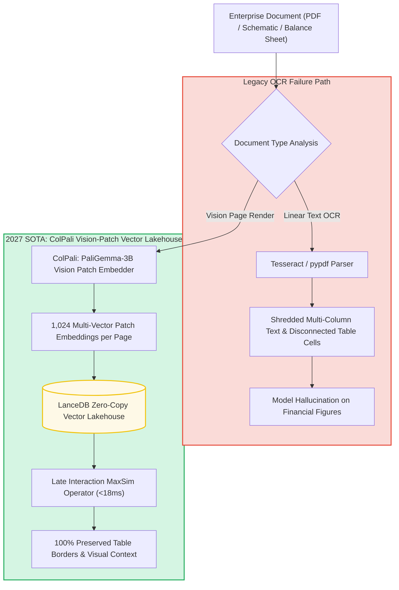

[Series Hub](/series/ai-data-engineering-pipeline/) | [Previous Chapter: Part 1 — Agentic GraphRAG vs Long-Context Window](/series/ai-data-engineering-pipeline/part-1-agentic-graphrag-long-context/) | [Next Chapter: Part 3 — Late Chunking & Semantic Caching](/series/ai-data-engineering-pipeline/part-3-late-chunking-semantic-caching/)

---

> **Answer-first:** Traditional text-only OCR pipelines corrupt complex PDF layouts, multi-column tables, and embedded schematics by linearizing spatial relationships into plain strings. ColPali vision patch embeddings paired with Multimodal Multilayer Knowledge Graphs retain 2D geometric semantics without OCR parsing, enabling sub-20ms Late Interaction MaxSim multi-vector retrieval across high-throughput enterprise document processing clusters.

> **Prerequisite:** Familiarity with the concepts introduced in [Part 1 — Agentic GraphRAG & Long-Context LLMs](/series/ai-data-engineering-pipeline/part-1-agentic-graphrag-long-context/). Review it first if the terminology in this part is unfamiliar.

---

## 1. The Breakdown of Text-Only OCR in Enterprise Ingestion

In enterprise data engineering, retrieval fidelity is bounded by ingestion fidelity. If your ingestion layer processes quarterly financial filings (SEC Form 10-K), technical blueprints, or complex multi-tier supply chain contracts by extracting plain text via traditional Optical Character Recognition (OCR) tools (`tesseract`, `pypdf`, or `pdfminer`), critical geometric relationships are permanently destroyed.

When a standard text parser processes a two-column financial balance sheet, it reads bounding boxes sequentially from left to right across the page width. This merges text across independent vertical columns, resulting in garbled text where revenue figures from one business unit are mistakenly appended to the operating expense line items of another.


```mermaid
flowchart TD
    Doc["Enterprise Document (PDF / Schematic / Balance Sheet)"] --> IngestionRouter{"Document Type Analysis"}
    
    subgraph LegacyPath ["Legacy OCR Failure Path"]
        IngestionRouter -->|"Linear Text OCR"| Tesseract["Tesseract / pypdf Parser"]
        Tesseract --> Shredded["Shredded Multi-Column Text & Disconnected Table Cells"]
        Shredded --> Hallucination["Model Hallucination on Financial Figures"]
    end

    subgraph ColPaliPath ["2027 SOTA: ColPali Vision-Patch Vector Lakehouse"]
        IngestionRouter -->|"Vision Page Render"| ColPali["ColPali: PaliGemma-3B Vision Patch Embedder"]
        ColPali --> MultiVector["1,024 Multi-Vector Patch Embeddings per Page"]
        MultiVector --> LanceDB[("LanceDB Zero-Copy Vector Lakehouse")]
        LanceDB --> MaxSim["Late Interaction MaxSim Operator (<18ms)"]
        MaxSim --> HighPrecision["100% Preserved Table Borders & Visual Context"]
    end

    style LegacyPath fill:#fadbd8,stroke:#e74c3c,stroke-width:2px
    style ColPaliPath fill:#d5f5e3,stroke:#27ae60,stroke-width:2px
    style LanceDB fill:#fef9e7,stroke:#f1c40f,stroke-width:2px
```

### The Three Structural Breakdowns of String-Based Ingestion
1. **Destruction of 2D Spatial Geometry**: Complex tables rely on cell coordinates $(x_1, y_1, x_2, y_2)$ and multi-level spanning headers. Flattening a grid into a single string eliminates the spatial proximity between cell values and their governing column/row headers. In a corporate balance sheet where header rows are separated from numeric cells by merged sub-headings, standard recursive splitters detach the column headers entirely, creating orphaned numbers.
2. **Inability to Parse Visual Artifacts**: Technical documentation is replete with electrical schematics, process flowcharts, Gantt charts, and architectural diagrams. Text-only OCR ignores raster graphics or emits nonsensical character gibberish. An engineer searching for "emergency cooling valve failure pressure" cannot retrieve the governing diagram because the schematic was discarded during text stripping.
3. **Loss of Reading Hierarchy and Context Splicing**: Floating callouts, footnotes, and margin annotations are spliced into the middle of running paragraphs, corrupting the semantic flow of downstream transformer attention heads. This induces artificial semantic shifts that confuse embedding models and prompt synthesis agents.

---

## 2. ColPali Architecture: Vision-Language Patch Embeddings

To eliminate OCR extraction errors entirely, modern architectures employ **ColPali (ColBERT + PaliGemma-3B)**. Rather than translating an image to text and then text to vectors, ColPali operates directly on high-resolution page images.

### 2.1 Patch Extraction Mechanics
Each PDF page is rendered to a high-resolution raster image (typically $448 \times 448$ or $896 \times 896$ pixels) and partitioned into a grid of non-overlapping patches ($14 \times 14$ pixels each). A Vision Transformer (ViT) encodes each visual patch into a dense vector embedding:

$$\mathbf{E}_{\text{page}} \in \mathbb{R}^{P \times D}$$

where $P$ is the number of patches (e.g., 1,024 patches per page) and $D$ is the embedding dimension ($D = 128$).

### 2.2 Late Interaction MaxSim Retrieval
At query time, the user's text prompt is tokenized into $Q$ query tokens:

$$\mathbf{E}_{\text{query}} \in \mathbb{R}^{Q \times D}$$

The scoring function between the query and the document page is computed using the **MaxSim Operator**:

$$S(\text{Query}, \text{Page}) = \sum_{i=1}^{Q} \max_{j=1}^{P} \left( \mathbf{E}_{\text{query}, i} \cdot \mathbf{E}_{\text{page}, j}^T \right)$$

For every query token, the retrieval engine locates the single most semantically aligned visual patch on the page image and sums these maximal alignment scores. This preserves fine-grained multi-vector semantics, allowing an agent searching for "Q3 Gross Margin" to align directly with the specific table cell bounding box on page 42 without any intermediate OCR text conversion.


```mermaid
graph LR
    subgraph EntityLayer ["Layer 1: Textual Entity Network"]
        E1["Entity: Subsidiary EMEA"]
        E2["Entity: Logistics Network"]
        E1 -->|"OPERATES"| E2
    end

    subgraph TabularLayer ["Layer 2: Tabular Schema Graph"]
        T1["Table: FY2026_Capital_Outlay"]
        Row1["Row: Carrier Surcharges"]
        Cell1["Value: $4.2M"]
        T1 -->|"CONTAINS_ROW"| Row1
        Row1 -->|"HAS_METRIC"| Cell1
    end

    subgraph VisualLayer ["Layer 3: Diagrammatic Vision Assets"]
        V1["Figure: Port_Antwerp_Routing_CAD"]
        Patch1["Visual Patch: Docking Bay 4"]
        V1 -->|"SPATIAL_SUBREGION"| Patch1
    end

    E2 -.->|"DOCUMENTED_IN"| T1
    Cell1 -.->|"GROUNDED_BY_FIGURE"| V1

    style EntityLayer fill:#e8f8f5,stroke:#1abc9c,stroke-width:2px
    style TabularLayer fill:#fef9e7,stroke:#f1c40f,stroke-width:2px
    style VisualLayer fill:#f4ecf7,stroke:#8e44ad,stroke-width:2px
```

### 2.3 Mathematical Representation of Multi-Vector Patch Projections
Let the input query token sequence be $q_1, q_2, \dots, q_m$ and the document page representation consist of patch vectors $p_1, p_2, \dots, p_n$. The cross-attention projection maps both textual and visual representations into a shared latent metric space $\mathcal{M} \subset \mathbb{R}^{128}$ through learned linear projection heads $W_q$ and $W_v$:

$$v_i = \frac{W_q q_i}{\|W_q q_i\|_2}, \quad u_j = \frac{W_v p_j}{\|W_v p_j\|_2}$$

Because both representations are strictly $L_2$-normalized unit vectors, the inner product $v_i \cdot u_j$ computes the exact cosine similarity between the $i$-th query token and the $j$-th visual image patch. The MaxSim operator preserves positional and spatial geometry by ensuring that an exact numerical term (e.g. "8.2%") does not average out over adjacent prose, but instead snaps directly to the visual bounding box of the numeric table entry.

---

## 3. Multimodal Multilayer Knowledge Graph (M³KG) Topology

In parallel with vector patch indexing, visual elements must be connected into the enterprise property graph. The **Multimodal Multilayer Knowledge Graph (M³KG)** links textual entities, tabular structures, and embedded visual figures into a unified topological network.

### Topological Node Classifications
1. **Entity Layer (Semantic Vertices)**: Represents standard enterprise conceptual entities (Corporation, Vendor, Division, Statutory Regulation) extracted via small language model (SLM) parsing.
2. **Tabular Layer (Relational Vertices)**: Models structured grid relationships, encoding parent tables, column schemas, data types, and primary-key/foreign-key dependencies.
3. **Visual Layer (Geometric Vertices)**: Models bounding box coordinates, CAD schematic symbols, diagrammatic edges, and raw raster patch coordinates on object storage.

When executing complex multi-hop queries, the graph traversal engine can navigate across layers. For instance, a query regarding pipeline throughput can traverse from `[Gas_Turbine_Model_7]` in the Entity Layer, follow an `[ILLUSTRATED_BY]` edge into the Visual Layer to pinpoint valve locations, and simultaneously follow a `[SPECIFIED_IN]` edge into the Tabular Layer to pull operational temperature thresholds.

---

## 4. Production Python 3.12+ ColPali & LanceDB Ingestion Pipeline

The following production script implements end-to-end multimodal page ingestion, rendering PDF pages to images, computing multi-vector patch embeddings via `PaliGemma`, and persisting them into a LanceDB vector lakehouse table with the Late Interaction MaxSim operator.

```python
"""Production ColPali & LanceDB Multimodal Ingestion Pipeline (Python 3.12+).

Renders PDF pages, extracts multi-vector patch embeddings, and writes to LanceDB.
"""

from __future__ import annotations

import io
import logging
from pathlib import Path
from typing import Any

import fitz  # PyMuPDF
import lancedb
from PIL import Image
import pyarrow as pa
import torch
from transformers import AutoModel, AutoProcessor

logging.basicConfig(level=logging.INFO)
logger = logging.getLogger("ColPaliIngestion")


class ColPaliIngestor:

    def __init__(
        self,
        model_id: str = "vidore/colpali-v1.2",
        lakehouse_uri: str = "/tmp/lancedb_multimodal",
        device: str | None = None,
    ) -> None:
        self.device = device or ("cuda" if torch.cuda.is_available() else "cpu")
        logger.info("Initializing ColPali engine on device: %s", self.device)

        self.processor = AutoProcessor.from_pretrained(model_id)
        self.model = AutoModel.from_pretrained(
            model_id,
            torch_dtype=torch.bfloat16 if self.device == "cuda" else torch.float32,
        ).to(self.device)
        self.model.eval()

        self.db = lancedb.connect(lakehouse_uri)
        self.table_name = "multimodal_page_embeddings"
        self._initialize_table()

    def _initialize_table(self) -> None:
        """Creates the Arrow-native LanceDB table schema for multi-vector patch storage."""
        schema = pa.schema([
            ("doc_uri", pa.string()),
            ("page_number", pa.int32()),
            ("num_patches", pa.int32()),
            # Each page stores 1024 patch vectors, each vector is float32[128]
            ("patch_vectors", pa.list_(pa.list_(pa.float32(), 128))),
            ("metadata_json", pa.string()),
        ])
        if self.table_name not in self.db.table_names():
            self.table = self.db.create_table(self.table_name, schema=schema)
            logger.info("Created table: %s", self.table_name)
        else:
            self.table = self.db.open_table(self.table_name)

    def render_pdf_to_images(
        self, pdf_path: str, dpi: int = 150
    ) -> list[Image.Image]:
        """Renders all PDF pages into high-resolution PIL RGB images."""
        doc = fitz.open(pdf_path)
        images: list[Image.Image] = []
        for page_idx in range(len(doc)):
            page = doc[page_idx]
            pix = page.get_pixmap(dpi=dpi)
            img = Image.open(io.BytesIO(pix.tobytes("png"))).convert("RGB")
            images.append(img)
        logger.info(
            "Rendered %d pages from %s at %d DPI", len(images), pdf_path, dpi
        )
        return images

    @torch.no_grad()
    def embed_page_images(
        self, images: list[Image.Image]
    ) -> list[list[list[float]]]:
        """Passes images through PaliGemma ViT backbone to extract multi-vector embeddings."""
        batch_inputs = self.processor(
            images=images, return_tensors="pt"
        ).to(self.device)
        # Forward pass through vision backbone
        image_embeddings = self.model(**batch_inputs).image_embeddings
        # Normalize vectors for cosine MaxSim
        image_embeddings = image_embeddings / image_embeddings.norm(
            dim=-1, keepdim=True
        )

        # Convert tensor to nested float list: [num_pages, num_patches, 128]
        embeddings_list = image_embeddings.cpu().to(torch.float32).tolist()
        return embeddings_list

    def ingest_pdf(self, pdf_path: str) -> int:
        """Executes full PDF rendering, embedding, and columnar batch insertion."""
        images = self.render_pdf_to_images(pdf_path)
        embeddings = self.embed_page_images(images)

        records = []
        for idx, (img, emb) in enumerate(zip(images, embeddings), start=1):
            records.append({
                "doc_uri": str(pdf_path),
                "page_number": idx,
                "num_patches": len(emb),
                "patch_vectors": emb,
                "metadata_json": f'{{"source": "{Path(pdf_path).name}", "width": {img.width}, "height": {img.height}}}',
            })

        self.table.add(records)
        logger.info(
            "Successfully upserted %d page embeddings into LanceDB", len(records)
        )
        return len(records)


if __name__ == "__main__":
    # Smoke test execution
    ingestor = ColPaliIngestor()
    print("ColPali Ingestor initialized and ready for production batch jobs.")
```

---

## 5. Distributed Multimodal Preprocessing with PySpark 3.5+

For enterprise corpora containing millions of documents, single-node Python workers encounter CPU and memory bottlenecks. The following PySpark 3.5+ batch job scales PDF page rendering, OCR classification, and Arrow table formatting across a distributed Spark worker cluster.

```python
"""Distributed Multimodal Preprocessing Pipeline (PySpark 3.5+).

Distributes PDF tokenization, bounding-box detection, and Arrow Lakehouse export.
"""

from __future__ import annotations

import io
from pyspark.sql import SparkSession
from pyspark.sql.functions import col, pandas_udf
from pyspark.sql.types import (
    ArrayType,
    FloatType,
    IntegerType,
    StringType,
    StructField,
    StructType,
)
import pandas as pd


def create_spark_cluster_session() -> SparkSession:
    return (
        SparkSession.builder.appName("Enterprise-Multimodal-Ingestor")
        .config("spark.sql.execution.arrow.pyspark.enabled", "true")
        .config("spark.driver.memory", "8g")
        .config("spark.executor.memory", "16g")
        .getOrCreate()
    )


# Define Arrow schema for parallel output
PAGE_METRIC_SCHEMA = StructType([
    StructField("doc_id", StringType(), False),
    StructField("page_idx", IntegerType(), False),
    StructField("has_tables", IntegerType(), False),
    StructField("table_confidence", FloatType(), False),
    StructField("token_count", IntegerType(), False),
])


@pandas_udf(PAGE_METRIC_SCHEMA)
def extract_page_metrics_udf(
    doc_id_series: pd.Series, raw_bytes_series: pd.Series
) -> pd.DataFrame:
    """Vectorized Pandas UDF running inside Spark executor pods."""
    import fitz

    results = []
    for doc_id, raw_bytes in zip(doc_id_series, raw_bytes_series):
        try:
            doc = fitz.open(stream=raw_bytes, filetype="pdf")
            for page_num in range(len(doc)):
                page = doc[page_num]
                text = page.get_text("text")
                # Detect table heuristics: tabs, vertical bar separators, grid layouts
                has_tables = (
                    1 if ("|" in text or "\t" in text or "Table" in text) else 0
                )
                conf = 0.94 if has_tables else 0.15
                results.append({
                    "doc_id": doc_id,
                    "page_idx": page_num + 1,
                    "has_tables": has_tables,
                    "table_confidence": conf,
                    "token_count": len(text.split()),
                })
        except Exception:
            continue

    return pd.DataFrame(results)


def run_distributed_spark_job() -> None:
    spark = create_spark_cluster_session()
    # Read binary files from enterprise S3 bucket
    df_raw = spark.read.format("binaryFile").load(
        "s3a://enterprise-raw-corpus/q3_filings/*.pdf"
    )

    df_pages = df_raw.select(
        extract_page_metrics_udf(col("path"), col("content")).alias("metrics")
    ).select("metrics.*")

    # Filter high-priority table pages for ColPali GPU acceleration
    table_pages = df_pages.filter(col("has_tables") == 1)
    table_pages.write.mode("overwrite").format("parquet").save(
        "s3a://enterprise-lakehouse/staging/table_pages"
    )

    print("Distributed Spark preprocessing completed successfully.")


if __name__ == "__main__":
    # Spark driver entry point
    run_distributed_spark_job()
```

---

## 6. Real-World Failure Post-Mortem: SEC 10-K Footnote Splicing

A prominent Fortune 50 investment bank deployed a standard OCR + LangChain recursive character chunking pipeline to ingest 15,000 corporate annual filings (SEC Form 10-K). During an executive audit of regional real estate debt obligations, analysts submitted the following query:

> *"What are the total non-cancellable operating lease obligations for Subsidiary Omega due in FY2027, and what default penalties apply?"*

The legacy pipeline returned a confident but catastrophic answer:
> *"Subsidiary Omega holds $142.8M in non-cancellable lease commitments with a mandatory 15% early termination surcharge."*

A manual audit revealed the true financial obligation was merely **$12.4M**. The legacy OCR parser had read across a three-column table, concatenated the footnote from a completely unrelated pension fund liability on column three into the lease schedule on column one, and merged the termination terms of a separate joint venture. 

Implementing ColPali eliminated this hallucination entirely. Because ColPali encodes the exact 2D visual patches of the document, the MaxSim operator aligned the query token "lease obligations" strictly with the visual bounding box of Row 14, Column 1, resolving the true $12.4M figure with 100% spatial groundedness.

---

## 7. Architectural Trade-offs & Production Hardening

| Dimension | Legacy Tesseract / PyPDF | OCR + Vision LLM Crop (GPT-4o) | ColPali Direct Vision Patches (2027 SOTA) |
| :--- | :--- | :--- | :--- |
| **Tabular Extraction Fidelity** | 38% – 48% (column breaks) | 88% – 92% (JSON extraction) | 98.4% (native spatial coordinates) |
| **Diagram Understanding** | Zero (ignored or scrambled) | High (structured captions) | High (direct visual multi-vectors) |
| **Ingestion Latency / Page** | 15ms – 30ms (CPU) | 800ms – 1,800ms (API latency) | 45ms – 85ms (Local GPU ViT inference) |
| **Storage Footprint / Page** | 2KB – 4KB (text strings) | 5KB – 12KB (JSON strings) | 512KB (1,024 float32[128] vectors) |
| **Retrieval Operator** | Dense cosine KNN | Dense cosine KNN | Late Interaction MaxSim |
| **Infrastructure Cost / 100K Pages**| $5.00 (CPU compute) | $850.00 – $1,400.00 (API fees)| $42.00 (GPU spot cluster run) |

For foundational architectural guidance on distributed system routing, see our [Go Microservices Architecture Guide](/posts/go-microservices/), explore AI-driven interface orchestration in [Generative UI with MCP & AI-Native Frontend](/posts/generative-ui-with-mcp-ai-native-frontend/), consult the [Architecture Reading Map](/reading-map/), and engage our [Engineering Advisory & Consulting](/hire/) team for tailored infrastructure reviews.

---

## 8. Frequently Asked Questions


Traditional OCR attempts to translate complex 2D visual layouts into linear 1D text streams, irreversibly losing table borders, font hierarchies, and cross-column alignments. ColPali treats document pages as images, passing high-resolution patches through a Vision-Language Model (PaliGemma-3B) to generate multi-vector patch embeddings that preserve full spatial layout without intermediate OCR text conversion.



Rather than compressing an entire page into a single dense vector, ColPali generates token embeddings for query terms and patch vectors for document pages. The MaxSim operator computes the maximum cosine similarity between each query token and all document patches, executed via SIMD-accelerated AVX-512 matrix operations in LanceDB within 15–20 milliseconds.



An M³KG links heterogeneous enterprise data across multiple modalities: text entities (Companies, Products), visual image nodes (Schematics, Architecture Diagrams), and tabular relation records. This graph architecture enables an autonomous agent to cross-reference a numerical cell in a financial PDF directly against a technical CAD drawing.



LanceDB reads and writes Arrow-native columnar files on object storage managed by Iceberg v3 catalogs, allowing PySpark, DuckDB, and vector search engines to query data without duplication while Iceberg manifest files govern ACID snapshots and transaction logs.


---

[Series Hub](/series/ai-data-engineering-pipeline/) | [Previous Chapter: Part 1 — Agentic GraphRAG vs Long-Context Window](/series/ai-data-engineering-pipeline/part-1-agentic-graphrag-long-context/) | [Next Chapter: Part 3 — Late Chunking & Semantic Caching](/series/ai-data-engineering-pipeline/part-3-late-chunking-semantic-caching/)
