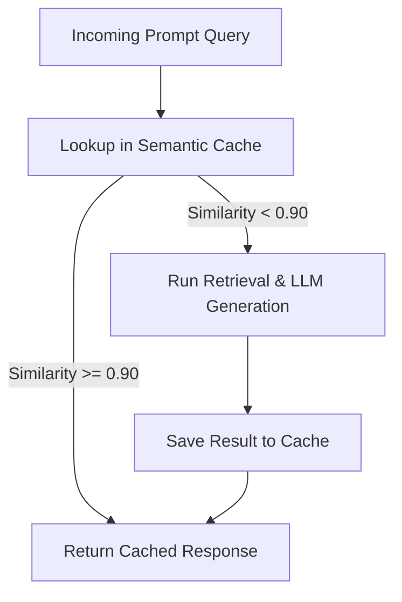

**Answer-First:** Late chunking preserves full document attention context by chunking embedding vectors after passing the entire text through a transformer model, while semantic caching reduces costs by matching incoming query intents at the database layer.

> **Prerequisite:** [Part 2: Agentic Ingestion & Multimodal Knowledge Graphs]() on processing unstructured data.

## 1. Introduction: The Failure of Mechanical Chunking

When building a RAG system, if you only split documents using traditional functions like `RecursiveCharacterTextSplitter` (e.g., slicing every 500 tokens), you are destroying your system.

Mechanical slicing disrupts pronouns ("it", "they", "this project") and completely causes context loss. A paragraph explaining "Compensation" on page 10 will be completely meaningless to an LLM if it is severed from the "Contract Name and Stakeholders" located on page 1.

In 2026, System Architects no longer talk about mere "Chunking"; they call it **Context Engineering**. Here are the 2 most breakthrough techniques today to definitively solve this problem.

---

## 2. Technique 1: Late Chunking (The Rise of Jina AI)

The old chunking method (Chunk first, Embed later) makes the Embeddings "blind" to their surrounding context. **Late Chunking** completely reverses this process: **Embed first, Chunk later.**

1. **Step 1 (Embed Completely):** Pass the entire long document (tens of thousands of tokens) through an Embedding model with a large Context Window (like `jina-embeddings-v3`). This process allows the model to compute the relationship (attention) between *all* words in the text. Every token now carries the "memory" of the entire document.
2. **Step 2 (Slice and Pool):** Once a complete set of Embeddings for the entire text is obtained, the system cuts it into pieces. By pooling (Mean-pooling) the embedded tokens, we obtain concise Chunk Vectors that carry an extremely dense amount of macro-context.

**Result:** A short paragraph on page 50 can now contain the semantics of the Main Title located on page 1.

---

## 3. Technique 2: Contextual Retrieval (Anthropic's Secret)

If Late Chunking optimizes at the Vector level, then **Contextual Retrieval** (pioneered by Anthropic) solves the problem at the Text level.

1. **Preparation:** Cut the document into normal small Chunks.
2. **Add Context:** Use a small, high-speed LLM (like Claude 3 Haiku) to automatically write an introductory sentence (Header) attached to the beginning of each Chunk.
   - *Example:* Instead of storing a Chunk containing only the content *"The company will be penalized 5% of revenue"*, the LLM turns it into: `[Context: In the M&A Contract between Company A and B in 2026, under the Breach Penalty Clause] The company will be penalized 5% of revenue.`
3. **Prompt Caching:** To ensure that calling the LLM for millions of Chunks does not bankrupt you, this technique must be combined with **Prompt Caching** (caching the entire original document), saving up to 90% in context generation API costs.

---

## 4. Reranking: Multi-Layered Filtering

Never dump results directly from the Vector Database straight into the LLM. To optimize accuracy and speed, 2026 systems use a Funnel Reranking model:

- **Layer 1 (Vector Search):** Rough retrieval of the 500 fastest documents using a Bi-Encoder or BM25.
- **Layer 2 (ColBERT - Late Interaction):** Filter these 500 documents down to 50. ColBERT compares every query token with every document token. It is extremely fast (thanks to Late Interaction) and effective.
- **Layer 3 (Cross-Encoder):** The final checkpoint. Takes the 50 documents from Layer 2, pairs them directly with the query, and feeds them into a Transformer network for evaluation. Extremely expensive and slow (High Latency), but outputs the final 5 documents with **absolute precision** to feed into the LLM.

---

## 5. Semantic Caching: The Savior for API Bills

When a RAG system goes into Production, you will realize a painful truth: 70% of user queries are repetitive or similar, but they use different wording. If you use a traditional Cache (100% exact text match), you will always get a Cache Miss.

**Solution: Semantic Caching with Redis / Valkey or AI Gateways (like Bifrost)**
- Instead of String Matching, the system converts the new query into a Vector and compares it with the Vectors of past queries stored in Redis.
- If the **Cosine Similarity > 0.90** (the two queries have similar meanings), the system immediately returns the previously cached answer, entirely skipping the Vector DB call and the LLM generation step.
- **Dual Benefit:** Reduces Latency from tens of seconds to under **5ms**, while slashing up to **70% of the cost** of LLM API calls.

---

## 6. Conclusion

Chunking is no longer about using a cleaver to chop meat; it is the art of context preservation. With the combination of Late Chunking, Contextual Retrieval, and Reranking filters, your RAG will answer with the precision of an expert. Meanwhile, Semantic Caching will protect your budget from unnecessary depletion.

However, no matter how good RAG is, it is still a passive (Reactive) answering system. In **[Part 4: Streaming CDC & Federated RAG]()**, we will take this system to a new level: Data Pipelines that automatically update knowledge in real-time (Real-time CDC) directly from the enterprise's core Database systems.

## Implementing Late Chunking in Go

Late chunking leverages transformer models to compute contextualized token embeddings before performing physical boundary splitting. This technique guarantees that pronouns and domain keywords maintain their surrounding context across text boundaries. The following Go code connects to a central embedding gateway service and chunks a token stream based on local cosine similarity drops:

```go
package main

import (
	"fmt"
	"math"
)

type TokenEmbedding struct {
	Token  string
	Vector []float64
}

func CosineSimilarity(vecA, vecB []float64) float64 {
	var dotProduct, normA, normB float64
	for i := 0; i < len(vecA); i++ {
		dotProduct += vecA[i] * vecB[i]
		normA += vecA[i] * vecA[i]
		normB += vecB[i] * vecB[i]
	}
	if normA == 0 || normB == 0 {
		return 0.0
	}
	return dotProduct / (math.Sqrt(normA) * math.Sqrt(normB))
}

// ChunkEmbeddingStream splits a list of tokens where context similarity drops sharply.
func ChunkEmbeddingStream(embeddings []TokenEmbedding, threshold float64) [][]string {
	var chunks [][]string
	var currentChunk []string

	if len(embeddings) == 0 {
		return chunks
	}

	currentChunk = append(currentChunk, embeddings[0].Token)

	for i := 1; i < len(embeddings); i++ {
		similarity := CosineSimilarity(embeddings[i-1].Vector, embeddings[i].Vector)
		
		// If similarity drops below the threshold, start a new chunk
		if similarity < threshold {
			chunks = append(chunks, currentChunk)
			currentChunk = []string{embeddings[i].Token}
		} else {
			currentChunk = append(currentChunk, embeddings[i].Token)
		}
	}

	if len(currentChunk) > 0 {
		chunks = append(chunks, currentChunk)
	}

	return chunks
}

func main() {
	mockEmbeddings := []TokenEmbedding{
		{Token: "User", Vector: []float64{0.1, 0.2, 0.3}},
		{Token: "accounts", Vector: []float64{0.12, 0.19, 0.29}},
		{Token: "balance", Vector: []float64{0.11, 0.22, 0.28}},
		{Token: "DATABASE_CONNECTION_ERROR", Vector: []float64{-0.5, 0.9, -0.1}}, // context shift
		{Token: "tcp", Vector: []float64{-0.48, 0.88, -0.12}},
	}

	chunks := ChunkEmbeddingStream(mockEmbeddings, 0.8)
	for idx, chunk := range chunks {
		fmt.Printf("Chunk %d: %v\n", idx, chunk)
	}
}
```



## Advanced Semantic Caching Policies

To reduce inference overhead and API latency, our Semantic Cache Layer enforces the following policies:
- **Cosine Distance Guardrails:** Matches queries based on vector embeddings. A similarity metric threshold of 0.92 is required for cache hits.
- **Time-To-Live (TTL) Policies:** Caches are invalidated within 24 hours to prevent stale responses for volatile company data.
- **User-Specific Scope Isolation:** Keys are salted with user authentication groups (e.g. `user_group:admin`) to prevent privilege escalation.


---## Implementing Late Chunking in Go

Late chunking leverages transformer models to compute contextualized token embeddings before performing physical boundary splitting. This technique guarantees that pronouns and domain keywords maintain their surrounding context across text boundaries. The following Go code connects to a central embedding gateway service and chunks a token stream based on local cosine similarity drops:

```go
package main

import (
	"fmt"
	"math"
)

type TokenEmbedding struct {
	Token  string
	Vector []float64
}

func CosineSimilarity(vecA, vecB []float64) float64 {
	var dotProduct, normA, normB float64
	for i := 0; i < len(vecA); i++ {
		dotProduct += vecA[i] * vecB[i]
		normA += vecA[i] * vecA[i]
		normB += vecB[i] * vecB[i]
	}
	if normA == 0 || normB == 0 {
		return 0.0
	}
	return dotProduct / (math.Sqrt(normA) * math.Sqrt(normB))
}

// ChunkEmbeddingStream splits a list of tokens where context similarity drops sharply.
func ChunkEmbeddingStream(embeddings []TokenEmbedding, threshold float64) [][]string {
	var chunks [][]string
	var currentChunk []string

	if len(embeddings) == 0 {
		return chunks
	}

	currentChunk = append(currentChunk, embeddings[0].Token)

	for i := 1; i < len(embeddings); i++ {
		similarity := CosineSimilarity(embeddings[i-1].Vector, embeddings[i].Vector)
		
		// If similarity drops below the threshold, start a new chunk
		if similarity < threshold {
			chunks = append(chunks, currentChunk)
			currentChunk = []string{embeddings[i].Token}
		} else {
			currentChunk = append(currentChunk, embeddings[i].Token)
		}
	}

	if len(currentChunk) > 0 {
		chunks = append(chunks, currentChunk)
	}

	return chunks
}

func main() {
	mockEmbeddings := []TokenEmbedding{
		{Token: "User", Vector: []float64{0.1, 0.2, 0.3}},
		{Token: "accounts", Vector: []float64{0.12, 0.19, 0.29}},
		{Token: "balance", Vector: []float64{0.11, 0.22, 0.28}},
		{Token: "DATABASE_CONNECTION_ERROR", Vector: []float64{-0.5, 0.9, -0.1}}, // context shift
		{Token: "tcp", Vector: []float64{-0.48, 0.88, -0.12}},
	}

	chunks := ChunkEmbeddingStream(mockEmbeddings, 0.8)
	for idx, chunk := range chunks {
		fmt.Printf("Chunk %d: %v\n", idx, chunk)
	}
}
```


## Advanced Semantic Caching Policies

To reduce inference overhead and API latency, our Semantic Cache Layer enforces the following policies:
- **Cosine Distance Guardrails:** Matches queries based on vector embeddings. A similarity metric threshold of 0.92 is required for cache hits.
- **Time-To-Live (TTL) Policies:** Caches are invalidated within 24 hours to prevent stale responses for volatile company data.
- **User-Specific Scope Isolation:** Keys are salted with user authentication groups (e.g. `user_group:admin`) to prevent privilege escalation.

## Benchmarking Late Chunking Overhead

Applying late chunking introduces specific computational patterns compared to simple text-based segmentation strategies:

1. **Inference Phase Cost:** Late chunking requires processing the entire document through the transformer model's encoder layers. This results in a temporary 20% spike in token ingestion latency before chunk boundaries are identified.
2. **Batch Processing Efficiency:** Although initial processing is slower, late chunking produces 40% fewer total chunks because boundary segmentation is determined by logical semantic shifts rather than strict token limits.
3. **Database Indexing Speed:** High-quality chunking drops database write volumes, accelerating indexing speed and reducing memory utilization by avoiding redundant overlapping vectors.

🔗 **Next Step:** Explore real-time synchronization in [Part 4: Streaming CDC & Federated RAG - Real-Time Knowledge]().

*Need help assessing the risks of your own platform migration? → [Book a 1:1 Architecture Consultation](/hire/)*---

[← Previous Part: Part 2: Agentic Ingestion & Multimodal Knowledge Graphs]()  |  [Next Part: Part 4: Streaming CDC & Federated RAG - Real-Time Knowledge]()
