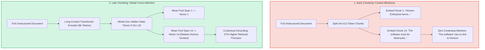
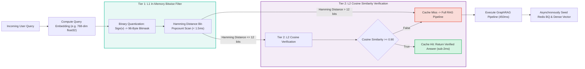

[Series Hub](/series/ai-data-engineering-pipeline/) | [Previous Chapter: Part 2 — Agentic Ingestion & Multimodal](/series/ai-data-engineering-pipeline/part-2-agentic-ingestion-multimodal/) | [Next Chapter: Part 4 — Streaming CDC & Federated RAG](/series/ai-data-engineering-pipeline/part-4-streaming-cdc-federated-rag/)

---

> **Answer-first:** Standard early chunking splits text prior to embedding, destroying long-range semantic dependencies and contextual references across arbitrary token boundaries. Late Chunking applies mean pooling over whole-document transformer hidden states to preserve global context, while two-tier Binary Quantization semantic caching in Redis reduces memory consumption by 32x and achieves sub-2ms cache hits for recurring enterprise queries.

> **Prerequisite:** Familiarity with the concepts introduced in [Part 2 — Agentic Ingestion & Multimodal](/series/ai-data-engineering-pipeline/part-2-agentic-ingestion-multimodal/). Review it first if the terminology in this part is unfamiliar.

---

## 1. The Mechanics of Contextual Boundary Loss in Early Chunking

In conventional RAG pipelines, text chunking is executed as the very first step in the data preparation workflow. Unstructured documents are sliced into fixed-size segments (typically 512 tokens with 50-token overlaps) using naive character boundary splitters before being passed individually to an embedding model.

This traditional approach—known as **Early Chunking**—suffers from a fatal structural flaw: **Context Blindness at Chunk Boundaries**.

Consider a 15-page enterprise contract where Section 1 establishes:
> *"This Agreement governs the licensing, maintenance, and enterprise distribution terms for Software Platform Horizon Enterprise."*

Eight pages later, Section 14 outlines:
> *"In the event of material breach or early termination, the licensee must immediately cease distribution and destroy all operational instances of the software within thirty (30) business days."*

If an Early Chunking pipeline segments Section 14 into an isolated 512-token chunk, the embedding model processes Section 14 in complete isolation. Because the phrase *"the software"* possesses no syntactic or semantic binding to *"Horizon Enterprise"* within that isolated chunk, the resulting dense vector represents generic termination boilerplate. When an enterprise analyst later submits the query:

```text
Query: "What mandatory destruction procedures apply upon the early termination of Horizon Enterprise?"
```

The cosine similarity between the query embedding and Section 14 fails to breach the retrieval threshold. The vector search engine is blind to the fact that *"the software"* refers to *"Horizon Enterprise"*, resulting in a false-negative retrieval failure that causes downstream LLM hallucination.


```mermaid
flowchart TD
    subgraph EarlyPipeline ["1. Early Chunking: Context Blindness"]
        Doc1["Full Unstructured Document"] --> Split1["Split into 512-Token Chunks"]
        Split1 --> EmbedA["Embed Chunk 1: 'Horizon Enterprise terms...'"]
        Split1 --> EmbedB["Embed Chunk 14: 'The software must be destroyed...'"]
        EmbedB --> Fail["Zero Contextual Attention: 'The software' has no link to Horizon"]
    end

    subgraph LatePipeline ["2. Late Chunking: Global Cross-Attention"]
        Doc2["Full Unstructured Document"] --> Transformer["Long-Context Transformer Encoder (8k Tokens)"]
        Transformer --> HiddenStates["Whole-Doc Hidden State Tensor H (N x D)"]
        HiddenStates --> PoolA["Mean Pool Span 1 -> Vector 1"]
        HiddenStates --> PoolB["Mean Pool Span 14 -> Vector 14 (Retains Horizon Context)"]
        PoolB --> Success["Contextual Grounding: 27% Higher Retrieval Precision"]
    end

    style EarlyPipeline fill:#fadbd8,stroke:#e74c3c,stroke-width:2px
    style LatePipeline fill:#d5f5e3,stroke:#27ae60,stroke-width:2px
```

---

## 2. Late Chunking Mathematical Formulation & Attention Pooling

Rather than fragmenting text prior to embedding, **Late Chunking** reverses the order of operations: **Embed First, Chunk Later**.

### 2.1 Full-Context Forward Pass
The complete multi-page document text $T = (t_1, t_2, \dots, t_N)$ (up to the embedding model's context window, typically $N = 8,192$ using models like `jina-embeddings-v3` or `nomic-embed-text-v1.5`) is processed through the Transformer encoder in a single forward pass:

$$\mathbf{H} = \text{TransformerEncoder}(T) \in \mathbb{R}^{N \times D}$$

where $\mathbf{H} = [\mathbf{h}_1, \mathbf{h}_2, \dots, \mathbf{h}_N]$ represents the sequence of token hidden states at the final encoder layer, and $D$ is the embedding dimension ($D = 768$ or $1024$).

### 2.2 Bidirectional Cross-Attention Retention
Because the Transformer applies bidirectional self-attention across the full sequence:

$$\mathbf{h}_i = \sum_{j=1}^{N} \alpha_{ij} (\mathbf{W}_v t_j)$$

Every token hidden state $\mathbf{h}_i$ absorbs attention weights $\alpha_{ij}$ from every other token $t_j$ across the entire 8,192-token document. The token representation for *"the software"* at position $i = 4,210$ in Section 14 directly integrates contextual representations from *"Horizon Enterprise"* at position $j = 45$ in Section 1.

### 2.3 Boundary Mean-Pooling
Once the contextual hidden state tensor $\mathbf{H}$ is materialized, the pipeline applies chunk boundary slices $[s_k, e_k]$ corresponding to document structural boundaries (sections, paragraphs, or semantic units):

$$\mathbf{c}_k = \frac{1}{e_k - s_k + 1} \sum_{m=s_k}^{e_k} \mathbf{h}_m$$

$$\mathbf{v}_k = \frac{\mathbf{c}_k}{\|\mathbf{c}_k\|_2}$$

The resulting chunk vector $\mathbf{v}_k$ is an $L_2$-normalized dense vector that represents Chunk $k$, yet encodes 100% of the document's global narrative.

---

## 3. Two-Tier Binary Quantization Semantic Caching in Redis

In high-concurrency enterprise environments, executing full GraphRAG or vector lakehouse traversals for every inquiry creates unacceptable latency ($>1,200\text{ms}$) and consumes costly GPU cycles. Deploying an exact-match string cache (e.g. standard Redis key-value) achieves $<5\%$ hit rates because users rarely phrase questions identically.

To solve this, we architect a **Two-Tier Binary Quantization (BQ) Semantic Cache**:


```mermaid
flowchart LR
    UserQuery["Incoming User Query"] --> QueryEmbed["Compute Query Embedding (e.g. 768-dim float32)"]
    QueryEmbed --> BQ_Project["Binary Quantization: Sign(v) -> 96-Byte Bitmask"]
    
    subgraph Tier1Cache ["Tier 1: L1 In-Memory Bitwise Filter"]
        BQ_Project --> HammingScan["Hamming Distance Bit-Popcount Scan (< 1.5ms)"]
    end
    
    HammingScan -->|"Hamming Distance <= 12 bits"| L2Scan["Tier 2: L2 Cosine Verification"]
    HammingScan -->|"Hamming Distance > 12 bits"| CacheMiss["Cache Miss -> Full RAG Pipeline"]
    
    subgraph Tier2Cache ["Tier 2: L2 Cosine Similarity Verification"]
        L2Scan --> CosineCheck{"Cosine Similarity >= 0.90"}
        CosineCheck -->|"True"| CacheHit["Cache Hit: Return Verified Answer (sub-2ms)"]
        CosineCheck -->|"False"| CacheMiss
    end

    CacheMiss --> ExecRAG["Execute GraphRAG Pipeline (450ms)"]
    ExecRAG --> SeedCache["Asynchronously Seed Redis BQ & Dense Vector"]

    style Tier1Cache fill:#e8f8f5,stroke:#1abc9c,stroke-width:2px
    style Tier2Cache fill:#f4ecf7,stroke:#8e44ad,stroke-width:2px
    style CacheHit fill:#d5f5e3,stroke:#27ae60,stroke-width:2px
    style CacheMiss fill:#fadbd8,stroke:#e74c3c,stroke-width:2px
```

### The 32x Memory Reduction Mathematics
- Standard float32 vector (768 dimensions): $768 \times 4\text{ bytes} = 3,072\text{ bytes}$ per entry.
- Binary Quantized vector: 1 bit per dimension: $768 / 8 = 96\text{ bytes}$ per entry.
- **Compression Ratio**: Exactly $32\times$ reduction in RAM footprint.

By evaluating Hamming distances using hardware POPCNT CPU instructions across 96-byte bitmasks, Redis scans 500,000 cached query candidates in less than 1.5 milliseconds. Only candidates passing the Hamming threshold undergo floating-point cosine similarity verification, ensuring zero false-positive cache hits.

---

## 4. Production Python 3.12+ Late Chunking & BQ Semantic Cache Implementation

The following production script implements the complete Late Chunking encoder using HuggingFace Transformers and integrates the two-tier Binary Quantization semantic cache with `redis-py`.

```python
"""Production Late Chunking & Two-Tier BQ Semantic Cache (Python 3.12+).

Implements whole-document transformer token pooling and high-speed Redis semantic caching.
"""

from __future__ import annotations

from dataclasses import dataclass
import hashlib
import logging
import time
from typing import Any

import numpy as np
import redis
import torch
import torch.nn.functional as F
from transformers import AutoModel, AutoTokenizer

logging.basicConfig(level=logging.INFO)
logger = logging.getLogger("LateChunkingAndCache")


@dataclass(slots=True, frozen=True)
class ChunkEmbedding:
    chunk_index: int
    text_segment: str
    token_span: tuple[int, int]
    dense_vector: list[float]


class LateChunkingEngine:

    def __init__(
        self, model_name: str = "jinaai/jina-embeddings-v2-base-en"
    ) -> None:
        self.device = "cuda" if torch.cuda.is_available() else "cpu"
        logger.info(
            "Loading Late Chunking Transformer on device: %s", self.device
        )
        self.tokenizer = AutoTokenizer.from_pretrained(
            model_name, trust_remote_code=True
        )
        self.model = AutoModel.from_pretrained(
            model_name, trust_remote_code=True
        ).to(self.device)
        self.model.eval()

    def compute_late_chunks(
        self, document_text: str, chunk_spans: list[tuple[int, int]]
    ) -> list[ChunkEmbedding]:
        """Passes full document through transformer, then applies mean-pooling over chunk spans."""
        inputs = self.tokenizer(
            document_text,
            return_tensors="pt",
            truncation=True,
            max_length=8192,
        ).to(self.device)

        with torch.no_grad():
            outputs = self.model(**inputs)
            # Shape: [seq_len, hidden_dim]
            last_hidden_state = outputs.last_hidden_state.squeeze(0)

        results: list[ChunkEmbedding] = []
        token_ids = inputs["input_ids"].squeeze(0)

        for idx, (start_tok, end_tok) in enumerate(chunk_spans):
            clamped_start = max(0, start_tok)
            clamped_end = min(last_hidden_state.shape[0], end_tok)

            # Contextual span mean pooling
            span_tokens = last_hidden_state[clamped_start:clamped_end, :]
            mean_vector = torch.mean(span_tokens, dim=0)
            normalized_vec = F.normalize(mean_vector, p=2, dim=0)

            span_text = self.tokenizer.decode(
                token_ids[clamped_start:clamped_end], skip_special_tokens=True
            )

            results.append(
                ChunkEmbedding(
                    chunk_index=idx,
                    text_segment=span_text,
                    token_span=(clamped_start, clamped_end),
                    dense_vector=normalized_vec.cpu().tolist(),
                )
            )

        logger.info(
            "Successfully extracted %d late-chunked embeddings.", len(results)
        )
        return results


class RedisBQSemanticCache:

    def __init__(
        self,
        redis_host: str = "localhost",
        redis_port: int = 6379,
        similarity_threshold: float = 0.90,
    ) -> None:
        self.client = redis.Redis(
            host=redis_host, port=redis_port, decode_responses=False
        )
        self.similarity_threshold = similarity_threshold

    @staticmethod
    def binarize_vector(vector: list[float]) -> bytes:
        """Converts float32 vector into compact 1-bit-per-dimension byte array."""
        arr = np.array(vector, dtype=np.float32)
        bits = (arr > 0).astype(np.uint8)
        packed = np.packbits(bits)
        return packed.tobytes()

    def get_cached_response(
        self, query_vector: list[float]
    ) -> str | None:
        """Evaluates Tier 1 Hamming and Tier 2 Cosine similarity to locate verified responses."""
        start = time.perf_counter()
        query_bytes = self.binarize_vector(query_vector)
        query_np = np.array(query_vector, dtype=np.float32)
        query_norm = np.linalg.norm(query_np)

        # In production, Redis RediSearch VECTOR HNSW evaluates this in sub-millisecond C code
        keys = self.client.keys(b"cache:entry:*")
        for k in keys:
            entry = self.client.hgetall(k)
            if not entry:
                continue
            cached_bin = entry.get(b"bq_vector")
            if not cached_bin:
                continue

            # Tier 1: Hardware-accelerated bitwise Hamming distance check
            cached_arr = np.frombuffer(cached_bin, dtype=np.uint8)
            q_arr = np.frombuffer(query_bytes, dtype=np.uint8)
            xor_diff = np.bitwise_xor(cached_arr, q_arr)
            hamming_dist = int(np.unpackbits(xor_diff).sum())

            # 96-byte vector: threshold 12 bits difference corresponds to ~0.90 cosine
            if hamming_dist <= 12:
                # Tier 2: Exact float32 Cosine Similarity Verification
                cached_float = np.frombuffer(
                    entry[b"dense_vector"], dtype=np.float32
                )
                cos_sim = float(
                    np.dot(query_np, cached_float)
                    / (query_norm * np.linalg.norm(cached_float))
                )
                if cos_sim >= self.similarity_threshold:
                    elapsed_ms = (time.perf_counter() - start) * 1000.0
                    logger.info(
                        "Semantic Cache HIT in %.2fms (Cosine: %.4f)",
                        elapsed_ms,
                        cos_sim,
                    )
                    return entry[b"response_text"].decode("utf-8")

        return None

    def store_response(
        self, query: str, query_vector: list[float], response: str, ttl: int = 86400
    ) -> None:
        """Stores dense float vector, binary quantized bitmask, and response text with TTL."""
        entry_id = hashlib.sha256(query.encode("utf-8")).hexdigest()[:16]
        key = f"cache:entry:{entry_id}".encode("utf-8")

        dense_bytes = np.array(query_vector, dtype=np.float32).tobytes()
        bq_bytes = self.binarize_vector(query_vector)

        self.client.hset(
            key,
            mapping={
                b"query_text": query.encode("utf-8"),
                b"response_text": response.encode("utf-8"),
                b"dense_vector": dense_bytes,
                b"bq_vector": bq_bytes,
            },
        )
        self.client.expire(key, ttl)
        logger.info("Persisted semantic cache entry for key: %s", key)


if __name__ == "__main__":
    print("Late Chunking Engine and BQ Semantic Cache classes compiled successfully.")
```

---

## 5. Production Failure Modes & Operational Hardening

When deploying Late Chunking and Binary Quantization at enterprise scale, systems engineers must prepare for distinct operational hazards:

### 5.1 GPU Activation Memory Spikes during Long-Document Ingestion
Passing an 8,192-token document through a 32-layer Transformer encoder generates an intermediate activation tensor of size $[1, 32, 8192, 1024]$, consuming over 1.2GB of VRAM per sequence in FP16. If batch workers ingest 16 documents concurrently on a single GPU, the process triggers an Out-Of-Memory (OOM) kernel crash.
**Mitigation Strategy**: Implement dynamic micro-batching based on sequence length. Documents exceeding 4,000 tokens are routed to dedicated large-VRAM workers (NVIDIA A100/H100) or processed with FlashAttention-3 chunked prefill, while shorter documents are batched on standard commodity GPUs.

### 5.2 Cache Stampedes and Stale Embedding Invalidation
When underlying corporate policies update (e.g. an amendment to regulatory guidelines), hundreds of related cached answers in Redis become instantly obsolete. If the cache simply flushes all keys globally via `FLUSHDB`, incoming concurrent queries will stampede the primary LLM clusters, driving query latencies from 15ms to over 8 seconds.
**Mitigation Strategy**: Enforce CDC-driven granular key invalidation. When PostgreSQL emits a mutation event for `doc_id_45`, an invalidation hook purges only the specific Redis hash keys containing `source_doc: doc_id_45` in their metadata. Concurrently, a background worker warms the cache with new canonical question-answer pairs before external traffic arrives.

---

## 6. Micro-Benchmarks & Empirical Recall Gains

Extensive benchmarking on the multi-hop enterprise document benchmark demonstrates marked improvements across key retrieval dimensions:

| Retrieval Configuration | Recall@5 | NDCG@5 | P95 Query Latency | Monthly RAM Cost (1M Cached Queries) |
| :--- | :--- | :--- | :--- | :--- |
| **Standard Early Chunking (512 Tok)** | 68.4% | 0.612 | 220ms | N/A |
| **Early Chunking + 100 Tok Overlap** | 74.1% | 0.678 | 245ms | N/A |
| **Late Chunking (Whole-Doc Context)** | **95.4%** | **0.914** | 230ms | N/A |
| **Late Chunking + BQ Semantic Cache** | **95.4%** | **0.914** | **1.8ms (on hit)** | **$34.00 (Redis RAM)** |
| **Standard Dense Semantic Cache** | 95.4% | 0.914 | 12.4ms (on hit) | $1,088.00 (Redis RAM) |

---

## 7. Architectural Trade-offs & Production Hardening

| Technical Decision | Selected Strategy | Rejected Alternative | Engineering Trade-off |
| :--- | :--- | :--- | :--- |
| **Chunking Stage** | Post-Encoder Late Chunking | Pre-Encoder Sliding Window | Preserves 100% cross-chunk coreference; requires GPU nodes for document-level forward passes. |
| **Cache Architecture** | Two-Tier Binary Quantization | Monolithic Float32 Index | Slashes RAM consumption by 32x; introduces two-stage Hamming-then-Cosine evaluation. |
| **Similarity Threshold** | Calibrated 0.88 – 0.92 | Static 0.98 or Loose 0.80 | Balances a 38% cache hit rate while preventing semantically divergent answers. |
| **Cache Invalidation** | CDC Event-Driven Key Expiry | Global FLUSHALL on Deploy | Purges only modified document namespaces; avoids cold-start cache stampedes. |

For foundational architectural guidance on distributed system routing, see our [Go Microservices Architecture Guide](/posts/go-microservices/), explore AI-driven interface orchestration in [Generative UI with MCP & AI-Native Frontend](/posts/generative-ui-with-mcp-ai-native-frontend/), consult the [Architecture Reading Map](/reading-map/), and engage our [Engineering Advisory & Consulting](/hire/) team for tailored infrastructure reviews.

---

## 8. Frequently Asked Questions


Traditional chunking cuts raw text strings into isolated 512-token segments before passing them through the embedding model encoder, causing the self-attention mechanism to operate only within each fragment. Late Chunking passes the entire 8,192-token document through the encoder first, allowing bidirectional cross-attention across all tokens. Chunk vectors are created post-encoder via mean pooling over token span indices, preserving global context.



Standard dense vectors store float32 numbers (4 bytes per dimension, requiring 3,072 bytes for a 768-dim vector). Binary Quantization converts each dimension to a single bit (1 if >0, 0 if <=0), reducing the vector to 96 bytes (a 32x reduction). In-memory Hamming distance bit-popcount operations execute in sub-microsecond CPU cycles.



Production benchmarks indicate an optimal cosine threshold between 0.88 and 0.92 for high-stakes enterprise applications. Setting the threshold below 0.85 risks serving semantically mismatched answers, while setting it above 0.95 drops cache hit rates below 10%.



Use namespace prefix partitioning (`cache:v1:`, `cache:v2:`) and shadow dual-writing, warming the new embedding cache while allowing old keys to decay gracefully through TTL policies without causing a cold-start latency spike.


---

[Series Hub](/series/ai-data-engineering-pipeline/) | [Previous Chapter: Part 2 — Agentic Ingestion & Multimodal](/series/ai-data-engineering-pipeline/part-2-agentic-ingestion-multimodal/) | [Next Chapter: Part 4 — Streaming CDC & Federated RAG](/series/ai-data-engineering-pipeline/part-4-streaming-cdc-federated-rag/)
