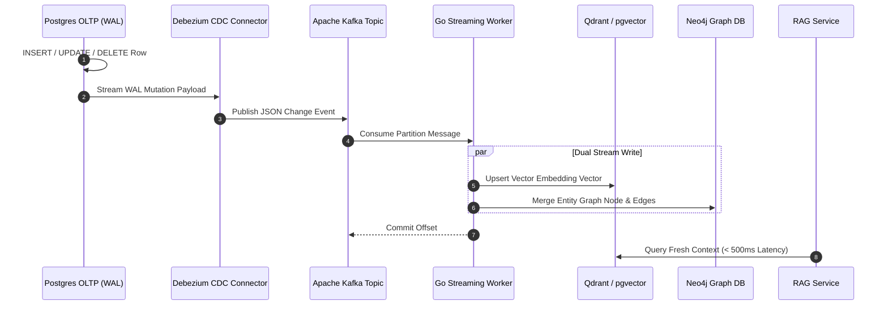
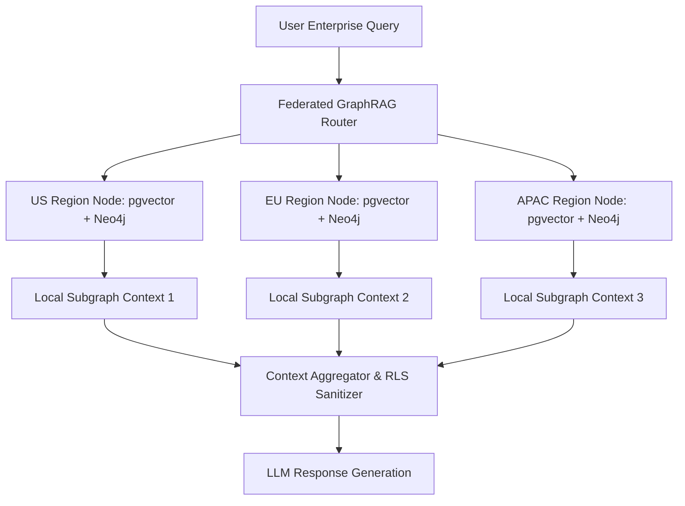

# Part 4 — Real-time Streaming CDC & Federated GraphRAG Architecture

> **Executive Summary & Quick Answer**: Enterprise RAG systems relying on nightly batch indexing suffer from stale context window drift. Event-driven Change Data Capture (CDC) streams row modifications from database Write-Ahead Logs (WAL) via Debezium and Apache Kafka to update vector indices and Knowledge Graphs in sub-500ms real time.
>
> **Key Takeaways**:
> - **< 500ms Data Freshness**: Debezium WAL tailing pushes real-time database mutations directly to vector indices without full dataset re-indexing.
> - **Transactional Outbox Pattern**: Prevents out-of-order entity edge mutations across distributed Neo4j graph nodes and pgvector stores.
> - **Federated Query Router**: Distributes RAG retrieval across siloed regional database nodes while maintaining local Row-Level Security (RLS).

---

In mission-critical enterprise environments—such as financial trading desks, e-commerce order management, and medical health record platforms—data changes continuously. A product price adjustment, a contract terms revision, or a inventory status update occurs thousands of times per minute.

If your RAG system relies on traditional **Nightly Batch ETL**, your AI agents will inevitably answer queries using stale context during the 24-hour window between batch runs.

---

## The Streaming CDC Paradigm Shift



### Key Architectural Benefits
1. **Zero Impact on Production OLTP Load**: Debezium tails the database Write-Ahead Log (WAL) directly on disk. It executes zero `SELECT *` queries against production application tables, preserving database CPU and memory capacity.
2. **Sub-Second Knowledge Sync**: Event-driven streaming updates vector embeddings and graph relations within 200ms to 500ms of the physical database transaction commit.
3. **Exact Change Semantics**: CDC events convey exact mutation metadata (`before` image, `after` image, `op: "c"|"u"|"d"`), allowing vector indices to delete obsolete chunk vectors instantly when a record is dropped.

---

## Production Go CDC Event Consumer

Below is a production-grade Go streaming consumer built with `github.com/segmentio/kafka-go` and `golang.org/x/sync/errgroup`. It consumes Debezium Postgres WAL change events and updates vector embeddings and Neo4j graph nodes concurrently:

```go
package main

import (
	"context"
	"encoding/json"
	"fmt"
	"log"
	"os"
	"os/signal"
	"syscall"
	"time"

	"github.com/segmentio/kafka-go"
	"golang.org/x/sync/errgroup"
)

type DebeziumPayload struct {
	Before map[string]interface{} `json:"before"`
	After  map[string]interface{} `json:"after"`
	Op     string                 `json:"op"` // "c": create, "u": update, "d": delete
	TsMs   int64                  `json:"ts_ms"`
}

type CDCEvent struct {
	Payload DebeziumPayload `json:"payload"`
}

type StreamProcessor struct {
	reader *kafka.Reader
}

func NewStreamProcessor(brokers []string, topic, groupID string) *StreamProcessor {
	return &StreamProcessor{
		reader: kafka.NewReader(kafka.ReaderConfig{
			Brokers:        brokers,
			Topic:          topic,
			GroupID:        groupID,
			MinBytes:       10KB,
			MaxBytes:       10MB,
			CommitInterval: 1 * time.Second,
		}),
	}
}

func (p *StreamProcessor) Start(ctx context.Context) error {
	log.Println("[CDC Processor] Starting real-time WAL event consumer loop...")
	for {
		select {
		case <-ctx.Done():
			return ctx.Err()
		default:
			msg, err := p.reader.FetchMessage(ctx)
			if err != nil {
				if ctx.Err() != nil {
					return nil
				}
				log.Printf("Error fetching Kafka message: %v\n", err)
				continue
			}

			if err := p.processMessage(ctx, msg); err != nil {
				log.Printf("Failed to process message offset %d: %v\n", msg.Offset, err)
				continue
			}

			if err := p.reader.CommitMessages(ctx, msg); err != nil {
				log.Printf("Failed to commit offset %d: %v\n", msg.Offset, err)
			}
		}
	}
}

func (p *StreamProcessor) processMessage(ctx context.Context, msg kafka.Message) error {
	var event CDCEvent
	if err := json.Unmarshal(msg.Value, &event); err != nil {
		return fmt.Errorf("json unmarshal failed: %w", err)
	}

	payload := event.Payload
	docID := fmt.Sprintf("%v", payload.After["id"])

	g, ctx := errgroup.WithContext(ctx)

	// Stream Task 1: Update HNSW Vector Index
	g.Go(func() error {
		select {
		case <-ctx.Done():
			return ctx.Err()
		default:
			if payload.Op == "d" {
				fmt.Printf("[Vector Store] Delete vector chunk for ID: %v\n", payload.Before["id"])
			} else {
				fmt.Printf("[Vector Store] Upsert vector embedding for Doc ID: %s (Op: %s)\n", docID, payload.Op)
			}
			return nil
		}
	})

	// Stream Task 2: Merge Neo4j Knowledge Graph Entity Node
	g.Go(func() error {
		select {
		case <-ctx.Done():
			return ctx.Err()
		default:
			if payload.Op == "d" {
				fmt.Printf("[Neo4j Graph] Detach delete node ID: %v\n", payload.Before["id"])
			} else {
				fmt.Printf("[Neo4j Graph] MERGE (n:Entity {id: '%s'}) SET n.updated_at = %d\n", docID, payload.TsMs)
			}
			return nil
		}
	})

	return g.Wait()
}

func main() {
	ctx, cancel := context.WithCancel(context.Background())
	defer cancel()

	// Capture OS interrupt signal for graceful shutdown
	sigChan := make(chan os.Signal, 1)
	signal.Notify(sigChan, os.Interrupt, syscall.SIGTERM)

	processor := NewStreamProcessor([]string{"localhost:9092"}, "postgres.public.documents", "graphrag-cdc-group")

	go func() {
		<-sigChan
		log.Println("[CDC Processor] Shutdown signal received. Closing consumer...")
		cancel()
	}()

	if err := processor.Start(ctx); err != nil && err != context.Canceled {
		log.Fatalf("Processor exited with error: %v", err)
	}
}
```

---

## Federated GraphRAG Query Routing Architecture

In enterprise organizations operating across distinct geographical jurisdictions (e.g., US-East, EU-Central, APAC), regulations like GDPR and HIPAA prohibit consolidating raw document vectors into a single centralized database.



### Operational Principles
1. **Local Retrieval & Privacy**: Queries are dispatched concurrently to regional database nodes. Raw document text remains within its home sovereign data center.
2. **Schema Uniformity**: Federated nodes expose identical GraphQL / gRPC search interfaces, returning anonymized sub-graph metadata to the central context aggregator.
3. **Consolidated Graph Synthesis**: The central aggregator synthesizes regional sub-graphs into a unified prompt context while stripping non-authorized attributes according to user claims.

---

## Frequently Asked Questions (FAQ)

### Q1: How do you handle schema evolution (DDL changes) in CDC streams feeding vector indices?
Schema evolution is managed using a Schema Registry (e.g., Confluent Schema Registry with Avro / Protobuf). When a database table column is added or modified in PostgreSQL, the Debezium connector publishes a schema migration event to Kafka. The Go stream processor checks schema compatibility versions, triggering automated re-framing of document AST parsing routines without dropping stream offsets.

### Q2: What is the optimal Kafka partition strategy for ordering entity graph updates?
To prevent out-of-order mutation race conditions (e.g., an `UPDATE` event executing before an `INSERT` event), Kafka messages must be partitioned by the Primary Key `document_id`. This guarantees that all WAL lifecycle events for a specific database row are handled sequentially by the same Kafka partition consumer thread.

### Q3: How do federated RAG queries maintain low latency across geographically distributed databases?
Federated RAG routers enforce strict per-region gRPC timeouts (e.g., 80ms deadline). If a remote regional node experiences high latency, the router degrades gracefully by synthesizing available responses from faster regional nodes alongside cached sub-graph metadata, appending a partial-retrieval notification flag to the agent context.

---

## Internal Series Navigation

- [Part 3 — Late Chunking & Contextual Retrieval](/series/ai-data-engineering-pipeline/part-3-late-chunking-semantic-caching/)
- [Part 5 — Enterprise Security, RBAC & Data Poisoning Defense](/series/ai-data-engineering-pipeline/part-5-enterprise-security-data-poisoning/)
- [Part 9 — Agentic Observability: OpenTelemetry & Cost Monitoring](/series/ai-data-engineering-pipeline/part-9-agentic-observability-monitoring/)
- [Architecting 21 Microservices in Go](/series/shopee-architecture/01-microservices-foundation/)
- [Mastering Event-Driven Architecture with Dapr](/series/modular-monolith-architecture/part-3-ddd-module-boundaries/)
