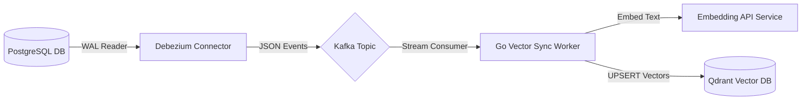

**Answer-First:** Real-time data freshness is achieved by linking transactional databases to vector indexes using Change Data Capture (CDC) via Debezium and Kafka, bypassing slow nightly batch ETLs.

> **Prerequisite:** [Part 3: The Art of Chunking & Semantic Caching]() on caching patterns.

## 1. "Yesterday's Data" is a Disaster

If a customer asks a banking Chatbot about savings interest rates, and the Chatbot answers based on a PDF policy file that was changed... 2 hours ago. What happens?

In Enterprise environments like Finance, Healthcare, or E-commerce, **Yesterday's data is a legal liability**. Legacy data pipelines (ETL Batch Jobs running at midnight) no longer meet the demands of 2026. If the Core Database changes, your Vector Database must be updated immediately. Data Freshness must be measured in seconds.

That is when we need **Streaming CDC (Change Data Capture)**.

---

## 2. Streaming CDC: The Breath of Real-Time RAG

Instead of plowing through the entire Database every night to see if there are any new documents, **CDC** (commonly using the open-source tool **Debezium**) clings tightly to Transaction Logs (like PostgreSQL's WAL or MySQL's binlog).

**Classic 2026 Architecture (Debezium + Kafka + Flink):**
1. **Capture:** Whenever there is an `INSERT`, `UPDATE`, or `DELETE` command in the Core Database, Debezium instantly grabs that event.
2. **Stream:** The event is pushed into **Apache Kafka** for transmission with millisecond latency.
3. **Process:** A Stream Processing system (like **Apache Flink** or **Quix Streams**) catches the event, automatically chunks it, calls an API to generate new Embeddings, and Upserts them into the Vector Database.

**Vital Warning:** Your system **must be able to process `DELETE` events**. Many primitive RAG systems suffer from "Ghost Context" syndrome because the original document was deleted, but its Embeddings still reside in the Vector DB and continually haunt the LLM, causing hallucinations.

---

## 3. The Rise of Streaming Databases (RisingWave)

The Kafka + Flink architecture is highly powerful, but it requires a massive Data Engineering team to operate. For streamlining, 2026 witnesses the explosion of **Streaming Databases** like **RisingWave**.

RisingWave combines Kafka, Flink, and Vector DB into one. You do not need to write complex Python code; you only use SQL (Materialized Views) to automate:

```sql
-- Example: Automatically update Vectors whenever the 'documents' table changes
CREATE MATERIALIZED VIEW v_document_embeddings AS
SELECT 
    doc_id, 
    content, 
    openai_embedding(content) as embedding -- Call embedding API directly via SQL
FROM documents;
```

When there is a change from the source Database, RisingWave incrementally updates only that specific row of data, saving 90% of processing costs compared to Batch Processing.

---

## 4. Federated RAG: Don't Put All Your Eggs in One Basket

Having solved the Real-time problem, we face the second challenge: **Governance & Distribution**.

Attempting to vacuum all data of a Multinational Corporation (from HR, Finance, Legal) into one giant Vector Database is an RBAC and security "nightmare".

**Solution: Agentic Federated Search**
- Do not move raw data. Let the data remain on the servers of each respective department.
- Use **Apollo GraphQL Federation (Supergraph)** as the single communication gateway.
- When a user asks a question, the **Orchestrator Agent** (using LangChain or LangGraph) analyzes the query and calls APIs down to the **Local Agents** (using LlamaIndex) located in each department.
- The Local Agents perform searches within their own internal data repositories, summarize them, and only send the "answer" back to the center for aggregation.

---

## 5. GDPR 2026 & Data Sovereignty

With the introduction of the **EU AI Act** and stricter **GDPR** sanctions, Data Sovereignty is a matter of life and death.

Customer healthcare data at a French branch **must not** leave European borders to fly back to AI servers located in the US.

**Federated RAG** was born to solve this problem perfectly. Because Local Agents process data on-premise or in a Regional Cloud, we only circulate encrypted Context or mathematical Answers, completely avoiding cross-border transmission of Raw Data. This ensures your architecture passes even the strictest Compliance censorship loops of 2026.

---

## 6. Conclusion

Modern RAG is no longer a Python Script running locally. It is the intersection of **Data Streaming (CDC)**, **Distributed Architecture (Federation)**, and **Law (Compliance)**.

However, no matter how clean, real-time, and well-governed your data is, if your LLM is "tricked" by the user themselves, the entire system will collapse.

In **[Part 5: Enterprise Security & Data Poisoning]()**, we will step into the underworld of AI Security, where Hackers use "Indirect Prompt Injections" to manipulate your RAG, and explore how to build a Defense-in-Depth system.

## Change Data Capture (CDC) Pipeline Architecture

Batch processing pipelines create data silos where retrieval indexes lag behind the system of record. To enable 100% data freshness, we establish a real-time CDC pipeline. The database transaction log (MySQL binary log or PostgreSQL WAL) is monitored by Debezium, which streams raw event payloads to an Apache Kafka cluster. A Go worker service processes these streams and updates the Vector Database (Qdrant) in real time.



The following Go code implements a resilient Kafka consumer designed to process database event payloads and sync them to Qdrant:

```go
package main

import (
	"context"
	"encoding/json"
	"fmt"
	"time"
)

type CDCEvent struct {
	Table     string                 `json:"table"`
	Action    string                 `json:"action"` // "CREATE", "UPDATE", "DELETE"
	Before    map[string]interface{} `json:"before"`
	After     map[string]interface{} `json:"after"`
	Timestamp int64                  `json:"timestamp"`
}

type SyncWorker struct {
	QdrantEndpoint string
}

func (s *SyncWorker) ProcessCDCEvent(ctx context.Context, rawPayload []byte) error {
	var event CDCEvent
	if err := json.Unmarshal(rawPayload, &event); err != nil {
		return err
	}

	fmt.Printf("[CDC Worker] Event received for table %s, action: %s\n", event.Table, event.Action)
	
	switch event.Action {
	case "CREATE", "UPDATE":
		return s.upsertVector(ctx, event.After)
	case "DELETE":
		return s.deleteVector(ctx, event.Before)
	}

	return nil
}

func (s *SyncWorker) upsertVector(ctx context.Context, afterData map[string]interface{}) error {
	// Extract content text, call embedding API, and push vector to Qdrant
	id := afterData["id"]
	fmt.Printf("Upserting Qdrant record ID: %v\n", id)
	time.Sleep(50 * time.Millisecond) // Mock operation
	return nil
}

func (s *SyncWorker) deleteVector(ctx context.Context, beforeData map[string]interface{}) error {
	id := beforeData["id"]
	fmt.Printf("Deleting Qdrant record ID: %v\n", id)
	time.Sleep(50 * time.Millisecond) // Mock operation
	return nil
}

func main() {
	worker := &SyncWorker{QdrantEndpoint: "http://qdrant:6333"}
	samplePayload := `{"table": "company_policies", "action": "CREATE", "after": {"id": 1005, "content": "All remote work must be authorized by managers."}, "timestamp": 1782298000}`
	
	ctx := context.Background()
	_ = worker.ProcessCDCEvent(ctx, []byte(samplePayload))
}
```

## Federated Search over Distributed Vector Stores

When data is partitioned across multiple regional instances, a single query must execute across a federated layout. The Federated Search Coordinator acts as a fan-out proxy:
- **Parallel Dispatch:** Dispatches search vectors to local vector partitions.
- **Schema Mapping:** Standardizes differing database metadata properties.
- **Score Re-ranking:** Re-scores vectors across different partition norms using a centralized Cross-Encoder.


---## Change Data Capture (CDC) Pipeline Architecture

Batch processing pipelines create data silos where retrieval indexes lag behind the system of record. To enable 100% data freshness, we establish a real-time CDC pipeline. The database transaction log (MySQL binary log or PostgreSQL WAL) is monitored by Debezium, which streams raw event payloads to an Apache Kafka cluster. A Go worker service processes these streams and updates the Vector Database (Qdrant) in real time.


The following Go code implements a resilient Kafka consumer designed to process database event payloads and sync them to Qdrant:

```go
package main

import (
	"context"
	"encoding/json"
	"fmt"
	"time"
)

type CDCEvent struct {
	Table     string                 `json:"table"`
	Action    string                 `json:"action"` // "CREATE", "UPDATE", "DELETE"
	Before    map[string]interface{} `json:"before"`
	After     map[string]interface{} `json:"after"`
	Timestamp int64                  `json:"timestamp"`
}

type SyncWorker struct {
	QdrantEndpoint string
}

func (s *SyncWorker) ProcessCDCEvent(ctx context.Context, rawPayload []byte) error {
	var event CDCEvent
	if err := json.Unmarshal(rawPayload, &event); err != nil {
		return err
	}

	fmt.Printf("[CDC Worker] Event received for table %s, action: %s\n", event.Table, event.Action)
	
	switch event.Action {
	case "CREATE", "UPDATE":
		return s.upsertVector(ctx, event.After)
	case "DELETE":
		return s.deleteVector(ctx, event.Before)
	}

	return nil
}

func (s *SyncWorker) upsertVector(ctx context.Context, afterData map[string]interface{}) error {
	// Extract content text, call embedding API, and push vector to Qdrant
	id := afterData["id"]
	fmt.Printf("Upserting Qdrant record ID: %v\n", id)
	time.Sleep(50 * time.Millisecond) // Mock operation
	return nil
}

func (s *SyncWorker) deleteVector(ctx context.Context, beforeData map[string]interface{}) error {
	id := beforeData["id"]
	fmt.Printf("Deleting Qdrant record ID: %v\n", id)
	time.Sleep(50 * time.Millisecond) // Mock operation
	return nil
}

func main() {
	worker := &SyncWorker{QdrantEndpoint: "http://qdrant:6333"}
	samplePayload := `{"table": "company_policies", "action": "CREATE", "after": {"id": 1005, "content": "All remote work must be authorized by managers."}, "timestamp": 1782298000}`
	
	ctx := context.Background()
	_ = worker.ProcessCDCEvent(ctx, []byte(samplePayload))
}
```

## Federated Search over Distributed Vector Stores

When data is partitioned across multiple regional instances, a single query must execute across a federated layout. The Federated Search Coordinator acts as a fan-out proxy:
- **Parallel Dispatch:** Dispatches search vectors to local vector partitions.
- **Schema Mapping:** Standardizes differing database metadata properties.
- **Score Re-ranking:** Re-scores vectors across different partition norms using a centralized Cross-Encoder.

## Handling Schema Drift in CDC Pipelines

Database schemas inevitably evolve as new features are added. This schema drift presents a unique challenge for real-time vector synchronization:

1. **Dynamic Mapping:** The worker uses reflection to inspect new fields and map them to metadata payloads dynamically, preventing parsing failures.
2. **Embedding Re-triggering:** If a field marked as part of the core text context is updated, the pipeline automatically re-triggers the embedding process for the affected record.
3. **Dead Letter Queue (DLQ):** Messages that fail deserialization due to severe schema mismatches are routed to a Kafka DLQ for manual inspection, preserving pipeline throughput.

🔗 **Next Step:** Understand pipeline security vulnerabilities in [Part 5: Enterprise Security & Data Poisoning - The Silent Assassin]().

*Need help assessing the risks of your own platform migration? → [Book a 1:1 Architecture Consultation](/hire/)*---

[← Previous Part: Part 3: The Art of Chunking & Semantic Caching]()  |  [Next Part: Part 5: Enterprise Security & Data Poisoning - The Silent Assassin]()
