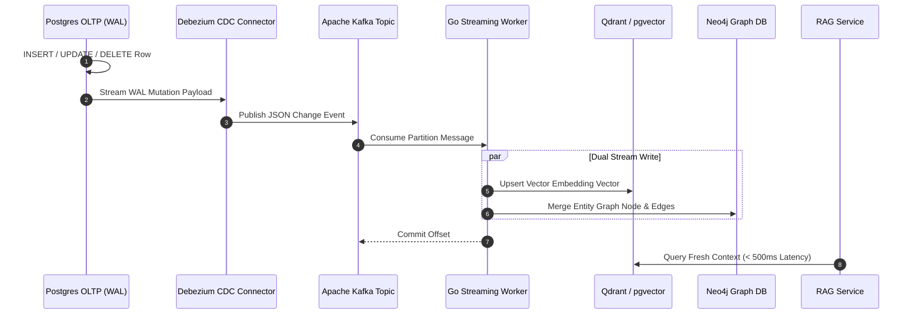
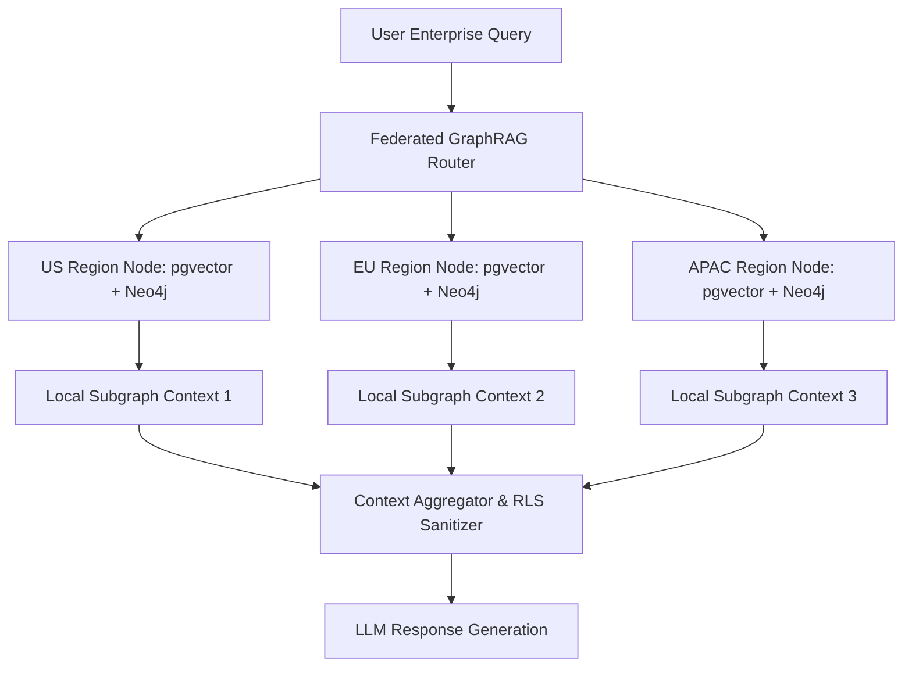

## Part 4 — Real-time Streaming CDC & Federated GraphRAG Architecture


In mission-critical enterprise environments—such as financial trading desks, e-commerce order management, and medical health record platforms—data changes continuously. A product price adjustment, a contract terms revision, or a inventory status update occurs thousands of times per minute.

If your RAG system relies on traditional **Nightly Batch ETL**, your AI agents will inevitably answer queries using stale context during the 24-hour window between batch runs.

---

## The Streaming CDC Paradigm Shift

**Answer-first:** Streaming Change Data Capture (CDC) streams database mutations into vector indexes in real time, eliminating stale vector database search results.

> **Pillar Architecture Guide:** This article is part of the **[Autonomous Hybrid-AI Pipeline: Cron to State-Machine](/posts/architecting-an-autonomous-hybrid-ai-content-pipeline/)** series. Please refer to the original article for a comprehensive overview of the architecture.


```mermaid
sequenceDiagram
    autonumber
    participant DB as Postgres OLTP (WAL)
    participant Deb as Debezium CDC Connector
    participant Kafka as Apache Kafka Topic
    participant GoProc as Go Streaming Worker
    participant Vector as Qdrant / pgvector
    participant Graph as Neo4j Graph DB
    participant RAG as RAG Service

    DB->>DB: INSERT / UPDATE / DELETE Row
    DB->>Deb: Stream WAL Mutation Payload
    Deb->>Kafka: Publish JSON Change Event
    Kafka->>GoProc: Consume Partition Message
    
    par Dual Stream Write
        GoProc->>Vector: Upsert Vector Embedding Vector
        GoProc->>Graph: Merge Entity Graph Node & Edges
    end

    GoProc-->>Kafka: Commit Offset
    RAG->>Vector: Query Fresh Context (< 500ms Latency)
```

### Key Architectural Benefits
1. **Zero Impact on Production OLTP Load**: Debezium tails the database Write-Ahead Log (WAL) directly on disk. It executes zero `SELECT *` queries against production application tables, preserving database CPU and memory capacity.
2. **Sub-Second Knowledge Sync**: Event-driven streaming updates vector embeddings and graph relations within 200ms to 500ms of the physical database transaction commit.
3. **Exact Change Semantics**: CDC events convey exact mutation metadata (`before` image, `after` image, `op: "c"|"u"|"d"`), allowing vector indices to delete obsolete chunk vectors instantly when a record is dropped.

### Comparison Matrix: Batch ETL vs. Real-Time Streaming CDC

| Architectural Feature | Traditional Batch ETL | Real-Time Streaming CDC |
| :--- | :--- | :--- |
| **Data Freshness / Latency** | 12 to 24 hours (Nightly Batch) | Sub-second (< 500ms P99) |
| **Database Load Profile** | High periodic `SELECT *` table scans | Continuous low-overhead WAL tailing |
| **Deletion Handling** | Soft deletes or full re-indexing required | Instant transactional `op: "d"` record purges |
| **Consistency Guarantee** | Stale context windows between runs | Eventual consistency within hundreds of ms |
| **Resource Overhead** | High burst CPU/RAM during batch runs | Constant, predictable streaming footprint |

---

## Production Go CDC Event Consumer

**Answer-first:** Production Go CDC consumers parse PostgreSQL Debezium event streams, triggering instant incremental vector indexing for updated database records.

This production-grade Go streaming consumer built with `github.com/segmentio/kafka-go` and `golang.org/x/sync/errgroup`. It consumes Debezium Postgres WAL change events and updates vector embeddings and Neo4j graph nodes concurrently:

```go
package main

import (
	"context"
	"encoding/json"
	"fmt"
	"log"
	"os"
	"os/signal"
	"syscall"
	"time"

	"github.com/segmentio/kafka-go"
	"golang.org/x/sync/errgroup"
)

type DebeziumPayload struct {
	Before map[string]interface{} `json:"before"`
	After  map[string]interface{} `json:"after"`
	Op     string                 `json:"op"` // "c": create, "u": update, "d": delete
	TsMs   int64                  `json:"ts_ms"`
}

type CDCEvent struct {
	Payload DebeziumPayload `json:"payload"`
}

type StreamProcessor struct {
	reader *kafka.Reader
}

func NewStreamProcessor(brokers []string, topic, groupID string) *StreamProcessor {
	return &StreamProcessor{
		reader: kafka.NewReader(kafka.ReaderConfig{
			Brokers:        brokers,
			Topic:          topic,
			GroupID:        groupID,
			MinBytes:       10 * 1024,
			MaxBytes:       10 * 1024 * 1024,
			CommitInterval: 1 * time.Second,
		}),
	}
}

func (p *StreamProcessor) Start(ctx context.Context) error {
	log.Println("[CDC Processor] Starting real-time WAL event consumer loop...")
	for {
		select {
		case <-ctx.Done():
			return ctx.Err()
		default:
			msg, err := p.reader.FetchMessage(ctx)
			if err != nil {
				if ctx.Err() != nil {
					return nil
				}
				log.Printf("Error fetching Kafka message: %v\n", err)
				continue
			}

			if err := p.processMessage(ctx, msg); err != nil {
				log.Printf("Failed to process message offset %d: %v\n", msg.Offset, err)
				continue
			}

			if err := p.reader.CommitMessages(ctx, msg); err != nil {
				log.Printf("Failed to commit offset %d: %v\n", msg.Offset, err)
			}
		}
	}
}

func (p *StreamProcessor) processMessage(ctx context.Context, msg kafka.Message) error {
	var event CDCEvent
	if err := json.Unmarshal(msg.Value, &event); err != nil {
		return fmt.Errorf("json unmarshal failed: %w", err)
	}

	payload := event.Payload
	docID := fmt.Sprintf("%v", payload.After["id"])

	g, ctx := errgroup.WithContext(ctx)

	// Stream Task 1: Update HNSW Vector Index
	g.Go(func() error {
		select {
		case <-ctx.Done():
			return ctx.Err()
		default:
			if payload.Op == "d" {
				fmt.Printf("[Vector Store] Delete vector chunk for ID: %v\n", payload.Before["id"])
			} else {
				fmt.Printf("[Vector Store] Upsert vector embedding for Doc ID: %s (Op: %s)\n", docID, payload.Op)
			}
			return nil
		}
	})

	// Stream Task 2: Merge Neo4j Knowledge Graph Entity Node
	g.Go(func() error {
		select {
		case <-ctx.Done():
			return ctx.Err()
		default:
			if payload.Op == "d" {
				fmt.Printf("[Neo4j Graph] Detach delete node ID: %v\n", payload.Before["id"])
			} else {
				fmt.Printf("[Neo4j Graph] MERGE (n:Entity {id: '%s'}) SET n.updated_at = %d\n", docID, payload.TsMs)
			}
			return nil
		}
	})

	return g.Wait()
}

func main() {
	ctx, cancel := context.WithCancel(context.Background())
	defer cancel()

	// Capture OS interrupt signal for graceful shutdown
	sigChan := make(chan os.Signal, 1)
	signal.Notify(sigChan, os.Interrupt, syscall.SIGTERM)

	processor := NewStreamProcessor([]string{"localhost:9092"}, "postgres.public.documents", "graphrag-cdc-group")

	go func() {
		<-sigChan
		log.Println("[CDC Processor] Shutdown signal received. Closing consumer...")
		cancel()
	}()

	if err := processor.Start(ctx); err != nil && err != context.Canceled {
		log.Fatalf("Processor exited with error: %v", err)
	}
}
```

---

## Federated GraphRAG Query Routing Architecture

**Answer-first:** Federated query routers distribute search queries across domain-specific knowledge graphs and aggregate partial graph results into unified context.

In enterprise organizations operating across distinct geographical jurisdictions (e.g., US-East, EU-Central, APAC), regulations like GDPR and HIPAA prohibit consolidating raw document vectors into a single centralized database.


```mermaid
graph TD
    UserQuery[User Enterprise Query] --> FederatedRouter[Federated GraphRAG Router]
    
    FederatedRouter --> Regional1["US Region Node: pgvector + Neo4j"]
    FederatedRouter --> Regional2["EU Region Node: pgvector + Neo4j"]
    FederatedRouter --> Regional3["APAC Region Node: pgvector + Neo4j"]

    Regional1 --> SubResult1[Local Subgraph Context 1]
    Regional2 --> SubResult2[Local Subgraph Context 2]
    Regional3 --> SubResult3[Local Subgraph Context 3]

    SubResult1 --> Aggregator["Context Aggregator & RLS Sanitizer"]
    SubResult2 --> Aggregator
    SubResult3 --> Aggregator

    Aggregator --> FinalLLM[LLM Response Generation]
```

### Operational Principles
1. **Local Retrieval & Privacy**: Queries are dispatched concurrently to regional database nodes. Raw document text remains within its home sovereign data center.
2. **Schema Uniformity**: Federated nodes expose identical GraphQL / gRPC search interfaces, returning anonymized sub-graph metadata to the central context aggregator.
3. **Consolidated Graph Synthesis**: The central aggregator synthesizes regional sub-graphs into a unified prompt context while stripping non-authorized attributes according to user claims.

---

## Frequently Asked Questions

### Q1: How does Debezium minimize database performance impact when streaming CDC events?
Debezium reads changes directly from the PostgreSQL Write-Ahead Log (WAL) or MySQL binary logs on disk without issuing heavy SQL SELECT queries. This decoupled log-tailing approach ensures zero computational or locking overhead on active production OLTP tables.

### Q2: What happens when Kafka goes down during CDC processing?
PostgreSQL retains unconsumed WAL logs (via logical replication slots) up to configured storage limits. When Kafka recovers, Debezium resumes streaming from the exact last acknowledged WAL offset without data loss.

### Q3: How do federated GraphRAG query routers preserve data privacy across compliance boundaries?
Federated routers execute local sub-graph searches entirely within regional boundaries (e.g., EU-Central for GDPR). Only anonymized, policy-sanitized sub-graph metadata is returned to the central context aggregator.

---

## Internal Series Navigation

**Answer-first:** Move to Part 5 to explore enterprise security, RBAC filtering, and data poisoning defense in RAG.

- [Part 3 — Late Chunking & Contextual Retrieval](/series/ai-data-engineering-pipeline/part-3-late-chunking-semantic-caching/)
- [Part 5 — Enterprise Security, RBAC & Data Poisoning Defense](/series/ai-data-engineering-pipeline/part-5-enterprise-security-data-poisoning/)
- [Part 9 — Agentic Observability: OpenTelemetry & Cost Monitoring](/series/ai-data-engineering-pipeline/part-9-agentic-observability-monitoring/)
- [Architecting 21 Microservices in Go](/series/shopee-architecture/01-microservices-foundation/)
- [Mastering Event-Driven Architecture with Dapr](/series/modular-monolith-architecture/part-3-ddd-module-boundaries/)
