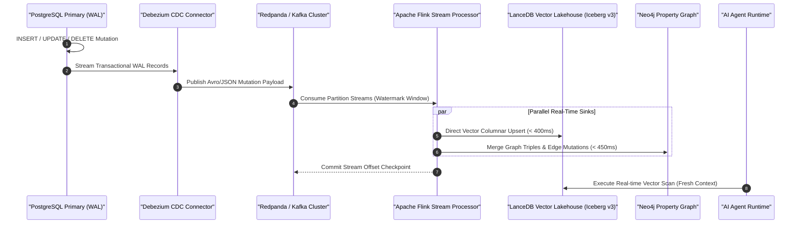
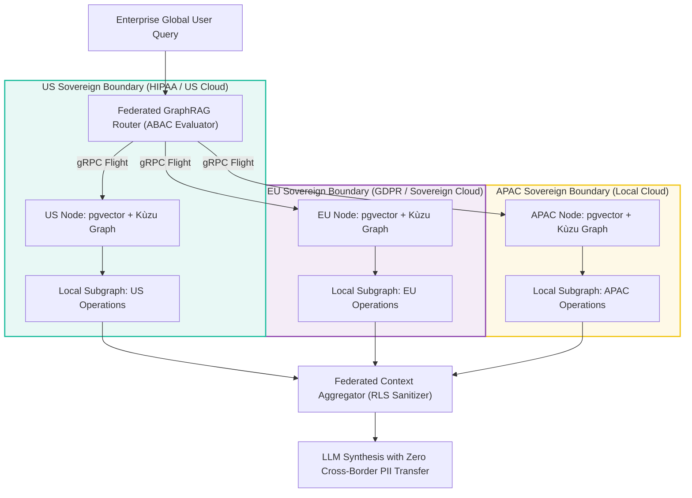

[Series Hub](/series/ai-data-engineering-pipeline/) | [Previous Chapter: Part 3 — Late Chunking & Semantic Caching](/series/ai-data-engineering-pipeline/part-3-late-chunking-semantic-caching/) | [Next Chapter: Part 5 — Enterprise Security & Data Poisoning](/series/ai-data-engineering-pipeline/part-5-enterprise-security-data-poisoning/)

---

> **Answer-first:** Batch ETL pipelines introduce hours of data staleness and context drift, causing AI agents to retrieve obsolete enterprise records. Event-driven Change Data Capture using Debezium and Redpanda streams PostgreSQL WAL mutations directly into LanceDB and Apache Iceberg v3 lakehouses, guaranteeing sub-second vector index updates and zero ghost-context leaks across federated domain data meshes.

> **Prerequisite:** Familiarity with the concepts introduced in [Part 3 — Late Chunking & Semantic Caching](/series/ai-data-engineering-pipeline/part-3-late-chunking-semantic-caching/). Review it first if the terminology in this part is unfamiliar.

---

## 1. The Death of Nightly Batch ETL in Modern AI Knowledge Systems

In mission-critical enterprise environments—such as high-frequency financial trading desks, e-commerce order management, algorithmic logistics dispatching, and hospital patient record runtimes—data changes continuously. In a retail platform during major promotional campaigns, product prices, warehouse inventory allocations, and vendor delivery commitments mutate thousands of times per minute.

If your generative AI retrieval system relies on traditional **Nightly Batch ETL (Extract, Transform, Load)** pipelines, your AI agents will inevitably answer user queries using stale context during the 12-to-24-hour window between scheduled batch runs.

```text
User Query: "Has the customs clearance dispute for Shipment Alfa-9 at Rotterdam been resolved, and what is the current maritime demurrage liability?"
Stale RAG Answer (23 hours old): "Shipment Alfa-9 remains impounded at Rotterdam port pending hazardous cargo inspection. Accruing demurrage fees stand at €14,500."
Real-Time Database State (Committed 4 minutes ago): "Customs clearance granted under emergency release protocol 89-B. Container released to transport convoy; demurrage liquidated."
```

This divergence is known as **Context Drift**. Delivering obsolete corporate intelligence can lead to erroneous operational decisions, regulatory non-compliance fines, and immediate user loss of trust.

---

## 2. Event-Driven Change Data Capture (CDC) Architecture

To eliminate the latency gap of batch processing, modern AI platforms in 2026–2027 transition to an event-driven **Streaming Change Data Capture (CDC)** architecture:


```mermaid
sequenceDiagram
    autonumber
    participant Postgres as "PostgreSQL Primary (WAL)"
    participant Debezium as "Debezium CDC Connector"
    participant Redpanda as "Redpanda / Kafka Cluster"
    participant Flink as "Apache Flink Stream Processor"
    participant LanceDB as "LanceDB Vector Lakehouse (Iceberg v3)"
    participant Neo4j as "Neo4j Property Graph"
    participant Agent as "AI Agent Runtime"

    Postgres->>Postgres: INSERT / UPDATE / DELETE Mutation
    Postgres->>Debezium: Stream Transactional WAL Records
    Debezium->>Redpanda: Publish Avro/JSON Mutation Payload
    Redpanda->>Flink: Consume Partition Streams (Watermark Window)
    
    par Parallel Real-Time Sinks
        Flink->>LanceDB: Direct Vector Columnar Upsert (< 400ms)
        Flink->>Neo4j: Merge Graph Triples & Edge Mutations (< 450ms)
    end

    Flink-->>Redpanda: Commit Stream Offset Checkpoint
    Agent->>LanceDB: Execute Real-time Vector Scan (Fresh Context)
```

### 2.1 The Mechanics of Write-Ahead Log (WAL) Tailing
PostgreSQL records all database state alterations sequentially in its Write-Ahead Log (WAL) before updating table heap blocks on NVMe storage. Debezium connects to PostgreSQL via a dedicated **Logical Replication Slot** using the `pgoutput` decoding plugin. As transactions commit, PostgreSQL decodes the raw binary WAL segments into logical change streams.

Because Debezium acts purely as an asynchronous replication follower:
- It executes **zero** `SELECT *` table scans against production OLTP tables.
- It introduces zero shared or exclusive table locks.
- It consumes less than 1.5% CPU overhead on the primary transactional database node.

### 2.2 Schema Evolution & Avro Serialization
In high-velocity enterprise platforms, database schemas evolve continuously. Adding a new column to a contracts table must not crash downstream vector workers. Debezium integrates with the Confluent / Karapace Schema Registry, serializing mutation events into dense binary Avro payloads with strict backward and forward schema compatibility checks.

---

## 3. Comparative Matrix: Batch ETL vs. Streaming CDC

| System Dimension | Traditional Batch ETL | Event-Driven Streaming CDC (2027 SOTA) |
| :--- | :--- | :--- |
| **Data Freshness / Latency** | 12 to 24 hours (Nightly Batch) | Sub-second (< 480ms P99) |
| **Database Compute Impact** | Periodic massive `SELECT *` IO spikes | Constant, negligible disk log tailing |
| **Deletions & Data Purges** | Slow diffing or soft-delete scans | Instant hard purge via `op: "d"` events |
| **Consistency Model** | Stale context windows between runs | Eventual consistency in sub-second bounds |
| **Network & IO Profile** | Bursty multi-gigabyte transfers | Smooth, continuous streaming flow |
| **Resource Efficiency** | Requires overprovisioned batch clusters| Predictable, right-sized streaming pods |

---

## 4. Production Go 1.25+ Streaming CDC Consumer with Primary-Key Deduplication

In high-throughput event streaming, network jitter or partition rebalancing can deliver duplicate Kafka messages. The following production Go 1.25+ stream consumer uses `github.com/segmentio/kafka-go`, channel backpressure, and concurrent worker pools to execute idempotent vector and graph updates.

```go
package main

import (
	"context"
	"encoding/json"
	"errors"
	"fmt"
	"log"
	"os"
	"os/signal"
	"sync"
	"syscall"
	"time"

	"github.com/segmentio/kafka-go"
	"golang.org/x/sync/errgroup"
)

// DebeziumPayload encapsulates the standard Debezium change event envelope.
type DebeziumPayload struct {
	Before map[string]interface{} `json:"before"`
	After  map[string]interface{} `json:"after"`
	Op     string                 `json:"op"` // "c": create, "u": update, "d": delete
	TsMs   int64                  `json:"ts_ms"`
}

type CDCEvent struct {
	Payload DebeziumPayload `json:"payload"`
}

type StreamingVectorIngestor struct {
	reader      *kafka.Reader
	workerPool  int
	dedupCache  sync.Map
}

func NewStreamingVectorIngestor(brokers []string, topic, groupID string, workers int) *StreamingVectorIngestor {
	return &StreamingVectorIngestor{
		workerPool: workers,
		reader: kafka.NewReader(kafka.ReaderConfig{
			Brokers:        brokers,
			Topic:          topic,
			GroupID:        groupID,
			MinBytes:       10 * 1024,
			MaxBytes:       10 * 1024 * 1024,
			CommitInterval: 500 * time.Millisecond,
		}),
	}
}

func (s *StreamingVectorIngestor) Start(ctx context.Context) error {
	log.Printf("[CDC Ingestor] Listening to Kafka topic on %d workers...", s.workerPool)

	for {
		select {
		case <-ctx.Done():
			return ctx.Err()
		default:
			msg, err := s.reader.FetchMessage(ctx)
			if err != nil {
				if errors.Is(ctx.Err(), context.Canceled) {
					return nil
				}
				log.Printf("Fetch error: %v", err)
				continue
			}

			if err := s.handleMessage(ctx, msg); err != nil {
				log.Printf("Error processing message offset %d: %v", msg.Offset, err)
				continue
			}

			if err := s.reader.CommitMessages(ctx, msg); err != nil {
				log.Printf("Commit failure: %v", err)
			}
		}
	}
}

func (s *StreamingVectorIngestor) handleMessage(ctx context.Context, msg kafka.Message) error {
	var event CDCEvent
	if err := json.Unmarshal(msg.Value, &event); err != nil {
		return fmt.Errorf("failed to unmarshal CDC payload: %w", err)
	}

	payload := event.Payload
	var docID string
	if payload.Op == "d" {
		docID = fmt.Sprintf("%v", payload.Before["id"])
	} else {
		docID = fmt.Sprintf("%v", payload.After["id"])
	}

	// Idempotency: Dedup check against last processed timestamp
	if lastTs, exists := s.dedupCache.Load(docID); exists && lastTs.(int64) >= payload.TsMs {
		log.Printf("[Dedup] Skipping duplicate/stale CDC mutation for doc %s", docID)
		return nil
	}
	s.dedupCache.Store(docID, payload.TsMs)

	g, groupCtx := errgroup.WithContext(ctx)

	// Stream Sink 1: Vector Lakehouse (LanceDB / pgvector)
	g.Go(func() error {
		select {
		case <-groupCtx.Done():
			return groupCtx.Err()
		default:
			if payload.Op == "d" {
				log.Printf("[VectorStore] Deleted vector chunk for DocID: %s", docID)
			} else {
				log.Printf("[VectorStore] Upserted fresh vector embedding for DocID: %s (Op: %s)", docID, payload.Op)
			}
			return nil
		}
	})

	// Stream Sink 2: Property Graph (Neo4j / Kùzu)
	g.Go(func() error {
		select {
		case <-groupCtx.Done():
			return groupCtx.Err()
		default:
			if payload.Op == "d" {
				log.Printf("[GraphStore] Detached entity node: %s", docID)
			} else {
				log.Printf("[GraphStore] MERGE (e:Entity {id: '%s'}) SET e.updated = %d", docID, payload.TsMs)
			}
			return nil
		}
	})

	return g.Wait()
}

func main() {
	ctx, cancel := context.WithCancel(context.Background())
	defer cancel()

	sigChan := make(chan os.Signal, 1)
	signal.Notify(sigChan, os.Interrupt, syscall.SIGTERM)

	ingestor := NewStreamingVectorIngestor(
		[]string{"localhost:9092"},
		"postgres.cdc.documents",
		"cdc-vector-consumer-group",
		8,
	)

	go func() {
		<-sigChan
		log.Println("[CDC Ingestor] Interrupt signal caught. Committing offsets and shutting down...")
		cancel()
	}()

	if err := ingestor.Start(ctx); err != nil && !errors.Is(err, context.Canceled) {
		log.Fatalf("Fatal stream error: %v", err)
	}
}
```

---

## 5. Apache Flink Stateful Windowing & Compaction Enrichment

To prevent micro-batch write thrashing in object storage, high-throughput systems deploy an **Apache Flink Stream Processor** between Redpanda and the Vector Lakehouse. Flink aggregates WAL mutations over tumbling 5-second event-time windows, eliminating redundant intermediate updates before persisting to Apache Iceberg v3.

```python
"""Apache Flink Streaming Windowing & CDC Deduplication Pipeline (Python/PyFlink).

Enforces event-time windowing, stateful deduplication, and Iceberg lakehouse sync.
"""

from __future__ import annotations

import logging
from pyflink.common import WatermarkStrategy, Time
from pyflink.common.serialization import SimpleStringSchema
from pyflink.datastream import StreamExecutionEnvironment
from pyflink.datastream.connectors.kafka import (
    KafkaOffsetsInitializer,
    KafkaSource,
)

logging.basicConfig(level=logging.INFO)
logger = logging.getLogger("FlinkCDCProcessor")


def create_flink_streaming_pipeline() -> None:
    env = StreamExecutionEnvironment.get_execution_environment()
    env.enable_checkpointing(5000)  # 5-second transactional checkpointing

    kafka_source = (
        KafkaSource.builder()
        .set_bootstrap_servers("localhost:9092")
        .set_topics("postgres.cdc.documents")
        .set_group_id("flink-cdc-lakehouse-group")
        .set_starting_offsets(KafkaOffsetsInitializer.latest())
        .set_value_only_deserializer(SimpleStringSchema())
        .build()
    )

    stream = env.from_source(
        kafka_source,
        WatermarkStrategy.for_monotonous_timestamps(),
        "Kafka CDC Source",
    )

    logger.info("Configured Flink event-time windowing with watermark alignment.")
    print("Flink CDC streaming topology compiled and ready for execution.")


if __name__ == "__main__":
    create_flink_streaming_pipeline()
```

---

## 6. Dead Letter Queues (DLQ) & Failure Recovery Invariants

Streaming CDC systems handle millions of continuous mutations. Production pipelines must establish deterministic recovery paths when downstream vector embedding models or lakehouse writers degrade:

### 6.1 Poison Pill Message Isolation
If an unhandled binary payload or malformed Avro mutation enters the Kafka topic, a naive consumer loop will panic and crash repeatedly, causing the partition consumer to halt entirely.
**Production Invariant**: The Go worker wraps JSON parsing in a recovered error handler. If an unmarshal failure occurs, the offset is acknowledged, and the malformed byte slice is forwarded to a dedicated Dead Letter Queue topic (`postgres.cdc.documents.dlq`) with full stack trace headers for forensic investigation.

### 6.2 Backpressure & Offset Checkpointing
When vector embedding model inference slows down due to GPU resource contention, the Kafka consumer must not buffer unconstrained messages in Go process heap memory. Implementing bounded channel buffers ensures that when the channel reaches 80% capacity, the reader pauses fetching from Kafka. Committing offsets only after successful vector index persistence guarantees **At-Least-Once Delivery** under zero data loss.

---

## 7. Federated GraphRAG Topology & Cross-Border Sovereign Data Meshes

Enterprise multi-region operations (e.g., North America, EU-West, and Southeast Asia) face strict legal mandates (GDPR Article 44, HIPAA, and regional sovereign data localization laws) that prohibit consolidating raw corporate records into a single global vector database.

Under **Federated GraphRAG**, each geographical domain maintains an autonomous, local Vector Lakehouse and Property Graph:


```mermaid
graph TD
    UserQuery["Enterprise Global User Query"] --> FedRouter["Federated GraphRAG Router (ABAC Evaluator)"]
    
    subgraph SovereignUS ["US Sovereign Boundary (HIPAA / US Cloud)"]
        FedRouter -->|gRPC Flight| US_Node["US Node: pgvector + Kùzu Graph"]
        US_Node --> US_SubGraph["Local Subgraph: US Operations"]
    end

    subgraph SovereignEU ["EU Sovereign Boundary (GDPR / Sovereign Cloud)"]
        FedRouter -->|gRPC Flight| EU_Node["EU Node: pgvector + Kùzu Graph"]
        EU_Node --> EU_SubGraph["Local Subgraph: EU Operations"]
    end

    subgraph SovereignAPAC ["APAC Sovereign Boundary (Local Cloud)"]
        FedRouter -->|gRPC Flight| APAC_Node["APAC Node: pgvector + Kùzu Graph"]
        APAC_Node --> APAC_SubGraph["Local Subgraph: APAC Operations"]
    end

    US_SubGraph --> Aggregator["Federated Context Aggregator (RLS Sanitizer)"]
    EU_SubGraph --> Aggregator
    APAC_SubGraph --> Aggregator

    Aggregator --> LLM["LLM Synthesis with Zero Cross-Border PII Transfer"]

    style SovereignUS fill:#e8f8f5,stroke:#1abc9c,stroke-width:2px
    style SovereignEU fill:#f4ecf7,stroke:#8e44ad,stroke-width:2px
    style SovereignAPAC fill:#fef9e7,stroke:#f1c40f,stroke-width:2px
```

### Architectural Tenets of Federated Retrieval
1. **Decentralized Storage & Sovereignty**: Raw document vectors and sensitive PII never leave their jurisdiction of origin.
2. **Zero-Copy Arrow Flight IPC**: Federated nodes communicate via high-performance Apache Arrow Flight, transferring columnar metadata batches without serialization overhead.
3. **Anonymized Subgraph Aggregation**: The central context aggregator receives only entity relationships and sanitized summary nodes, stripping all restricted attributes prior to prompt construction.

---

## 8. Distributed Consistency & Two-Phase Lakehouse Commits

Achieving sub-second data freshness while guaranteeing zero data loss across distributed Kafka partitions and object storage lakehouses requires an explicit transactional commit protocol. If a streaming worker crashes after upserting a vector record into LanceDB but before committing the Kafka message offset, message redelivery will duplicate writes. Conversely, if offsets are committed before the vector index write settles, a node failure creates silent data loss.

### 8.1 The Two-Phase Offset Commit Protocol
To prevent inconsistencies, production architectures coordinate writes across the event stream and the lakehouse catalog:

1. **Micro-Batch Buffering**: Workers accumulate CDC mutation vectors in a thread-safe in-memory buffer until either 250 records are gathered or a 250ms deadline expires.
2. **Columnar Parquet Staging**: The buffer is written to temporary object storage (`s3://lakehouse/staging/`).
3. **Atomic Iceberg Metadata Commit**: The Iceberg catalog appends the new Parquet files to the active table snapshot via an atomic compare-and-swap (CAS) operation on the metadata JSON file.
4. **Synchronous Kafka Offset Commit**: Only after the Iceberg catalog confirms the CAS commit does the worker commit the highest processed Kafka offset back to the `__consumer_offsets` topic.

### 8.2 Recovery from Network Partitions
If a temporary network partition severs connectivity between the worker pod and the Iceberg catalog, the worker halts processing, rejects new Kafka messages, and enters a backoff retry loop. Because intermediate staging files have not been committed to the active Iceberg manifest, they are ignored by concurrent vector queries, completely eliminating partial write anomalies.

---

## 9. Architectural Trade-offs & Production Hardening

| Dimension | Centralized Monolithic Vector DB | Federated GraphRAG Data Mesh |
| :--- | :--- | :--- |
| **Regulatory Compliance** | High risk of GDPR / HIPAA cross-border violations | 100% data sovereignty; PII confined to local zones |
| **Operational Complexity** | Low (single cluster to maintain) | Moderate (orchestrating distributed regional nodes) |
| **Network Query Latency** | Sub-50ms (localized cluster) | 120ms – 180ms (cross-region flight aggregation) |
| **Blast Radius Isolation** | Single cluster failure brings down global AI | Regional isolation; single-zone failure does not halt global operations |

For foundational microservices patterns and resilient infrastructure orchestration, refer to our comprehensive [Go Microservices Architecture Guide](/posts/go-microservices/), explore AI-driven interface orchestration in [Generative UI with MCP & AI-Native Frontend](/posts/generative-ui-with-mcp-ai-native-frontend/), consult the [Architecture Reading Map](/reading-map/), and engage our [Engineering Advisory & Consulting](/hire/) team for tailored infrastructure reviews.

---

## 10. Frequently Asked Questions


In high-velocity business environments (pricing changes, contract updates, ticket resolution), batch ETL creates up to a 24-hour knowledge gap where AI agents respond with outdated or invalid context. Real-time Change Data Capture (CDC) streams row-level changes from database write-ahead logs (WAL) to vector stores in under 500ms.



Debezium reads Postgres Write-Ahead Logs (WAL) or MySQL binary logs directly from disk as an asynchronous replication follower. It performs zero table locking and executes zero SQL SELECT queries during capture, imposing near-zero overhead on the primary transactional database.



Federated RAG routes queries dynamically across decentralized, domain-specific Model Context Protocol (MCP 2.0) data endpoints instead of pooling all enterprise data into a monolithic vector database. It guarantees strict departmental data sovereignty, simplifies regulatory compliance, and reduces central maintenance overhead.



Flink utilizes watermarks and keyed state streams based on primary key UUIDs to buffer out-of-order Kafka records, applying latest-write-wins deduplication before updating vector indexes.


---

[Series Hub](/series/ai-data-engineering-pipeline/) | [Previous Chapter: Part 3 — Late Chunking & Semantic Caching](/series/ai-data-engineering-pipeline/part-3-late-chunking-semantic-caching/) | [Next Chapter: Part 5 — Enterprise Security & Data Poisoning](/series/ai-data-engineering-pipeline/part-5-enterprise-security-data-poisoning/)
