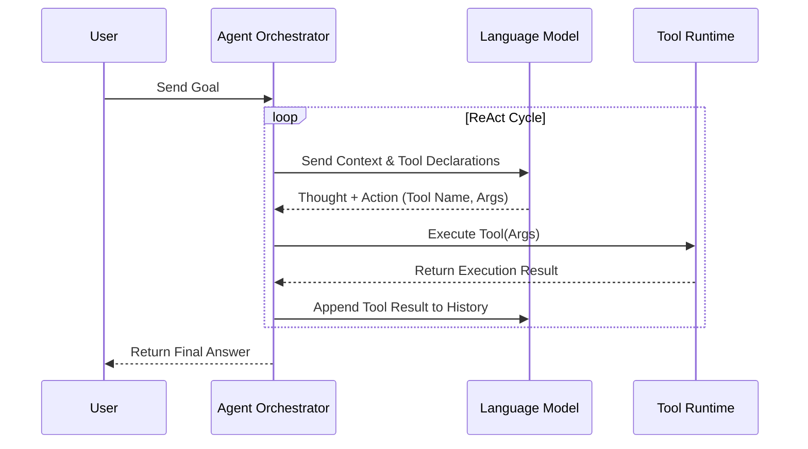

**Answer-First:** Moving from static retrieval to autonomous agents requires translating natural language goals into structured tool calls and loops (ReAct/Plan-and-Solve) that interface directly with transactional APIs.

> **Prerequisite:** [Part 5: Enterprise Security & Data Poisoning - The Silent Assassin]() on data access controls.

## 1. The Decline of Static RAG

In the previous 5 parts, we built a perfect RAG machine: real-time data (CDC), absolute security, and strict authorization. But no matter how perfect, traditional RAG suffers from a fatal flaw: **It only knows how to "Read" and "Speak", not how to "Do".**

If you ask a RAG system: *"Check if the server is overloaded, and if so, automatically boot up 2 more servers"*, it will be completely powerless. RAG is a Static Pipeline running on a one-way street.

In 2026, enterprises do not pay for a machine that merely quotes documents. They need "Digital Workers" who can analyze problems, plan autonomously, and interact directly with business systems (Accounting Software, CRM, AWS). That is the dawn of the **AI Agent Era**.

---

## 2. Reasoning Strategies: ReAct vs. Plan-and-Solve

For an LLM to transform from a "brain" into an "employee", it needs a Reasoning Strategy. 2026 architects usually choose between these 2 models:

*   **The ReAct Model (Reason + Act): Real-World Friction**
    Designed for ambiguous tasks. The Agent thinks one step (Thought), executes an action via API (Action), observes the returned result (Observation), and then thinks of the next step. ReAct is very powerful for debugging source code or researching dynamic information, but in return, it consumes a lot of Tokens (High cost) because the loop repeats continuously.
*   **The Plan-and-Solve Model: Military Discipline**
    Used for standard processes (KYC procedures, Month-end financial reporting). Instead of thinking while doing, a "Manager Agent" will create a clear 5-step Plan from the very beginning. Then, it delegates to an "Execution Agent" to run exactly according to those 5 steps. It is faster, cheaper, and more controllable than ReAct.

---

## 3. The "USB-C of AI": The Model Context Protocol (MCP) Era

In the past, if you wanted an Agent to send an Email, you had to write a lengthy Python script (Function Calling) specifically integrating the Gmail API. Switching to Outlook? You had to rewrite it. Changing the model from GPT-4 to Claude? You had to rewrite the structure.

The emergence of the **Model Context Protocol (MCP)** managed by the Linux Foundation changed everything. MCP acts as the "USB-C" connection standard for the AI world.
* Enterprises only need to set up an **MCP Server** connected to their internal Database or CRM.
* Any LLM (Gemini, Claude, GPT) just needs to "plug into" this MCP standard to instantly understand available tools, automatically authenticate, and know how to use them without an AI Engineer writing a single line of integration code.

---

## 4. Enterprise Architecture: Why Enterprises Choose LangGraph?

When shifting to Multi-Agent systems, programmers debated fiercely between AutoGen and LangGraph.

**AutoGen** designs Agents like a group of people chatting with each other (Group Chat) – very creative but chaotic. You never know where the conversation will lead.

Conversely, **LangGraph** wins absolutely in the Enterprise environment. It forces the Agent's thought flow into a Directed Acyclic Graph (DAG) with Cyclic capabilities.
*   **Stateful Management:** All memory and work progress are saved as Checkpoints. If the server crashes at Step 4, LangGraph will auto-recover and resume from Step 4, instead of grinding again from Step 1. Enterprises need stability and predictability, and LangGraph was born to deliver that.

---

## 5. The Safety Brake: Human-in-the-Loop (HITL)

Granting an Agent the power to automatically execute financial transactions or alter Cloud structures is suicidal without control. In the standard 2026 LangGraph architecture, the concept of **Human-in-the-Loop** is mandatory.

By using the `interrupt()` mechanism, the system operates as follows:
1. The Agent reads the request and drafts the command *"Delete Customer Database 2024"*.
2. Right before the Agent "presses the button", the LangGraph pauses. The system automatically sends a Slack notification to the IT Director.
3. The Agent's state is "frozen".
4. The Director clicks "Approve" (Resume). The Agent unfreezes and officially executes.
The combination of AI automation and human accountability is the key to bringing Agentic AI into Production.

---

## 6. Conclusion

Agentic AI transforms your system from an encyclopedia into a true workforce. By combining reasoning capabilities (Plan-and-Solve), a transcendent connection standard (MCP), and the absolute control of LangGraph (HITL), 2026 enterprises are automating processes that seemed only humans could do.

However, an AI Agent only performs well if it can "remember" what it has done. In **[Part 7: Agentic Memory - Long-Term Personalized Storage]()**, we will dissect **Mem0** and **Zep** to see how engineers grant AI a "hippocampus" – the ability to remember events across time.

## ReAct Execution Loop in Go

Autonomous agents extend RAG systems by executing code, calling tools, and updating status parameters. The ReAct (Reasoning and Acting) execution pattern runs in a loop: the LLM analyzes a goal, determines which tool to run, receives the tool's execution result, and loops until the final goal is met.

The following Go code implements this complete execution runtime, showing how to dynamically invoke registered tools using structured natural language commands:

```go
package main

import (
	"context"
	"errors"
	"fmt"
	"strings"
	"time"
)

type Tool interface {
	Name() string
	Execute(ctx context.Context, args string) (string, error)
}

// ServerRestartTool mock tool definition
type ServerRestartTool struct{}

func (t *ServerRestartTool) Name() string { return "restart_server" }
func (t *ServerRestartTool) Execute(ctx context.Context, args string) (string, error) {
	fmt.Printf("[Tool] Executing restart_server with args: %s\n", args)
	time.Sleep(100 * time.Millisecond)
	return "Server successfully restarted. System status is green.", nil
}

type AgentExecutor struct {
	Tools map[string]Tool
}

func NewAgentExecutor() *AgentExecutor {
	return &AgentExecutor{Tools: make(map[string]Tool)}
}

func (ae *AgentExecutor) RegisterTool(t Tool) {
	ae.Tools[t.Name()] = t
}

func (ae *AgentExecutor) ExecuteLoop(ctx context.Context, task string) (string, error) {
	// A real LLM would be called here to decide which tool to execute.
	// We simulate a 2-step loop: 1. call restart_server, 2. return final answer.
	fmt.Printf("[Agent] Task received: %s\n", task)
	
	// Step 1: Decision to run restart_server
	selectedTool := "restart_server"
	args := "server_id=prod-srv-99"
	
	tool, ok := ae.Tools[selectedTool]
	if !ok {
		return "", errors.New("tool not found")
	}
	
	result, err := tool.Execute(ctx, args)
	if err != nil {
		return "", err
	}
	
	// Step 2: Final Answer generation
	finalAnswer := fmt.Sprintf("Action complete. Restart tool reported: %s", result)
	return finalAnswer, nil
}

func main() {
	executor := NewAgentExecutor()
	executor.RegisterTool(&ServerRestartTool{})
	
	ctx := context.Background()
	ans, _ := executor.ExecuteLoop(ctx, "Restart production server prod-srv-99")
	fmt.Println("[Agent Final Answer]:", ans)
}
```



By decoupling the agent from static paths and letting it select tools dynamically within a ReAct cycle, the system can autonomously adapt to environment state changes.


---## ReAct Execution Loop in Go

Autonomous agents extend RAG systems by executing code, calling tools, and updating status parameters. The ReAct (Reasoning and Acting) execution pattern runs in a loop: the LLM analyzes a goal, determines which tool to run, receives the tool's execution result, and loops until the final goal is met.

The following Go code implements this complete execution runtime, showing how to dynamically invoke registered tools using structured natural language commands:

```go
package main

import (
	"context"
	"errors"
	"fmt"
	"strings"
	"time"
)

type Tool interface {
	Name() string
	Execute(ctx context.Context, args string) (string, error)
}

// ServerRestartTool mock tool definition
type ServerRestartTool struct{}

func (t *ServerRestartTool) Name() string { return "restart_server" }
func (t *ServerRestartTool) Execute(ctx context.Context, args string) (string, error) {
	fmt.Printf("[Tool] Executing restart_server with args: %s\n", args)
	time.Sleep(100 * time.Millisecond)
	return "Server successfully restarted. System status is green.", nil
}

type AgentExecutor struct {
	Tools map[string]Tool
}

func NewAgentExecutor() *AgentExecutor {
	return &AgentExecutor{Tools: make(map[string]Tool)}
}

func (ae *AgentExecutor) RegisterTool(t Tool) {
	ae.Tools[t.Name()] = t
}

func (ae *AgentExecutor) ExecuteLoop(ctx context.Context, task string) (string, error) {
	// A real LLM would be called here to decide which tool to execute.
	// We simulate a 2-step loop: 1. call restart_server, 2. return final answer.
	fmt.Printf("[Agent] Task received: %s\n", task)
	
	// Step 1: Decision to run restart_server
	selectedTool := "restart_server"
	args := "server_id=prod-srv-99"
	
	tool, ok := ae.Tools[selectedTool]
	if !ok {
		return "", errors.New("tool not found")
	}
	
	result, err := tool.Execute(ctx, args)
	if err != nil {
		return "", err
	}
	
	// Step 2: Final Answer generation
	finalAnswer := fmt.Sprintf("Action complete. Restart tool reported: %s", result)
	return finalAnswer, nil
}

func main() {
	executor := NewAgentExecutor()
	executor.RegisterTool(&ServerRestartTool{})
	
	ctx := context.Background()
	ans, _ := executor.ExecuteLoop(ctx, "Restart production server prod-srv-99")
	fmt.Println("[Agent Final Answer]:", ans)
}
```


By decoupling the agent from static paths and letting it select tools dynamically within a ReAct cycle, the system can autonomously adapt to environment state changes.

## State Machine and Flow Control for Autonomous Loops

Unconstrained loops can cause agents to enter infinite execution cycles, exhausting resources and racking up massive API charges. We prevent this by implementing a formal state machine:

1. **Max Iteration Guardrails:** Every execution context carries a `MaxSteps` counter (typically capped at 8). The agent aborts if the goal is not met within this limit.
2. **Circular Call Detection:** The runtime hashes the history of (Tool Name, Argument) tuples. If the exact same action is invoked consecutively, the execution loop raises an error.
3. **Execution Timeouts:** Individual tool runs are bounded by context deadlines, ensuring slow API integrations do not lock the executor thread.

🔗 **Next Step:** Learn to design persistent state systems in [Part 7: Agentic Memory - Solving the 'Goldfish' Curse]().

*Need help assessing the risks of your own platform migration? → [Book a 1:1 Architecture Consultation](/hire/)*---

[← Previous Part: Part 5: Enterprise Security & Data Poisoning - The Silent Assassin]()  |  [Next Part: Part 7: Agentic Memory - Solving the 'Goldfish' Curse]()
