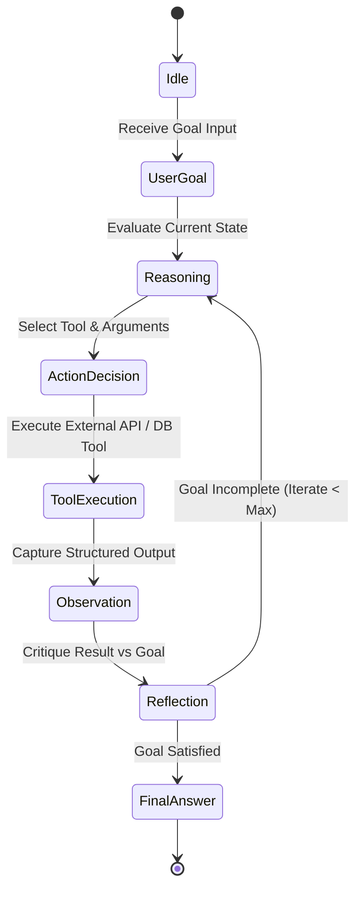
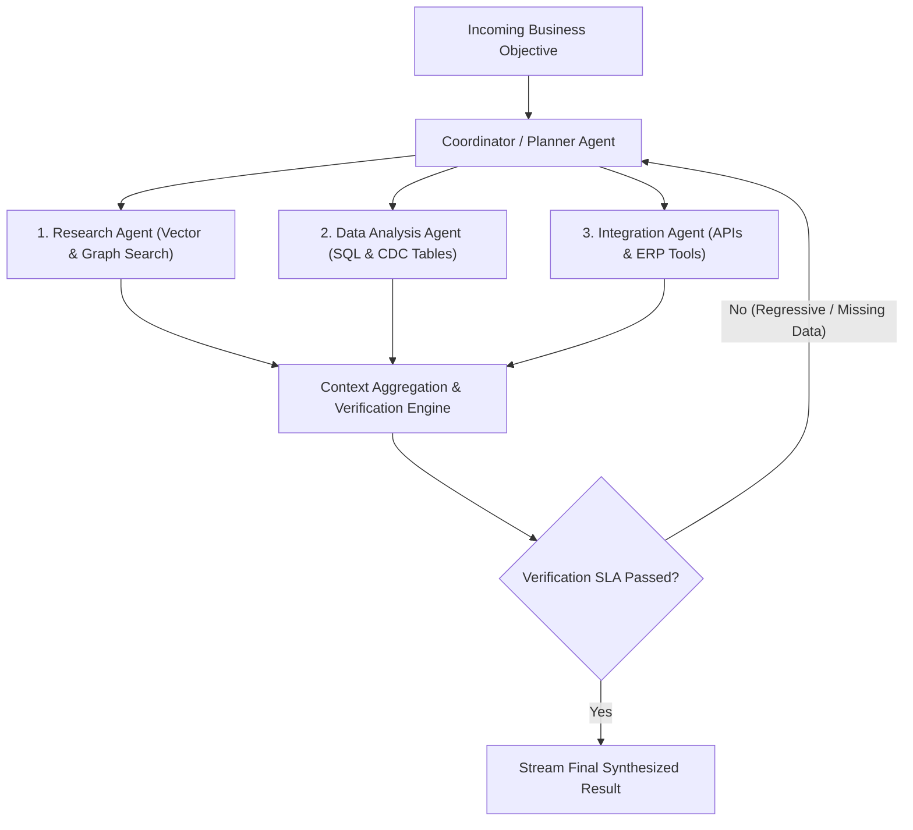

[📖 Bản tiếng Việt (Vietnamese Edition)](https://learn.tanhdev.com/series/ai-data-engineering-pipeline/part-6-rise-of-ai-agents/)

---

> **Prerequisite:** Familiarity with zero-trust data security and prompt boundary isolation covered in [Part 5 — Enterprise Security & Data Poisoning](/series/ai-data-engineering-pipeline/part-5-enterprise-security-data-poisoning/).

## Part 6 — The Rise of AI Agents: From Passive RAG to Autonomous Execution

Static retrieval-augmented generation (Passive RAG) retrieves context once and sends it directly to the model. While effective for simple document Q&A, passive RAG fails on multi-step investigative objectives, cross-database data synthesis, or actions requiring iterative problem resolution.

The evolution of enterprise generative AI has progressed through three fundamental paradigms:
1. **Prompt Engineering (2022-2023)**: Single-shot LLM prompts relying solely on static parametric model weights.
2. **Passive RAG (2023-2024)**: Single retrieval vector lookup injecting static context chunks into a prompt template.
3. **Autonomous Agent Systems (2025-2027 SOTA)**: Dynamic multi-turn reasoning loops equipped with tool execution capabilities, working memory buffers, and stateful reflection loops.

---

## The ReAct Loop Mechanics

**Answer-first:** The ReAct (Reasoning + Acting) loop enables autonomous AI agents to interleave chain-of-thought planning with physical tool invocations (SQL queries, vector searches, API requests), iteratively evaluating observations until reaching verifiable goal completion.


```mermaid
stateDiagram-v2
    [*] --> Idle
    Idle --> UserGoal: Receive Goal Input
    UserGoal --> Reasoning: Evaluate Current State
    Reasoning --> ActionDecision: Select Tool & Arguments
    
    ActionDecision --> ToolExecution: Execute External API / DB Tool
    ToolExecution --> Observation: Capture Structured Output
    
    Observation --> Reflection: Critique Result vs Goal
    Reflection --> Reasoning: Goal Incomplete (Iterate < Max)
    Reflection --> FinalAnswer: Goal Satisfied
    FinalAnswer --> [*]
```

### Execution Loop Breakdown
1. **Thought (Reasoning)**: The agent analyzes the user's objective alongside current conversation history and past observations to select the next logical action.
2. **Action (Tool Call)**: The agent outputs a structured JSON payload targeting a registered tool (e.g., `ExecuteVectorSearch`, `QueryPostgresDB`, `RunPythonSandbox`).
3. **Observation (Environment Feedback)**: The runtime executes the requested tool, capturing the output payload and injecting it back into the agent context buffer.
4. **Reflection (Critique)**: The agent evaluates whether the observation answers the core objective or requires another iteration step.

---

## Multi-Agent Swarm Coordination Pipeline

In enterprise platforms, complex workflows are partitioned across specialized subagents coordinated by an orchestrator agent:


```mermaid
flowchart TD
    UserRequest["Incoming Business Objective"] --> Orchestrator["Coordinator / Planner Agent"]
    
    Orchestrator --> SpecSubagent["1. Research Agent (Vector & Graph Search)"]
    Orchestrator --> SQLSubagent["2. Data Analysis Agent (SQL & CDC Tables)"]
    Orchestrator --> ActionSubagent["3. Integration Agent (APIs & ERP Tools)"]

    SpecSubagent --> Aggregator["Context Aggregation & Verification Engine"]
    SQLSubagent --> Aggregator
    ActionSubagent --> Aggregator

    Aggregator --> OutputJudge{"Verification SLA Passed?"}
    OutputJudge -->|"Yes"| StreamResponse["Stream Final Synthesized Result"]
    OutputJudge -->|"No (Regressive / Missing Data)"| Orchestrator
```

---

## Production Go ReAct Agent Runtime

The following production-grade Go agent runtime implements the ReAct loop with JSON schema argument validation, context cancellation timeouts, and maximum iteration safeguards:

```go
package main

import (
	"context"
	"encoding/json"
	"errors"
	"fmt"
	"log"
	"strings"
	"time"
)

type ToolCall struct {
	Name      string          `json:"name"`
	Arguments json.RawMessage `json:"arguments"`
}

type AgentState struct {
	Goal         string
	Iterations   int
	Observations []string
	Done         bool
	FinalAnswer  string
}

type ToolRegistry map[string]func(ctx context.Context, args json.RawMessage) (string, error)

type AgentRuntime struct {
	tools   ToolRegistry
	maxIter int
}

func NewAgentRuntime(tools ToolRegistry, maxIter int) *AgentRuntime {
	return &AgentRuntime{
		tools:   tools,
		maxIter: maxIter,
	}
}

func (r *AgentRuntime) Step(ctx context.Context, state *AgentState) error {
	state.Iterations++
	if state.Iterations > r.maxIter {
		return errors.New("maximum reasoning iterations reached without converging")
	}

	// 1. Simulated LLM Thought & Tool Selection
	toolName, toolArgs, thought := r.simulateLLMReasoning(state)
	fmt.Printf("[Iteration %d] Thought: %s
", state.Iterations, thought)

	if toolName == "CompleteGoal" {
		state.Done = true
		state.FinalAnswer = string(toolArgs)
		return nil
	}

	// 2. Tool Execution
	handler, exists := r.tools[toolName]
	if !exists {
		return fmt.Errorf("tool '%s' not registered", toolName)
	}

	observation, err := handler(ctx, toolArgs)
	if err != nil {
		observation = fmt.Sprintf("Tool Execution Error: %v", err)
	}

	// 3. Record Observation into Agent State
	state.Observations = append(state.Observations, fmt.Sprintf("[%s]: %s", toolName, observation))
	return nil
}

func (r *AgentRuntime) simulateLLMReasoning(state *AgentState) (string, json.RawMessage, string) {
	if len(state.Observations) == 0 {
		return "VectorSearch", json.RawMessage(`{"query": "Q3 Enterprise Revenue"}`), "Need to retrieve current financial context."
	}
	if len(state.Observations) == 1 {
		return "SQLQuery", json.RawMessage(`{"sql": "SELECT ebitda FROM quarterly_metrics WHERE year=2026"}`), "Context acquired; querying exact numeric metrics."
	}
	return "CompleteGoal", json.RawMessage(`"Q3 Revenue: $42M with EBITDA margin of 28.4%."`), "Sufficient verified data collected to conclude."
}

func main() {
	tools := ToolRegistry{
		"VectorSearch": func(ctx context.Context, args json.RawMessage) (string, error) {
			return "Found 2 matching documents: Q3 revenue exceeded plan by 14%.", nil
		},
		"SQLQuery": func(ctx context.Context, args json.RawMessage) (string, error) {
			return "Row: ebitda=28.4%", nil
		},
	}

	runtime := NewAgentRuntime(tools, 5)
	state := &AgentState{Goal: "Synthesize Q3 financial overview."}

	ctx, cancel := context.WithTimeout(context.Background(), 10*time.Second)
	defer cancel()

	for !state.Done {
		if err := runtime.Step(ctx, state); err != nil {
			log.Fatalf("Agent runtime failure: %v", err)
		}
	}

	fmt.Printf("[Agent Final Result] %s
", state.FinalAnswer)
}
```

---

## Comparative Matrix: Agent Paradigms

```
Passive RAG vs Single ReAct Agent vs Multi-Agent Swarms
```

| Dimension / Metric | Passive RAG (2024) | ReAct Agent (Single Loop) | Multi-Agent Swarm (2027 SOTA) |
| :--- | :--- | :--- | :--- |
| **Reasoning Depth** | Single forward pass | Multi-turn iterative loop | Distributed parallel reasoning |
| **Tool Execution** | None (Static text) | Linear sequential tool calls | Parallel coordinated tool execution |
| **Failure Recovery** | Zero (Emits hallucination) | Self-correcting retry loop | Role-specialized consensus & fallback |
| **State Persistence**| Stateless prompt | In-memory session scratchpad | Tri-Tier Shared Memory Mesh |
| **Latency SLA** | Fast (200ms - 800ms) | Moderate (1.2s - 4.5s) | Variable (2s - 8s bounded by concurrency) |

---

## Frequently Asked Questions (FAQ)


Passive RAG executes a single vector retrieval step and immediately streams the LLM response without verifying correctness. Autonomous agents execute a dynamic ReAct loop: they inspect intermediate tool outputs, decide whether additional searches or calculations are required, and iteratively self-correct before generating a final verified response.



Production agent runtimes enforce hard iteration ceilings (e.g. max 5 to 8 steps), strict per-turn execution timeouts using Go/Python contexts, and token usage circuit breakers that abort execution if cumulative spend crosses preset budgetary boundaries.



Model Context Protocol (MCP) provides a standardized client-server interface for tool discovery, prompt templates, and resource access. Instead of hand-coding custom integration clients for every database, agents communicate with standardized MCP servers via JSON-RPC, enabling clean cross-language tool sharing across Go, Python, and TypeScript runtimes.


---

## Production Agent Invariants

1. **Hard Iteration Caps**: Every agent loop must enforce an immutable iteration limit (`max_iterations <= 8`) to prevent infinite reasoning cycles.
2. **Context Timeout Enforcement**: All tool invocations must pass cancellation-aware contexts with timeouts under 5 seconds per tool step.
3. **Structured JSON Validation**: Disallow arbitrary free-text tool arguments; validate all tool inputs against strict Pydantic or Go JSON schemas prior to execution.

---

🔗 **Next Step:** Continue to [Part 7 — Agentic Memory Systems: Episodic & Working Storage](/series/ai-data-engineering-pipeline/part-7-agentic-memory-long-term/) to implement multi-tier persistent memory.

## Internal Series Navigation

- [Part 5 — Enterprise Security & Data Poisoning](/series/ai-data-engineering-pipeline/part-5-enterprise-security-data-poisoning/)
- [Part 7 — Agentic Memory Systems: Episodic & Working Storage](/series/ai-data-engineering-pipeline/part-7-agentic-memory-long-term/)
- [Part 8 — Inference Optimization: vLLM & PagedAttention](/series/ai-data-engineering-pipeline/part-8-inference-optimization-vllm/)
