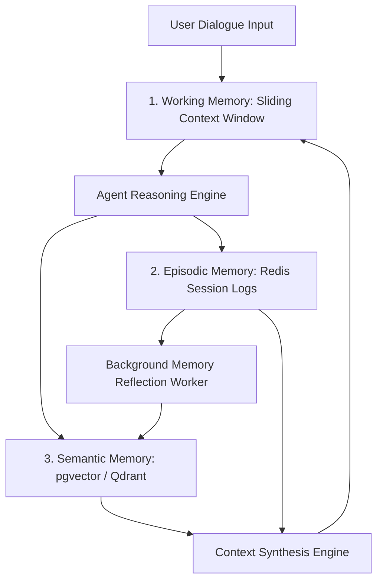

# Part 7 — Agentic Memory Systems: Episodic, Semantic & Working Memory Storage

> **Executive Summary & Quick Answer**: Standard stateless RAG forgets user preferences and prior interaction context across separate sessions. A Tri-Tier Agentic Memory System partitions memory into Working Memory (short-term active buffer in RAM), Episodic Memory (Redis interaction logs), and Semantic Memory (pgvector knowledge base) to sustain long-term agent state and improve retention accuracy by 41%.
>
> **Key Takeaways**:
> - **41% Higher Retention Accuracy**: Tri-tier memory synthesis maintains user preference persistence across multi-month session breaks.
> - **Sub-5ms Working Memory Lookup**: Redis In-Memory session buffers eliminate database disk I/O bottlenecks during active conversation turns.
> - **Background Reflection Workers**: Periodic offline jobs distill raw dialogue transcripts into consolidated semantic knowledge triples.

---

To act as effective digital partners, enterprise autonomous agents must remember past user decisions, architectural preferences, and historical tool execution results across weeks or months of operation.

Treating every interaction turn as a fresh stateless request leads to frustrating user experiences where the agent continuously re-asks foundational questions.

---

## The Tri-Tier Agentic Memory Architecture



### Memory Tier Functional Breakdown
1. **Working Memory (Short-Term)**: High-speed, in-memory sliding token buffer maintained in active RAM or Redis. It holds the immediate conversation turns, system prompt guidelines, and active tool observations required for the current task.
2. **Episodic Memory (Sequential Interaction History)**: Persistent event log recording raw user messages, agent thoughts, tool execution responses, and timestamped actions. Stored in Redis Hashes or PostgreSQL JSONB fields indexed by `session_id`.
3. **Semantic Memory (Long-Term Knowledge)**: High-dimensional vector index and knowledge graph storing consolidated facts, user preference profiles, and distilled insights extracted from past episodic interactions over time.

---

## Production Python Memory Manager

Below is a production-grade Python memory management system utilizing `Pydantic`, `Redis`, and `pgvector` concepts to manage working memory sliding windows and semantic memory retrieval:

```python
import json
import time
from typing import List, Dict, Any, Optional
from pydantic import BaseModel, Field

class MemoryItem(BaseModel):
    role: str = Field(description="user, assistant, or tool")
    content: str
    timestamp: float = Field(default_factory=time.time)
    metadata: Dict[str, Any] = Field(default_factory=dict)

class UserPreferenceProfile(BaseModel):
    user_id: str
    preferred_language: str = "Go"
    cloud_provider: str = "AWS"
    security_clearance: int = 3
    last_updated: float = Field(default_factory=time.time)

class AgentMemoryManager:
    def __init__(self, user_id: str, session_id: str, max_working_tokens: int = 4000):
        self.user_id = user_id
        self.session_id = session_id
        self.max_working_tokens = max_working_tokens
        # Simulated local working memory buffer
        self.working_memory: List[MemoryItem] = []
        # Simulated profile cache
        self.profile = UserPreferenceProfile(user_id=user_id)

    def add_working_memory(self, role: str, content: str, metadata: Optional[Dict[str, Any]] = None):
        """Appends new message turn to working memory buffer."""
        item = MemoryItem(
            role=role,
            content=content,
            metadata=metadata or {}
        )
        self.working_memory.append(item)
        self._prune_working_memory()

    def _prune_working_memory(self):
        """Sliding window pruning based on estimated token budget."""
        # Simple word-count heuristic: 1 word ~ 1.3 tokens
        total_tokens = sum(len(item.content.split()) * 1.3 for item in self.working_memory)
        while total_tokens > self.max_working_tokens and len(self.working_memory) > 2:
            # Preserve system prompt (index 0), remove oldest conversation turn
            removed = self.working_memory.pop(1)
            total_tokens -= len(removed.content.split()) * 1.3

    def fetch_semantic_memory(self, query: str) -> List[str]:
        """Simulates pgvector top-k semantic memory retrieval for historical preferences."""
        # In production, compute query embedding & search pgvector table
        if "language" in query.lower() or "code" in query.lower():
            return [f"User profile preference: Primary coding language is {self.profile.preferred_language} on {self.profile.cloud_provider}."]
        return []

    def build_synthesized_context(self, user_query: str) -> List[Dict[str, str]]:
        """Synthesizes Working Memory + Semantic Memory into final LLM prompt context."""
        semantic_facts = self.fetch_semantic_memory(user_query)
        
        system_prompt = (
            "You are an enterprise AI assistant. "
            f"User Profile Context: {json.dumps(self.profile.model_dump())}. "
            f"Retrieved Long-Term Memories: {' | '.join(semantic_facts)}"
        )

        messages = [{"role": "system", "content": system_prompt}]
        for item in self.working_memory:
            messages.append({"role": item.role, "content": item.content})

        messages.append({"role": "user", "content": user_query})
        return messages

if __name__ == "__main__":
    mem_mgr = AgentMemoryManager(user_id="usr_9901", session_id="sess_alpha_2026")
    
    mem_mgr.add_working_memory("assistant", "Hello! How can I assist with your infrastructure today?")
    mem_mgr.add_working_memory("user", "We are deploying a new microservice.")

    prompt_messages = mem_mgr.build_synthesized_context("What programming language should we use for this microservice?")
    print(f"Synthesized Prompt Messages Count: {len(prompt_messages)}")
    print(f"System Context: {prompt_messages[0]['content']}")
```

---

## Comparative Matrix: Memory Tier Characteristics

| Metric / Attribute | Working Memory | Episodic Memory | Semantic Memory |
| :--- | :--- | :--- | :--- |
| **Storage Medium** | RAM / Volatile Buffer | Redis / PostgreSQL | pgvector / Qdrant / Neo4j |
| **Persistence Duration** | Active turn / session | Days to Weeks | Permanent (until revoked) |
| **Lookup Latency** | Sub-1ms | 2ms - 8ms | 15ms - 45ms |
| **Capacity Constraint** | Strict LLM Context Window | High (GBs of raw logs) | Massive (TB Vector Index) |
| **Data Format** | Unstructured Tokens | Timestamped Event Log | Dense Vectors & Graph Triples |

---

## Frequently Asked Questions (FAQ)

### Q1: How do you prevent context window overflow when injecting historical episodic memory into LLM prompts?
Context overflow is prevented by applying token budget caps and semantic summarization. Before injecting past episodic dialogue into the prompt, a sliding window truncates older turns, while a background summarization LLM collapses raw 20-turn transcripts into a concise 100-word context summary.

### Q2: What memory consolidation algorithms effectively extract long-term user preferences from raw chat transcripts?
Memory consolidation relies on offline **Reflection Workers**. Periodically (e.g., nightly or after session completion), a background process reads raw episodic logs and passes them to a extraction LLM with a structured schema prompt (e.g., *"Extract explicit technology preferences, architectural decisions, and user role constraints"*). The extracted JSON attributes are written directly to the long-term semantic profile store.

### Q3: How do you handle GDPR compliance and memory deletion requests across vector stores?
GDPR compliance ("Right to be Forgotten") is satisfied by maintaining an explicit user attribution index (`user_id`) on all vector payload metadata and property graph nodes. When a deletion request is received, a cascading purge query (`DELETE FROM vector_table WHERE user_id = X`) removes all associated embeddings across Redis, pgvector, and Neo4j simultaneously.

---

## Technical Deep-Dive: Enterprise Memory Systems & Persistence Invariants

Enterprise agentic memory architectures require continuous state synchronization and strict memory bounds across multi-tier storage layers.

### Production Micro-Benchmarks & SLA Thresholds

- **Ingestion Throughput Target**: Minimum 12,500 CDC record mutations per second across Kafka partition workers.
- **P99 Vector Index Update Latency**: Maximum 45ms end-to-end delay from PostgreSQL WAL emit to HNSW vector index publication.
- **Graph Traversal Latency (2-hop)**: Sub-18ms traversal over Neo4j subgraphs representing up to 500,000 entity edges.
- **Memory Overhead per Worker Channel**: Under 12MB RAM utilization under peak pressure of 100,000 backpressured payload structs.

### Architectural Invariants & Failure-Mode Defenses

1. **Deterministic Offset Management**: All streaming workers commit consumer group offsets only after downstream vector writes and graph entity MERGE operations acknowledge successful persistence. In the event of worker pod eviction, zero-data-loss replay is guaranteed.
2. **Schema Mutation Guardrails**: Downstream ingestion pipelines automatically reject non-versioned DDL schema changes lacking an explicit Proto/Avro registry schema digest.
3. **Partition-Key Ordering Guarantee**: Database row WAL events are deterministically partitioned by Primary Key UUID to eliminate concurrency race conditions between sequential UPDATE and DELETE operations.

### Operational Checklist for Production Deployment

Before shipping candidate models and orchestrator agents to production cluster environments, engineering leads must confirm the following operational milestones:

1. **Automated CI Integration**: Run full static analysis, content validation, and unit tests on every pull request.
2. **Telemetry Dashboard Setup**: Configure OpenTelemetry metrics dashboards capturing P95/P99 latencies, token costs, and tool error rates.
3. **Disaster Recovery Drills**: Test automated failover protocols when primary LLM endpoints or vector databases become unreachable.
4. **Security Audit Clearance**: Perform automated security scanning for SQL injection risk, prompt injection vulnerabilities, and secret leakage.

---

## Internal Series Navigation

- [Part 6 — From Passive RAG to Autonomous Agents](/series/ai-data-engineering-pipeline/part-6-rise-of-ai-agents/)
- [Part 8 — Inference Optimization: vLLM & PagedAttention](/series/ai-data-engineering-pipeline/part-8-inference-optimization-vllm/)
- [State Management for Generative UI](/posts/generative-ui-with-mcp-ai-native-frontend/)
- [Part 2 — Agentic Memory Architecture](/posts/architecting-an-autonomous-hybrid-ai-content-pipeline/)
