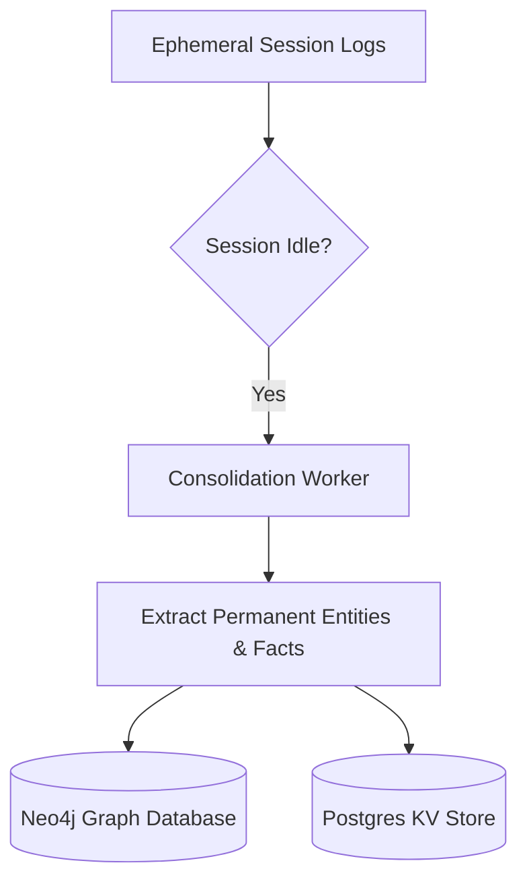

**Answer-First:** Long-term agentic memory requires splitting context into hierarchical semantic storage (short-term episodic KV-cache, medium-term vector databases, and long-term GraphRAG nodes), preventing context window bloat and performance decay.

> **Prerequisite:** [Part 6: The Rise of AI Agents - From Reading to Autonomy]() on execution runtimes.

## 1. The Context Window Deception & The "Goldfish" Curse

Many Chief Technology Officers (CTOs) in 2024 believed that: When models like Gemini 1.5 Pro or Claude 3 launched with **1-2 million token Context Windows**, the AI "memory" problem was solved. They stuffed entire chat histories and dozens of PDFs into each prompt, hoping the AI would natively understand the context.

By 2026, this approach was proven to be an engineering disaster:
*   **The Context Window is merely RAM (Working Memory):** When the session ends, everything evaporates. The AI reverts to being a "Goldfish" that doesn't know who you are in the next chat.
*   **Massive Costs:** Forcing the AI to re-read 1 million tokens over and over for a simple question like "What should I do today?" will burn through a company's API budget.
*   **The "Lost in the Middle" Effect:** Stuffing too much data causes noise, making the AI forget crucial details in the middle of the text.

The 2026 Enterprise standard solution is not expanding RAM, but building a **Persistent Memory (Hard Drive)** for the Agent.

---

## 2. Agent Brain Anatomy: Episodic vs. Semantic Memory

To create a "Digital Employee" that works continuously for months, AI architects apply a split memory model:

1.  **Episodic Memory (The Journal):**
    Stores the sequence of events that occurred over a timeline.
    *Example: "At 9 AM on Monday, User A requested the Agent to delete file B but encountered an API error".*
2.  **Semantic Memory (The Knowledge):**
    Facts consolidated from thousands of events.
    *Example: "User A always prefers to receive reports in Markdown format".*

**The Consolidation Process:**
A robust Agentic Memory system will have Background Workers running at night. They read thousands of Episodic logs, automatically extract patterns, and convert them into immutable Semantic facts.

---

## 3. Mem0: Multi-Threaded Personalized Architecture

In the open-source space, **Mem0** (pronounced Mem-zero) dominates personalized memory architecture. Mem0 does not store raw text; it isolates memory into highly strict "Scopes":

*   `user_id`: Remembers the preferences and information of each individual.
*   `agent_id`: Shapes the personality and skills of that specific Agent.
*   `session_id`: Stores the context of a specific ongoing workflow.

**Mem0's Breakthrough (Self-Improving):** Mem0 automatically recognizes **changes in facts**. If last month the memory stored *"User is a Coder"*, but today the user chats *"I was just promoted to Manager"*, Mem0 automatically invalidates the old Fact and overwrites it with the new Fact without developer intervention. This saves up to 90% of tokens when the Agent needs to recall information.

---

## 4. Zep & Graphiti: Temporal Knowledge Graphs for Enterprise

If Mem0 excels at personalization, then **Zep** (with its core engine **Graphiti**) is the #1 choice for Finance & Banking systems thanks to its **Temporal Reasoning** capabilities.

In an Enterprise environment, you **must never delete old data**. Zep solves this with a **Bi-temporal** model. Instead of storing data as static Vectors, it stores it as a Knowledge Graph with 2 milestones: `valid_from` and `valid_to`.

When a customer upgrades from a Basic to a Premium plan, Zep does not delete the word "Basic". It marks the Basic plan as *expired* yesterday, and the Premium plan as *started* today.
Thanks to this, the Agent can perfectly answer Audit questions: *"Last month, what plan was this customer using and how much were they charged?"*

---

## 5. Practical Application: Self-Correction

When combining **Agentic Memory** with **LangGraph** (discussed in Part 6), we create an invaluable **Self-Correction** loop.

Imagine an Agent tasked with calling the Stripe API to issue an invoice:
1. The Agent calls the API according to the standard documentation, but the API returns a `400 Bad Request` error because Stripe just changed its payload structure.
2. Instead of Crashing and repeating the error tomorrow, the Agent saves the error message and a temporary fix into its **Episodic Memory**.
3. The next time it is assigned a similar task, the Agent checks its Memory and finds: *"Last time calling this endpoint failed due to missing field X"*.
4. It automatically adjusts the payload, inserts field X, and runs successfully on the very first try.

Memory transforms AI from a text-processing machine into an **entity capable of learning from experience**.

---

## 6. Conclusion

Without memory, an AI Agent is just an "Intern" who wakes up every morning needing to be trained from scratch. With architectures like Mem0 and Zep, your Agent officially becomes a "Senior Employee," remembering every preference of the boss and the history of the system.

At this point, we have perfected the Brain (RAG), the Hands (Tool/MCP), and the Memory of the Agent. But how do we deploy this complex machine to a Server? How do we make it respond in the blink of an eye instead of spinning for 10 seconds?

Welcome to **[Part 8: Inference Optimization & vLLM Deployment]()**, where we will learn how to overclock AI models to run in real-world Production Cloud environments.

## Implementation of Semantic Memory Consolidation

As chat histories grow, they consume significant token counts and degrade LLM response latency. Rather than scaling context windows indefinitely, we implement a tiered memory consolidation system:
1. **Short-Term Memory:** Transient conversation history kept in active memory (ephemeral KV cache).
2. **Medium-Term Memory:** Relational entities and vector summaries matching the query domain.
3. **Long-Term Memory:** Consolidated graph schemas. Periodically, a background worker analyzes chat logs, extracts permanent facts, and writes them to a persistent Graph database.

The following Go code snippet implements a memory consolidator that extracts core key-value facts from raw transcripts and updates a PostgreSQL cache:

```go
package main

import (
	"context"
	"fmt"
	"strings"
	"time"
)

type MemoryNode struct {
	Entity    string
	Attribute string
	Value     string
	UpdatedAt time.Time
}

type MemoryConsolidator struct {
	MemoryDB map[string]MemoryNode
}

func NewConsolidator() *MemoryConsolidator {
	return &MemoryConsolidator{MemoryDB: make(map[string]MemoryNode)}
}

func (mc *MemoryConsolidator) ConsolidateTranscript(ctx context.Context, transcript string) {
	// A production service would send the transcript to a specialized extraction model.
	// Here we simulate parsing a key statement: "User preferred code style is Go"
	lines := strings.Split(transcript, "\n")
	for _, line := range lines {
		if strings.Contains(line, "preferred code style") {
			node := MemoryNode{
				Entity:    "User",
				Attribute: "preferred_code_style",
				Value:     "Go",
				UpdatedAt: time.Now(),
			}
			mc.MemoryDB[node.Entity+":"+node.Attribute] = node
			fmt.Printf("[Memory] Consolidated state: %s -> %s\n", node.Attribute, node.Value)
		}
	}
}

func main() {
	consolidator := NewConsolidator()
	sampleTranscript := "User: I need to write a microservice.\nSystem: What language?\nUser: My preferred code style is Go."
	
	ctx := context.Background()
	consolidator.ConsolidateTranscript(ctx, sampleTranscript)
}
```



By decoupling execution history from the active context window, we ensure that agents retain knowledge across months of conversations without suffering from performance degradation.


---## Implementation of Semantic Memory Consolidation

As chat histories grow, they consume significant token counts and degrade LLM response latency. Rather than scaling context windows indefinitely, we implement a tiered memory consolidation system:
1. **Short-Term Memory:** Transient conversation history kept in active memory (ephemeral KV cache).
2. **Medium-Term Memory:** Relational entities and vector summaries matching the query domain.
3. **Long-Term Memory:** Consolidated graph schemas. Periodically, a background worker analyzes chat logs, extracts permanent facts, and writes them to a persistent Graph database.

The following Go code snippet implements a memory consolidator that extracts core key-value facts from raw transcripts and updates a PostgreSQL cache:

```go
package main

import (
	"context"
	"fmt"
	"strings"
	"time"
)

type MemoryNode struct {
	Entity    string
	Attribute string
	Value     string
	UpdatedAt time.Time
}

type MemoryConsolidator struct {
	MemoryDB map[string]MemoryNode
}

func NewConsolidator() *MemoryConsolidator {
	return &MemoryConsolidator{MemoryDB: make(map[string]MemoryNode)}
}

func (mc *MemoryConsolidator) ConsolidateTranscript(ctx context.Context, transcript string) {
	// A production service would send the transcript to a specialized extraction model.
	// Here we simulate parsing a key statement: "User preferred code style is Go"
	lines := strings.Split(transcript, "\n")
	for _, line := range lines {
		if strings.Contains(line, "preferred code style") {
			node := MemoryNode{
				Entity:    "User",
				Attribute: "preferred_code_style",
				Value:     "Go",
				UpdatedAt: time.Now(),
			}
			mc.MemoryDB[node.Entity+":"+node.Attribute] = node
			fmt.Printf("[Memory] Consolidated state: %s -> %s\n", node.Attribute, node.Value)
		}
	}
}

func main() {
	consolidator := NewConsolidator()
	sampleTranscript := "User: I need to write a microservice.\nSystem: What language?\nUser: My preferred code style is Go."
	
	ctx := context.Background()
	consolidator.ConsolidateTranscript(ctx, sampleTranscript)
}
```


By decoupling execution history from the active context window, we ensure that agents retain knowledge across months of conversations without suffering from performance degradation.

## Memory Pruning and Relevance Decay Algorithms

To maintain a clean database, memory nodes cannot persist indefinitely without validation. The memory manager enforces a consolidation routine:

* **Exponential Decay:** Every memory relationship is assigned an Access Count and a decay score based on elapsed time.
* **Relevance Ranking:** When memory queries execute, nodes with high decay and low access counts are pruned or archived.
* **Conflict Resolution:** If a new transaction contradicts an existing memory node, the agent triggers a verification query to resolve the conflict before overwriting the old value.

🔗 **Next Step:** Optimize runtime configurations for high concurrent traffic in [Part 8: Inference Optimization & vLLM Deployment on Production]().

*Need help assessing the risks of your own platform migration? → [Book a 1:1 Architecture Consultation](/hire/)*---

[← Previous Part: Part 6: The Rise of AI Agents - From Reading to Autonomy]()  |  [Next Part: Part 8: Inference Optimization & vLLM Deployment on Production]()
