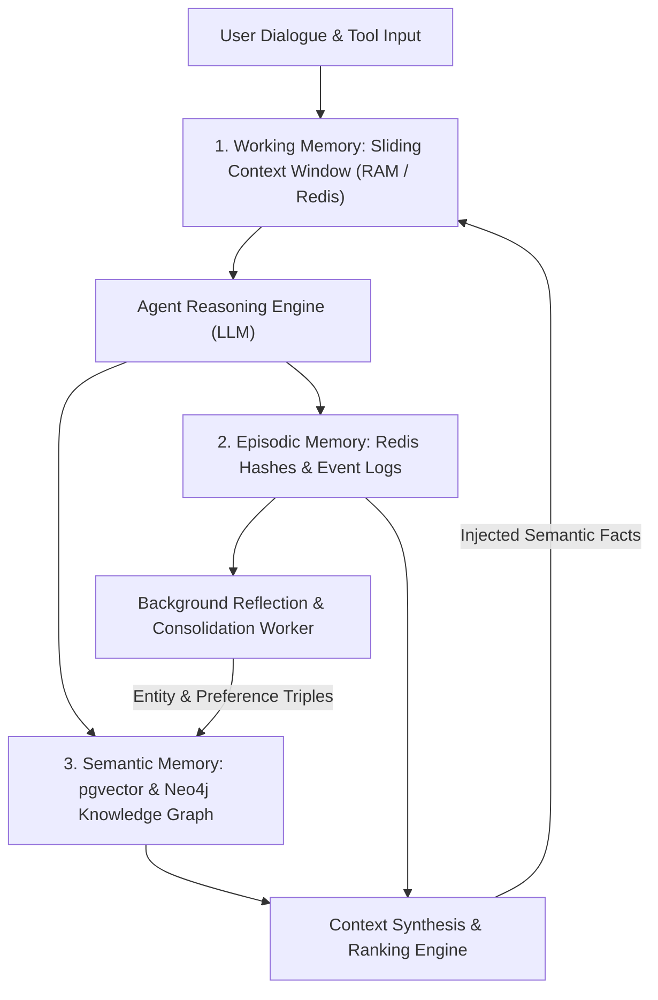
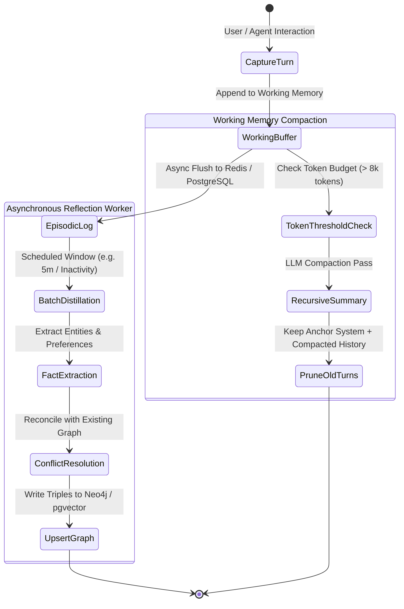

[📖 Bản tiếng Việt (Vietnamese Edition)](https://learn.tanhdev.com/series/ai-data-engineering-pipeline/part-7-agentic-memory-long-term/)

---

> **Prerequisite:** Familiarity with autonomous agent architectures covered in [Part 6 — Rise of AI Agents](/series/ai-data-engineering-pipeline/part-6-rise-of-ai-agents/). Review it first to understand tool routing and agentic loops.

## Part 7 — Agentic Memory Systems: Episodic, Semantic & Working Memory Storage

To act as effective digital partners, enterprise autonomous agents must remember past user decisions, architectural preferences, and historical tool execution results across weeks or months of operation.

Treating every interaction turn as a fresh stateless request leads to frustrating user experiences where the agent continuously re-asks foundational questions, repeats failed tool calls, or violates previously established enterprise constraints.

---

## The Tri-Tier Agentic Memory Architecture

**Answer-first:** Tri-tier agentic memory organizes conversational and analytical state across three decoupled storage planes: an in-RAM **Working Memory** sliding context window, an append-only **Episodic Memory** interaction log stored in Redis/PostgreSQL JSONB, and a consolidated **Semantic Knowledge Graph** in pgvector and Neo4j. Asynchronous reflection workers continuously distill episodic traces into permanent semantic triples, maintaining sub-15ms memory retrieval while bounding active LLM context tokens below strict cost thresholds.


```mermaid
graph TD
    UserInput["User Dialogue & Tool Input"] --> WM["1. Working Memory: Sliding Context Window (RAM / Redis)"]
    WM --> AgentCore["Agent Reasoning Engine (LLM)"]

    AgentCore --> Episodic["2. Episodic Memory: Redis Hashes & Event Logs"]
    AgentCore --> Semantic["3. Semantic Memory: pgvector & Neo4j Knowledge Graph"]

    Episodic --> Distiller["Background Reflection & Consolidation Worker"]
    Distiller -->|"Entity & Preference Triples"| Semantic

    Semantic --> Synthesis["Context Synthesis & Ranking Engine"]
    Episodic --> Synthesis
    Synthesis -->|"Injected Semantic Facts"| WM
```

### Memory Tier Functional Breakdown

1. **Working Memory (Short-Term / Volatile)**: High-speed sliding token buffer maintained in active RAM or local Redis cache. It holds immediate conversation turns, system prompt guidelines, scratchpad scratch memory, and active tool observations required for the current execution step.
2. **Episodic Memory (Sequential Interaction History)**: Persistent chronological event log recording raw user messages, agent thoughts, tool execution responses, error stack traces, and timestamped actions. Stored in Redis Hashes or PostgreSQL JSONB tables indexed by `session_id` and `trace_id`.
3. **Semantic Memory (Long-Term Knowledge & User Preferences)**: High-dimensional vector index and knowledge graph storing consolidated facts, user preference profiles, domain constraints, and distilled insights extracted from past episodic interactions over time.

---

## Memory Reflection and Entity Reconciliation Lifecycle

As agents engage in hundreds of multi-turn dialogues, storing every raw token permanently becomes economically unviable and causes severe retrieval noise. The **Reflection & Compaction Lifecycle** solves this by separating real-time execution from asynchronous knowledge consolidation.


```mermaid
stateDiagram-v2
    [*] --> CaptureTurn: User / Agent Interaction
    CaptureTurn --> WorkingBuffer: Append to Working Memory
    WorkingBuffer --> EpisodicLog: Async Flush to Redis / PostgreSQL
    
    state "Asynchronous Reflection Worker" as ReflectionService {
        EpisodicLog --> BatchDistillation: Scheduled Window (e.g. 5m / Inactivity)
        BatchDistillation --> FactExtraction: Extract Entities & Preferences
        FactExtraction --> ConflictResolution: Reconcile with Existing Graph
        ConflictResolution --> UpsertGraph: Write Triples to Neo4j / pgvector
    }

    state "Working Memory Compaction" as CompactionService {
        WorkingBuffer --> TokenThresholdCheck: Check Token Budget (> 8k tokens)
        TokenThresholdCheck --> RecursiveSummary: LLM Compaction Pass
        RecursiveSummary --> PruneOldTurns: Keep Anchor System + Compacted History
    }

    UpsertGraph --> [*]
    PruneOldTurns --> [*]
```

---

## Production Python Memory Manager

Production memory managers maintain an active session buffer in Redis, asynchronously archive episodic interactions, extract semantic triples with entity reconciliation, and assemble an optimized prompt context.

The following production-ready Python memory manager illustrates sliding-window compaction, semantic preference retrieval, and context synthesis:

```python
import json
import time
from typing import List, Dict, Any, Optional
from pydantic import BaseModel, Field

class MemoryItem(BaseModel):
    role: str = Field(description="user, assistant, or tool")
    content: str
    timestamp: float = Field(default_factory=time.time)
    metadata: Dict[str, Any] = Field(default_factory=dict)

class UserPreferenceProfile(BaseModel):
    user_id: str
    preferred_language: str = "Go"
    cloud_provider: str = "AWS"
    compliance_boundary: str = "SOC2-Type2"
    last_updated: float = Field(default_factory=time.time)

class AgentMemoryManager:
    """Production Tri-Tier Memory Manager combining Working, Episodic, and Semantic Tiers."""

    def __init__(self, user_id: str, session_id: str, max_working_tokens: int = 4000):
        self.user_id = user_id
        self.session_id = session_id
        self.max_working_tokens = max_working_tokens
        self.working_memory: List[MemoryItem] = []
        self.episodic_archive: List[MemoryItem] = []
        self.profile = UserPreferenceProfile(user_id=user_id)

    def add_turn(self, role: str, content: str, metadata: Optional[Dict[str, Any]] = None):
        """Appends new turn to working memory and archives to episodic storage."""
        item = MemoryItem(role=role, content=content, metadata=metadata or {})
        self.working_memory.append(item)
        self.episodic_archive.append(item)
        self._enforce_working_token_budget()

    def _estimate_tokens(self, text: str) -> int:
        """Heuristic token estimation: ~1.3 tokens per whitespace-separated word."""
        return int(len(text.split()) * 1.3)

    def _enforce_working_token_budget(self):
        """Sliding-window pruning: drops oldest non-system turns when budget is exceeded."""
        current_tokens = sum(self._estimate_tokens(item.content) for item in self.working_memory)
        while current_tokens > self.max_working_tokens and len(self.working_memory) > 2:
            # Preserve system instruction (index 0), prune oldest conversational turn
            pruned_turn = self.working_memory.pop(1)
            current_tokens -= self._estimate_tokens(pruned_turn.content)

    def fetch_semantic_facts(self, query: str) -> List[str]:
        """Retrieves long-term domain constraints and user preferences based on query semantic intent."""
        facts = []
        query_lower = query.lower()
        if any(term in query_lower for term in ["language", "framework", "code", "deploy"]):
            facts.append(f"User Architecture Preference: Primary language is {self.profile.preferred_language}.")
            facts.append(f"Target Infrastructure: Deploy strictly to {self.profile.cloud_provider}.")
            facts.append(f"Security Compliance: Must comply with {self.profile.compliance_boundary}.")
        return facts

    def build_synthesized_prompt(self, user_query: str) -> List[Dict[str, str]]:
        """Assembles synthesized prompt containing profile facts, relevant semantic context, and working memory."""
        semantic_facts = self.fetch_semantic_facts(user_query)
        system_content = (
            "You are an enterprise AI data platform engineer. "
            f"User Profile: {json.dumps(self.profile.model_dump())}. "
            f"Active Constraints: {' | '.join(semantic_facts)}"
        )

        messages = [{"role": "system", "content": system_content}]
        for item in self.working_memory:
            messages.append({"role": item.role, "content": item.content})
        messages.append({"role": "user", "content": user_query})
        return messages

if __name__ == "__main__":
    mem = AgentMemoryManager(user_id="eng_9401", session_id="sess_prod_2027")
    mem.add_turn("system", "Strict enterprise code generation mode enabled.")
    mem.add_turn("assistant", "Ready. How can I assist with your infrastructure pipeline?")
    mem.add_turn("user", "We are setting up our distributed CDC streaming ingestion.")

    synthesized = mem.build_synthesized_prompt("What language and deployment pattern should we choose?")
    print(f"Total Prompt Messages: {len(synthesized)}")
    print(f"Synthesized System Context:
{synthesized[0]['content']}")
```

---

## Comparative Matrix: Memory Tier Characteristics

```
Working Memory (RAM) vs Episodic Memory (Redis/PostgreSQL) vs Semantic Memory (pgvector/Neo4j)
```

| Metric / Dimension | Working Memory | Episodic Memory | Semantic Memory |
| :--- | :--- | :--- | :--- |
| **Storage Technology** | In-Process RAM / Local Cache | Redis Hashes / PostgreSQL JSONB | pgvector / Qdrant / Neo4j |
| **Persistence Horizon** | Active turn / ephemeral session | Days to Weeks (Time-to-Live bounded) | Permanent until explicitly revoked |
| **P99 Read Latency** | < 0.5 ms | 2 ms - 8 ms | 15 ms - 45 ms |
| **Capacity Constraint** | Strict LLM Context Window (< 8k-16k tokens) | High (100s of MBs per user) | Massive (Multi-GB/TB knowledge base) |
| **Data Structure** | Unstructured token sequence | Chronological timestamped event logs | Dense vectors & entity-relationship triples |
| **Compaction Strategy** | Sliding window / recursive summary | Archival to cold Parquet lakehouse | Entity reconciliation & confidence decay |

---

## Frequently Asked Questions (FAQ)


Working memory enforces sliding-window token budgets and recursive LLM context compaction. When conversational tokens approach model allocation thresholds, older intermediate turns are pruned or compressed into high-level semantic summaries, while preserving the foundational system prompt, active constraints, and the most recent execution turns.



Reflection workers run as background workers decoupled from user-facing latency. They ingest raw episodic interaction traces from Redis or PostgreSQL, extract entity relationships, user preferences, and failure modes, reconcile them with existing graph records, and update the long-term vector database and knowledge graph without blocking real-time agent responses.



When a user or organization requests data deletion, an automated purge cascade executes key invalidation in Redis working session caches, row deletions in PostgreSQL JSONB episodic tables, vector tombstoning in pgvector/Qdrant, and entity node detachments in the Neo4j knowledge graph, guaranteeing complete erasure across all storage tiers.


---

## Production Memory Invariants

1. **Deterministic Token Caps**: Never allow unbounded working memory append operations. Sliding window heuristics must prune oldest non-system turns when token limits are reached.
2. **Decoupled Reflection**: Never execute entity extraction and graph upserts synchronously within the user-facing request path. Offload memory reflection to asynchronous background workers.
3. **Temporal Decay & Reconciliation**: Apply exponential confidence decay to episodic memories over time; newly validated user preferences must overwrite contradictory historical triples.

---

🔗 **Next Step:** Continue to [Part 8 — Inference Optimization: vLLM & PagedAttention](/series/ai-data-engineering-pipeline/part-8-inference-optimization-vllm/) to master high-throughput LLM serving and memory management.

## Internal Series Navigation

- [Part 6 — Rise of AI Agents: From Passive RAG to Autonomous Execution](/series/ai-data-engineering-pipeline/part-6-rise-of-ai-agents/)
- [Part 8 — Inference Optimization: vLLM & PagedAttention](/series/ai-data-engineering-pipeline/part-8-inference-optimization-vllm/)
- [Part 9 — Agentic Observability: OpenTelemetry & Cost Monitoring](/series/ai-data-engineering-pipeline/part-9-agentic-observability-monitoring/)
