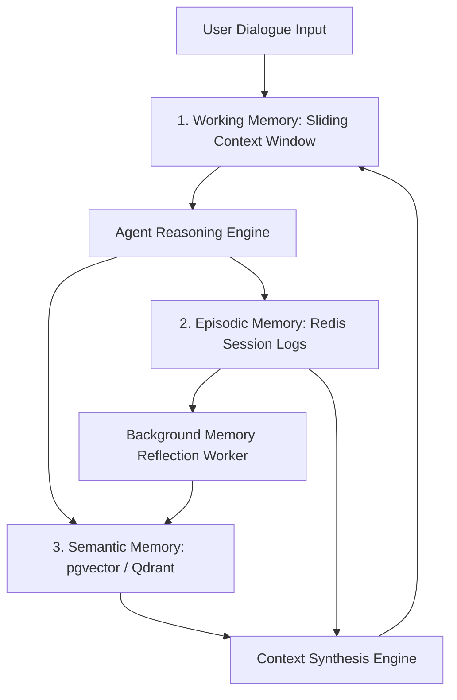

# Part 7 — Agentic Memory Systems: Episodic, Semantic & Working Memory Storage


To act as effective digital partners, enterprise autonomous agents must remember past user decisions, architectural preferences, and historical tool execution results across weeks or months of operation.

Treating every interaction turn as a fresh stateless request leads to frustrating user experiences where the agent continuously re-asks foundational questions.

---

## The Tri-Tier Agentic Memory Architecture

**Answer-first:** Tri-tier memory architecture organizes agent context into short-term working scratchpads, episodic interaction logs, and long-term semantic graphs.

> **Pillar Architecture Guide:** This article is part of the **[Autonomous Hybrid-AI Pipeline: Cron to State-Machine](/posts/architecting-an-autonomous-hybrid-ai-content-pipeline/)** series. Please refer to the original article for a comprehensive overview of the architecture.


```mermaid
graph TD
    UserInput[User Dialogue Input] --> WM["1. Working Memory: Sliding Context Window"]
    WM --> AgentCore[Agent Reasoning Engine]

    AgentCore --> Episodic["2. Episodic Memory: Redis Session Logs"]
    AgentCore --> Semantic["3. Semantic Memory: pgvector / Qdrant"]

    Episodic --> Distiller[Background Memory Reflection Worker]
    Distiller --> Semantic

    Semantic --> Synthesis[Context Synthesis Engine]
    Episodic --> Synthesis
    Synthesis --> WM
```

### Memory Tier Functional Breakdown
1. **Working Memory (Short-Term)**: High-speed, in-memory sliding token buffer maintained in active RAM or Redis. It holds the immediate conversation turns, system prompt guidelines, and active tool observations required for the current task.
2. **Episodic Memory (Sequential Interaction History)**: Persistent event log recording raw user messages, agent thoughts, tool execution responses, and timestamped actions. Stored in Redis Hashes or PostgreSQL JSONB fields indexed by `session_id`.
3. **Semantic Memory (Long-Term Knowledge)**: High-dimensional vector index and knowledge graph storing consolidated facts, user preference profiles, and distilled insights extracted from past episodic interactions over time.

---

## Production Python Memory Manager

**Answer-first:** Production memory managers store conversation sessions in Redis, archive episodic interactions in Qdrant, and update entity relationships in Neo4j.

This production-grade Python memory management system utilizing `Pydantic`, `Redis`, and `pgvector` concepts to manage working memory sliding windows and semantic memory retrieval:

```python
import json
import time
from typing import List, Dict, Any, Optional
from pydantic import BaseModel, Field

class MemoryItem(BaseModel):
    role: str = Field(description="user, assistant, or tool")
    content: str
    timestamp: float = Field(default_factory=time.time)
    metadata: Dict[str, Any] = Field(default_factory=dict)

class UserPreferenceProfile(BaseModel):
    user_id: str
    preferred_language: str = "Go"
    cloud_provider: str = "AWS"
    security_clearance: int = 3
    last_updated: float = Field(default_factory=time.time)

class AgentMemoryManager:
    def __init__(self, user_id: str, session_id: str, max_working_tokens: int = 4000):
        self.user_id = user_id
        self.session_id = session_id
        self.max_working_tokens = max_working_tokens
        # Simulated local working memory buffer
        self.working_memory: List[MemoryItem] = []
        # Simulated profile cache
        self.profile = UserPreferenceProfile(user_id=user_id)

    def add_working_memory(self, role: str, content: str, metadata: Optional[Dict[str, Any]] = None):
        """Appends new message turn to working memory buffer."""
        item = MemoryItem(
            role=role,
            content=content,
            metadata=metadata or {}
        )
        self.working_memory.append(item)
        self._prune_working_memory()

    def _prune_working_memory(self):
        """Sliding window pruning based on estimated token budget."""
        # Simple word-count heuristic: 1 word ~ 1.3 tokens
        total_tokens = sum(len(item.content.split()) * 1.3 for item in self.working_memory)
        while total_tokens > self.max_working_tokens and len(self.working_memory) > 2:
            # Preserve system prompt (index 0), remove oldest conversation turn
            removed = self.working_memory.pop(1)
            total_tokens -= len(removed.content.split()) * 1.3

    def fetch_semantic_memory(self, query: str) -> List[str]:
        """Simulates pgvector top-k semantic memory retrieval for historical preferences."""
        # In production, compute query embedding & search pgvector table
        if "language" in query.lower() or "code" in query.lower():
            return [f"User profile preference: Primary coding language is {self.profile.preferred_language} on {self.profile.cloud_provider}."]
        return []

    def build_synthesized_context(self, user_query: str) -> List[Dict[str, str]]:
        """Synthesizes Working Memory + Semantic Memory into final LLM prompt context."""
        semantic_facts = self.fetch_semantic_memory(user_query)
        
        system_prompt = (
            "You are an enterprise AI assistant. "
            f"User Profile Context: {json.dumps(self.profile.model_dump())}. "
            f"Retrieved Long-Term Memories: {' | '.join(semantic_facts)}"
        )

        messages = [{"role": "system", "content": system_prompt}]
        for item in self.working_memory:
            messages.append({"role": item.role, "content": item.content})

        messages.append({"role": "user", "content": user_query})
        return messages

if __name__ == "__main__":
    mem_mgr = AgentMemoryManager(user_id="usr_9901", session_id="sess_alpha_2026")
    
    mem_mgr.add_working_memory("assistant", "Hello! How can I assist with your infrastructure today?")
    mem_mgr.add_working_memory("user", "We are deploying a new microservice.")

    prompt_messages = mem_mgr.build_synthesized_context("What programming language should we use for this microservice?")
    print(f"Synthesized Prompt Messages Count: {len(prompt_messages)}")
    print(f"System Context: {prompt_messages[0]['content']}")
```

---

## Comparative Matrix: Memory Tier Characteristics

**Answer-first:** Working memory is volatile and fast, episodic memory provides temporal interaction search, and semantic memory retains domain facts permanently.

| Metric / Attribute | Working Memory | Episodic Memory | Semantic Memory |
| :--- | :--- | :--- | :--- |
| **Storage Medium** | RAM / Volatile Buffer | Redis / PostgreSQL | pgvector / Qdrant / Neo4j |
| **Persistence Duration** | Active turn / session | Days to Weeks | Permanent (until revoked) |
| **Lookup Latency** | Sub-1ms | 2ms - 8ms | 15ms - 45ms |
| **Capacity Constraint** | Strict LLM Context Window | High (GBs of raw logs) | Massive (TB Vector Index) |
| **Data Format** | Unstructured Tokens | Timestamped Event Log | Dense Vectors & Graph Triples |

---

## Frequently Asked Questions (FAQ)

### Q1: How does an agentic working memory buffer prevent context overflow during long-running tasks?
Working memory relies on sliding-window token budgets and LLM context truncation strategies. When conversation tokens approach model limits, older turns are pruned or compressed into high-level summaries while retaining the system prompt and core user instructions.

### Q2: What is the role of asynchronous reflection workers in agentic memory consolidation?
Reflection workers run as background tasks that periodically process episodic interaction logs. They extract key facts, user preferences, and entity relationships, updating the long-term semantic vector database and knowledge graph without blocking real-time agent responses.

### Q3: How are GDPR and right-to-be-forgotten requests handled across multi-tier memory systems?
When a user requests data deletion, an automated purge cascade issues explicit key deletes in Redis working session caches, row deletions in PostgreSQL JSONB logs, vector record purges in pgvector/Qdrant, and entity node detachments in Neo4j.

---

## Technical Deep-Dive: Enterprise Memory Systems & Persistence Invariants

**Answer-first:** Persisting agent memory at scale demands automatic summarization of past conversations and graph reconciliation to prevent memory decay.

Enterprise agentic memory architectures require continuous state synchronization and strict memory bounds across multi-tier storage layers.

### Architectural Invariants & Failure-Mode Defenses

1. **Token Budget Sliding Windows**: Prune oldest conversation turns automatically when working memory exceeds token caps.
2. **Asynchronous Reflection Workers**: Distill episodic dialogue logs into structured semantic triples via background jobs to prevent inline user latency.
3. **GDPR Purge Cascades**: Execute cascading deletes across Redis session caches, pgvector tables, and Neo4j graph nodes upon user deletion requests.

---

## Internal Series Navigation

**Answer-first:** Proceed to Part 8 to examine inference optimization with vLLM and PagedAttention.

- [Part 6 — From Passive RAG to Autonomous Agents](/series/ai-data-engineering-pipeline/part-6-rise-of-ai-agents/)
- [Part 8 — Inference Optimization: vLLM & PagedAttention](/series/ai-data-engineering-pipeline/part-8-inference-optimization-vllm/)
- [State Management for Generative UI](/posts/generative-ui-with-mcp-ai-native-frontend/)
- [Part 2 — Agentic Memory Architecture](/posts/architecting-an-autonomous-hybrid-ai-content-pipeline/)
