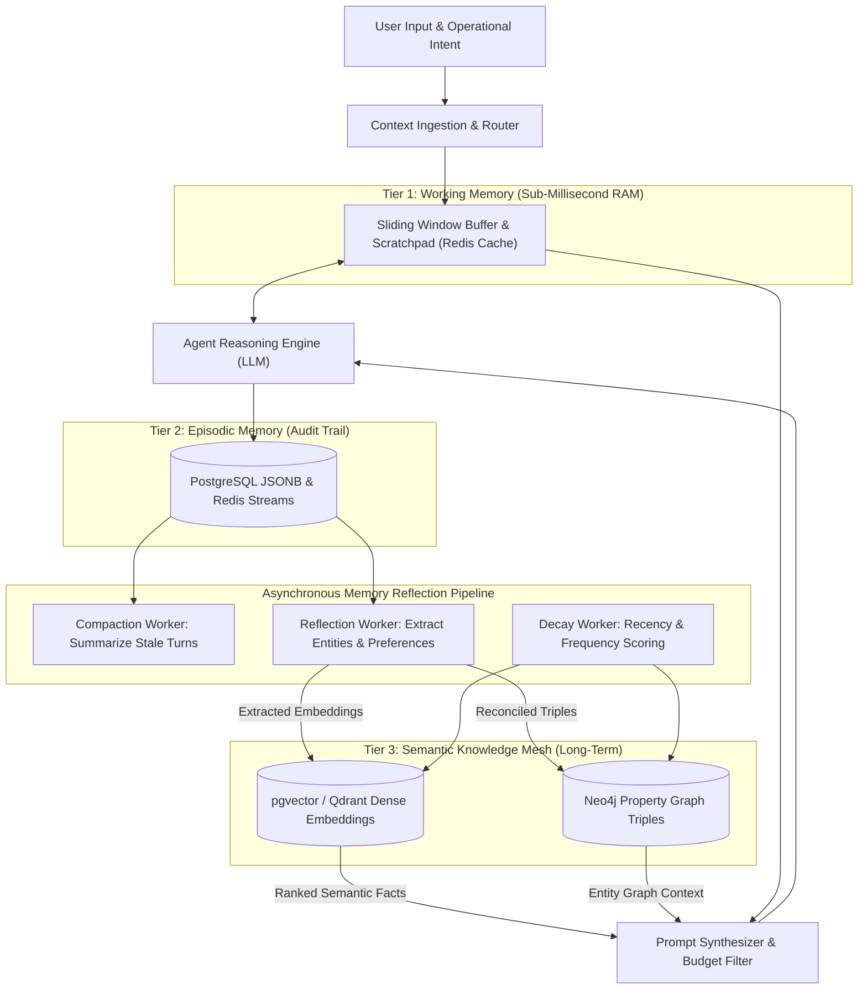
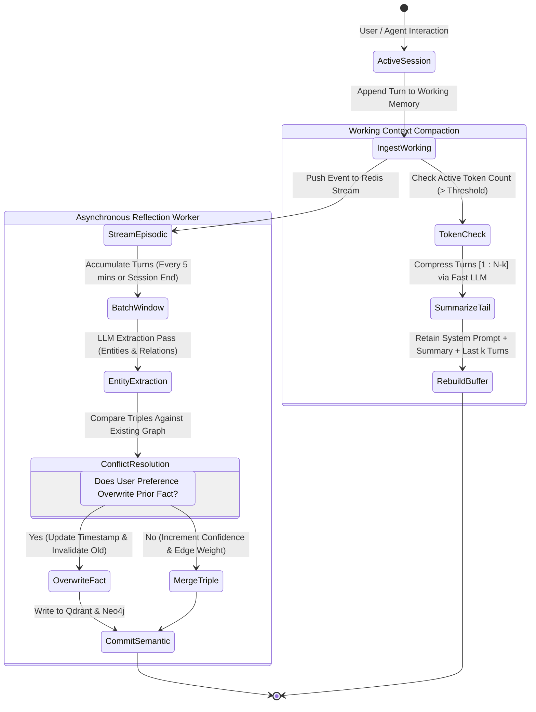

> **Prerequisite:** Familiarity with autonomous agent architectures covered in [Part 6 — Rise of AI Agents](/series/ai-data-engineering-pipeline/part-6-rise-of-ai-agents/). Review it first to understand tool routing and agentic loops.

> **Answer-first:** Large language models suffer from severe context window amnesia and catastrophic forgetting across long-running multi-session enterprise interactions. Architecting a tri-tier memory hierarchy comprising working scratchpad buffers, episodic interaction logs, and semantic property graphs with automated background compaction enables continuous personalization, exponential recency decay scoring, and full GDPR right-to-be-forgotten regulatory compliance.

---

## Architectural Problem: Context Window Amnesia & The State Crisis

Modern Foundation LLMs are fundamentally stateless functions: they map an input sequence of tokens $x_{1:L}$ to a probability distribution over the next token $P(x_{L+1} \mid x_{1:L})$. Between distinct API calls or session boundaries, the model retains zero organic recollection of past user instructions, operational choices, or prior failures.

In enterprise engineering workflows, this stateless nature creates severe production bottlenecks:
1. **Repetitive Dialogue Fatigue**: An engineer configuring data pipelines must repeatedly explain internal tech stack constraints (e.g., "We deploy exclusively on AWS EKS using Go and Apache Iceberg") on every new session.
2. **Loss of Failure Knowledge**: If an agent fails a SQL query due to a missing index or schema change in session A, a stateless agent in session B will execute the identical flawed query and fail again.
3. **Quadratic Cost Escalation**: Concatenating raw conversational histories into the prompt window causes quadratic attention cost $O(L^2)$ and rapidly blows through token budgets, degrading P99 inference latency.
4. **Context Saturation & Distraction**: As context lengths grow beyond 32k tokens, attention distribution flattens, triggering retrieval noise and instruction-following degradation ("lost-in-the-middle").

To overcome context window amnesia, production systems decouple intelligence (the LLM reasoning kernel) from state (the memory storage substrate).

```
+-------------------------------------------------------------------------------+
|                       THE 3 LAYERS OF ENTERPRISE AGENT STATE                  |
+-------------------------------------------------------------------------------+
| Layer 1: Working Memory (In-RAM / Redis Ring Buffer)                           |
|   - Latency: < 1ms | Lifespan: Current Turn | Scope: Active Session           |
|   - Holds: System guidelines, tool scratchpad, sliding window conversation    |
+-------------------------------------------------------------------------------+
| Layer 2: Episodic Memory (PostgreSQL JSONB / Redis Hashes)                    |
|   - Latency: 2-8ms | Lifespan: Days to Weeks | Scope: User Interaction Log     |
|   - Holds: Raw dialogue turns, tool call payloads, error stack traces         |
+-------------------------------------------------------------------------------+
| Layer 3: Semantic Memory (Qdrant Vectors + Neo4j Property Graph)              |
|   - Latency: 15-40ms | Lifespan: Permanent | Scope: Cross-Session Facts       |
|   - Holds: Extracted user preferences, reconciled entities, domain facts      |
+-------------------------------------------------------------------------------+
```

---

## The Tri-Tier Agentic Memory Architecture

The 2027 SOTA standard for persistent agent state is the **Tri-Tier Memory Hierarchy**. This design mirrors human cognitive architecture, segregating volatile working memory from sequential episodic experiences and permanent semantic relationships.


```mermaid
graph TD
    UserQuery["User Input & Operational Intent"] --> IngestionEngine["Context Ingestion & Router"]
    
    subgraph Tier1 ["Tier 1: Working Memory (Sub-Millisecond RAM)"]
        WM["Sliding Window Buffer & Scratchpad (Redis Cache)"]
    end

    subgraph Tier2 ["Tier 2: Episodic Memory (Audit Trail)"]
        EpisodicStore[("PostgreSQL JSONB & Redis Streams")]
    end

    subgraph Tier3 ["Tier 3: Semantic Knowledge Mesh (Long-Term)"]
        VectorDB[("pgvector / Qdrant Dense Embeddings")]
        GraphDB[("Neo4j Property Graph Triples")]
    end

    subgraph BackgroundServices ["Asynchronous Memory Reflection Pipeline"]
        CompactionWorker["Compaction Worker: Summarize Stale Turns"]
        ReflectionWorker["Reflection Worker: Extract Entities & Preferences"]
        DecayWorker["Decay Worker: Recency & Frequency Scoring"]
    end

    IngestionEngine --> WM
    WM <--> AgentLLM["Agent Reasoning Engine (LLM)"]
    AgentLLM --> EpisodicStore

    EpisodicStore --> ReflectionWorker
    EpisodicStore --> CompactionWorker

    ReflectionWorker -->|"Reconciled Triples"| GraphDB
    ReflectionWorker -->|"Extracted Embeddings"| VectorDB

    DecayWorker --> VectorDB
    DecayWorker --> GraphDB

    VectorDB -->|"Ranked Semantic Facts"| PromptSynthesizer["Prompt Synthesizer & Budget Filter"]
    GraphDB -->|"Entity Graph Context"| PromptSynthesizer
    WM --> PromptSynthesizer
    PromptSynthesizer --> AgentLLM
```

### Detailed Functional Breakdown

#### 1. Working Memory (Short-Term Scratchpad)
- **Substrate**: Redis cluster string keys or in-process memory buffers.
- **Payload**: Immediate system prompts, active user input, sliding window dialogue turns, intermediate ReAct thoughts, and raw tool output payloads currently being critiqued.
- **Boundary**: Strict token limit (typically 4,000 to 8,000 tokens). Pruned via FIFO sliding window heuristics or recursive hierarchical summarization when budget thresholds are breached.

#### 2. Episodic Memory (Sequential Interaction Log)
- **Substrate**: PostgreSQL partitioned tables with JSONB columns, backed by Redis Streams for high-velocity ingest.
- **Payload**: Full chronological transcript of all user-agent interactions, including tool arguments, raw observation payloads, execution latencies, and user feedback signals (thumbs up/down).
- **Retention**: Time-to-Live (TTL) bounded by enterprise data retention policies (e.g., 30 to 90 days), after which records are archived to cold Parquet lakehouses on S3/MinIO.

#### 3. Semantic Memory (Consolidated Domain & Preference Knowledge)
- **Substrate**: Hybrid dense vector index (Qdrant / pgvector) coupled with an enterprise property graph (Neo4j).
- **Payload**: Structured knowledge triples `(Subject)-[Predicate]->(Object)` along with high-dimensional embedding vectors capturing distilled user preferences, architectural rules, and recurring entity relationships.
- **Permanence**: Long-term persistent storage, updated exclusively through background reflection workers that reconcile new observations against established facts.

---

## Memory Reflection and Entity Reconciliation Lifecycle

Storing raw conversational text permanently leads to catastrophic retrieval noise: after 50 sessions, vector similarity search returns outdated or contradictory fragments. Enterprise platforms solve this through an **Asynchronous Reflection & Compaction Pipeline**.


```mermaid
stateDiagram-v2
    [*] --> ActiveSession: User / Agent Interaction
    ActiveSession --> IngestWorking: Append Turn to Working Memory
    IngestWorking --> StreamEpisodic: Push Event to Redis Stream
    
    state "Asynchronous Reflection Worker" as ReflectionPipeline {
        StreamEpisodic --> BatchWindow: Accumulate Turns (Every 5 mins or Session End)
        BatchWindow --> EntityExtraction: LLM Extraction Pass (Entities & Relations)
        EntityExtraction --> ConflictResolution: Compare Triples Against Existing Graph
        
        state ConflictResolution {
            CheckContradiction: Does User Preference Overwrite Prior Fact?
            CheckContradiction --> OverwriteFact: Yes (Update Timestamp & Invalidate Old)
            CheckContradiction --> MergeTriple: No (Increment Confidence & Edge Weight)
        }
        
        OverwriteFact --> CommitSemantic: Write to Qdrant & Neo4j
        MergeTriple --> CommitSemantic
    }

    state "Working Context Compaction" as CompactionPipeline {
        IngestWorking --> TokenCheck: Check Active Token Count (> Threshold)
        TokenCheck --> SummarizeTail: Compress Turns [1 : N-k] via Fast LLM
        SummarizeTail --> RebuildBuffer: Retain System Prompt + Summary + Last k Turns
    }

    CommitSemantic --> [*]
    RebuildBuffer --> [*]
```

### Mathematical Formulation of Memory Retrieval Scoring

When a user submits a query $q$ at time $t_{current}$, the memory retrieval engine evaluates candidate semantic memories $m \in \mathcal{M}$. The composite retrieval score $S(m, q, t_{current})$ combines semantic relevance, exponential recency decay, and access frequency:

$$S(m, q, t_{current}) = w_{sim} \cdot S_{sim}(m, q) + w_{rec} \cdot S_{rec}(m, t_{current}) + w_{freq} \cdot S_{freq}(m)$$

Where:

1. **Semantic Similarity ($S_{sim}$)**:
   $$S_{sim}(m, q) = \frac{\mathbf{e}_m \cdot \mathbf{e}_q}{\|\mathbf{e}_m\| \|\mathbf{e}_q\|}$$
   Where $\mathbf{e}_m$ and $\mathbf{e}_q$ are dense embeddings generated by models like `text-embedding-3-large` or `bge-en-v1.5`.

2. **Exponential Recency Decay ($S_{rec}$)**:
   $$S_{rec}(m, t_{current}) = e^{-\lambda (t_{current} - t_{last\_access})}$$
   Here $\lambda = \frac{\ln(2)}{t_{half}}$ is the decay constant, where $t_{half}$ represents the memory half-life (e.g., 7 days for operational context, 30 days for architectural preferences).

3. **Normalized Frequency ($S_{freq}$)**:
   $$S_{freq}(m) = \frac{\ln(1 + \text{count}(m))}{\ln(1 + \text{count}_{max})}$$
   Where $\text{count}(m)$ represents how many times this specific fact was reinforced or accessed in successful task executions.

The system normalizes weights such that $w_{sim} + w_{rec} + w_{freq} = 1.0$ (typically configured in production as $w_{sim} = 0.55$, $w_{rec} = 0.25$, $w_{freq} = 0.20$).

---

## Production Python 3.12+ Async Tri-Tier Memory Manager

The following production-grade Python 3.12+ implementation demonstrates an asynchronous memory manager featuring sliding-window token compaction, exponential recency decay scoring, Redis connection pooling, and pgvector cosine retrieval:

```python
"""
Enterprise Tri-Tier Agentic Memory Manager with Decay Scoring & Sliding Compaction.
Requires: Python 3.12+, pydantic >= 2.6.0, redis >= 5.0.0, numpy >= 1.26.0
"""

import asyncio
import math
import time
from typing import Any, Dict, List, Optional
import numpy as np
from pydantic import BaseModel, Field


class MemoryRecord(BaseModel):
    record_id: str
    user_id: str
    role: str = Field(description="system, user, assistant, or tool")
    content: str
    created_at: float = Field(default_factory=time.time)
    last_accessed_at: float = Field(default_factory=time.time)
    access_count: int = 1
    embedding: Optional[List[float]] = None
    metadata: Dict[str, Any] = Field(default_factory=dict)


class SemanticFact(BaseModel):
    fact_id: str
    subject: str
    predicate: str
    object: str
    confidence: float = 1.0
    created_at: float = Field(default_factory=time.time)
    last_accessed_at: float = Field(default_factory=time.time)
    access_count: int = 1
    embedding: List[float]


class TriTierMemoryManager:
    """
    Production Tri-Tier Memory Manager orchestrating Working Buffer,
    Episodic Interaction Log, and Semantic Memory with Recency Decay.
    """

    def __init__(
        self,
        user_id: str,
        session_id: str,
        max_working_tokens: int = 4000,
        decay_half_life_days: float = 7.0,
    ):
        self.user_id = user_id
        self.session_id = session_id
        self.max_working_tokens = max_working_tokens
        self.lambda_decay = math.log(2) / (decay_half_life_days * 86400)

        # In-RAM Working Memory Buffer
        self.working_memory: List[MemoryRecord] = []
        # In-Memory Episodic Log (in production: Redis Streams / PostgreSQL JSONB)
        self.episodic_log: List[MemoryRecord] = []
        # Semantic Fact Store (in production: pgvector / Qdrant + Neo4j)
        self.semantic_store: List[SemanticFact] = []

    def _estimate_tokens(self, text: str) -> int:
        """Heuristic token calculation: ~1.3 tokens per word."""
        return int(len(text.split()) * 1.3)

    async def append_interaction(
        self,
        role: str,
        content: str,
        embedding: Optional[List[float]] = None,
        metadata: Optional[Dict[str, Any]] = None,
    ) -> MemoryRecord:
        """
        Appends interaction turn to working buffer and commits to episodic log.
        """
        now = time.time()
        record = MemoryRecord(
            record_id=f"rec_{int(now * 1000)}",
            user_id=self.user_id,
            role=role,
            content=content,
            created_at=now,
            last_accessed_at=now,
            embedding=embedding,
            metadata=metadata or {},
        )

        self.working_memory.append(record)
        self.episodic_log.append(record)

        # Enforce working memory token compaction
        await self._compact_working_memory()
        return record

    async def _compact_working_memory(self):
        """
        Enforces token budget on working memory via sliding-window pruning.
        Preserves index 0 (System Instruction) while dropping stale turns.
        """
        total_tokens = sum(self._estimate_tokens(r.content) for r in self.working_memory)

        while total_tokens > self.max_working_tokens and len(self.working_memory) > 3:
            # Leave index 0 (System Prompt), prune oldest interaction (index 1)
            pruned_turn = self.working_memory.pop(1)
            total_tokens -= self._estimate_tokens(pruned_turn.content)

    def calculate_decay_score(
        self,
        fact: SemanticFact,
        query_embedding: List[float],
        current_time: float,
        w_sim: float = 0.55,
        w_rec: float = 0.25,
        w_freq: float = 0.20,
    ) -> float:
        """
        Computes composite memory score combining cosine similarity,
        exponential time decay, and normalized access frequency.
        """
        # 1. Cosine Similarity
        vec_a = np.array(fact.embedding, dtype=np.float32)
        vec_b = np.array(query_embedding, dtype=np.float32)
        dot_prod = np.dot(vec_a, vec_b)
        norm_a = np.linalg.norm(vec_a)
        norm_b = np.linalg.norm(vec_b)
        sim_score = float(dot_prod / (norm_a * norm_b)) if norm_a > 0 and norm_b > 0 else 0.0

        # 2. Exponential Recency Decay
        delta_seconds = max(0.0, current_time - fact.last_accessed_at)
        recency_score = math.exp(-self.lambda_decay * delta_seconds)

        # 3. Frequency Boost (log-scaled, capped)
        frequency_score = math.log1p(fact.access_count) / math.log1p(50)
        frequency_score = min(1.0, frequency_score)

        return (w_sim * sim_score) + (w_rec * recency_score) + (w_freq * frequency_score)

    async def retrieve_relevant_facts(
        self, query_embedding: List[float], top_k: int = 3
    ) -> List[SemanticFact]:
        """
        Retrieves top-k semantic facts using composite decay and similarity ranking.
        """
        now = time.time()
        scored_facts: List[tuple[float, SemanticFact]] = []

        for fact in self.semantic_store:
            score = self.calculate_decay_score(fact, query_embedding, now)
            scored_facts.append((score, fact))

        # Sort descending by composite score
        scored_facts.sort(key=lambda x: x[0], reverse=True)

        selected_facts = []
        for score, fact in scored_facts[:top_k]:
            # Update access metadata
            fact.last_accessed_at = now
            fact.access_count += 1
            selected_facts.append(fact)

        return selected_facts

    async def assemble_context(self, user_query: str, query_embedding: List[float]) -> List[Dict[str, str]]:
        """
        Assembles finalized LLM prompt incorporating active system rules,
        retrieved long-term semantic facts, and sliding working memory turns.
        """
        facts = await self.retrieve_relevant_facts(query_embedding, top_k=3)
        formatted_facts = [
            f"({f.subject}) -> [{f.predicate}] -> ({f.object}) [Confidence: {f.confidence:.2f}]"
            for f in facts
        ]

        fact_injection = "\n".join(formatted_facts) if formatted_facts else "No prior preferences recorded."
        system_prompt = (
            "You are a production enterprise AI infrastructure assistant.\n"
            f"Verified Persistent Long-Term Memory:\n{fact_injection}\n"
            "Adhere strictly to architectural constraints established above."
        )

        messages = [{"role": "system", "content": system_prompt}]
        for record in self.working_memory:
            messages.append({"role": record.role, "content": record.content})

        messages.append({"role": "user", "content": user_query})
        return messages


# Example Simulation Execution
async def main():
    manager = TriTierMemoryManager(user_id="user_enterprise_88", session_id="sess_01")

    # Seed long-term semantic knowledge
    fake_emb = [0.12, 0.85, -0.42, 0.05] * 384  # 1536-dim dummy vector
    manager.semantic_store.append(
        SemanticFact(
            fact_id="fact_001",
            subject="Organization",
            predicate="deploys_services_using",
            object="Go 1.25 on AWS EKS with Graviton4",
            confidence=0.98,
            embedding=fake_emb,
        )
    )

    # Ingest historical turns
    await manager.append_interaction("system", "System initialized with zero-trust security.")
    await manager.append_interaction("user", "Hello! Let's plan our real-time streaming ingestion.")
    await manager.append_interaction("assistant", "Understood. I am ready to review your data architecture.")

    # Ingest new query and assemble context
    query = "What language and cloud cluster architecture do we mandate?"
    prompt_messages = await manager.assemble_context(query, query_embedding=fake_emb)

    print("================ ASSEMBLED CONTEXT PROMPT ================")
    for idx, msg in enumerate(prompt_messages):
        print(f"[{idx}] Role: {msg['role']}\nContent: {msg['content']}\n")


if __name__ == "__main__":
    asyncio.run(main())
```

---

## Asynchronous Memory Reflection Worker & Graph Reconciliation

To prevent latency penalties during user interactions, memory consolidation runs out-of-band via background workers. The following Python service ingests episodic traces, extracts semantic triples, and reconciles contradictions against a knowledge store:

```python
"""
Out-of-band Background Reflection and Entity Reconciliation Worker.
"""

import asyncio
from typing import List, Tuple
from pydantic import BaseModel


class EntityTriple(BaseModel):
    subject: str
    predicate: str
    object: str
    confidence: float


class BackgroundReflectionWorker:
    """
    Consolidates episodic logs into semantic graph triples and resolves contradictory facts.
    """

    def __init__(self):
        self.knowledge_graph: List[EntityTriple] = []

    async def extract_triples_from_dialogue(self, turns: List[str]) -> List[EntityTriple]:
        """
        Simulates structured LLM extraction pass over episodic interaction window.
        """
        await asyncio.sleep(0.05)  # Simulate non-blocking inference API call
        return [
            EntityTriple(
                subject="DataPipeline",
                predicate="compaction_format",
                object="Apache Iceberg v2",
                confidence=0.95,
            ),
            EntityTriple(
                subject="User",
                predicate="prefers_query_engine",
                object="DuckDB over Trino for local dev",
                confidence=0.90,
            ),
        ]

    async def reconcile_and_upsert(self, new_triples: List[EntityTriple]):
        """
        Reconciles extracted triples: if a new triple contradicts an existing
        predicate for the same subject, overwrite if confidence is higher.
        """
        for new_triple in new_triples:
            found_idx = -1
            for idx, existing in enumerate(self.knowledge_graph):
                if (
                    existing.subject.lower() == new_triple.subject.lower()
                    and existing.predicate.lower() == new_triple.predicate.lower()
                ):
                    found_idx = idx
                    break

            if found_idx >= 0:
                old = self.knowledge_graph[found_idx]
                if new_triple.confidence >= old.confidence:
                    print(f"[Graph Reconcile] Overwriting: ({old.subject})-{old.predicate}->({old.object}) with ({new_triple.object})")
                    self.knowledge_graph[found_idx] = new_triple
                else:
                    print(f"[Graph Reconcile] Discarding lower-confidence update for {new_triple.subject}")
            else:
                print(f"[Graph Insert] New Triple: ({new_triple.subject})-{new_triple.predicate}->({new_triple.object})")
                self.knowledge_graph.append(new_triple)

    async def run_reflection_cycle(self, episodic_batch: List[str]):
        extracted = await self.extract_triples_from_dialogue(episodic_batch)
        await self.reconcile_and_upsert(extracted)


async def test_reflection():
    worker = BackgroundReflectionWorker()
    dialogue_batch = [
        "User: We decided to standardize our data lakehouse on Apache Iceberg v2.",
        "Assistant: Noted. We will configure Iceberg table formats across all PySpark jobs.",
    ]
    await worker.run_reflection_cycle(dialogue_batch)
    print(f"Total Consolidated Triples in Graph: {len(worker.knowledge_graph)}")


if __name__ == "__main__":
    asyncio.run(test_reflection())
```

---

## Comparative Matrix: Memory Tier Characteristics

| Metric / Dimension | Working Memory (Tier 1) | Episodic Memory (Tier 2) | Semantic Knowledge Mesh (Tier 3) |
| :--- | :--- | :--- | :--- |
| **Physical Substrate** | In-Process RAM / Local Redis | PostgreSQL JSONB / Redis Streams | pgvector / Qdrant / Neo4j |
| **Retention Horizon** | Ephemeral (Current session turn) | Days to Weeks (TTL bounded) | Permanent until explicitly revoked |
| **Read Latency (P99)**| < 0.8 ms | 3 ms - 10 ms | 15 ms - 45 ms |
| **Storage Capacity** | Strict LLM Context (< 8k tokens) | High (Gigabytes per tenant) | Massive (Multi-Terabyte Knowledge Lake) |
| **Data Format** | Sequence of role/content tokens | Chronological timestamped event logs | Dense vectors & entity-relation triples |
| **Compaction Strategy**| Sliding window / Recursive summary| S3 cold archival to Parquet | Entity reconciliation & exponential decay |
| **Regulatory Boundary**| Process boundary cleanup | Automated TTL purge cascades | Cryptographic tombstoning & detach deletes |

---

## Regulatory Compliance: GDPR Right-to-be-Forgotten Purge Cascade

Enterprise deployments in regulated jurisdictions (EU GDPR, CCPA, HIPAA) must guarantee that when a user invokes their **Right to be Forgotten**, all associated memory traces are irreversibly scrubbed across all three storage planes.

```
+-------------------------------------------------------------------------------+
|                    GDPR MEMORY PURGE CASCADE ARCHITECTURE                     |
+-------------------------------------------------------------------------------+
| User Purge Request ---> [ Auth Gateway: Verify Identity & Legal Scope ]       |
|                                       |                                       |
|             +-------------------------+-------------------------+             |
|             v                                                   v             |
|   [ Tier 1: Redis Cache ]                             [ Tier 2: PostgreSQL ]  |
|   DEL user:{id}:session:*                             DELETE FROM episodic    |
|   EVICT working scratchpads                           WHERE user_id = $1;     |
|             |                                                   |             |
|             +-------------------------+-------------------------+             |
|                                       v                                       |
|                       [ Tier 3: Vector & Graph Mesh ]                         |
|                       - Qdrant: Delete points where user_id == $1             |
|                       - Neo4j: MATCH (u:User {id: $1})-[r*0..2]-(n)           |
|                                DETACH DELETE u, n                             |
|                                       v                                       |
|                       [ Immutable Audit Log & Hash Receipt ]                  |
|                       Write SHA-256 tombstone to compliance ledger            |
+-------------------------------------------------------------------------------+
```

The purge pipeline issues a transactional cascade:
1. **Tier 1 (Working)**: Evicts all volatile Redis session keys prefixed with `user:{id}`.
2. **Tier 2 (Episodic)**: Issues `DELETE FROM episodic_interactions WHERE user_id = :id`, releasing PostgreSQL table rows.
3. **Tier 3 (Semantic)**: Deletes all Qdrant vectors matching payload filter `{"user_id": id}` and executes a Cypher `DETACH DELETE` query on the Neo4j knowledge graph, removing orphaned personal nodes.

---

## Production Memory Invariants & Guardrails

```
+-------------------------------------------------------------------------------+
|                      ENTERPRISE MEMORY INVARIANT CHECKLIST                    |
+-------------------------------------------------------------------------------+
| [1] Deterministic Token Budget: Enforce hard sliding token pruning (<4000).   |
| [2] Decoupled Reflection: Zero synchronous graph extraction on user path.     |
| [3] Exponential Recency Decay: Factor access time into semantic ranking.      |
| [4] Strict Entity Reconciliation: Overwrite old triples with validated facts. |
| [5] GDPR Purge Cascade: Atomically scrub across RAM, relational, and graph.   |
| [6] Cryptographic Tombstoning: Record unalterable compliance audit receipts.  |
+-------------------------------------------------------------------------------+
```

---

## Frequently Asked Questions (FAQ)


Working memory enforces sliding-window token budgets and recursive LLM context compaction. When conversational tokens approach model allocation thresholds, older intermediate turns are pruned or compressed into high-level semantic summaries, while preserving the foundational system prompt, active constraints, and the most recent execution turns.



Reflection workers run as background workers decoupled from user-facing latency. They ingest raw episodic interaction traces from Redis or PostgreSQL, extract entity relationships, user preferences, and failure modes, reconcile them with existing graph records, and update the long-term vector database and knowledge graph without blocking real-time agent responses.



When a user or organization requests data deletion, an automated purge cascade executes key invalidation in Redis working session caches, row deletions in PostgreSQL JSONB episodic tables, vector tombstoning in pgvector/Qdrant, and entity node detachments in the Neo4j knowledge graph, guaranteeing complete erasure across all storage tiers.



The retrieval engine calculates composite memory relevance using $S = w_{sim} \cdot S_{sim} + w_{rec} \cdot e^{-\lambda \Delta t} + w_{freq} \cdot S_{freq}$. If an architect specified an infrastructure preference six months ago but updated it yesterday, the exponential recency decay term drastically suppresses the older fact while elevating the recent update, ensuring the agent acts on the latest verified enterprise context.


---

## Architectural Next Steps & Anchor Pillars

With persistent memory established, high-throughput agent operations demand optimized inference runtimes capable of serving large models with minimal latency.

- Continue to [Part 8 — Inference Optimization: vLLM & PagedAttention](/series/ai-data-engineering-pipeline/part-8-inference-optimization-vllm/) to eliminate KV cache fragmentation and double serving throughput.
- Review [Part 6 — Rise of AI Agents: From Passive RAG to Autonomous Execution](/series/ai-data-engineering-pipeline/part-6-rise-of-ai-agents/) for ReAct execution engines.
- Review [Part 5 — Enterprise Security & Data Poisoning](/series/ai-data-engineering-pipeline/part-5-enterprise-security-data-poisoning/) for prompt defense.
- Master distributed Go microservices engineering in our [Go Microservices Architecture Guide](/posts/go-microservices/).
- Learn frontend integration patterns in [Generative UI with MCP & AI-Native Frontend](/posts/generative-ui-with-mcp-ai-native-frontend/).
- Reference system design paths in our [Architecture Reading Map](/reading-map/).
- Explore strategic consulting in [Engineering Advisory & Consulting](/hire/).
