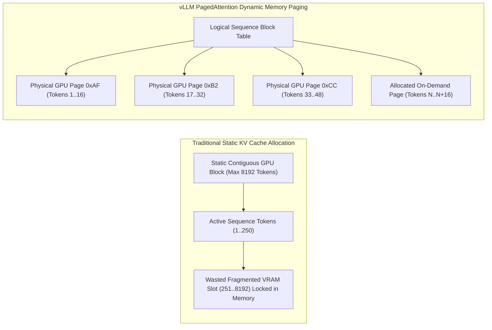
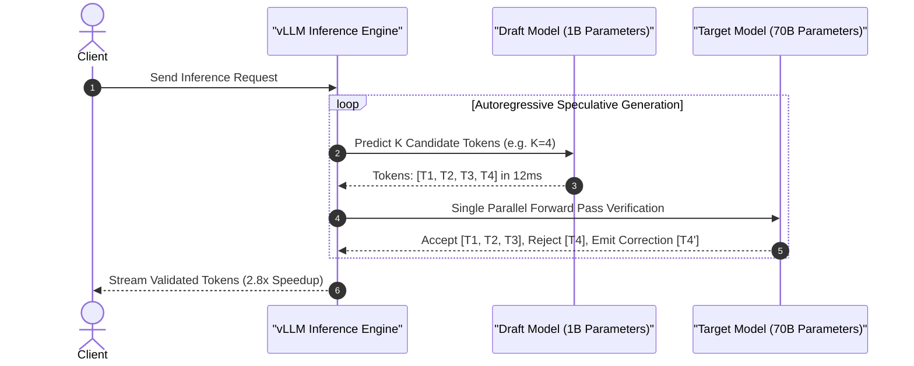

[📖 Bản tiếng Việt (Vietnamese Edition)](https://learn.tanhdev.com/series/ai-data-engineering-pipeline/part-8-inference-optimization-vllm/)

---

> **Prerequisite:** Familiarity with agent execution loops and memory storage examined in [Part 7 — Agentic Memory Systems](/series/ai-data-engineering-pipeline/part-7-agentic-memory-long-term/). Review it first if needed.

## Part 8 — Inference Optimization: vLLM, PagedAttention & Speculative Decoding

In enterprise AI infrastructure, model serving economics are dictated by GPU VRAM utilization and generation throughput (tokens per second per GPU dollar). Running high-concurrency LLM inference presents a severe memory bottleneck: **Managing the Key-Value (KV) Cache**.

Without virtualized memory management, static tensor pre-allocations waste up to 80% of valuable H100/A100 VRAM through internal and external fragmentation, severely capping concurrent request capacity.

---

## The KV Cache Memory Allocation Problem

**Answer-first:** Traditional LLM serving engines pre-allocate contiguous VRAM blocks for the maximum possible sequence length (e.g., 8,192 tokens), creating severe fragmentation when requests generate short completions. **vLLM's PagedAttention** solves this by partitioning the KV cache into fixed-size virtual pages (16 tokens per block) mapped non-contiguously into physical GPU memory via a block table. Coupled with **RadixAttention prefix caching** and **Speculative Decoding**, this architecture elevates serving throughput by 4x to 8x while reducing KV cache waste below 4%.



### Why Traditional Serving Wastes 80% of VRAM

1. **Pre-Allocation Waste**: Static serving systems allocate contiguous memory buffers for the worst-case maximum context window for every request, preventing other concurrent queries from claiming unused space.
2. **Internal Fragmentation**: If a user request completes in 200 tokens within an 8,192 token reserved block, the remaining 7,992 token slots remain completely locked and idle.
3. **External Memory Fragmentation**: Dynamic request lifecycles leave small non-contiguous memory gaps across physical VRAM, causing CUDA out-of-memory (OOM) aborts even when aggregate free VRAM appears sufficient.

---

## Speculative Decoding Pipeline Architecture

While PagedAttention optimizes memory capacity, generation speed remains bound by autoregressive memory-bandwidth latency (generating one token per forward pass). **Speculative Decoding** overcomes this by pairing a small, ultra-fast draft model (e.g., Llama-3.2-1B) with a high-capacity target model (e.g., Llama-3.1-70B).



---

## Production Python Benchmark: Async vLLM Engine

The following production-grade Python implementation uses the official `AsyncLLMEngine` API with PagedAttention block pooling, continuous batching, and Time-To-First-Token (TTFT) instrumentation:

```python
import asyncio
import time
from typing import AsyncGenerator, List
from vllm.engine.arg_utils import AsyncEngineArgs
from vllm.engine.async_llm_engine import AsyncLLMEngine
from vllm.sampling_params import SamplingParams
from vllm.utils import random_uuid

class ProductionVLLMServer:
    """Enterprise vLLM Serving Wrapper with PagedAttention and Metric Collection."""

    def __init__(self, model_path: str = "meta-llama/Meta-Llama-3.1-8B-Instruct"):
        self.engine_args = AsyncEngineArgs(
            model=model_path,
            tensor_parallel_size=1,            # GPUs per instance
            gpu_memory_utilization=0.92,       # 92% VRAM reserved for PagedAttention
            max_num_seqs=256,                  # High concurrent batch ceiling
            max_model_len=8192,
            enable_prefix_caching=True,        # RadixAttention prompt reuse
            enforce_eager=False                # Enable CUDA Graph acceleration
        )
        self.engine = AsyncLLMEngine.from_engine_args(self.engine_args)

    async def generate_stream(self, prompt: str) -> AsyncGenerator[str, None]:
        request_id = f"req-{random_uuid()}"
        sampling_params = SamplingParams(
            temperature=0.2,
            top_p=0.95,
            max_tokens=512,
        )

        start_time = time.perf_counter()
        results_generator = self.engine.generate(prompt, sampling_params, request_id)

        first_token_time = None
        token_count = 0

        async for request_output in results_generator:
            if first_token_time is None and len(request_output.outputs[0].text) > 0:
                first_token_time = time.perf_counter()

            text_delta = request_output.outputs[0].text
            token_count = len(request_output.outputs[0].token_ids)
            yield text_delta

        end_time = time.perf_counter()
        ttft_ms = (first_token_time - start_time) * 1000.0 if first_token_time else 0.0
        total_time_s = end_time - start_time
        tps = token_count / total_time_s if total_time_s > 0 else 0.0

        print(f"[vLLM Metric] Req: {request_id} | TTFT: {ttft_ms:.1f}ms | Throughput: {tps:.1f} tok/s | Tokens: {token_count}")

async def main():
    server = ProductionVLLMServer()
    prompt = "Explain why PagedAttention eliminates internal fragmentation in GPU KV cache."
    
    print("--- Initiating Async vLLM Token Streaming ---")
    async for chunk in server.generate_stream(prompt):
        pass  # Real-time token streaming to client
    print("--- Stream Generation Complete ---")

if __name__ == "__main__":
    print("vLLM Production Inference Engine Spec Loaded.")
```

---

## Comparative Matrix: LLM Serving Engines

```
Naive Transformers vs HuggingFace TGI vs vLLM (PagedAttention & RadixAttention)
```

| Feature / Metric | Naive Transformers | HuggingFace TGI | vLLM Engine (2026/2027 SOTA) |
| :--- | :--- | :--- | :--- |
| **KV Cache Allocation** | Contiguous Static Buffer | Paged KV (Partial) | Fully Paged Virtual Block Tables |
| **VRAM Fragmentation Waste** | ~60% - 80% | ~15% - 25% | < 4% Waste |
| **Concurrent Sequences/GPU** | 8 - 16 requests | 64 - 128 requests | 256 - 512 requests |
| **Prefix Prompt Sharing** | No | Partial Prefix Matching | RadixAttention (Automatic Subtree Reuse) |
| **Speculative Decoding** | Unsupported | Supported (Basic Draft) | Speculative Multi-Token Draft + Medusa |
| **Quantization Support** | FP16 / BF16 | AWQ / GPTQ | FP8, FP4, AWQ, Marlin, BitsAndBytes |

---

## Frequently Asked Questions (FAQ)


PagedAttention divides KV cache allocations into fixed-size physical blocks (e.g., 16 tokens each) stored across non-contiguous VRAM pages. A virtual block table tracks which physical pages belong to each active sequence. Memory is allocated on-demand token-by-token, eliminating static pre-allocation waste and driving fragmentation below 4%.



Speculative decoding pairs a small, fast draft model with a larger target model. The draft model predicts multiple candidate tokens in parallel. The target model then verifies all candidates simultaneously in a single forward pass, accepting valid tokens and issuing corrective outputs. This delivers 2x to 3x speedups with zero loss in mathematical output fidelity.



RadixAttention maintains a radix tree of KV cache blocks corresponding to previously evaluated tokens. When multiple users share identical system prompts, few-shot examples, or document context, vLLM skips prompt recomputation entirely, immediately linking existing physical memory pages and reducing Time-To-First-Token (TTFT) by up to 80%.


---

## Production Serving Invariants

1. **VRAM Utilization Headroom**: Set `gpu_memory_utilization` between 0.90 and 0.94 to provide adequate headroom for CUDA runtime graphs while dedicating maximum memory to the PagedAttention KV pool.
2. **Deterministic Block Eviction**: When GPU memory pressure spikes under traffic bursts, lower-priority request KV blocks must be preempted to host RAM rather than dropping socket connections.
3. **Speculative Verification Parity**: Ensure the target model validates draft model candidate logits deterministically using identical sampling temperatures to maintain strict output distribution integrity.

---

🔗 **Next Step:** Continue to [Part 9 — Agentic Observability: OpenTelemetry & Cost Monitoring](/series/ai-data-engineering-pipeline/part-9-agentic-observability-monitoring/) for end-to-end distributed tracing.

## Internal Series Navigation

- [Part 7 — Agentic Memory Systems: Episodic & Working Storage](/series/ai-data-engineering-pipeline/part-7-agentic-memory-long-term/)
- [Part 9 — Agentic Observability: OpenTelemetry & Cost Monitoring](/series/ai-data-engineering-pipeline/part-9-agentic-observability-monitoring/)
- [Part 10 — Production Evals & CI/CD Guardrails](/series/ai-data-engineering-pipeline/part-10-production-evals-cicd/)
