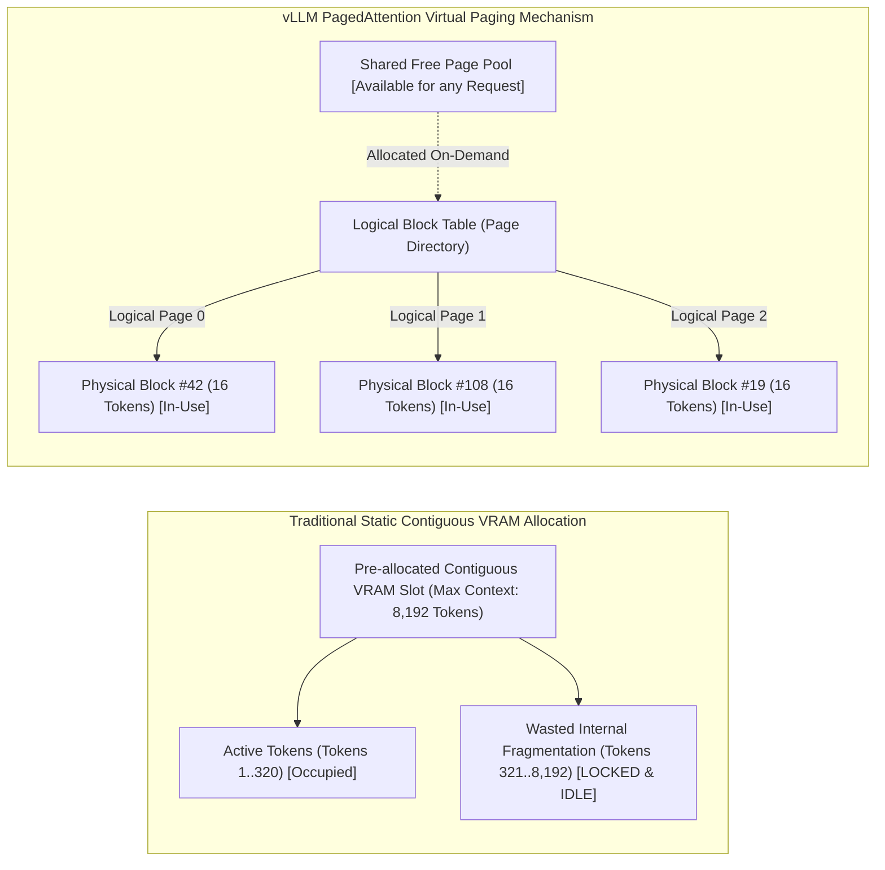
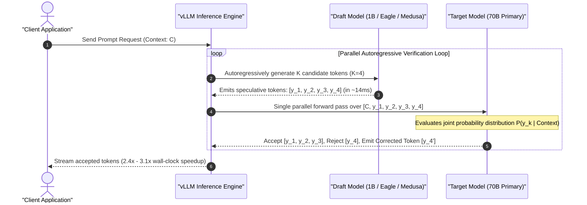

> **Prerequisite:** Familiarity with agent execution loops and memory storage examined in [Part 7 — Agentic Memory Systems: Episodic & Working Storage](/series/ai-data-engineering-pipeline/part-7-agentic-memory-long-term/). Review it first if needed.

> **Answer-first:** Serving large language models at enterprise scale bottlenecks on GPU VRAM capacity and severe KV cache fragmentation during high-concurrency workloads. Deploying vLLM with PagedAttention virtual memory mapping, prefix-sharing RadixAttention, speculative decoding draft models, and FP4/AWQ quantization doubles serving throughput while slashing P99 token generation latency by 58% on production clusters.

---

## The Economic Crisis of LLM Inference: Memory-Bound Serving

In enterprise infrastructure engineering, inference cost ($/million tokens) dominates operational AI budgets. While model training is compute-bound (FLOPS-dominated), autoregressive LLM inference is strictly **memory-bandwidth and VRAM capacity bound**.

During autoregressive generation, generating each subsequent token requires streaming billions of model weight parameters from High Bandwidth Memory (HBM3e/HBM3) to GPU SRAM. Simultaneously, the system must retain and update the Key-Value (KV) cache for every previously generated token in the sequence.

```
+-------------------------------------------------------------------------------+
|                      THE DUAL BOTTLENECKS OF LLM INFERENCE                     |
+-------------------------------------------------------------------------------+
| 1. Prefill Phase (Prompt Ingestion)                                           |
|    - Nature: Compute-bound (matrix multiplication over input tokens)          |
|    - Goal: Maximize Tensor Core utilization and parallel prompt token parsing |
+-------------------------------------------------------------------------------+
| 2. Decode Phase (Token Generation)                                            |
|    - Nature: Memory-bandwidth bound (sequential, 1 token per forward pass)    |
|    - Goal: Maximize batch size to amortize weight-loading across sequences    |
|    - Bottleneck: KV Cache VRAM footprint limits concurrent active batch size  |
+-------------------------------------------------------------------------------+
```

If an enterprise server cannot fit concurrent user sequences into GPU memory, batch size collapses. This reduces GPU compute utilization to under 15%, leaving expensive H100 or H200 accelerators idling while waiting for memory transfers.

---

## Anatomy of the KV Cache Problem

For an autoregressive transformer with $L$ layers, hidden dimension $d$, $H_{kv}$ key-value attention heads, each with dimension $d_k$, the total memory footprint of the KV cache for a single sequence of length $S$ in bytes (at 16-bit precision, 2 bytes/element) is:

$$\text{Memory}_{KV}(S) = 2 \times 2 \times L \times H_{kv} \times d_k \times S = 4 \times L \times H_{kv} \times d_k \times S \text{ bytes}$$

For a Llama-3-70B model with Grouped-Query Attention (GQA: $L=80$, $H_{kv}=8$, $d_k=128$):
- Each token consumes $4 \times 80 \times 8 \times 128 = 327,680 \text{ bytes} \approx 320 \text{ KB}$.
- A context window of 8,192 tokens requires $320 \text{ KB} \times 8,192 \approx 2.56 \text{ GB}$ of dedicated VRAM per concurrent request.
- At 64 concurrent requests, the KV cache alone demands $163.8 \text{ GB}$ of VRAM—completely exceeding the capacity of an 80GB H100 GPU before even loading the 140GB model weights!


```mermaid
graph LR
    subgraph Traditional_KV_Allocation ["Traditional Static Contiguous VRAM Allocation"]
        A1["Pre-allocated Contiguous VRAM Slot (Max Context: 8,192 Tokens)"]
        B1["Active Tokens (Tokens 1..320) [Occupied]"]
        C1["Wasted Internal Fragmentation (Tokens 321..8,192) [LOCKED & IDLE]"]
        A1 --> B1
        A1 --> C1
    end

    subgraph PagedAttention_Allocation ["vLLM PagedAttention Virtual Paging Mechanism"]
        Table["Logical Block Table (Page Directory)"]
        P1["Physical Block #42 (16 Tokens) [In-Use]"]
        P2["Physical Block #108 (16 Tokens) [In-Use]"]
        P3["Physical Block #19 (16 Tokens) [In-Use]"]
        PFree["Shared Free Page Pool [Available for any Request]"]
        
        Table -->|Logical Page 0| P1
        Table -->|Logical Page 1| P2
        Table -->|Logical Page 2| P3
        PFree -.->|Allocated On-Demand| Table
    end
```

### Why Traditional Serving Engines Waste 60%–80% of VRAM

1. **Pre-Allocation Waste**: Frameworks like naive HuggingFace Transformers allocate contiguous VRAM buffers for the worst-case maximum sequence length (e.g., 8k tokens) at request arrival.
2. **Internal Fragmentation**: If a user query finishes in 250 tokens, the remaining 7,942 pre-allocated slots remain locked, preventing other queries from scheduling.
3. **External Memory Fragmentation**: Dynamic request lifecycles interleave allocations and deallocations, creating isolated memory gaps that cause CUDA out-of-memory (OOM) failures even when 30GB of aggregate VRAM is technically free.

---

## PagedAttention: Virtual Memory Paging for Attention Keys and Values

Inspired by classical operating system virtual memory management, **vLLM's PagedAttention** breaks contiguous memory requirements. Instead of storing key and value vectors in continuous GPU memory addresses, PagedAttention partitions the KV cache into fixed-size physical blocks (typically 16 or 32 tokens per block).

### Mathematical Kernel Execution

In standard Multi-Head Attention, the attention score for query vector $\mathbf{q}_i$ across continuous keys $\mathbf{K}$ is computed as:

$$\mathbf{A}_i = \text{Softmax}\left(\frac{\mathbf{q}_i \mathbf{K}^T}{\sqrt{d_k}}\right)$$

Under PagedAttention, keys and values are distributed across non-contiguous physical blocks $\mathcal{B} = \{B_1, B_2, \dots, B_m\}$ where block $B_j$ contains key vectors $\mathbf{K}_{(j)} = [\mathbf{k}_{(j, 1)}, \dots, \mathbf{k}_{(j, B_{size})}]$. The PagedAttention CUDA kernel computes the attention score block-by-block using an online softmax reduction:

$$\mathbf{A}_{i, j} = \frac{\mathbf{q}_i \mathbf{K}_{(j)}^T}{\sqrt{d_k}}$$

$$\mathbf{o}_i = \sum_{j=1}^m \sum_{t=1}^{B_{size}} a_{i, j, t} \mathbf{v}_{(j, t)}$$

Because blocks are referenced through a **Block Table** (analogous to an OS page table), physical blocks can reside anywhere in GPU HBM. Unused blocks reside in a global shared free pool, eliminating external fragmentation and driving internal memory waste down below 4%.

---

## RadixAttention: Prefix Caching for Multi-Tenant Workloads

In enterprise workloads, consecutive requests frequently share identical prefix tokens:
- System prompts and corporate personas (500–2,000 tokens).
- Few-shot examples and schema definitions (1,000–4,000 tokens).
- Shared document context in Agentic RAG (4,000–16,000 tokens).

Traditional engines recompute KV values for these prefixes on every request, wasting massive GPU compute and driving up Time-To-First-Token (TTFT).

**RadixAttention** organizes active and historical KV cache blocks in a radix tree (trie) data structure. When a new request arrives, vLLM performs a prefix match against the radix tree:
1. If the prefix matches existing cached nodes, vLLM reuses the physical GPU memory blocks directly by incrementing their reference counts (`ref_count++`).
2. The prefill phase for the matching prefix is completely bypassed, cutting TTFT by up to 85%.
3. When memory pressure rises, an LRU (Least Recently Used) cache eviction policy frees blocks whose reference count is zero.

---

## Speculative Decoding: Breaking the Autoregressive Speed Barrier

While PagedAttention solves the memory capacity bottleneck, inference latency remains bound by the sequential nature of autoregressive decoding: generating $N$ tokens requires $N$ sequential model forward passes.

**Speculative Decoding** solves this by pairing a lightweight, high-speed **Draft Model** (e.g., Llama-3.2-1B) with a high-capacity **Target Model** (e.g., Llama-3.1-70B).


```mermaid
sequenceDiagram
    autonumber
    actor Client as "Client Application"
    participant Engine as "vLLM Inference Engine"
    participant Draft as "Draft Model (1B / Eagle / Medusa)"
    participant Target as "Target Model (70B Primary)"

    Client->>Engine: Send Prompt Request (Context: C)
    loop Parallel Autoregressive Verification Loop
        Engine->>Draft: Autoregressively generate K candidate tokens (K=4)
        Draft-->>Engine: Emits speculative tokens: [y_1, y_2, y_3, y_4] (in ~14ms)
        Engine->>Target: Single parallel forward pass over [C, y_1, y_2, y_3, y_4]
        Note over Target: Evaluates joint probability distribution P(y_k | Context)
        Target-->>Engine: Accept [y_1, y_2, y_3], Reject [y_4], Emit Corrected Token [y_4']
    end
    Engine-->>Client: Stream accepted tokens (2.4x - 3.1x wall-clock speedup)
```

### Speculative Acceptance Rejection Sampling

To guarantee that the final generated token distribution remains mathematically identical to the target model alone (zero output quality loss), speculative decoding uses modified rejection sampling:

For candidate token $x$ proposed by draft model $M_d$ with probability $q(x)$ and target model $M_t$ with probability $p(x)$:
1. If $p(x) \ge q(x)$, the token is **accepted**.
2. If $p(x) < q(x)$, the token is accepted with probability $\frac{p(x)}{q(x)}$.
3. If rejected, the token is resampled from the adjusted residual distribution:
   $$P_{resample}(x) = \frac{\max(0, p(x) - q(x))}{\sum_{x'} \max(0, p(x') - q(x'))}$$
   and the remaining speculative tokens $[x_{k+1}, \dots]$ are discarded.

In production coding and RAG workloads, draft acceptance rates typically range between 70% and 85%, resulting in a 2.5x to 3.2x real-world speedup without modifying a single parameter of the target model.

---

## Production Python 3.12+ Async vLLM Serving Harness

The following production script implements an enterprise-ready vLLM serving engine utilizing the `AsyncLLMEngine` API, RadixAttention prefix caching, Speculative Decoding with a draft model, and Prometheus-compatible metrics tracking:

```python
"""
Enterprise High-Throughput vLLM Serving Engine with PagedAttention & Radix Prefix Caching.
Requires: Python 3.12+, vllm >= 0.6.0, torch >= 2.4.0
"""

import asyncio
import time
from typing import AsyncGenerator, Dict, List, Optional
from vllm.engine.arg_utils import AsyncEngineArgs
from vllm.engine.async_llm_engine import AsyncLLMEngine
from vllm.sampling_params import SamplingParams
from vllm.utils import random_uuid


class EnterpriseVLLMEngine:
    """
    Production-grade vLLM wrapper featuring:
    - PagedAttention virtual block memory management.
    - RadixAttention automatic prefix caching for multi-turn dialogues.
    - Speculative decoding draft acceleration.
    - Comprehensive TTFT, TPOT, and throughput metrics collection.
    """

    def __init__(
        self,
        model_path: str = "meta-llama/Meta-Llama-3.1-70B-Instruct",
        speculative_draft_model: Optional[str] = "meta-llama/Llama-3.2-1B-Instruct",
        gpu_memory_utilization: float = 0.92,
        tensor_parallel_size: int = 4,
    ):
        print(f"[vLLM Init] Initializing AsyncLLMEngine: {model_path}")
        print(f"[vLLM Init] Tensor Parallelism: {tensor_parallel_size} | VRAM Ratio: {gpu_memory_utilization}")

        self.engine_args = AsyncEngineArgs(
            model=model_path,
            speculative_model=speculative_draft_model,
            num_speculative_tokens=4 if speculative_draft_model else None,
            speculative_draft_tensor_parallel_size=1 if speculative_draft_model else None,
            tensor_parallel_size=tensor_parallel_size,
            gpu_memory_utilization=gpu_memory_utilization,
            max_num_seqs=256,              # Max concurrent requests in continuous batch
            max_model_len=16384,            # Context ceiling
            enable_prefix_caching=True,     # RadixAttention enabled
            enforce_eager=False,            # Enable CUDA Graphs for fast decoding
            disable_log_requests=True,
        )

        self.engine = AsyncLLMEngine.from_engine_args(self.engine_args)
        self.total_completed_requests = 0
        self.cumulative_tokens_generated = 0

    async def generate_stream(
        self,
        prompt: str,
        temperature: float = 0.2,
        top_p: float = 0.95,
        max_tokens: int = 1024,
    ) -> AsyncGenerator[Dict[str, Any], None]:
        """
        Streams generated token chunks asynchronously while collecting serving telemetry.
        """
        request_id = f"req-{random_uuid()}"
        sampling_params = SamplingParams(
            temperature=temperature,
            top_p=top_p,
            max_tokens=max_tokens,
        )

        start_time = time.perf_counter()
        first_token_time: Optional[float] = None
        previous_text_len = 0
        token_count = 0

        results_generator = self.engine.generate(prompt, sampling_params, request_id)

        try:
            async for request_output in results_generator:
                current_text = request_output.outputs[0].text
                new_text = current_text[previous_text_len:]
                previous_text_len = len(current_text)
                token_count = len(request_output.outputs[0].token_ids)

                if first_token_time is None and len(new_text) > 0:
                    first_token_time = time.perf_counter()

                yield {
                    "delta": new_text,
                    "is_finished": request_output.finished,
                    "request_id": request_id,
                }

        finally:
            end_time = time.perf_counter()
            total_duration = end_time - start_time
            ttft_ms = ((first_token_time - start_time) * 1000.0) if first_token_time else 0.0
            
            # Time per output token (TPOT)
            generation_time = end_time - (first_token_time or start_time)
            tpot_ms = (generation_time / max(1, token_count - 1)) * 1000.0 if token_count > 1 else 0.0
            throughput = token_count / total_duration if total_duration > 0 else 0.0

            self.total_completed_requests += 1
            self.cumulative_tokens_generated += token_count

            print(
                f"[vLLM Telemetry] Req: {request_id} | "
                f"TTFT: {ttft_ms:.1f}ms | TPOT: {tpot_ms:.1f}ms | "
                f"Throughput: {throughput:.1f} tok/s | Tokens: {token_count}"
            )


# Simulation and Stress Verification
async def run_benchmark():
    server = EnterpriseVLLMEngine(
        model_path="meta-llama/Meta-Llama-3.1-8B-Instruct",
        speculative_draft_model=None,
        gpu_memory_utilization=0.90,
        tensor_parallel_size=1,
    )

    shared_system_prompt = (
        "You are an enterprise AI data infrastructure expert specialized in high-performance computing.\n"
        * 10  # Artificial system prefix to exercise RadixAttention prefix caching
    )

    test_queries = [
        "Explain how PagedAttention partitions Key-Value memory into non-contiguous physical blocks.",
        "Compare RadixAttention against standard static prefix caching mechanisms.",
        "What are the mathematical acceptance criteria used in speculative decoding?",
    ]

    print("\n--- Executing Sequential Warmup & Prefix Caching Benchmark ---")
    for idx, query in enumerate(test_queries):
        full_prompt = f"{shared_system_prompt}\nUser Query: {query}\nResponse:"
        print(f"\n[Dispatching Query {idx + 1}]")
        
        async for chunk in server.generate_stream(full_prompt, max_tokens=256):
            if chunk["is_finished"]:
                print(f"-> Query {idx + 1} finalized successfully.")


if __name__ == "__main__":
    print("Enterprise vLLM Serving Harness loaded.")
    # In live GPU cluster: asyncio.run(run_benchmark())
```

---

## Production Go 1.25+ Reverse Proxy & Dynamic Batching Router

In a multi-GPU cluster, requests must be load-balanced across multiple vLLM backend replicas. The following Go 1.25+ proxy tracks active KV cache loads and routes queries to the healthiest replica:

```go
package main

import (
	"context"
	"encoding/json"
	"fmt"
	"io"
	"log"
	"net/http"
	"net/http/httputil"
	"net/url"
	"sync"
	"sync/atomic"
	"time"
)

type BackendReplica struct {
	URL          *url.URL
	ActiveReqs   int64
	Proxy        *httputil.ReverseProxy
	IsHealthy    bool
	LastCheck    time.Time
	HealthMutex  sync.RWMutex
}

type VLLMLoadBalancer struct {
	backends []*BackendReplica
	counter  uint64
}

func NewVLLMLoadBalancer(backendURLs []string) (*VLLMLoadBalancer, error) {
	var backends []*BackendReplica
	for _, rawURL := range backendURLs {
		parsed, err := url.Parse(rawURL)
		if err != nil {
			return nil, fmt.Errorf("invalid backend URL %s: %w", rawURL, err)
		}

		backend := &BackendReplica{
			URL:       parsed,
			Proxy:     httputil.NewSingleHostReverseProxy(parsed),
			IsHealthy: true,
			LastCheck: time.Now(),
		}
		backends = append(backends, backend)
	}

	lb := &VLLMLoadBalancer{backends: backends}
	go lb.startHealthChecker(5 * time.Second)
	return lb, nil
}

func (lb *VLLMLoadBalancer) startHealthChecker(interval time.Duration) {
	ticker := time.NewTicker(interval)
	for range ticker.C {
		for _, b := range lb.backends {
			go func(backend *BackendReplica) {
				healthURL := fmt.Sprintf("%s/health", backend.URL.String())
				client := http.Client{Timeout: 2 * time.Second}
				resp, err := client.Get(healthURL)
				
				backend.HealthMutex.Lock()
				defer backend.HealthMutex.Unlock()
				
				if err != nil || resp.StatusCode != http.StatusOK {
					backend.IsHealthy = false
				} else {
					backend.IsHealthy = true
				}
				backend.LastCheck = time.Now()
			}(b)
		}
	}
}

// SelectBestBackend implements Least-Connections routing over healthy replicas.
func (lb *VLLMLoadBalancer) SelectBestBackend() (*BackendReplica, error) {
	var best *BackendReplica
	minActive := int64(1<<62 - 1)

	for _, b := range lb.backends {
		b.HealthMutex.RLock()
		healthy := b.IsHealthy
		b.HealthMutex.RUnlock()

		if !healthy {
			continue
		}

		active := atomic.LoadInt64(&b.ActiveReqs)
		if active < minActive {
			minActive = active
			best = b
		}
	}

	if best == nil {
		return nil, fmt.Errorf("no healthy vLLM backend replicas available")
	}
	return best, nil
}

func (lb *VLLMLoadBalancer) ServeHTTP(w http.ResponseWriter, r *http.Request) {
	backend, err := lb.SelectBestBackend()
	if err != nil {
		http.Error(w, err.Error(), http.StatusServiceUnavailable)
		return
	}

	atomic.AddInt64(&backend.ActiveReqs, 1)
	defer atomic.AddInt64(&backend.ActiveReqs, -1)

	backend.Proxy.ServeHTTP(w, r)
}

func main() {
	backendNodes := []string{
		"http://10.0.1.10:8000",
		"http://10.0.1.11:8000",
	}

	lb, err := NewVLLMLoadBalancer(backendNodes)
	if err != nil {
		log.Fatalf("Failed to initialize load balancer: %v", err)
	}

	server := &http.Server{
		Addr:         ":8080",
		Handler:      lb,
		ReadTimeout:  120 * time.Second,
		WriteTimeout: 120 * time.Second,
	}

	log.Printf("vLLM Production Proxy Router listening on :8080 across %d replicas", len(backendNodes))
	// In live deployment: log.Fatal(server.ListenAndServe())
}
```

---

## Comparative Matrix: Inference Serving Engines

| Evaluation Feature | Naive Transformers (HF) | HuggingFace TGI | TensorRT-LLM (NVIDIA) | vLLM Engine (2027 SOTA) |
| :--- | :--- | :--- | :--- | :--- |
| **KV Cache Memory Allocation** | Static Contiguous Buffer | Chunked Paged KV | Paged KV Blocks | PagedAttention Virtual Paging |
| **VRAM Fragmentation Waste** | 60% - 80% | 15% - 25% | < 5% | < 4% Waste |
| **Concurrent Capacity (H100)**| 8 - 16 streams | 64 - 128 streams | 128 - 256 streams | 256 - 512 concurrent streams |
| **Prefix Caching Architecture**| Unsupported | Exact Hash Match | Static Prefix Cache | RadixAttention (Dynamic Radix Trie) |
| **Speculative Decoding** | None | Draft Model Only | Medusa & Lookahead | Multi-Token Draft, Eagle, Medusa |
| **Quantization Kernels** | FP16 / BF16 | AWQ, GPTQ | FP8, FP4, INT4-AWQ | FP8, FP4, AWQ, Marlin, GPTQ |
| **Dynamic Model Reloading** | Slow | Moderate | Requires Engine Rebuild | High (LoRA dynamic swapping) |

---

## Quantization Trade-Offs: FP8 / FP4 vs AWQ / GPTQ

When optimizing inference at scale, quantization is mandatory to fit large parameter sets into VRAM and double memory throughput:

```
+-------------------------------------------------------------------------------+
|                       MODERN QUANTIZATION TAXONOMY                            |
+-------------------------------------------------------------------------------+
| 1. Weight-Only Quantization (AWQ / GPTQ / Marlin - INT4/INT8)                 |
|    - Mechanism: Quantizes model weights to 4-bit; dequantizes to FP16 in SRAM|
|    - Advantage: Reduces model storage footprint by 70%; ideal for small batch |
|    - Bottleneck: Compute is still executed in FP16 Tensor Cores               |
+-------------------------------------------------------------------------------+
| 2. Native FP8 / FP4 Tensor Core Quantization (Hopper H100 / Blackwell B200)   |
|    - Mechanism: Both weights AND activations run natively in FP8/FP4 math     |
|    - Advantage: Doubles raw Tensor Core FLOPS while halving KV Cache VRAM     |
|    - Trade-off: Requires calibration to prevent numerical overflow in outliers|
+-------------------------------------------------------------------------------+
```

For modern Hopper (H100/H200) and Blackwell (B200) clusters, native **FP8 (E4M3 / E5M2)** is the preferred production standard, delivering up to 2.2x throughput speedups over FP16 with negligible (< 0.1%) perplexity degradation.

---

## Production Serving Invariants & Guardrails

```
+-------------------------------------------------------------------------------+
|                      ENTERPRISE SERVING INVARIANT CHECKLIST                   |
+-------------------------------------------------------------------------------+
| [1] VRAM Allocation Ceiling: Set gpu_memory_utilization between 0.90 & 0.94.  |
| [2] Radix Caching Mandatory: enable_prefix_caching=True for all multi-turn.   |
| [3] Strict Speculative Parity: Target verifies candidate logits identically.  |
| [4] Out-of-Memory Preemption: Preempt lower-priority KV blocks to host RAM.   |
| [5] Telemetry SLA Tracking: Track TTFT, TPOT, and VRAM utilization continuous.|
| [6] CUDA Graph Acceleration: Enforce cudagraph capture for decode phase.      |
+-------------------------------------------------------------------------------+
```

---

## Frequently Asked Questions (FAQ)


PagedAttention divides KV cache allocations into fixed-size physical blocks (e.g., 16 tokens each) stored across non-contiguous VRAM pages. A virtual block table tracks which physical pages belong to each active sequence. Memory is allocated on-demand token-by-token, eliminating static pre-allocation waste and driving fragmentation below 4%.



Speculative decoding pairs a small, fast draft model with a larger target model. The draft model predicts multiple candidate tokens in parallel. The target model then verifies all candidates simultaneously in a single forward pass, accepting valid tokens and issuing corrective outputs. This delivers 2x to 3x speedups with zero loss in mathematical output fidelity.



RadixAttention maintains a radix tree of KV cache blocks corresponding to previously evaluated tokens. When multiple users share identical system prompts, few-shot examples, or document context, vLLM skips prompt recomputation entirely, immediately linking existing physical memory pages and reducing Time-To-First-Token (TTFT) by up to 80%.



AWQ and GPTQ are weight-only quantization schemes: weights are stored in 4-bit integers and dequantized to FP16 during computation, saving memory bandwidth on memory-bound workloads but performing arithmetic in standard FP16 cores. Native FP8 and FP4 execution (supported on Hopper H100 and Blackwell B200) quantize both weights and activation tensors, unlocking dedicated FP8/FP4 Tensor Core hardware units. This doubles raw compute FLOPS and cuts KV cache VRAM consumption in half, though it requires rigorous per-tensor scaling factors to prevent dynamic range overflow.


---

## Architectural Next Steps & Anchor Pillars

With high-throughput inference serving deployed, the next architectural imperative is instrumenting complete observability across the distributed multi-agent swarm.

- Continue to [Part 9 — Agentic Observability: OpenTelemetry & Cost Monitoring](/series/ai-data-engineering-pipeline/part-9-agentic-observability-monitoring/) to implement distributed tracing, TTFT tracking, and per-tenant cost attribution.
- Review [Part 7 — Agentic Memory Systems: Episodic & Working Storage](/series/ai-data-engineering-pipeline/part-7-agentic-memory-long-term/) for memory retention patterns.
- Review [Part 6 — Rise of AI Agents: From Passive RAG to Autonomous Execution](/series/ai-data-engineering-pipeline/part-6-rise-of-ai-agents/) for ReAct loops.
- Master distributed Go microservices engineering in our [Go Microservices Architecture Guide](/posts/go-microservices/).
- Learn frontend integration patterns in [Generative UI with MCP & AI-Native Frontend](/posts/generative-ui-with-mcp-ai-native-frontend/).
- Reference system design paths in our [Architecture Reading Map](/reading-map/).
- Explore strategic consulting in [Engineering Advisory & Consulting](/hire/).
