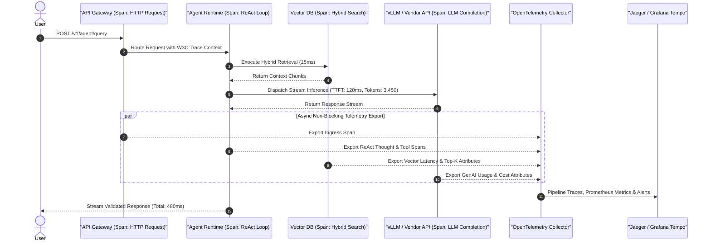
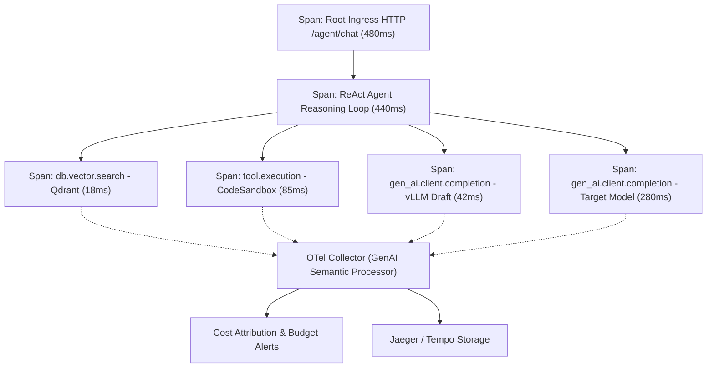

[📖 Bản tiếng Việt (Vietnamese Edition)](https://learn.tanhdev.com/series/ai-data-engineering-pipeline/part-9-agentic-observability-monitoring/)

---

> **Prerequisite:** Familiarity with high-throughput inference engines and serving metrics covered in [Part 8 — Inference Optimization: vLLM](/series/ai-data-engineering-pipeline/part-8-inference-optimization-vllm/).

## Part 9 — Agentic Observability: OpenTelemetry, Tracing & Cost Monitoring

Debugging traditional microservices involves tracking HTTP status codes, SQL query durations, and memory allocations. Debugging enterprise AI agent architectures requires tracking non-deterministic reasoning chains, token consumption surges, context window inflation, multi-turn tool loops, and subtle prompt drift.

Without vendor-agnostic distributed tracing, diagnosing why an agent invocation took 8.5 seconds or incurred $1.20 across cascading LLM calls becomes an intractable troubleshooting nightmare.

---

## OpenTelemetry Tracing Pipeline Architecture

**Answer-first:** OpenTelemetry (OTel) pipelines capture distributed trace spans across API gateways, autonomous agent reasoning loops, vector database retrievers, and LLM model providers into backends like Jaeger, Tempo, or Datadog. Adopting standardized **OpenTelemetry GenAI Semantic Conventions** guarantees unified instrumentation for prompt/completion token counters, Time-To-First-Token (TTFT), dollar cost attribution, and PII masking without proprietary vendor lock-in.


```mermaid
sequenceDiagram
    autonumber
    actor User
    participant Gateway as "API Gateway (Span: HTTP Request)"
    participant Agent as "Agent Runtime (Span: ReAct Loop)"
    participant Vector as "Vector DB (Span: Hybrid Search)"
    participant LLM as "vLLM / Vendor API (Span: LLM Completion)"
    participant OTel as "OpenTelemetry Collector"
    participant Dashboard as "Jaeger / Grafana Tempo"

    User->>Gateway: POST /v1/agent/query
    Gateway->>Agent: Route Request with W3C Trace Context
    Agent->>Vector: Execute Hybrid Retrieval (15ms)
    Vector-->>Agent: Return Context Chunks
    
    Agent->>LLM: Dispatch Stream Inference (TTFT: 120ms, Tokens: 3,450)
    LLM-->>Agent: Return Response Stream
    
    par Async Non-Blocking Telemetry Export
        Gateway-->>OTel: Export Ingress Span
        Agent-->>OTel: Export ReAct Thought & Tool Spans
        Vector-->>OTel: Export Vector Latency & Top-K Attributes
        LLM-->>OTel: Export GenAI Usage & Cost Attributes
    end

    OTel->>Dashboard: Pipeline Traces, Prometheus Metrics & Alerts
    Agent-->>User: Stream Validated Response (Total: 480ms)
```

---

## OpenTelemetry GenAI Span Hierarchy & Tree Topology

A production agent request does not execute as a flat log entry. Instead, it unfolds as a deeply nested span hierarchy where parent agent spans encapsulate child vector retrieval spans and grandchild LLM completion spans.


```mermaid
graph TD
    RootSpan["Span: Root Ingress HTTP /agent/chat (480ms)"] --> AgentLoop["Span: ReAct Agent Reasoning Loop (440ms)"]
    
    AgentLoop --> SearchSpan["Span: db.vector.search - Qdrant (18ms)"]
    AgentLoop --> ToolSpan["Span: tool.execution - CodeSandbox (85ms)"]
    AgentLoop --> LLMSpan1["Span: gen_ai.client.completion - vLLM Draft (42ms)"]
    AgentLoop --> LLMSpan2["Span: gen_ai.client.completion - Target Model (280ms)"]

    SearchSpan -.-> OTelCollector["OTel Collector (GenAI Semantic Processor)"]
    ToolSpan -.-> OTelCollector
    LLMSpan1 -.-> OTelCollector
    LLMSpan2 -.-> OTelCollector

    OTelCollector --> CostCalc["Cost Attribution & Budget Alerts"]
    OTelCollector --> TraceStore["Jaeger / Tempo Storage"]
```

---

## Standard OpenTelemetry Semantic Conventions for GenAI

To standardize observability across diverse frameworks, the OpenTelemetry working group defined official **GenAI Semantic Conventions**:

| Attribute Key | Type | Description / Standard Example |
| :--- | :--- | :--- |
| `gen_ai.system` | string | Serving backend identifier (`vllm`, `openai`, `anthropic`) |
| `gen_ai.request.model` | string | Model name requested (`meta-llama/Llama-3.1-8b`, `gpt-4o`) |
| `gen_ai.usage.input_tokens` | int | Prompt tokens consumed by this step |
| `gen_ai.usage.output_tokens`| int | Completion tokens generated |
| `gen_ai.response.ttft_ms` | float | Time to First Token in milliseconds |
| `gen_ai.cost.estimated_usd` | float | Calculated dollar cost attributed to the span |
| `gen_ai.agent.tool_name` | string | Tool invoked during this step (`python_exec`, `sql_query`) |

---

## Production Go OpenTelemetry Instrumentor

The following production Go middleware instruments LLM API invocations using official `go.opentelemetry.io/otel/trace`. It attaches GenAI semantic attributes, records nested trace spans, and calculates exact token cost attribution:

```go
package main

import (
	"context"
	"fmt"
	"log"
	"strings"
	"time"

	"go.opentelemetry.io/otel"
	"go.opentelemetry.io/otel/attribute"
	"go.opentelemetry.io/otel/codes"
	"go.opentelemetry.io/otel/trace"
)

type LLMRequest struct {
	Model       string  `json:"model"`
	Prompt      string  `json:"prompt"`
	MaxTokens   int     `json:"max_tokens"`
	Temperature float64 `json:"temperature"`
}

type LLMResponse struct {
	Text             string  `json:"text"`
	PromptTokens     int     `json:"prompt_tokens"`
	CompletionTokens int     `json:"completion_tokens"`
	TTFTMs           float64 `json:"ttft_ms"`
}

type OTelLLMClient struct {
	tracer trace.Tracer
}

func NewOTelLLMClient() *OTelLLMClient {
	return &OTelLLMClient{
		tracer: otel.Tracer("genai-agent-service"),
	}
}

func (c *OTelLLMClient) ExecuteLLMCall(ctx context.Context, req LLMRequest) (*LLMResponse, error) {
	// Start nested OTel child span with GenAI attributes
	ctx, span := c.tracer.Start(ctx, "gen_ai.client.completion",
		trace.WithAttributes(
			attribute.String("gen_ai.system", "vllm-cluster"),
			attribute.String("gen_ai.request.model", req.Model),
			attribute.Int("gen_ai.request.max_tokens", req.MaxTokens),
			attribute.Float64("gen_ai.request.temperature", req.Temperature),
		),
	)
	defer span.End()

	startTime := time.Now()

	// Execute LLM call simulation
	resp, err := c.invokeInferenceBackend(ctx, req)
	if err != nil {
		span.RecordError(err)
		span.SetStatus(codes.Error, err.Error())
		return nil, err
	}

	// Cost accounting (e.g., $1.50/1M input, $6.00/1M output tokens)
	inputCost := (float64(resp.PromptTokens) / 1_000_000.0) * 1.50
	outputCost := (float64(resp.CompletionTokens) / 1_000_000.0) * 6.00
	totalCostUSD := inputCost + outputCost

	// Record output execution attributes to Span
	span.SetAttributes(
		attribute.Int("gen_ai.usage.input_tokens", resp.PromptTokens),
		attribute.Int("gen_ai.usage.output_tokens", resp.CompletionTokens),
		attribute.Float64("gen_ai.response.ttft_ms", resp.TTFTMs),
		attribute.Float64("gen_ai.cost.estimated_usd", totalCostUSD),
		attribute.Float64("gen_ai.latency_total_ms", float64(time.Since(startTime).Milliseconds())),
	)

	span.SetStatus(codes.Ok, "LLM Generation Successful")
	return resp, nil
}

func (c *OTelLLMClient) invokeInferenceBackend(ctx context.Context, req LLMRequest) (*LLMResponse, error) {
	words := strings.Fields(req.Prompt)
	promptTokens := len(words) * 2
	if promptTokens < 10 {
		promptTokens = 20
	}

	t0 := time.Now()
	responseText := fmt.Sprintf("Response for model %s: Traced span recorded with %d input tokens.", req.Model, promptTokens)
	completionTokens := len(strings.Fields(responseText)) * 2
	ttft := float64(time.Since(t0).Microseconds()) / 1000.0

	return &LLMResponse{
		Text:             responseText,
		PromptTokens:     promptTokens,
		CompletionTokens: completionTokens,
		TTFTMs:           ttft,
	}, nil
}

func main() {
	client := NewOTelLLMClient()
	ctx := context.Background()

	req := LLMRequest{
		Model:       "meta-llama/Llama-3.1-8B-Instruct",
		Prompt:      "Configure OpenTelemetry distributed tracing collector for AI agent swarms.",
		MaxTokens:   256,
		Temperature: 0.1,
	}

	resp, err := client.ExecuteLLMCall(ctx, req)
	if err != nil {
		log.Fatalf("Execution failed: %v", err)
	}

	fmt.Printf("[OTel GenAI Telemetry] Input Tokens: %d | Output Tokens: %d | Response: %s
",
		resp.PromptTokens, resp.CompletionTokens, resp.Text)
}
```

---

## Comparative Matrix: Observability Strategies

```
Plain Log Printing vs SaaS Tool Portals (LangSmith/Arize) vs OpenTelemetry Native
```

| Dimension / Metric | Plain Text Logs | Proprietary SaaS (LangSmith) | OpenTelemetry Native (OTel) |
| :--- | :--- | :--- | :--- |
| **Vendor Independence** | High (stdout) | Zero (Locked to SaaS vendor) | 100% CNCF Open Standard |
| **Collector Exporters** | File / Elastic | Vendor Cloud Storage | Prometheus, Jaeger, Tempo, Datadog |
| **Runtime Overhead** | Minimal (<0.1ms) | Moderate (HTTP egress calls) | Negligible (<0.5ms async batching) |
| **Cost Attribution** | Manual grep scripting | Proprietary dashboard | Metric attributes & Prometheus alerts |
| **Distributed Context** | Broken across services | LLM boundary only | Full End-to-End W3C Traceparent |

---

## Frequently Asked Questions (FAQ)


GenAI semantic conventions establish a unified schema for span names and attribute keys (such as gen_ai.system, gen_ai.request.model, and gen_ai.usage.input_tokens). This ensures that observability backends like Jaeger, Tempo, or Grafana visualize performance, latency, and costs identically, whether calls route to OpenAI, Anthropic, or an internal vLLM cluster.



Cost tracking is computed from numerical token counters (input_tokens and output_tokens) multiplied by model tier rates. By applying OpenTelemetry Collector processors, sensitive prompts and raw completion payloads can be sanitized, hashed, or dropped entirely, while preserving performance metrics and dollar cost attributes for billing dashboards.



OpenTelemetry client SDKs buffer and dispatch trace spans asynchronously using non-blocking background batch worker queues. The local CPU overhead per span initialization is under 1 microsecond, ensuring zero noticeable impact on user-facing response latency.


---

## Production Observability Invariants

1. **W3C Traceparent Propagation**: Always inject and extract `traceparent` headers across all HTTP, gRPC, and Kafka boundaries to ensure unbroken trace lineages across microservices and agent runtimes.
2. **PII Masking at Collector Edge**: Strip Social Security numbers, API keys, and sensitive personally identifiable information (PII) at the collector stage prior to storing traces in central persistence stores.
3. **Budget Alert Thresholds**: Configure automated alerting when tenant token consumption velocity exceeds predefined rate-of-spend quotas to prevent billing runaway.

---

🔗 **Next Step:** Conclude the series with [Part 10 — Production Evals & CI/CD Guardrails: LLM-as-a-Judge at Scale](/series/ai-data-engineering-pipeline/part-10-production-evals-cicd/).

## Internal Series Navigation

- [Part 8 — Inference Optimization: vLLM & PagedAttention](/series/ai-data-engineering-pipeline/part-8-inference-optimization-vllm/)
- [Part 10 — Production Evals & CI/CD Guardrails](/series/ai-data-engineering-pipeline/part-10-production-evals-cicd/)
- [Executive Summary: The Disruption of Naive RAG](/series/ai-data-engineering-pipeline/executive-summary/)
