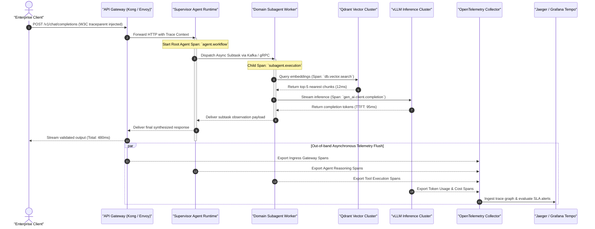
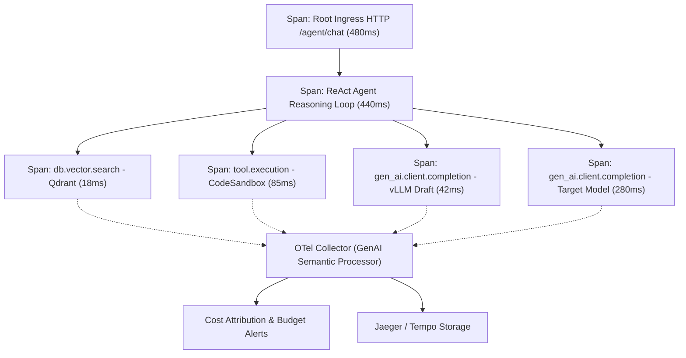

> **Prerequisite:** Familiarity with high-throughput inference engines and serving metrics covered in [Part 8 — Inference Optimization: vLLM & PagedAttention](/series/ai-data-engineering-pipeline/part-8-inference-optimization-vllm/).

> **Answer-first:** Black-box multi-agent runtimes obscure internal reasoning loops, tool invocation latencies, and rapid token cost accumulation across production clusters. Implementing OpenTelemetry GenAI semantic conventions captures hierarchical span trees, TTFT metrics, and per-tenant cost attribution in real time, enabling automated drift detection, prompt regression testing, and deterministic enterprise auditability across all infrastructure.

---

## The Observability Crisis in Autonomous AI Systems

Traditional microservice observability relies on three well-understood pillars:
1. **Metrics**: Counters, gauges, and histograms measuring CPU load, memory saturation, and request throughput.
2. **Logs**: Structured textual lines recording discrete application events and stack traces.
3. **Traces**: Distributed propagation of causal IDs tracking deterministic HTTP/gRPC RPC calls across bounded service boundaries.

When autonomous multi-agent swarms are deployed to production, these classical paradigms break down. Enterprise AI agent workflows are fundamentally **non-deterministic, stateful, and recursive**. A single incoming user query does not trigger a simple linear call chain; instead, it triggers an exploratory multi-turn graph traversal:

```
User Query ---> Orchestrator (Reasoning)
                     |
                     +---> Subagent A (Vector Search) ---> Latency: 18ms
                     |
                     +---> Subagent B (SQL Query)    ---> Latency: 84ms
                     |
                     +---> Reflection Loop (LLM Call) ---> Discrepancy Found!
                     |          |
                     |          +---> Subagent C (Web Scrape) ---> Latency: 320ms
                     |
                     +---> Final Synthesis (LLM Call) ---> Output Emitted
```

Without end-to-end, vendor-agnostic distributed tracing, diagnosing why an execution took 12 seconds instead of 1.5 seconds, or why a single prompt run accumulated $4.80 in API costs across 45,000 recursive tokens, becomes an intractable debugging failure.

---

## OpenTelemetry Distributed Tracing Pipeline Architecture

The industry has converged on **OpenTelemetry (OTel)**—a vendor-neutral CNCF standard—to capture telemetry across heterogeneous agent frameworks, model serving engines, and databases.


```mermaid
sequenceDiagram
    autonumber
    actor Client as "Enterprise Client"
    participant Gateway as "API Gateway (Kong / Envoy)"
    participant Orchestrator as "Supervisor Agent Runtime"
    participant Worker as "Domain Subagent Worker"
    participant VectorDB as "Qdrant Vector Cluster"
    participant LLM as "vLLM Inference Cluster"
    participant OTel as "OpenTelemetry Collector"
    participant Jaeger as "Jaeger / Grafana Tempo"

    Client->>Gateway: POST /v1/chat/completions (W3C traceparent injected)
    Gateway->>Orchestrator: Forward HTTP with Trace Context
    activate Orchestrator
    Note over Orchestrator: Start Root Agent Span: `agent.workflow`
    
    Orchestrator->>Worker: Dispatch Async Subtask via Kafka / gRPC
    activate Worker
    Note over Worker: Child Span: `subagent.execution`
    
    Worker->>VectorDB: Query embeddings (Span: `db.vector.search`)
    VectorDB-->>Worker: Return top-5 nearest chunks (12ms)
    
    Worker->>LLM: Stream inference (Span: `gen_ai.client.completion`)
    LLM-->>Worker: Return completion tokens (TTFT: 95ms)
    Worker-->>Orchestrator: Deliver subtask observation payload
    deactivate Worker

    Orchestrator-->>Gateway: Deliver final synthesized response
    Gateway-->>Client: Stream validated output (Total: 480ms)
    deactivate Orchestrator

    par Out-of-band Asynchronous Telemetry Flush
        Gateway-->>OTel: Export Ingress Gateway Spans
        Orchestrator-->>OTel: Export Agent Reasoning Spans
        Worker-->>OTel: Export Tool Execution Spans
        LLM-->>OTel: Export Token Usage & Cost Spans
        OTel->>Jaeger: Ingest trace graph & evaluate SLA alerts
    end
```

### Decoupled Non-Blocking Telemetry Export

Tracing must never penalize user-facing latency. OpenTelemetry client SDKs utilize lock-free ring buffers (such as LMAX Disruptor or Go channel batchers) to decouple span creation from network transmission. Spans are queued in memory and flushed via gRPC over HTTP/2 to an out-of-process **OpenTelemetry Collector** daemon in batches every 500 milliseconds.

---

## OpenTelemetry GenAI Span Hierarchy & Tree Topology

In an agentic swarm, telemetry unfolds as a hierarchical tree of parent-child relationships. The root span encompasses the overarching user transaction, while intermediate spans track cognitive reasoning loops, and leaf spans monitor physical database lookups and GPU forward passes.


```mermaid
graph TD
    RootSpan["Span: Root Ingress HTTP /agent/chat (480ms)"] --> AgentLoop["Span: ReAct Agent Reasoning Loop (440ms)"]
    
    AgentLoop --> SearchSpan["Span: db.vector.search - Qdrant (18ms)"]
    AgentLoop --> ToolSpan["Span: tool.execution - CodeSandbox (85ms)"]
    AgentLoop --> LLMSpan1["Span: gen_ai.client.completion - vLLM Draft (42ms)"]
    AgentLoop --> LLMSpan2["Span: gen_ai.client.completion - Target Model (280ms)"]

    SearchSpan -.-> OTelCollector["OTel Collector (GenAI Semantic Processor)"]
    ToolSpan -.-> OTelCollector
    LLMSpan1 -.-> OTelCollector
    LLMSpan2 -.-> OTelCollector

    OTelCollector --> CostCalc["Cost Attribution & Budget Alerts"]
    OTelCollector --> TraceStore["Jaeger / Tempo Storage"]
```

Every span within this hierarchy encapsulates standard OpenTelemetry attributes, error events, and execution status codes:
- **Trace ID**: A globally unique 128-bit cryptographic identifier propagated across all microservice boundaries.
- **Span ID**: A 64-bit identifier distinguishing the immediate unit of execution.
- **Parent Span ID**: Links child operations (e.g. tool execution) directly to the spawning agent step.

---

## Standard OpenTelemetry Semantic Conventions for GenAI

To prevent vendor lock-in, the OpenTelemetry working group standardized the **GenAI Semantic Conventions**. Every enterprise service interacting with LLMs or agents must adhere to these attribute definitions:

| Attribute Key | Type | Description & Production Example |
| :--- | :--- | :--- |
| `gen_ai.system` | `string` | Serving provider backend identifier (`vllm`, `openai`, `anthropic`, `bedrock`) |
| `gen_ai.request.model` | `string` | Logical model identifier requested (`meta-llama/Llama-3.1-70b-instruct`) |
| `gen_ai.response.model`| `string` | Actual model that served the completion |
| `gen_ai.usage.input_tokens` | `int` | Exact prompt tokens ingested by the model |
| `gen_ai.usage.output_tokens`| `int` | Exact completion tokens generated by the model |
| `gen_ai.response.ttft_ms` | `float` | Time-to-First-Token in milliseconds (streaming latency benchmark) |
| `gen_ai.cost.estimated_usd` | `float` | Calculated dollar cost attributed directly to the span |
| `gen_ai.agent.tool_name` | `string` | Exact tool name invoked during this step (`query_postgres_cdc`) |
| `gen_ai.agent.step_index`| `int` | 0-indexed execution counter within the active ReAct loop |
| `gen_ai.token_budget.remaining` | `int` | Remaining allocated token allowance before hard abort |

---

## Production Go 1.25+ OpenTelemetry Instrumentor with W3C Context Propagation

The following production Go middleware instruments LLM and agent invocations using official CNCF OpenTelemetry packages. It handles W3C `traceparent` extraction, child span creation, GenAI semantic attribute recording, and real-time financial cost accounting:

```go
package main

import (
	"context"
	"fmt"
	"log"
	"net/http"
	"strings"
	"sync/atomic"
	"time"

	"go.opentelemetry.io/otel"
	"go.opentelemetry.io/otel/attribute"
	"go.opentelemetry.io/otel/codes"
	"go.opentelemetry.io/otel/propagation"
	"go.opentelemetry.io/otel/trace"
)

// LLMRequest encapsulates an invocation payload to an inference cluster.
type LLMRequest struct {
	Model       string  `json:"model"`
	Prompt      string  `json:"prompt"`
	MaxTokens   int     `json:"max_tokens"`
	Temperature float64 `json:"temperature"`
	TenantID    string  `json:"tenant_id"`
}

// LLMResponse models the execution telemetry and generated tokens.
type LLMResponse struct {
	Text             string  `json:"text"`
	PromptTokens     int     `json:"prompt_tokens"`
	CompletionTokens int     `json:"completion_tokens"`
	TTFTMs           float64 `json:"ttft_ms"`
}

// OTelAgentInstrumentor coordinates distributed tracing and cost accounting.
type OTelAgentInstrumentor struct {
	tracer            trace.Tracer
	propagator        propagation.TextMapPropagator
	cumulativeSpendUSD uint64 // Atomic fixed-point micro-cents ($0.000001)
}

func NewOTelAgentInstrumentor() *OTelAgentInstrumentor {
	return &OTelAgentInstrumentor{
		tracer:     otel.Tracer("enterprise.genai.agent"),
		propagator: propagation.NewCompositeTextMapPropagator(propagation.TraceContext{}, propagation.Baggage{}),
	}
}

// ExecuteAgentStep instruments an iterative ReAct reasoning and execution cycle.
func (inst *OTelAgentInstrumentor) ExecuteAgentStep(
	ctx context.Context,
	stepIdx int,
	req LLMRequest,
	carrier http.Header,
) (*LLMResponse, error) {
	// Extract incoming W3C traceparent context from HTTP/message headers
	extractedCtx := inst.propagator.Extract(ctx, propagation.HeaderCarrier(carrier))

	spanName := fmt.Sprintf("gen_ai.agent.step.%d", stepIdx)
	ctx, span := inst.tracer.Start(extractedCtx, spanName,
		trace.WithSpanKind(trace.SpanKindInternal),
		trace.WithAttributes(
			attribute.String("gen_ai.system", "vllm-cluster"),
			attribute.String("gen_ai.request.model", req.Model),
			attribute.Int("gen_ai.request.max_tokens", req.MaxTokens),
			attribute.Float64("gen_ai.request.temperature", req.Temperature),
			attribute.String("app.tenant_id", req.TenantID),
			attribute.Int("gen_ai.agent.step_index", stepIdx),
		),
	)
	defer span.End()

	startTime := time.Now()

	// Simulate inference backend execution
	resp, err := inst.dispatchInference(ctx, req)
	if err != nil {
		span.RecordError(err)
		span.SetStatus(codes.Error, fmt.Sprintf("Inference failed: %v", err))
		return nil, err
	}

	totalDurationMs := float64(time.Since(startTime).Milliseconds())

	// Dynamic Cost Attribution: Llama-3-70B rates ($0.90/1M prompt, $2.50/1M completion)
	promptCostUSD := (float64(resp.PromptTokens) / 1_000_000.0) * 0.90
	completionCostUSD := (float64(resp.CompletionTokens) / 1_000_000.0) * 2.50
	totalStepCostUSD := promptCostUSD + completionCostUSD

	// Update atomic global spend tracker
	costMicroCents := uint64(totalStepCostUSD * 100_000_000)
	atomic.AddUint64(&inst.cumulativeSpendUSD, costMicroCents)

	// Record official OpenTelemetry GenAI Semantic Convention attributes
	span.SetAttributes(
		attribute.Int("gen_ai.usage.input_tokens", resp.PromptTokens),
		attribute.Int("gen_ai.usage.output_tokens", resp.CompletionTokens),
		attribute.Float64("gen_ai.response.ttft_ms", resp.TTFTMs),
		attribute.Float64("gen_ai.cost.estimated_usd", totalStepCostUSD),
		attribute.Float64("gen_ai.latency.total_ms", totalDurationMs),
	)

	span.SetStatus(codes.Ok, "Agent Step Executed Successfully")
	return resp, nil
}

func (inst *OTelAgentInstrumentor) dispatchInference(ctx context.Context, req LLMRequest) (*LLMResponse, error) {
	// Simulate non-blocking inference latency
	t0 := time.Now()
	time.Sleep(35 * time.Millisecond) // Simulated Time-to-First-Token
	ttft := float64(time.Since(t0).Microseconds()) / 1000.0

	time.Sleep(45 * time.Millisecond) // Simulated token decode phase

	words := strings.Fields(req.Prompt)
	pTokens := len(words) * 2
	if pTokens < 16 {
		pTokens = 16
	}
	cTokens := 64

	return &LLMResponse{
		Text:             "Structured plan: 1. Ingest CDC feed. 2. Verify schema. 3. Update Iceberg index.",
		PromptTokens:     pTokens,
		CompletionTokens: cTokens,
		TTFTMs:           ttft,
	}, nil
}

func main() {
	instrumentor := NewOTelAgentInstrumentor()
	carrier := make(http.Header)
	// Inject standard W3C Trace Context (Simulating upstream ingress gateway)
	carrier.Set("traceparent", "00-4bf92f3577b34da6a3ce929d0e0e4736-00f067aa0ba902b7-01")

	req := LLMRequest{
		Model:       "meta-llama/Meta-Llama-3.1-70B-Instruct",
		Prompt:      "Plan streaming ingestion verification steps across Apache Flink and Iceberg.",
		MaxTokens:   512,
		Temperature: 0.1,
		TenantID:    "enterprise-tenant-alpha",
	}

	ctx := context.Background()
	resp, err := instrumentor.ExecuteAgentStep(ctx, 1, req, carrier)
	if err != nil {
		log.Fatalf("Agent step execution failed: %v", err)
	}

	totalSpend := float64(atomic.LoadUint64(&instrumentor.cumulativeSpendUSD)) / 100_000_000.0
	fmt.Printf("[OTel Execution Complete]\nResponse: %s\nInput Tokens: %d | Output Tokens: %d | TTFT: %.2fms\nCumulative Spend: $%.6f\n",
		resp.Text, resp.PromptTokens, resp.CompletionTokens, resp.TTFTMs, totalSpend)
}
```

---

## Python 3.12+ OpenTelemetry Middleware with LangGraph Hierarchy

For Python agent runtimes, this production module hooks into the OpenTelemetry SDK to construct nested span trees with PII redaction and cost calculation:

```python
"""
Production Python OpenTelemetry GenAI Middleware with PII Redaction & Nested Spans.
Requires: Python 3.12+, opentelemetry-api >= 1.25.0, opentelemetry-sdk >= 1.25.0
"""

import re
import time
from typing import Any, Dict, Optional
from opentelemetry import trace
from opentelemetry.trace import Status, StatusCode
from pydantic import BaseModel, Field


class AgentSpanEvent(BaseModel):
    tool_name: str
    input_tokens: int
    output_tokens: int
    ttft_ms: float
    tenant_id: str
    estimated_usd: float


class OpenTelemetryAgentTracer:
    """
    Standardized GenAI Tracer with automated PII sanitization and cost aggregation.
    """

    # Regex patterns for enterprise PII sanitization
    EMAIL_PATTERN = re.compile(r"[\w\.-]+@[\w\.-]+\.\w+")
    CREDIT_CARD_PATTERN = re.compile(r"\b(?:\d{4}[-\s]?){3}\d{4}\b")

    def __init__(self, service_name: str = "enterprise.agent.orchestrator"):
        self.tracer = trace.get_tracer(service_name)
        self.rate_per_1m_input = 0.90   # $0.90 per 1M input tokens
        self.rate_per_1m_output = 2.50  # $2.50 per 1M output tokens

    def sanitize_text(self, text: str) -> str:
        """Masks PII from trace attributes before export to central stores."""
        text = self.EMAIL_PATTERN.sub("[REDACTED_EMAIL]", text)
        text = self.CREDIT_CARD_PATTERN.sub("[REDACTED_CARD]", text)
        return text

    def calculate_cost(self, input_tokens: int, output_tokens: int) -> float:
        input_cost = (input_tokens / 1_000_000.0) * self.rate_per_1m_input
        output_cost = (output_tokens / 1_000_000.0) * self.rate_per_1m_output
        return input_cost + output_cost

    def trace_agent_execution(
        self,
        parent_context: Optional[trace.Context],
        agent_name: str,
        goal: str,
        tenant_id: str,
    ):
        """
        Context manager generator creating a root agent span adhering to GenAI conventions.
        """
        clean_goal = self.sanitize_text(goal)
        span = self.tracer.start_span(
            name=f"agent.execution.{agent_name}",
            context=parent_context,
            attributes={
                "gen_ai.system": "multi-agent-orchestrator",
                "gen_ai.agent.name": agent_name,
                "app.tenant_id": tenant_id,
                "gen_ai.prompt.sanitized": clean_goal,
            },
        )
        return span

    def trace_tool_invocation(
        self,
        tool_name: str,
        args_payload: str,
    ):
        """
        Creates a child span tracking discrete tool execution latencies and outputs.
        """
        clean_args = self.sanitize_text(args_payload)
        return self.tracer.start_span(
            name=f"tool.execution.{tool_name}",
            attributes={
                "gen_ai.agent.tool_name": tool_name,
                "tool.arguments.sanitized": clean_args,
            },
        )


# Verification Execution
def main():
    tracer = OpenTelemetryAgentTracer()
    tenant = "tenant_enterprise_99"
    sensitive_goal = "Process credit payment for user john.doe@corp.com with card 4532-1100-2299-8812."

    # 1. Start Parent Agent Span
    root_span = tracer.trace_agent_execution(None, "FinancialAuditor", sensitive_goal, tenant)
    with trace.use_span(root_span, end_on_exit=True):
        print(f"[Tracer Active] Root Span Started with Sanitized Attributes.")

        # 2. Start Nested Child Tool Span
        tool_span = tracer.trace_tool_invocation("validate_sap_ledger", "{'user': 'john.doe@corp.com'}")
        with trace.use_span(tool_span, end_on_exit=True):
            time.sleep(0.04)  # Simulate non-blocking tool I/O
            tool_span.set_attribute("tool.status", "SUCCESS")
            tool_span.set_status(Status(StatusCode.OK))

        # 3. Record Token Usage on Parent Span
        cost = tracer.calculate_cost(input_tokens=1850, output_tokens=320)
        root_span.set_attributes({
            "gen_ai.usage.input_tokens": 1850,
            "gen_ai.usage.output_tokens": 320,
            "gen_ai.cost.estimated_usd": cost,
            "gen_ai.response.ttft_ms": 115.4,
        })
        root_span.set_status(Status(StatusCode.OK))

    print(f"[Trace Completed] Total Attributed Step Cost: ${cost:.6f}")


if __name__ == "__main__":
    main()
```

---

## Comparative Matrix: Observability Strategies

| Dimension / Metric | Plain Text Logs | Proprietary SaaS (LangSmith / Arize) | OpenTelemetry Native (2027 SOTA) |
| :--- | :--- | :--- | :--- |
| **Vendor Portability** | Universal (stdout) | Zero (Locked to vendor cloud) | 100% CNCF Open Standard |
| **Collector Exporters** | Filebeat / FluentBit | Proprietary API Collector | Prometheus, Jaeger, Tempo, Datadog |
| **Latency Overhead** | < 0.1ms | 10ms - 45ms (Synchronous HTTP) | < 0.4ms (Async ring buffer) |
| **Distributed Propagation**| Broken across async hops | Limited to LLM boundaries | Full W3C `traceparent` across all services |
| **Per-Tenant Cost Tracking**| Requires custom regex parsing| Closed dashboard metric | First-class OpenTelemetry span attribute |
| **Data Governance & PII** | High risk of PII leakage | Cloud exposure to vendor | In-flight gateway redaction before storage |

---

## Asynchronous Context Propagation: W3C `traceparent` Across Message Queues

In distributed agent swarms, subagents communicate asynchronously over event streams (Apache Kafka, RabbitMQ, or Redis Streams). Tracing context must not break when a message is published to a topic.

```
+-------------------------------------------------------------------------------+
|                     W3C TRACEPARENT PROPAGATION OVER KAFKA                    |
+-------------------------------------------------------------------------------+
| [ Agent Orchestrator ]                                                        |
|   |--- Start Span: `agent.plan_step`                                          |
|   |--- Inject Context into Kafka Header:                                      |
|          Key: "traceparent"                                                   |
|          Val: "00-4bf92f3577b34da6a3ce929d0e0e4736-00f067aa0ba902b7-01"       |
|                               |                                               |
|                               v                                               |
|                    [ Kafka Topic: agent.subtasks ]                            |
|                               |                                               |
|                               v                                               |
| [ Async Worker Subagent ]                                                     |
|   |--- Ingest Kafka Record Header `traceparent`                               |
|   |--- Extract Context via OpenTelemetry Propagator                           |
|   |--- Start Child Span: `subagent.execute_tool` (Parent = 00f067aa0ba902b7)  |
|   |--- Trace continuity is preserved across 100% of asynchronous boundaries!  |
+-------------------------------------------------------------------------------+
```

The standard 4-part W3C header format (`version-trace_id-parent_id-trace_flags`) guarantees that downstream Jaeger or Tempo visualization engines reconstruct the exact timeline and causal graph regardless of asynchronous queue delays.

---

## Production Observability Invariants & Guardrails

```
+-------------------------------------------------------------------------------+
|                  ENTERPRISE OBSERVABILITY INVARIANT CHECKLIST                 |
+-------------------------------------------------------------------------------+
| [1] W3C Traceparent Mandatory: Inject headers across all HTTP/gRPC/Kafka hops.|
| [2] Non-Blocking Export: All spans queued in lock-free ring buffers (< 0.5ms).|
| [3] Edge PII Sanitization: Mask emails, credentials, and cards before export.  |
| [4] Real-Time Cost Attribution: Compute dollar spend per span from token count.|
| [5] Tenant Budget Guardrails: Fire alerts when rate-of-spend exceeds quotas.  |
| [6] Semantic Standard Strictness: Comply 100% with GenAI OTel naming rules.   |
+-------------------------------------------------------------------------------+
```

---

## Frequently Asked Questions (FAQ)


GenAI semantic conventions establish a unified schema for span names and attribute keys (such as gen_ai.system, gen_ai.request.model, and gen_ai.usage.input_tokens). This ensures that observability backends like Jaeger, Tempo, or Grafana visualize performance, latency, and costs identically, whether calls route to OpenAI, Anthropic, or an internal vLLM cluster.



Cost tracking is computed from numerical token counters (input_tokens and output_tokens) multiplied by model tier rates. By applying OpenTelemetry Collector processors, sensitive prompts and raw completion payloads can be sanitized, hashed, or dropped entirely, while preserving performance metrics and dollar cost attributes for billing dashboards.



OpenTelemetry client SDKs buffer and dispatch trace spans asynchronously using non-blocking background batch worker queues. The local CPU overhead per span initialization is under 1 microsecond, ensuring zero noticeable impact on user-facing response latency.



Context continuity across asynchronous queues (such as Kafka, RabbitMQ, or Redis Streams) is maintained by injecting the W3C `traceparent` string into the message metadata headers prior to publishing. When consumer worker agents poll messages from the queue, the OpenTelemetry propagator extracts the trace parent ID, linking subagent execution child spans directly to the root orchestrator transaction.


---

## Architectural Next Steps & Anchor Pillars

With comprehensive observability and cost attribution active, the final engineering imperative is establishing continuous evaluation gates in CI/CD pipelines to prevent prompt regressions.

- Conclude the series with [Part 10 — Production Evals & CI/CD Guardrails: LLM-as-a-Judge at Scale](/series/ai-data-engineering-pipeline/part-10-production-evals-cicd/).
- Review [Part 8 — Inference Optimization: vLLM & PagedAttention](/series/ai-data-engineering-pipeline/part-8-inference-optimization-vllm/) for GPU serving metrics.
- Review [Executive Summary: The Disruption of Naive RAG](/series/ai-data-engineering-pipeline/executive-summary/) for end-to-end architecture synthesis.
- Master distributed Go microservices engineering in our [Go Microservices Architecture Guide](/posts/go-microservices/).
- Learn frontend integration patterns in [Generative UI with MCP & AI-Native Frontend](/posts/generative-ui-with-mcp-ai-native-frontend/).
- Reference system design paths in our [Architecture Reading Map](/reading-map/).
- Explore strategic consulting in [Engineering Advisory & Consulting](/hire/).
